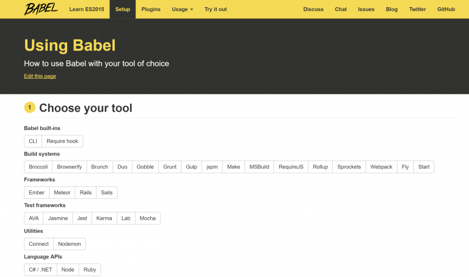

Well for a long time I wanted to write a blog post about migrating Angular 1.x to 2, however, before doing so I thought it is really helpful to write about some prerequisites of that.

<!--more-->

This is the third article in ES6 new features series.

[Part I](/2016/07/06/es6-new-features-part-i/)

[Part II](/2016/07/07/es6-new-features-part-ii/)

### 9. Classes in ES6

In many ways, they are a sham. Javascript classes don’t really exist other than for cosmetic reasons. They are syntactic sugar over existing Javascript prototypical inheritance. The reason for this was to ensure backwards compatibility, classes merely give you a cleaner way to organise your code.

If you love object-oriented programming (OOP), then you’ll love this feature. In ES5 there wan not a *class* keyword.

```javascript
class myClass {
  constructor(name = 'default', age = 80) {
    this.name = name
    this.age = age
  }

  sayName() {
    alert(this.name)
  }

  sayAge() {
    alert(this.age)
  }
}

const myInstance = new myClass()
myInstance.sayName()
```

Notice that I’m using default parameter values for name and age. Also, method names don’t need to have the word `function` or the colon (`:`) anymore.

When it comes to inheritance it is very similar to OOP programming languages such as C# or any other one. The basic inheritance can be implemented as follow:

```javascript
class childClass extends myClass {
  constructor(name, age) {
    super(name, age)
  }

  // Override the someClass method above
  sayName() {
    // This will call someClass.sayName() triggering the old alert
    // Which will just display our name
    super.sayName()

    // This will trigger the new alert which has labels and our age
    alert('Name:' + this.name + ' Age:' + this.age)
  }
}

const myChild = new childClass('dwayne', 27)
myChild.sayName()
```

Notice that to call the parent constructor, effortlessly invoke `super()` with expected parameters. Isn't it amazing?

### 10. Modules in ES6

As you might now, there were no native modules support in JavaScript before ES6. People came up with AMD, RequireJS, CommonJS and other workarounds. Now there are modules with `import` and `export` operands.

The ES6 module standard has two parts:

- Declarative syntax (for importing and exporting)
- Programmatic loader API: to configure how modules are loaded and to conditionally load modules

```javascript
export const myName = 'Yaser'

export function getCreditCardNumber() {
  //Not implemented yet, you can leave yours
  //in the comments for the moment 😉
}
```

In other modules, we use `import {myName} from 'my-module'`syntax. For example:

```javascript
import { myName, getCreditCardNumber } from 'module'

console.log(myName) // Yaser
```

Or we can import everything as a variable in other modules and use it as an object literal:

```javascript
import * as myData from 'module'

console.log(myData.myName) // Yaser
```

Modules that only export single values are very popular in the `Node.js` community. But they are also common in front-end development where you often have constructors/classes for models, with one model per module. An ECMAScript 6 module can pick a _default export_, the most important exported value. Default exports are especially easy to import.

The following ES6 module “is” a single function:

```javascript
//------ myFunc.js ------
export default function () { ... };

//------ main1.js ------
import myFunc from 'myFunc';

myFunc();
```

An ES6 module whose default export is a class looks as follows:

```javascript
//------ MyClass.js ------
export default class { ... };

//------ main2.js ------
import MyClass from 'MyClass';
let instance = new MyClass();
```

And finally having both default and named exports together will look like something like the following code. I used some underscore metadata to show how it can be used and simplify everything.

```javascript
//------ underscore.js ------
export default function (obj) {
    ...
};
export function each(obj, iterator, context) {
    ...
}
export { each as forEach };

//------ main.js ------
import _, { each } from 'underscore';
```

### 11. How to use it

Well ES6 is not currently supported by all browsers and also those who does support it only have implemented part of it, so you need a safe way to utilise its power.

Here there are a couple of options but apparently best of which is Babel (which is a compiler). You can run it as a standalone tool or use with your build system. There are Babel [plugins](http://babeljs.io/docs/setup) for Grunt, Gulp and webpack (again my favourite).


