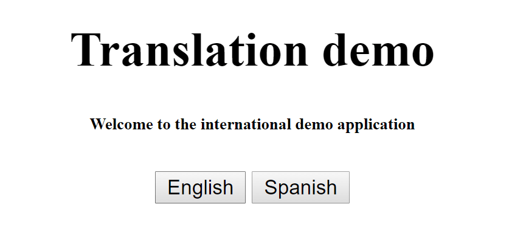
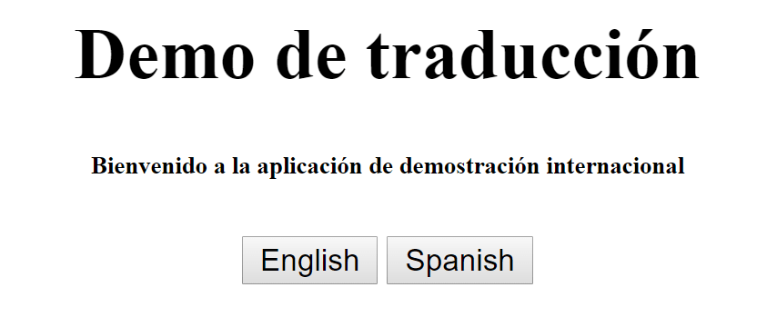
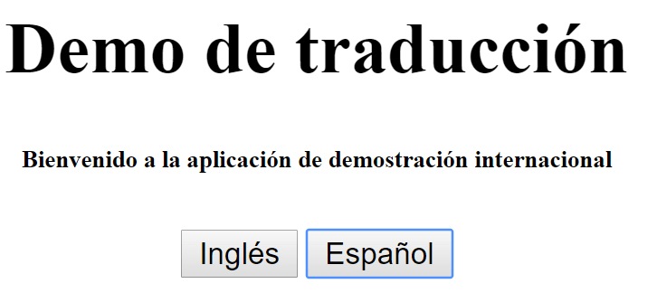
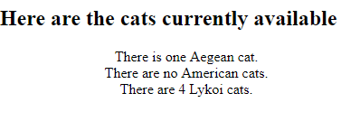
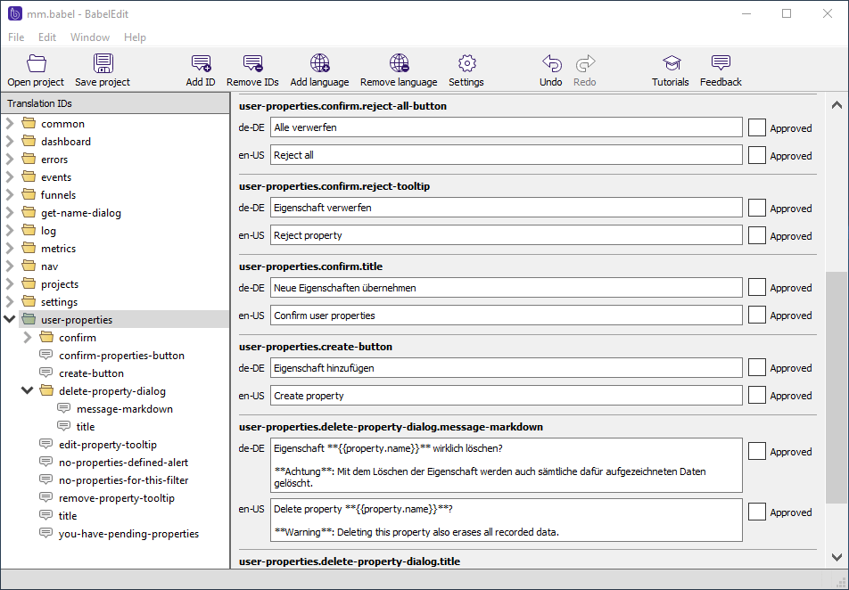

Are you working on an international product where you need to support multiple languages? Is your application written in Angular? Then this article might help you to get it done easier than ever.

<!--more-->

We will use a small application since the purpose here is to show you how easy you can another language to your application. So let's get started.

Full source code of this example is available on [this GitHub repo](https://github.com/yashints/ngx-translate).

## Prerequisites

You will need to have node, npm and [Angular CLI](https://github.com/angular/angular-cli) installed before going further.

## Creating the application

Let's start by creating a new application using [Angular CLI](https://github.com/angular/angular-cli):

```bash
ng new demo --skip-install
```

We use `--skip-install` flag to prevent installing the node modules as we intend to add **ngx-translate** to our `package.json` shortly.

Let's do that next:

```bash
npm install @ngx-translate/core @ngx-translate/http-loader --save
```

I added the `http-loader` just because I've created some `json` files containing the translations which I want to fetch. This simulates some real time translation such as using a *RESTful* translation service.

You will get some warnings from `npm` but don't worry, go ahead and run `npm install` to install all the required packages for the application.

## Importing the translation module

Let's open up our `app.module.ts` and import the `TranslateModule`.

This module requires a loader which is the `TranslationHttpLoader` we added earlier. But before doing so we need a way to create it since it has a dependency on `HttpClient`.

There are multiple ways to achieve this, but we use a factory method just because you will need and exported function for [AoT compilation](https://angular.io/docs/ts/latest/cookbook/aot-compiler.html) or if you are using [Ionic](http://ionic.io/):

```typescript
import { HttpClientModule, HttpClient } from '@angular/common/http';
import { TranslateModule, TranslateLoader } from '@ngx-translate/core';
import { TranslateHttpLoader } from '@ngx-translate/http-loader';

export function translateHttpLoaderFactory(http: HttpClient) {
  return new TranslateHttpLoader(http);
}

@NgModule({
  declarations: [
    AppComponent
  ],
  imports: [
    BrowserModule,
    HttpClientModule,
    TranslateModule.forRoot({
      loader: {
        provide: TranslateLoader,
        useFactory: translateHttpLoaderFactory,
        deps: [HttpClient]
      }
    })
  ],
  providers: [],
  bootstrap: [AppComponent]
})
```

The loader can load the translation files using `http`.

## Adding the translation service

OK, we need the `TranslateService` to be able to make our template multi-lingual. Also we need to add our translation files for different languages we want to use.

First let's import the service. Open your `app.component.ts` and insert this line on top:

```typescript
import { TranslateService } from '@ngx-translate/core'
```

Now we need to define our default language, which we will do inside the constructor:

```typescript
constructor(private translateService: TranslateService) {
  translateService.setDefaultLang('en');
}
```

I'll use two languages here but the process is the same and adding a third one as simple as adding a file containing the translated text. These files would be put into `assets/i18n` folder.

First English file in `src/assets/i18n/en.json`:

```json
{
  "Title": "Translation demo",
  "WelcomeMessage": "Welcome to the international demo application"
}
```

And Spanish in `src/assets/i18n/es.json`:

```json
{
  "Title": "Demo de traducción",
  "WelcomeMessage": "Bienvenido a la aplicación de demostración internacional"
}
```

These files will be loaded using our translation loader that we added to the translation module. Now we can go ahead and create our template. We use the translate directive to tell the translate service which part of the template should be replaced.

[[info]]
|**Note:** If you use the translate pipe, it expects nothing but the variable name inside the tag, so if you add other text it won't pick it up.

```html
<h1 translate>Title</h1>

<div translate>WelcomeMessage</div>
```

There is nothing fancy in there, just using the variables in those `json` files and adding the translate attribute so that Angular know how these should be fetched using translation loader.

We need one more thing to setup and that is our language switcher. Let's for now keep it simple and add two buttons there which will call a function to switch between these languages, your final template would be something like this:

```html
<div style="text-align:center">
  <h1 translate>Title</h1>

  <h6 translate>WelcomeMessage</h6>

  <button (click)="switchLanguage('en')">English</button>

  <button (click)="switchLanguage('es')">Spanish</button>
</div>
```

and now defining the `switchLanguage` method:

```typescript
switchLanguage(language: string) {
  this.translateService.use(language);
}
```

Remember that we injected our service into the constructor.

## First test

Let's run the app and see what happens, just type `ng serve` and open up `http://localhost:4200` in the browser. You will see the home page:



If you click on Spanish button the page will change to this:



Let's go ahead and change the button texts as well. This time we use inline template with the `translate` pipe. First we add the two labels to the `json` files.

For English:

```json
{
  "Title": "Translation demo",
  "WelcomeMessage": "Welcome to the international demo application",
  "English": "English",
  "Spanish": "Spanish"
}
```

And for Spanish:

```json
{
  "Title": "Demo de traducción",
  "WelcomeMessage": "Bienvenido a la aplicación de demostración internacional",
  "English": "Inglés",
  "Spanish": "Español"
}
```

Finally we change the buttons in the template to use these labels:

```html
<button (click)="switchLanguage('en')">{{ 'English' | translate }}</button>

<button (click)="switchLanguage('es')">{{ 'Spanish' | translate }}</button>
```

Now the application should have hot reloaded and you should see the first picture. But if you click on Spanish you should see the buttons change:



## Passing variables to translate service

You can pass your component variables to the translate pipe to be able to format your strings in those `json` files. The simplest form is to show the welcome message for the user by having his/her name in the message.

We will first change our `json` files to have the user name in the message:

```json
{
  "Title": "Translation demo",
  "WelcomeMessage": "Dear {{name}}, welcome to the international demo application",
  "English": "English",
  "Spanish": "Spanish"
}
```

And for Spanish:

```json
// Line break for readability
{
  "Title": "Demo de traducción",
  "WelcomeMessage": "Querido {{name}}, bienvenido a la aplicación de
    demostración internacional",
  "English": "Inglés",
  "Spanish": "Español"
}
```

Now let's define the user in our `app.component.ts`.

```typescript
let user: any = {
  name: Yaser,
}
```

Finally, we need to pass this to the pipe:

```html
<h6>{{ 'WelcomeMessage' | translate: user }}</h6>
```

Now you should be able to see the my name in the welcome message.

## Custom loaders

You can even write your own loaders and use a third party service for translation. It is very easy to do that, in fact all you need to do is to create a class which extends the TranslateLoader and then add a method called `getTranslation`:

```typescript
class CustomLoader implements TranslateLoader {
  getTranslation(lang: string): Observable<any> {
    return Observable.of({ KEY: 'value' })
  }
}
```

Now you can use this instead of that factory method we created earlier in your `app.module.ts`.

```typescript
@NgModule({
  imports: [
    BrowserModule,
    TranslateModule.forRoot({
      loader: { provide: TranslateLoader, useClass: CustomLoader },
    }),
  ],
  bootstrap: [AppComponent],
})
export class AppModule {}
```

Hope this article has helped you to get started with the `ngx-traslate` package. For more information you can refer to [their official documentation](https://github.com/ngx-translate/core).

## More goodies

Based on one of the comments I got from **_Andreas Löw_** from **_CodeAndWeb GmbH_**, just wanted to introduce some tools you can use alongside `ngx-translate` which makes your day perfect.

### A pluralisation plugin

First one is an npm package called [ngx-translate-messageformat-compiler](https://www.npmjs.com/package/ngx-translate-messageformat-compiler) which allows you to compile translations using _ICU syntax_ for handling pluralization and gender.

[ICU Message Format](http://userguide.icu-project.org/formatparse/messages) is a standardized syntax for dealing with the translation of user-visible strings into various languages that may have different requirements for the correct declension of words (e.g. according to number, gender, case) - or to simplify: pluralization.

The complete guide can be found in their [Github repository](https://github.com/lephyrus/ngx-translate-messageformat-compiler) but to quickly show you how it can help you (I will skip the setup part as you can find it in the [code repository on my GitHub](https://github.com/yashints/ngx-translate-tools)).

Imagine you want to show a list of different categories of cats with their count on your web site which presumably helps a pet shop to show case what their current inventory is. here is how HTML will look like:

```html
<ul>
  <li *ngFor="let cat of cats">
    <span
      translate
      [translateParams]="{ Count: cat.count, category: cat.category }"
      >CATS</span
    >.
  </li>
</ul>
```

In your component you will have a list of cats categories and their count:

```typescript
cats = [
  {
    count: 1,
    category: 'Aegean',
  },
  {
    count: 0,
    category: 'American',
  },
  {
    count: 4,
    category: 'Lykoi',
  },
]
```

And finally in your `json` file:

```json
{
  "CATS": "There {Count, plural, =0{are no {category} cats} one{is one {category} cat} other{are # {category} cats}}"
}
```

No when you run your app you will see the list like this:



### Extract plugin

This amasing plugin is [ngx-translate-extract](https://github.com/biesbjerg/ngx-translate-extract) and it lets you extract your translatable text into the `json` files. This is very handy if you already have a project and want to extract all of the text in one go instead of going through your HTML files one by one.

First install it by running:

```bash
npm install @biesbjerg/ngx-translate-extract --save-dev
```

As you can see there is no need to save it as a dependency. You only need this when developing, and obviously you care about your package size.

Now you can simply use it by running the below command:

```bash
ngx-translate-extract -i ./src -o ./src/i18n/en.json
```

And that's it, you can now go ahead and modify the variable names if you like. For more info please refer to [their GitHub page](https://github.com/biesbjerg/ngx-translate-extract).

## BableEdit

This is a [handy little tool ](https://www.codeandweb.com/babeledit) which you can use to edit your `json` files all at once. It allows you see and edit all your translations in one place, compare translations for different languages, and find missing translations.



It's worth giving it a shot if you have a couple of languages to support.
