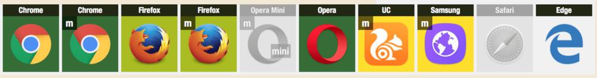
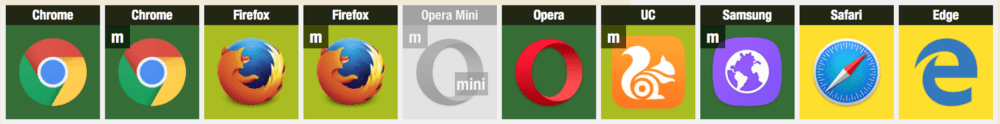
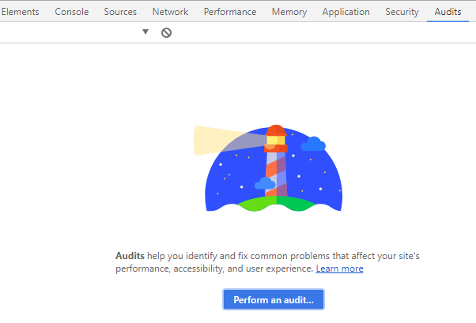
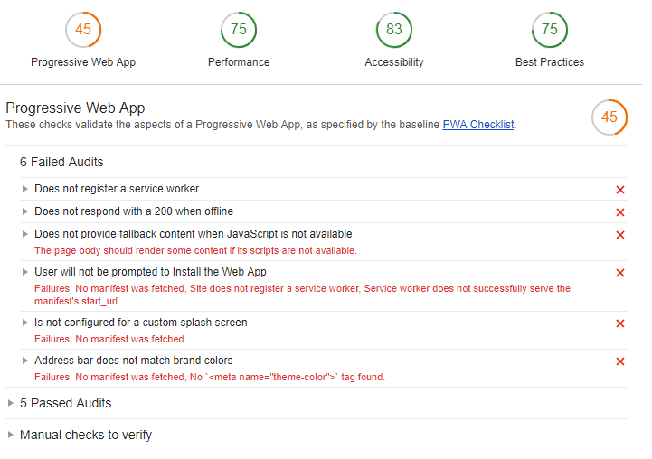
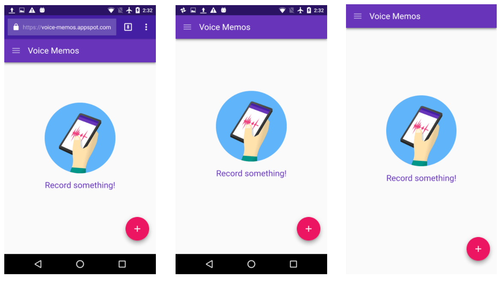
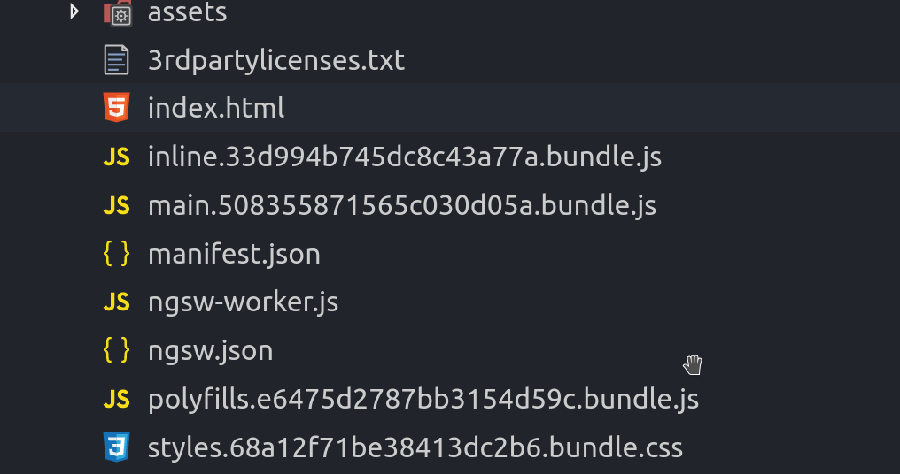
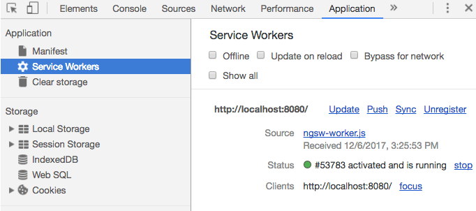
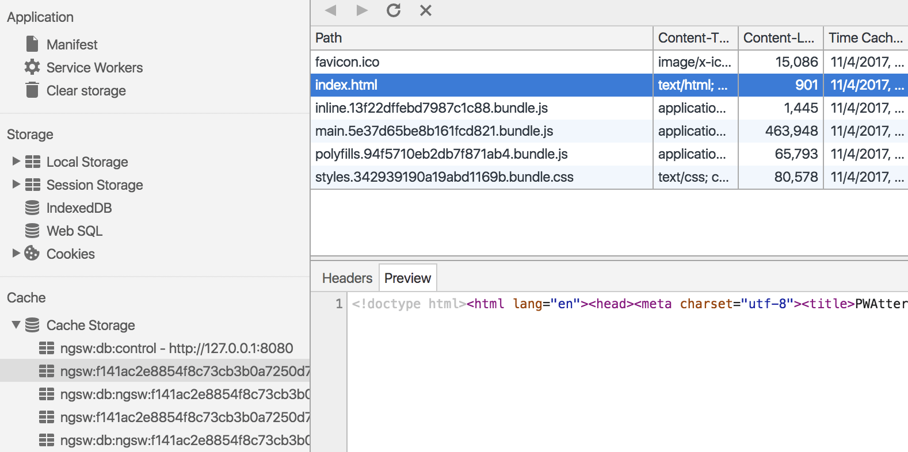
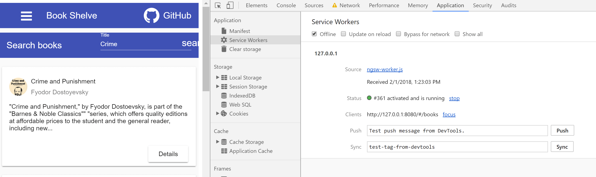
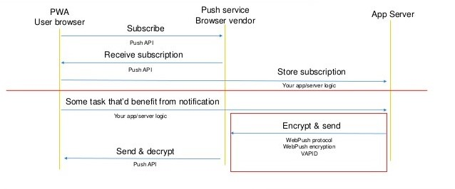

[Progressive Web Applications (PWA)](https://developers.google.com/web/progressive-web-apps/) are getting more and more attractions by day. With recent move from DevKit team, adding service worker support to the latest version of Safari, and [Microsoft adding progressive web applications to their store](https://www.windowscentral.com/first-batch-windows-10-progressive-web-apps-here), we can see the importance of the key role PWAs play in today's market.

<!--more-->

With [Angular version 5.0.0](https://angular.io/), the team introduced a new version of their [service worker aka (ngsw)](https://angular.io/guide/service-worker-intro) which has a ton of goodies from a fully functional service worker to full support for push notifications. In this post I will iterate through them and turn an existing application into a PWA.

The demo application I've prepared can be found on [my GitHub repo here](https://github.com/yashints/Angular-PWA).

## Table of content

1.  [What is a progressive web application?](#wispwa)
2.  [Current state of support in major browsers](#support)
3.  [Key components](#keycomponents)
4.  [How to evaluate your current application?](#lighthouse)
5.  [Application manifest](#appmanifest)
6.  [Angular and PWA](#angularpwa)
7.  [Angular Service Worker aka (ngsw)](#ngsw)
8.  [Under the hood](#hood)
9.  [Push notifications](#push)

## <a id="wispwa"></a>What is a progressive web application?

In 2015, designer **Frances Berriman** and [Google Chrome](https://en.wikipedia.org/wiki/Google_Chrome) engineer **Alex Russell** coined the term `progressive web apps`.  These are applications which leverage new features supported by modern browsers such as [application manifest](https://developer.mozilla.org/en-US/docs/Web/Manifest) and [service worker](https://developer.mozilla.org/en-US/docs/Web/API/Service_Worker_API) allowing us to create faster, more engaging and reliable applications.

They have the following characteristics:

- **Progressive** - Work for every user, regardless of browser choice because they’re built with [progressive enhancement](https://en.wikipedia.org/wiki/Progressive_enhancement) as a core tenet.
- **Responsive** - Fit any form factor: desktop, mobile, tablet, or forms yet to emerge.
- **Connectivity independent** - [Service workers](https://en.wikipedia.org/wiki/Progressive_web_app#Service_Workers) allow work offline, or on low quality networks.
- **App-like** - Feel like an app to the user with app-style interactions and navigation.
- **Fresh** - Always up-to-date thanks to the service worker update process.
- **Safe** - Served via HTTPS to prevent snooping and ensure content hasn’t been tampered with.
- **Discoverable** - Are identifiable as “applications” thanks to W3C manifests<sup>[[6]](https://en.wikipedia.org/wiki/Progressive_web_app#cite_note-w3cmanifest-6)</sup> and service worker registration scope allowing search engines to find them.
- **Re-engageable** - Make re-engagement easy through features like [push notifications](https://en.wikipedia.org/wiki/Push_technology).
- **Installable** - Allow users to “keep” apps they find most useful on their home screen without the hassle of an app store.
- **Linkable** - Easily shared via a URL and do not require complex installation.
  These applications look very similar to a native mobile application and offer some features that makes user very happy. The most important one is ability to add the application to your device's home screen. Accessing device's hardware like location, camera and etc. is another thing where it gives a native experience to users.

## <a id="keycomponents"></a>Key components

There are three key components you will have to add to your project to be able to say your web application is progressive.

### Application manifest

From [Mozilla documents](https://developer.mozilla.org/en-US/docs/Web/Manifest):

> The web app manifest provides information about an application (such as name, author, icon, and description) in a `JSON` text file. The purpose of the manifest is to install web applications to the homescreen of a device, providing users with quicker access and a richer experience.

### Service worker

A service worker is a script that your browser runs in the background, separate from a web page, opening the door to features that don't need a web page or user interaction. It includes offline support, request caching, [push notifications](https://developers.google.com/web/updates/2015/03/push-notifications-on-the-open-web) and [background sync](https://developers.google.com/web/updates/2015/12/background-sync).

### App shell

An **application shell** (or app shell) architecture is one way to build a Progressive Web App that reliably and instantly loads on your users' screens, similar to what you see in native applications.

## <a id="support"></a>Current state of support in major browsers

Most of the major browsers have been trying to add support for application manifest and service workers. By the start of the last year [Chrome](https://www.google.ca/chrome/browser/desktop/index.html) and [Chrome mobile](https://play.google.com/store/apps/details?id=com.android.chrome&hl=en) had full support, whereas [Safari](https://www.apple.com/au/safari/) wasn't even looking into it. [Microsoft Edge](https://www.microsoft.com/en-au/windows/microsoft-edge) not only were working on it, but also looking into adding PWA's to their store with the help of [ElectronJS](https://electronjs.org). Mozilla's [FireFox](https://www.mozilla.org/en-US/firefox/new) team was supporting most of the features as well but they were a bit behind [Google](https://www.google.com) on that.



Later in the year there was a massive effort put into supporting the new APIs and surprisingly Apple started working on it seriously. Microsoft Edge got it in preview and Safari added some basic support as well.



> ###### Photo from : [https://ispwaready.toxicjohann.com](https://ispwaready.toxicjohann.com/)

## <a id="lighthouse"></a>How to evaluate your current application?

Your question now might be where to start. There are some tools that allow you to evaluate your application against the PWA requirements. However the most easy to use is [Lighthouse](https://developers.google.com/web/tools/lighthouse/) which is now built in [Chrome DevTools](https://developer.chrome.com/devtools).

If you open up your developer tools and go to Audits tab, you will see its logo in the middle of the page and there is an audit button which you can click to get started with your application.



Even without doing anything you could browse your application and audit it to see how compliant your app is. When you run the report you will see a report like below and there are even hints on how to fix some of those.



You can see how detail the report is and if you open those red items you will see what is missing.

## <a id="appmanifest"></a>Application manifest

Application manifest is a normal `JSON` file containing the initial flags and attributes a PWA needs. They vary from theme colour to short name which appears below the icon on your device home screen when you add it (amazingly it supports emoji's).

Theme colour tells the browser what colour to choose for background on address bar and toolbar. A sample is shown in below picture.


> ###### *https://developers.google.com/web/updates/2015/08/using-manifest-to-set-sitewide-theme-color*             

As you can see in the right side, the background colour of the address bar is replaced with the application's theme colour to maintain the consistency of the user experience and make it more interesting. Just note that this is only supported when you open your application from home screen.

The most important attribute on application manifest is the [display mode](https://developer.mozilla.org/en-US/docs/Web/Manifest#display). This defines how your application is displayed when opened from home screen. There currently four modes in the specification:

- **fullscreen**: All of the available display area is used and no user agent [chrome](https://developer.mozilla.org/en-US/docs/Glossary/chrome) is shown.
- **standalone**: The application will look and feel like a standalone application. This can include the application having a different window, its own icon in the application launcher, etc. In this mode, the user agent will exclude UI elements for controlling navigation, but can include other UI elements such as a status bar.
- **minimal-ui**: The application will look and feel like a standalone application, but will have a minimal set of UI elements for controlling navigation. The elements will vary by browser.
- **browser**: The application opens in a conventional browser tab or new window, depending on the browser and platform. This is the default.
  To get a better understanding of their difference have a look at the how the application is displayed in different modes. From left to right they are `minimum-ui`, `standalone`, and `full screen`.



> ###### photo from Chromium Blog

The easiest way to create your application's manifest file is to use some of the tools out there. The one I like is called _App Manifest Generator_ and you can find it [here](https://app-manifest.firebaseapp.com/).

## <a id="angularpwa"></a>Angular and PWA

With the introduction of [Angular Service Worker](https://angular.io/guide/service-worker-intro) after releasing their version `5.0.0` and the Angular CLI built-in PWA support, it's now easier than ever to make your web application faster, more reliable, more engaging, and installable like a native one.

Let's see what they say about their new addition to the family:

> Angular's service worker is designed to optimize the end user experience of using an application over a slow or unreliable network connection, while also minimizing the risks of serving outdated content.

To use Angular service workers, you must have the following Angular and CLI versions:

- Angular 5.0.0 or later.
- Angular CLI 1.6.0 or later.

## <a id="ngsw"></a>Angular Service Worker aka (ngsw)

In previous versions of Angular, you had to use a third party library like `sw-precache` or [workbox](https://developers.google.com/web/tools/workbox/) to add a service worker to your application. [Angular](https://angular.io/) team have spent a fair amount of time on creating their own service worker aka `ngsw` and adding the support to its CLI which you can add to your project with a couple of commands. The first one would be obviously to install it:

```bash
npm install @angular/service-worker --save
```

At this point there would be two possible scenario, either you already have an Angular application and want to add PWA support to it, or you are creating a new application. I will go through the former in another post.

In terms of the later, it would be very easy:

```bash
ng new angular-pwa-app --service-worker
```

And you've got the basic generated for you to _progressify_ your application. This means you now should have configuration file `ngsw-config.json` in your project which tell service worker what to do. You should also have the service worker itself `ngsw-worker.js` in your `node_module` folder.

Here is what's inside the configuration file:

```json
{
  "index": "/index.html",
  "assetGroups": [
    {
      "name": "app",
      "installMode": "prefetch",
      "resources": {
        "files": ["/favicon.ico", "/index.html"],
        "versionedFiles": ["/*.bundle.css", "/*.bundle.js", "/*.chunk.js"]
      }
    },
    {
      "name": "assets",
      "installMode": "lazy",
      "updateMode": "prefetch",
      "resources": {
        "files": ["/assets/**"]
      }
    }
  ]
}
```

As you can see the most important part in this file is about caching mechanism and which files to cache for the application. We will go through these in details later.

You will also have a flag set in your `.angular-cli.json`:

```json
"serviceWorker": true
```

This flag will cause the production build to include a couple of extra files in the output dist folder:

- The Angular Service Worker file `ngsw-worker.js`
- The runtime configuration of the Angular Service Worker `ngsw.json`

The last bit but also important is that it will add the `ServiceWorkerModule` to your `app.module.ts` file and configure it for production.

```typescript
@NgModule({
  declarations: [AppComponent],
  imports: [
    BrowserModule,
    AppRoutingModule,
    ServiceWorkerModule.register('/ngsw-worker.js', {
      enabled: environment.production,
    }),
  ],
  providers: [],
  bootstrap: [AppComponent],
})
export class AppModule {}
```

This module provides a couple of injectable services:

- `SwUpdate` for managing application version updates
- `SwPush` for doing server Web Push notifications
  You won't need to know what is inside the service worker file itself and you cannot change that either (it will be overwritten by each build), but I recommend you have a look at [the code](https://github.com/angular/angular/tree/master/packages/service-worker/worker/src) to understand some of the techniques which is used, interesting stuff.

> This file has its own HTTP request so that the browser would know which if there is a newer version of the service worker available.

The Angular Service Worker is nothing but a javascript file subscribing to service worker life cycles and handling different stuff in there.

## <a id="hood"></a>Under the hood

The Angular Service Worker can cache all sorts of files/content in the browser's [Cache Storage](https://developer.mozilla.org/en-US/docs/Web/API/CacheStorage). It doesn't use the normal caching mechanism which is used in the standard browsers called `cache-control` so it can be used in conjunction with that.

There were two sections in the  `assetGroup` in configuration file's, the `app` and `assets`. The former is used to let Angular Service Worker know what files need to be cached from application's main files.

This usually include `index.html`, css files and main bundles. The assets section is used for anything that doesn't need to be loaded at first like images and other assets which would be loaded later on demand.

There were also two different install/update mode mentioned in the configuration, `prefetch` and `lazy`.

**Prefetch** means that the files are cached ahead of time and **_lazy_** is used for on demand caching, meaning they will be cached on their first usage.

OK let's build the application and have a look at what will be generated in the dist folder:

```bash
ng build --prod
```

If you now open your dist folder you will see something similar to this:



We've talk'ed about the service worker itself, so let's have a look at the `ngsw.json` to see how 'the template helped to generate this file.

This is the *runtime* configuration file that the Angular Service Worker will use and is built based on the `ngsw-config.json`.

It contains all the information needed by the Angular Service Worker to know at runtime about which files it needs to cache, and when.

```json
{
  "configVersion": 1,
  "index": "/index.html",
  "assetGroups": [
    {
      "name": "app",
      "installMode": "prefetch",
      "updateMode": "prefetch",
      "urls": [
        "/favicon.ico",
        "/index.html",
        "/inline.5646543f86fbfdc19b11.bundle.js",
        "/main.3bb4e08c826e33bb0fca.bundle.js",
        "/polyfills.55440df0c9305462dd41.bundle.js",
        "/styles.1862c2c45c11dc3dbcf3.bundle.css"
      ],
      "patterns": []
    },
    {
      "name": "assets",
      "installMode": "lazy",
      "updateMode": "prefetch",
      "urls": [],
      "patterns": []
    }
  ],
  "dataGroups": [],
  "hashTable": {
    "/inline.5646543f86fbfdc19b11.bundle.js": "1028ce05cb8393bd53706064e3a8dc8f646c8039",
    "/main.3bb4e08c826e33bb0fca.bundle.js": "ae15cc3875440d0185b46b4b73bfa731961872e0",
    "/polyfills.55440df0c9305462dd41.bundle.js": "c3b13e2980f9515f4726fd2621440bd7068baa3b",
    "/styles.1862c2c45c11dc3dbcf3.bundle.css": "3318b88e1200c77a5ff691c03ca5d5682a19b196",
    "/favicon.ico": "84161b857f5c547e3699ddfbffc6d8d737542e01",
    "/index.html": "cfdca0ab1cec8379bbbf8ce4af2eaa295a3f3827"
  }
}
```

First of all there is the assetGroup section which now contains all the required files with their bundle id's included. Then you can see there is a hash table generated containing the file names and a hash value generated based on the name. This hash table is used for versioning purposes.

Let's say you update your main style file, what happens next is that it's id will change. As a result the hash value will change and service worker knows then that it needs to be requested again instead of responding with the cached version.

You might ask where that `manifest.json` came from. That is not something that Angular generates, it is the application manifest that you should generate and put in your project and then reference it in your `.angular-cli.json`.

```json
"apps": [
    {
      "root": "src",
      "outDir": "dist",
      "assets": [
        "assets",
        "favicon.ico",
        "assets\\manifest.json"
      ],
    }
    ...
]
```

If you want to run your application to see whether the service worker is registered or not, be mindful of the fact that you cannot do it in non prod mode and you will need a web server for it.

You could use the CLI dev server but that is not also not recommended but also it won't pass the security part of the audit step in lighthouse.

The best and simplest option is to install the [http-server](https://www.npmjs.com/package/http-server) and use that, but first we need to install it globally:

```bash
npm install -g http-server
```

Now let's then go into the `dist` folder, and start the application in production mode:

```bash
cd dist

http-server -c-1 .
```

At this point the server will be initialised and serving from this folder as base, you can browse
<u>_http://127.0.0.1:8080_</u> or <u>_http://localhost:8080_</u> to see your application and run the audit to see what else is remaining.

If you open the developer tools, you should see the service worker registered for your application by going into application tab:



You can see what fi'les have been cached so far by opening the cache section:'



The Angular Serv'ice Worker will start serving the application files the next time you load the 'page. If you hit refresh, you will notice that the application starts much faster this time (note that the first time the service worker gets registered, so caching starts after that).

## <a id="otherresource"></a>Extending the configuration, caching other resources

When you are adding Angular Service Worker to your existing application or when you have a more complex project calling web API endpoints to get data or maybe you are including some static resources from an [external CDN](https://en.wikipedia.org/wiki/Content_delivery_network).

You can cache those items easily by extending the configuration file. If you remember from the snippet above, there was an empty section called `dataGroups`.

In this section you can easily add these kind of resources and set a whole bunch of caching configuration for them. So let's see what is available.

We start with fonts which are the most obvious case, this would also go in `assetGroup` section. I'm using google fonts but this can be from anywhere. All you need to do is to add the `urls` property in the assets with lazy install mode since you don't want to slow down your application load time by loading the fonts first.

```json
{
  "name": "assets",
  "installMode": "lazy",
  "updateMode": "prefetch",
  "resources": {
    "files": ["/assets/**"],
    "urls": ["https://fonts.googleapis.com/**"]
  }
}
```

This makes sure that any font (using wildcard) requested from <u>**fonts.googleapis.com**</u> will get cached and served from there on future requests.

In terms of APIs the `dataGroup` comes to play. We will need to tell service worker which routes are to be used, the size of cached items, their life time in cache (expiry) and also time out if the network request fails.

```json
"dataGroups": [
  {
    "name": "books-api",
    "urls": ["/books"],
    "cacheConfig": {
      "strategy": "freshness",
      "maxSize": 20,
      "maxAge": "1h",
      "timeout": "5s"
    }
  },
  {
    "name": "book-api",
    "urls": ["/book/:id"],
    "cacheConfig": {
      "strategy": "performance",
      "maxSize": 10,
      "maxAge": "1d"
    }
  }
]
```

The most important part of the above config is the strategy. There are currently two values available, `freshness` and `performance`. The first one is equal to **network first**, meaning the resource is requested from network first and if not available from cache.

The second one is equal to **cache first** means it is returned from cache first and if it does not exist on cache it will be requested from network.

**Max size** determines for how many entries should be kept in cache, because we don't want to take too much space in browser cache and cause problems. **Max age** is used to determine how long responses are allowed to remain in the cache before being considered invalid and evicted.

You can have these suffixes:

- `d`: days
- `h`: hours
- `m`: minutes
- `s`: seconds
- `u`: milliseconds
  After configuring these options you can now try to set your app to offline in dev tools and see what happens. It does feel good to see the application working without a network connection, doesn't it.



## <a id="push"></a>Push notification's'

To me the most impressing feature coming with PWAs is the push notification. This somehow completes the native user experience alongside the _add to home screen_ feature.

The good news is that this is supported by default in Angular and you don't need to put too much effort in getting it working. We will however need to follow some conventions to implement the functionality in our API (as its needed for this purpose).

First thing we need to do is to subscribe to the notifications. We will need `SwPush` from the Angular Service Worker to implement this:

```typescript
import { SwPush } from '@angular/service-worker';
import { HttpClient } from '@angular/common/http';
import { Observable } from 'rxjs/Observable';
...

  constructor(private swPush: SwPush, private http: HttpClient) {}
  VAPID_PUBLIC_KEY = 'your VAPID private key';
  API_URL = 'the api endpoint which supports push notification';

  subscribeToPush() {
    // Requesting messaging service to subscribe current client (browser)
    this.swPush.requestSubscription({
      serverPublicKey: this.VAPID_PUBLIC_KEY
    })
      .then(pushSubscription =&gt; {

        // Passing subscription object to our backend
        this.addSubscriber(pushSubscription)
          .subscribe(
            res =&gt; {
              console.log('[App] Add subscriber request answer', res);
            },
            err =&gt; {
              console.log('[App] Add subscriber request failed', err);
            })
      })
      .catch(err =&gt; {
        ...
      })
  }

  addSubscriber(subscription) {

    const url = `${this.API_URL}`;
    console.log('[Push Service] Adding subscriber')

    let body = {
      action: 'subscribing to the push endpoint',
      subscription: subscription
    }

    return this.http
      .post(url, body)
      .catch(this.handleError);

  }

  private handleError(error: Response | any) {
    let errMsg: string;
    if (error instanceof Response) {
      errMsg = `${error.statusText || 'Network error'}`;
    } else {
      errMsg = error.message ? error.message : error.toString();
    }
    return Observable.throw(errMsg);
  }
```

Let me break this down and explain it step by step.

The first step is to subscribe to your web push endpoint (this is not your back-end server) which is responsible for sending push notifications. This is like establishing a connection with a server and keeping that open so they can send us the notifications later through that (of course this was just an example and not reality).

To do this we need to have a valid [Voluntary Application Server Identification](https://tools.ietf.org/html/draft-thomson-webpush-vapid-02) (VAPID) public key from our sever which `ngsw` will use to subscribe to the push endpoint. If you are wondering about these concepts and don't have enough background refer to [Web Push Protocol](https://tools.ietf.org/html/draft-ietf-webpush-protocol) specifications.

In short the whole process looks like this:



As soon as you subscribe, you will start getting notifications. At this point I haven't implemented the push notification in the demo application, but I will add it in my next blog post.

#### Considerations with push notifications using ngsw

- You nee to send notification data straight away with the send notification request as payload (NGSW can’t request this payload later, which is possible in general).
- You have to send this data object in the `notification` property of the payload.

A normal payload structure will look like:

```json
{
  "notification": {
    "title": "The push notification title",
    "actions": [
      {
        "action": "actionOne",
        "title": "Action One"
      }
    ],
    "body": "The is the body which will be shown on notification",
    "dir": "auto",
    "icon": "path to icon",
    "badge": "path to badge",
    "lang": "en",
    "renotify": true,
    "requireInteraction": true,
    "tag": 926796012340920300,
    "vibrate": [300, 100, 400],
    "data": {
      // this object can contain arbitrary info
    }
  }
}
```

Hope this article has helped you to get started with PWAs using Angular. Don't forget to spread the love fellas.
