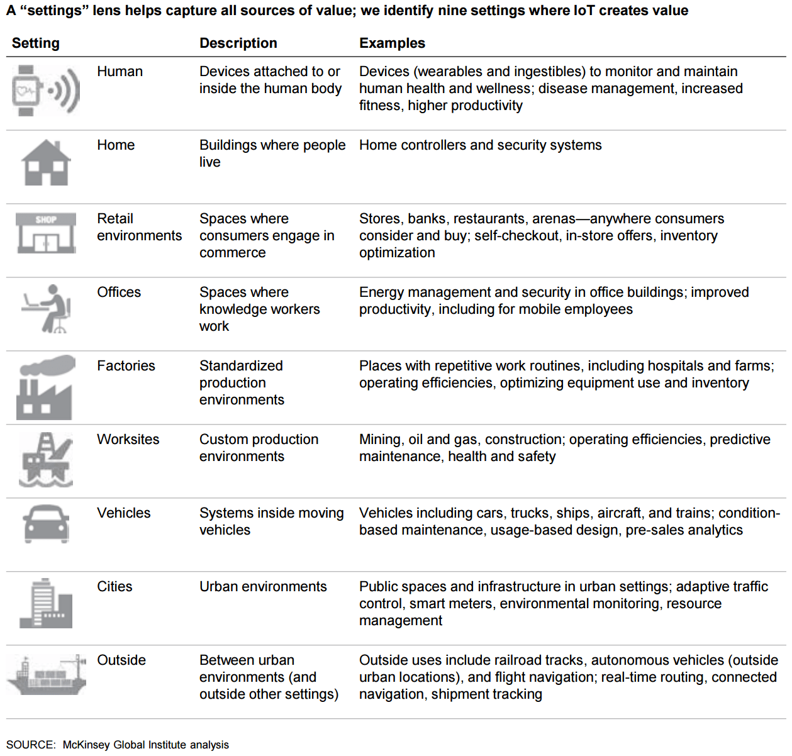

I've being reading around [internet of things (IoT)](https://en.wikipedia.org/wiki/Internet_of_things) and playing with some of the kits available, however, this post is not about how to setup a device and read the data from sensors.

<!--more-->

After talking to some of my family and friends about this and asking what their take on the subject is, I figured most of the people have some misconceptions around it.

In this article I want to explain what is IoT and some of the usage and concerns around it, but before I start, let me mention some of those misconceptions:

**No 1 - IoT is a new phenomenon**

I agree that the buzzword is fairly used recently, but what if I told you that the word internet of things (IoT) was coined in 1999 at MIT. Although at that time it described a network of connected RFID devices.

**No 2 - It is all about sensors**

Although most of the data gathered from devices are mostly produced by sensors, and it is a big part of IoT, however, there is much more to IoT than that. In short, It involves a lot of things such as APIs, networks, gateways, hubs, cloud, software, and the communication between the physical objects.

**No 3 - IoT is not safe**

Security will be a tricky subject with IoT devices as it is with any computer or embedded device. When we talk about sending data to cloud, one cannot deny the high possibility of attacks. However, a lot of work is already being done by the industry leaders in this space. network security protocols and government regulations like [HIPAA (Health Insurance Portability and Accountability Act of 1996)](https://en.wikipedia.org/wiki/Health_Insurance_Portability_and_Accountability_Act) are forcing the industry to take more measures towards securing private data.

**No 4 – It is all about wearables**

Wearables might be the sexiest sort of IoT, and the most personal ones (two of five wearable users claim they feel naked without their devices!), but thy are a tiny portion of IoT settings in which it offers impressive value creation opportunities. Below you can find these from a report published by [MGI reports](http://www.mckinsey.com/insights/business_technology/the_internet_of_things_the_value_of_digitizing_the_physical_world):

**No 5 - IoT is About the Things**

Because of the “Things” in the term, people usually tent to focus on that, however, IoT is about the business services that pull data from those IoT networks. Think of it as every single invention mankind has ever made is done to add value in one way or the other. There is no invention for the sake of creating something new.

# Definition

The Internet of Things, or IoT, refers to billions of mechanical and digital machines, objects, animals and people with unique identifiers around the world that are now connected to the internet, collecting and sharing data without the need for human-to-human or human-to-computer interaction.

If you are wondering how a human or an animal can be part of the network, imagine a human with a heart implant or a farm animal with a bio transponder which are in a network and being monitored for various reasons.

IoT has evolved from the convergence of [wireless](http://searchmobilecomputing.techtarget.com/definition/wireless) technologies, micro-electromechanical systems ([MEMS](http://searchcio-midmarket.techtarget.com/definition/micro-electromechanical-systems)), [microservices](http://searchsoa.techtarget.com/definition/microservices) and the internet.

Kevin Ashton, cofounder of the Auto-ID Centre at MIT, first mentioned the Internet of Things in a presentation he made to Procter &amp; Gamble in 1999. Here’s how he explained it:

> Today computers -- and, therefore, the internet -- are almost wholly dependent on human beings for information. Nearly all of the roughly 50 [petabytes](http://searchstorage.techtarget.com/definition/petabyte) (a petabyte is 1,024 [terabytes](http://searchstorage.techtarget.com/definition/terabyte)) of data available on the internet were first captured and created by human beings by typing, pressing a record button, taking a digital picture or scanning a bar code.

The problem is, people have limited time, attention and accuracy, all of which means they are not very good at capturing data about things in the real world.

If we had computers that knew everything there was to know about things - using data they gathered without any help from us - we would be able to track and count everything and greatly reduce waste, loss and cost. We would know when things needed replacing, repairing or recalling and whether they were fresh or past their best.

# Examples of its usage

While an IoT device can be as fluffy as a child’s toy to a very serious autonomous car, there are many more usages that people are currently adopting into their life style.

## Smart homes

Smart home technology, which co-ordinates and controls lights, televisions, security and air conditioning, is becoming mainstream, while at the top end, luxury homes are pushing the boundaries of technological innovation, particularly in the realms of entertainment.

A touch-screen control panel in the kitchen controls the heating, cooling, security, blinds, music and other systems. Security is a key feature of the technology. The alarm can be deactivated from a smart phone or the keypad at the entrance. When the alarm is deactivated, four entrance doors automatically open and all blinds rise up.

## Wearables

There were[ 78.1 million wearables sold](http://expandedramblings.com/index.php/wearables-statistics/) in 2015 and the market is expected to grow to 411 million by 2020. All wearable technologies including smart watches, fitness trackers, VR headsets and more, generate a ton of data that businesses are just beginning to understand the possibilities and potential applications for.

# Side notes

## Security

Security is one the biggest issues with the IoT. In many cased the sensors gather extremely sensitive information which should be secured to gain the consumer’s trust. Many IoT devices are given little thought to basics of security, like encrypting data in transit and at rest.

Software bugs – even well-maintained code – are regularly found and fixed, however in case of IoT devices, many are not patchable.

## Data privacy

With all those sensors collecting data on everything you do, the IoT is a potentially vast privacy risk.

Take the smart home:

- It can tell when you wake up (when the smart coffee machine is activated)
- How well you brush your teeth (thanks to your smart toothbrush)
- What radio station you listen to (thanks to your smart speaker)
- What type of food you eat (thanks to your smart oven or fridge)
- What your children think (thanks to their smart toys),
- Who visits you and passes by your house (thanks to your smart doorbell).

What happens if this data reaches to thief’s or other types of criminals. Even if we don’t think that extreme, your data can be sold to other companies for things like advertisement which can get annoying too easily if you start getting targeted ads based on your daily activities.

## Big data

The data generated by IoT is huge. This means that IoT can be a significant driver of big data projects because it allows companies to create giant data sets and analyse them.

Giving a manufacturer vast amounts of data about how its components behave in real-world situations can help them to make improvements much more rapidly, while data culled from sensors around a city could help planners make traffic flow more efficiently.

## Smart cities

By spreading a vast number of sensors over a town or city, planners can get a better idea of what's really happening, in real time. As a result, smart cities projects are a key feature of the IoT.

Cities already generate large amounts of data (from security cameras and environmental sensors) and already contain big infrastructure networks (like those controlling traffic lights). IoT projects aim to connect these up, and then add further intelligence into the system.

## What next

As the price of hardware and communications continue to drop, it becomes cost-effective to add more devices to the IoT, even if in some cases there's little obvious benefit to consumers.

As the number of connected devices continues to rise, our living and working environments will become filled with smart products, assuming we are willing to accept the security and privacy trade-offs. Some will welcome the new era of smart things. Others will pine for the days when a washing machine was simply a machine and didn’t order powder from internet.
