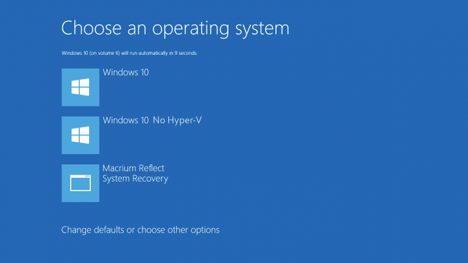

Recently I had to switch between [VirtualBox](https://www.virtualbox.org/) and [Hyper-V](https://en.wikipedia.org/wiki/Hyper-V) and unfortunately these two don't get along well 😉. So I started googling for a solution and this one was the one that got my attention.

<!--more-->

This solution uses a tool called `bcdedit` on windows. The way it works is by duplicating your windows profile and set `hypervisorlaunchtype` mode off in one of them. This way you don't have to uninstall Hyper-V and restart to be able to start a VirtualBox virtual machine. So in this article I will show you how it is done.

First let's start by taking a backup just in case we mess it up.

```bash
bcdedit /export filepath\filename
```

Note: if you don't specify a path it will be saved wherever you are running the script (in case you are looking for it afterwards and you don't remember where it was like me).

Then we will create a copy of the current settings:

```bash
bcdedit /copy {current} /d "Windows 10 No Hyper-V"
```

This command will output a `GUID` which is the identifier of your newly created profile.

```bash
The entry was successfully copied to {271c695f-3ddb-11e8-877f-44850042c8be}.
```

You will need this identifier to change the settings. If for any reason you didn't manage to copy this you can get it by running `bcdedit /enum` command.

Now we will set the `hypervisorlaunchtype` mode on this profile to `off`.

```bash
bcdedit /set {271c695f-3ddb-11e8-877f-44850042c8be} hypervisorlaunchtype off
```

And the output will be something like this:

```bash
The operation completed successfully.
```

Now if you hold the shift key when restarting your windows you will have the option to boot into a windows with Hyper-V off and VirtualBox runs with no issues.



You can take this even further by setting a default so you won't have to switch too frequently:

```bash
bcdedit /default {271c695f-3ddb-11e8-877f-44850042c8be}
```

Hope this saves you some time so you can code instead of figuring this sort of stuff out.
