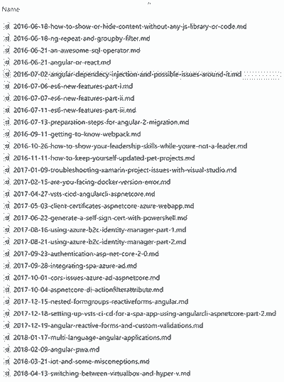

I restarted my blogging around 2016 after loosing all of my previous content and chose [WordPress](https://wordpress.com) because I wanted to focus on content rather than managing the site.

<!--more-->

However, after two years I realised there are a couple of issues really hurting user experience. There were limitations on page load speed because of plugins, managing the plugins and updating them regularly was another one 🔌.

Apart from these the security wasn't that good, the site was served over https, but because of nature of running content out of MySql there were serious risks I had to deal with using other plugins 🔐.

Anyway, I decided to move to [GitHub Pages](https://pages.github.com) and chose [Jekyll](https://jekyllrb.com/) as the static resource generator.

Again since I didn't want to spend a lot of time, searching on google was the starting point. There are many good Jekyll templates which are already on GitHub and ready to use.

I chose [Beautiful Jekyll](https://github.com/daattali/beautiful-jekyll) which to me stood out from others.

[My website](https://mehraban.com.au) is now up and running, but since I had to deal with a couple of tricks, I thought it would be useful to share my experience.

## Starting point

Fork the [Beautiful Jekyll](https://github.com/daattali/beautiful-jekyll) repository on GitHub and rename it to `yourusername.github.io`.

The repository had a very detailed read me that you can follow for customising the site with your information. Most of the configs are in `_config.yaml` file in the root.

## Next step exporting WordPress

This was a bit tricky for me since there is not an easy way to export your content and the media uploaded. So first I exported the content as an `XML` file and then downloaded my photos from my hosting provider's `cPanel`.

## Converting the posts

Since I hadn't used [Markdown](https://en.wikipedia.org/wiki/Markdown) format from beginning there was a lot of garbage in my posts including `inline css`, `pre` and `code` tags, etc. If you are already using Markdown in your WordPress site, your job would be easier than mine.

If not, you have some manual processing to do after converting the posts to Markdown.

### What tool should you use for conversion

I did a search on tools to convert the exported site to Markdown, but many of them failed for me. The one that didn't disappoint me is `wpXml2Jekyll` which you can find [on GitHub](https://github.com/theaob/wpXml2Jekyll/).

You have the option to download the source or you can download the binary and run it. It has an `exe` file which you can use. A single command will convert your posts to Markdown and puts them in a folder.

```bash
wpXml2Jekyll [wordpress export file] [output folder]
```

After running this command you would have a folder with all your posts as separate Markdown files.



## Copy the posts to your site

Now you need to copy these files to your `_posts` folder in the Jekyll site. You might need to check the content a bit to make sure everything looks as it should. Also fixing image paths should be in your mind, unless you decide to stick with WordPress file structure.

## Run the site locally

If you want to run the site locally, there are two options. First and easiest is to install Jekyll on your system. I used [WSL on windows](https://docs.microsoft.com/en-us/windows/wsl/install-win10) and more specifically `Ubuntu` for this which is very easy to setup.

After installing `Ubuntu`, just follow the [instructions](https://jekyllrb.com/docs/installation/#ubuntu) on Jekyll docs to install it.

[[info]]
|**Note**: Remember to update the WSL OS before installing Ruby and Jekyll. by running below command:

```bash
sudo apt-get update -y && sudo apt-get upgrade -y
```

Once finished, you can go into your Ubuntu's terminal and navigate to `/mnt/{drive}/{yourrepofolder}` and run:

```bash
bundle exec jekyll serve
```

This command will build your site and starts a server where you can view your site at `localhost:4000`.

## Push the changes

Once happy push your changes to your `master` branch and wait for a minute for the site to be generated. Now you can navigate to `yourusername.github.io` and see how it looks like.

## Maintaining the links

If you use a specific routing for your blog and want to maintain that so that after migration your old links still work, go into the `_config.yaml` file and change the `permalink` to match your URL pattern.

In my case I got rid of my `subdomain` as well and created a `.htaccess` file in the root of my blog to change the domain and keep the path. This way it the old links will redirect to the main domain but still work. Here is how the `.htaccess` file looks like:

```bash
<IfModule mod_rewrite.c>
RewriteEngine On
RewriteBase /
RewriteRule (.*) https://mehraban.com.au/$1 [R=301,L]
</IfModule>
```

As you can see I am doing a permanent redirect to my website. This way the back button won't work and users will start using my main domain. After a while, I will delete the blog all together 😊.

## Some improvements

### Custom domain

First thing for me was to use my custom domain on GitHub Pages. This part is very easy, you just need to update your DNS `A records` to point to GitHub servers. You will find more information on [GitHub docs](https://help.github.com/articles/using-a-custom-domain-with-github-pages/).

### Enable HTTPS

When you're finished wait for the DNS changes to finish, then you can tick the `Enforce HTTPS` on GitHub which enables HTTPS for your site using [Let's Encrypt](https://letsencrypt.org/getting-started/) certificates.

### Add comment ability to posts

I needed to let users comment on my posts and with GitHub and Jekyll setup, the easiest way was to use [DISQUS](https://disqus.com/).

If you don't have an account, just open a free account and create a website. Once done, get your website name and update the `_config.yaml` file:

```json
# --- Misc --- #
# Fill in your Disqus shortname (NOT the userid) if you want to support Disqus comments
disqus: "yashints"
```

That's it, you can see the comment box on each post and users can comment on them which is great with almost no effort.

### Add share icons to posts

If you want to see share icons at the end of each post, just go to the `share-links-active` section on the config file and set the desired social media flag to `true`.

[[info]]
|**Note**: In order for the share icons to work, you will need to fill in the `social-network-links` part in the config as well.

### Estimated read time

I used to have a plugin on the old blog which showed people how much time they have to spend reading the post. So I took the challenge and implemented mine. Here is how I did it:

1. Add an html file to `_include` folder named `read-time.html`
2. Put the code below inside the file:

```html
<span class="post-meta" title="Estimated read time">
  - <i class="fa fa-clock-o"></i> { % assign words = include.content |
  number_of_words % } { % if words < 360 % } 1 min { % else % } {{ words |
  divided_by:180 }} mins { % endif % } read
</span>
```

The code above takes the count of words of each post and divides it by 180 (average speed of a normal user). Nothing fancy here. I've also done some styling with the added class as well.

3. Add a reference to the read time file in the header template in `_include` folder:

```html
{ % include read_time.html content=content % }
```

Once done, you will have an estimate under post title like me:


Cool isn't it? 😉

### Some performance tuning

All the styles sheets are added to head in this template and since it is using `bootstrap` the render blocking scripts are too much. So I added `pre-loading` to all the style sheets.

The only thing you need to do is to search for all link tags and change them to something like this:

```html
<link
  rel="preload"
  as="style"
  onload="this.rel='stylesheet'"
  href="{{ css | prepend: site.baseurl | replace: '//', '/' }}"
/>
```

This is just an example, but what is happening is that we are telling the browser to pre load the `css` file which doesn't block the rendering. Once finished it changed the `rel` attribute to `stylesheet` so that the CSS get's applied.

This simple step has boosted up the performance by **30%** on Google page speed analyser.

### Add search to your entire site

I decided to use Google search for my site. So I created a new page called `search.md` first:

```html
---
layout: default
title: 'Search the entire site'
css: '/css/search.css'
---

## Search ### Using the Google

<div class="google-custom-search"></div>
```

The next step is to create a site in [Google search](https://cse.google.com/all). Once done, it will give you a code snippet (clicking on get code) that you can simply put into your search page:

```javascript
<script>
  (function() {
    var cx = 'xxxxxxxxxxxxxxxxxxxxxxxxxxxxxxx';
    var gcse = document.createElement('script');
    gcse.type = 'text/javascript';
    gcse.async = true;
    gcse.src = 'https://cse.google.com/cse.js?cx=' + cx;
    var s = document.getElementsByTagName('script')[0];
    s.parentNode.insertBefore(gcse, s);
  })();
</script>
<gcse:search></gcse:search>
```

[[info]]
|**Note**: Do not use the above code as I have masked the unique identifier Google has issued specific to me.

Hope you have a good migration and I will update this article as I customise the template even more 🔥.
