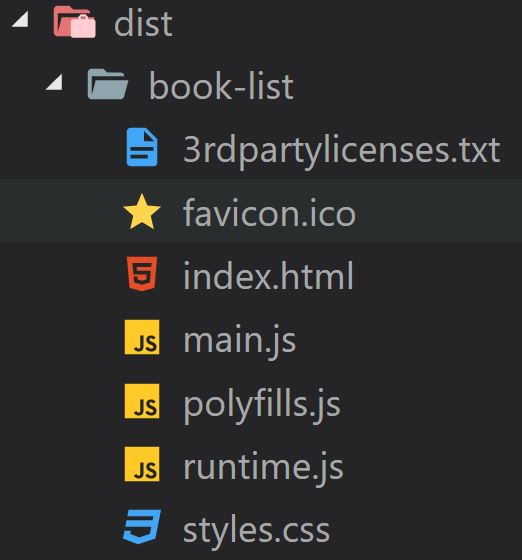
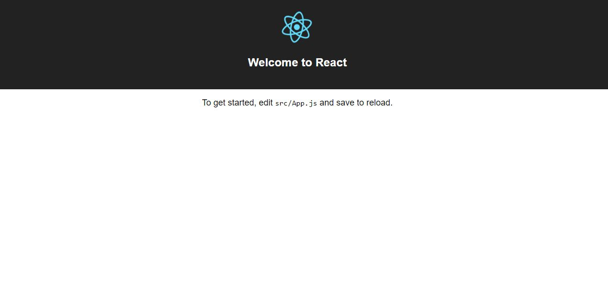

With release of [Angular 6](https://blog.angular.io/version-6-of-angular-now-available-cc56b0efa7a4), the team released `Angular Elements` which allows you to bootstrap Angular components within an existing Angular application by registering them as _Custom Components_.

<!--more-->

This opens a whole lot of opportunities to web developers who are used to argue about superiority of Angular vs React. Some people believe Angular is suitable for developing enterprise applications, while others prefer React because of it's speed and bundle size. Meanwhile, Angular team has been working hard to bring this feature into V6 release and let Angular lovers create Custom Components which can be used in other framework.

The result component will be like a web component for the React application like any other HTML components like `button` or `input`. Plus, finally I found some time to play with the concepts and get a quick demo ready and it was pretty easy as expected. So let's get started.

For the purpose of this post, I will create a book list component in Angular which accepts a list of books and shows them in the page. This component is ported into a React application which will send the list of books as props to it. Once a book is added to card the changes will be propagated to React app.

## Create your Angular component

First let's create a new Angular application using Angular CLI:

```bash
ng new book-list
```

You can go ahead and delete the default app component and create a new component called book list:

```bash
ng g c book-list
```

Since we want to evaluate the communication between our Angular and React applications, we will pass the book list as input. Just to test the other way around, we define an output as an `EventEmitter` that gets triggered whenever a book is selected from the list. So the component code will look like this:

```typescript
import { Component, Input, Output, EventEmitter } from '@angular/core'

@Component({
  selector: 'book-list',
  templateUrl: './book-list.component.html',
  styleUrls: ['./book-list.component.css'],
})
export class BookListComponent {
  public booksList: any[]

  @Input('books')
  set books(books: string) {
    this.booksList = JSON.parse(books)
  }

  @Output('bookSelected') bookSelected = new EventEmitter<any>()

  constructor() {}

  selected(book: any) {
    this.bookSelected.emit(JSON.stringify(book))
  }
}
```

[[info]]
|**Note:** Currently passing a complex object like array into a web component is a bit of grey area. So we just pass a JSON string for the purpose of this post. If someone knows a way to to this please comment below and I will update the post (thank you in advance 🙏).

And the HTML is pretty simple:

```html
<h1>List of recent books</h1>

<div *ngFor="let book of booksList">
  <strong>{{book.name}}</strong>
  <p>{{book.description}}</p>
  <label class="container"
    >Add to card <input type="checkbox" (change)="selected(book)" />
    <span class="checkmark"></span>
  </label>
</div>
```

### Bootstrapping the component as an element

Now that we have created our component, it's time to bootstrap our component as an Angular element:

```typescript
import { BrowserModule } from '@angular/platform-browser'
import { NgModule, Injector } from '@angular/core'
import { createCustomElement } from '@angular/elements'
import { BookListComponent } from './book-list/book-list.component'

@NgModule({
  declarations: [BookListComponent],
  imports: [BrowserModule],
  providers: [],
  bootstrap: [],
  entryComponents: [BookListComponent],
})
export class AppModule {
  constructor(private injector: Injector) {
    const customElement = createCustomElement(BookListComponent, { injector })
    customElements.define('book-list', customElement)
  }

  ngDoBootstrap() {}
}
```

To create a custom element from the book list component, we should invoke the new `createCustomElement` method which doesn't insert the newly created component inside _CustomElementRegistry_, hence using AppModule constructor to do it manually. Maybe in future that will happen automatically but until then it is our job to do it.

At this point the element is ready. It's time to build our element:

```bash
ng build --prod --output-hashing none
```

If you have a look at your `dist/book-list` folder now, you should see three JS files generated for you, `main.js`, `polyfills.js`, `runtime.js`.



## Hosting our book list inside a React app

It's time to create our React app. We can start by creating one using React CLI:

```bash
npx create-react-app react-host
```

When the command finished you should have the initial React app template setup. If you run `npm start` from inside the _react-host_ folder, you should see the default app:



We can copy the three files created by Angular CLI into the public folder of our React app and reference them inside `index.html`:

```html
<body>
  <noscript> You need to enable JavaScript to run this app. </noscript>
  <div id="root"></div>

  <script type="text/javascript" src="./book-list/runtime.js"></script>
  <script type="text/javascript" src="./book-list/polyfills.js"></script>
  <script type="text/javascript" src="./book-list/main.js"></script>
</body>
```

### Using the book list component

Now that we have everything in place, let's start by modifying our app component and add a list of books as it's state so we can pass it down to our book list:

```javascript
constructor(props){
  super(props)
  this.state = {
    books: [
      {
        name: '10% Happier',
        description: `Practicing meditation and mindfulness
          will make you at least 10 percent happier.`
      },
      {
        name: 'The 10X Rule',
        description: `The biggest mistake most people
          make in life is not setting goals high enough.`
      },
      {
        name: 'A Short Guide to a Happy Life',
        description: `The only thing you have that nobody
          else has is control of your life.`
      }
    ]
  };
}
```

Now we can use our book list component and pass the books down as property:

```javascript
render() {
  return (
    <div className="App">
      <header className="App-header">
        
        <h1 className="App-title">Welcome to React</h1>
      </header>

      <div className="book-list">
        <book-list ref={elem => this.nv = elem}
          books={JSON.stringify(this.state.books)}></book-list>
      </div>
      <div className="selected-books">
        <h1>Shopping card</h1>
        {this.renderSelectedBooks()}
      </div>
    </div>
  );
}
```

[[info]]
|**Note:** As I mentioned above, we need to pass a string to our custom component or it won't receive the correct data.

We used a method to render the selected books, so let's define it:

```javascript
renderSelectedBooks() {
    return(
      <div>
        {
          this.state.selectedBooks.map(function(book, index){
            return <div><strong key={ index }>{book.name}</strong></div>;
          })
        }
      </div>
    )
  }
```

I am using internal state here, but note that this is not a React post and I am not following any practice here.

Also we used a variable called `nv` to have a reference to the component. We will add an event listener to it which listens to `bookSelected` event and called a method to handle the event.

```javascript
componentDidMount() {
  this.nv.addEventListener("bookSelected", this.handleBookSelected);
}
```

[[warning]]
|**Warning:** The name of the event should match the name of event that you used when defining the Angular element.

Let's initialise our state in our event handler:

```javascript
handleBookSelected = event => {
  const book = JSON.parse(event.detail)
  let selectedBookList = []

  if (this.state.selectedBooks.find(x => x.name === book.name)) {
    selectedBookList = this.state.selectedBooks.filter(
      x => x.name !== book.name
    )
  } else {
    selectedBookList = [...this.state.selectedBooks, book]
  }

  this.setState({
    ...this.state,
    selectedBooks: [...selectedBookList],
  })
}
```

The above code looks a bit busy, but it is very simple. We first check if the book is already selected and remove it if it is. If the book is not in selected list we add it and update the state. Once the state is updated React will reload the page and shows the updated selected books.

If you run the app now you should see a screen like this:

<video width="600px" controls>
  <source src="./ReactApp.mp4" type="video/mp4">
</video>

And that's it you're officially running an Angular element inside a React app and they get along really well 😁🔥💯.

You can find the source code [on my GitHub repository](https://github.com/yashints/AngularInsideReact).

Hope you've enjoyed the reading.
