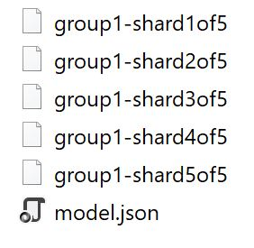

If you are like me, who have been wondering what is machine learning (aka ML) and scaped from all those mathematical jargon, it's an exciting time since the `TensorFlow.js` is here to the rescue.

<!--more-->

You can find the [code for this post here](https://github.com/yashints/mobilenet).

## Intro

I've been a front end developer for may years, but also curious about machine learning and AI. However, never had a chance to go deeper into it because I have always been busy and most of the machine learning frameworks have been written in languages that I had no exposure to.

Things has changed, and people are now using machine learning in mobile devices or in the browser. `TensorFlow.js` is one of the libraries which allows us to create, train and deploy ML models in the browser or in `Node.js`. To be honest, I am really excited about this since it allows me to play with models and neural networks without need to go very low level or learn a new language 🤯.

Don't get me wrong, I am not afraid of learning a new language and in fact it is one of my hobbies. But since I have been busy with lot's of different tasks, simply haven't had time to dive into that area.

The good thing about this library is that you don't need to have prior knowledge on ML, you just deal with some high level APIs that have simplified a lot of concepts for you, so you can focus on deploying the models and solving problems rather than reinventing the wheel 🔥.

But there are more options which open up a whole lot of opportunities for us. Basically you can:

- Import a pre-trained model and use it (predict or deploy it)
- Import a pre-trained models (Keras or Python) and train it with your dataset
- Create, train, predict, and deploy privacy friendly models (data never leaves the app)
- And probably much more that I am not aware of 🤷‍.

## Core concepts

Before we go further into how to use it, we need to get familiar with some basic concepts so to be on the same page.

**Tensor**

The central unit of data in TensorFlow.js is the tensor: a set of numerical values shaped into an array of one or more dimensions. A `Tensor` instance has a shape attribute that defines the array `shape` (i.e., how many values are in each dimension of the array).

**Variables**

Variables are initialized with a tensor of values. Unlike Tensors, however, their values are mutable.

**Operations (Ops)**

While tensors allow you to store data, operations (ops) allow you to manipulate that data. TensorFlow.js provides a wide variety of ops suitable for linear algebra and machine learning that can be performed on tensors. Because tensors are immutable, these ops do not change their values; instead, ops return new tensors.

**Models and Layers**

Conceptually, a model is a function that given some input will produce some desired output. In `TensorFlow.js` there are two ways to create models. You can use ops directly to represent the work the model does.

Or you can use the high-level API `tf.model` to construct a model out of layers, which are a popular abstraction in deep learning.

[[warning]]
|**Warning:** Because TensorFlow.js uses the GPU to accelerate math operations, it's necessary to manage GPU memory when working with tensors and variables. TensorFlow.js provide two functions to help with this: `dispose` and `tf.tidy`. We will dive into these later.

## How to use a pre-trained model

You can use pre-trained models from the highly-popular [Keras](https://keras.io/) Python library to make predictions. This means you don't need to be a data scientist to be able to use the models or even to build powerful ML-powered apps.

Fortunately there are many models available and ready to use which are being exposed via `TensorFlow.js`. For this you will need to use `TensorFlow.js converter` which is an open source library to load a pre-trained model into a format which is understandable by `TenserFlow.js`.

[[info]]
|**Note:** For this you will need to know a tiny bit of [Python](https://www.python.org/) and have it installed locally.

You will need to perform two operations to have a ready to use model. First save the model locally, and then run the convertor to convert it. But I found an easier way which doesn't require running a conversion. The conversion logic is already implemented in the `tensorflowjs` Python package 😁, so I am just going to use that.

### Save the model

Let's go through an example, say we want to import the MobileNet network (which is used to detect objects in images) and save it locally. First follow the [instructions here to install the pre-requisites](https://www.tensorflow.org/install/pip).

Then we can write the below code to save the model locally:

```py
from keras.applications import mobilenet
import tensorflowjs as tfjs

mobilenet = mobilenet.MobileNet()

save_path = "output\\mobilenet"
tfjs.converters.save_keras_model(mobilenet, save_path)
```

َAfter running this, you should have a `mobilenet` folder in the `output` folder which contains the following files:



And guess what, you're ready to use this and write your first `TensorFlow.js` application.

If you're keen to convert the model using the CLI commands, have a look at [this tutorial](https://js.tensorflow.org/tutorials/import-keras.html).

## Use the model in your application

I am using [Angular](https://angular.io/) in my example, but feel free to use any framework you prefer or even vanilla JS 🙃.

### Create the app

I've got the Angular CLI installed already, so I am just going to open up a command prompt and create a new application:

```bash
ng new mobilenet

cd mobilenet
```

### Install the TensorFlow.js

This will take a few moments (creating the app and installing all the npm packages). When finished add the `TensorFlow.js` package as well:

```bash
npm install @tensorflow/tfjs --save
```

Once this is finished, copy the content of your saved model into your asset folder and open the folder with your editor of choice ([VS Code](https://code.visualstudio.com/) 😁).

You will also need to have the image classes for prediction purposes. So create a file somewhere in the project and add the content of [this file](https://github.com/tensorflow/tfjs-examples/blob/master/mobilenet/imagenet_classes.js) into it. I've put it in my assets folder.

### Import the model and use it

Open your `app.component.ts` file and add the import statement:

```ts
import * as tf from '@tensorflow/tfjs'
import { IMAGENET_CLASSES } from '../assets/imagenet-classes'
```

We will need some variables to hold our data and some references to out HTML elements we have to use:

```ts
model: tf.Model;
classes: any[];
imageData: ImageData;

@ViewChild('chosenImage') img: ElementRef;
@ViewChild('fileUpload') fileUpload: ElementRef;
```

The model will have our model, classes is used for our prediction result, and `imageData` is used to convert our file upload file to it and show it in an image on the page.

And two global variables, the image size is the size which model is trained on, and the number of predictions we want to pick from prediction result (since it is an array):

```ts
const IMAGE_SIZE = 224
const TOPK_PREDICTIONS = 5
```

Time to add a method to load the model and call it in the `ngOnInit`:

```ts
ngOnInit() {
  this.loadModel();
}

async loadModel() {
  this.model = await tf.loadModel('/assets/model.json');
}
```

We will need a file upload and an image in our HTML, so let's add them:

```html
<div class="container">
  <h2>
    Using MobileNet neural network in Angular
  </h2>
  <div class="upload" [hidden]="!model">
    Upload an image:
    <input
      #fileUpload
      type="file"
      id="files"
      name="files[]"
      (change)="fileChangeEvent($event)"
    />
  </div>
  <div>
    
    <div class="predictions">
      <div
        *ngFor="let class of classes"
        class="row"
      >
        <div class="col-sm-6">
          {{class.className}}
        </div>
        <div class="col-sm-6">
          {{class.probability.toFixed(3)}}
        </div>
      </div>
    </div>
  </div>
</div>
```

And a bit of CSS to make it pretty:

```scss
.container {
  padding: 200px;

  .sample-image {
    margin: 20px;
  }

  .predictions {
    margin-top: 20px;
    width: 100%;
  }
}
```

The predictions section in the HTML will have the prediction results in it, we assume it is stored in a variable called `classes`.

Now let's go back to our TypeScript file and add the prediction code. Let's create a handler for our file input first, that will trigger our prediction logic:

```ts
fileChangeEvent(event: any) {
  const file = event.target.files[0];
  if (!file || !file.type.match('image.*')) {
    return;
  }

  this.classes = [];

  const reader = new FileReader();
  reader.onload = e => {
    this.img.nativeElement.src = e.target['result'];
    this.predict(this.img.nativeElement);
  };

  reader.readAsDataURL(file);
}
```

All we are doing in this method is to read the selected file, put as the source of the image on the page so it's visible which image is selected and call the predict method. We have call that in the `onload` event handler asynchronously because file has to be read first.

Let's now write the prediction code:

```ts
async predict(imageData: ImageData): Promise<any> {
  this.fileUpload.nativeElement.value = '';
  const startTime = performance.now();
  const logits = tf.tidy(() => {
    // tf.fromPixels() returns a Tensor from an image element.
    const img = tf.fromPixels(imageData).toFloat();

    const offset = tf.scalar(127.5);
    // Normalize the image from [0, 255] to [-1, 1].
    const normalized = img.sub(offset).div(offset);

    // Reshape to a single-element batch so we can pass it to predict.
    const batched = normalized.reshape([1, IMAGE_SIZE, IMAGE_SIZE, 3]);

    // Make a prediction through mobilenet.
    return this.model.predict(batched);
  });

  // Convert logits to probabilities and class names.
  this.classes = await this.getTopKClasses(logits, TOPK_PREDICTIONS);
  const totalTime = performance.now() - startTime;
  console.log(`Done in ${Math.floor(totalTime)}ms`);
}
```

If you don't understand the code here at the first glance, it's perfectly OK. Since we have imported the model we have to know a bit about its internals.

First of all I am using the `tidy` function as I mentioned earlier to make sure we don't have any memory leak.

Then I will convert the image to a float data type which is expected in this model.

Once that is done we need to normalise the data from [0, 255] range to [-1, 1]. The `scalar` operation creates a tensor with provided value.

And at last we need to reshape our input to a [1, IMAGE_SIZE, IMAGE_SIZE, 3] tensor and call predict.

Once we got the result we have to extract the top `x` classes from the result, so let's implement that:

```ts
async getTopKClasses(logits, topK): Promise<any[]> {
  const values = await logits.data();

  const valuesAndIndices = [];
  for (let i = 0; i < values.length; i++) {
    valuesAndIndices.push({ value: values[i], index: i });
  }
  valuesAndIndices.sort((a, b) => {
    return b.value - a.value;
  });
  const topkValues = new Float32Array(topK);
  const topkIndices = new Int32Array(topK);
  for (let i = 0; i < topK; i++) {
    topkValues[i] = valuesAndIndices[i].value;
    topkIndices[i] = valuesAndIndices[i].index;
  }

  const topClassesAndProbs = [];
  for (let i = 0; i < topkIndices.length; i++) {
    topClassesAndProbs.push({
      className: IMAGENET_CLASSES[topkIndices[i]],
      probability: topkValues[i]
    });
  }
  return topClassesAndProbs;
}
```

Alright, remember we called this method with the result of predict in shape of a `logit`. Logits are normally either a `Tensor` or an array or a typed array.

So basically we get the result by awaiting the `data` method. Then we create a new array using the value and index of the output of that.

And based on that we calculate the resulting classes based on the formed array. Again you don't need to understand what the code does, at a high level it is just mapping the result to one of the classes we got from the GitHub repository earlier.

## Running the app

You can now run the app and go to `localhost:4200` and upload an image and see what predictions you get 😎.

<video controls playsinline webkit-playsinline 
  style="max-width: 900px"
  src="./Mobilenet.webm" preload="auto">
Your browser does not support the video tag.
</video>

And that's how easy it is to get started. Hope you've enjoyed this post and be sure there will be more.

You can find the [code for this post here](https://github.com/yashints/mobilenet).
