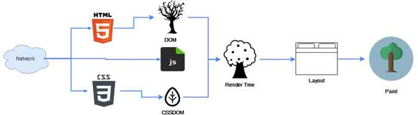
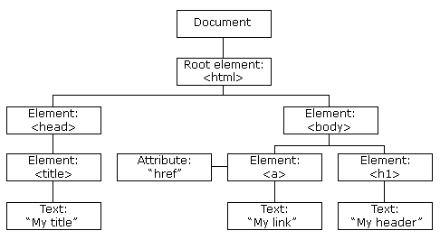

Recently I had a chance to present a talk at [NDC Sydney](https://ndcsydney.com/talk/need-for-speed-8-performance-tuning-of-your-web-application/) about web performance and it received a great feedback.

<!--more-->

That inspired me to write up a series of posts on each topic I covered in that talk, and who knows, maybe each of these posts would be a talk some day by their own 😃.

Link to all other parts:

[Part 2 use Preload/Prefetch to boost load time](/blog/2018/10/06/web-perf-2)

[Part 3 JavaScript tips and tricks](/blog/2018/10/12/web-perf-3)

[Part 4 Image optimisation](/blog/2018/11/12/web-perf-4)

[Part 5 Web font optimisation](/blog/2018/11/23/web-perf-5)

So here we go, part one is about tips and tricks on HTML and CSS to improve the performance.

But before we jump into this, you will need to know how browsers render your page. This involves [HTML](https://en.wikipedia.org/wiki/HTML), [CSS](https://en.wikipedia.org/wiki/Cascading_Style_Sheets) and [JavaScript](https://en.wikipedia.org/wiki/JavaScript) and steps every browser takes to show your web page to end user.

## The Critical Rendering Path

The [Critical Rendering Path](https://css-tricks.com/understanding-critical-rendering-path/) consists of five steps which are best to be seen in visual:

Alright now that you saw it in a picture, let me explain each step in more details.

### Building DOM and CCCOM

As most of the pages consist of HTML, CSS and JavaScript. Web browsers need to know what and how to show to users and they do this by parsing the HTML page sent over network and constructing a Document Object Model (DOM). They look at HTML tags (`

`, `

`, `<h1></h1>`) and convert them to tokens. These tokens are then converted to nodes in parallel.

By processing the start and end tags for each token in order, the browser then establishes their hierarchy (parent and child).

This is way simpler than it looks, in the picture above imagine DOM to be a bit tree with all the nodes (branches) and their children (leaves). This tree contains all the dependencies of nodes to construct our HTML:

<i>Image from [W3C website](https://www.w3schools.com/js/pic_htmltree.gif)</i>

The DOM represents your whole markup and is built incrementally by the browser. As of HTML5 the browsers support streaming HTML instead of waiting for the whole page to get sent to browser in one go. This is great because it helps the rendering to be done at the same time as the bytes are arrived.

After constructing the DOM, browser looks at any style which is referenced in the page to build the CSS Object Model (CCCOM). CCCOM describes the style rules that need to be applied to the document. This is very similar to how DOM was built, however, in this process each child inherits the styles applied to its parent - hence the name cascading style sheets.

Partial processing of styles is not possible so browsers need to wait for all the style rules to be sent over before they can start inferring what rule is applied to which nodes. This is the reason why CSS is a render blocking element.

Mix of DOM and CCCOM is something called the Render Tree. This tree includes all the nodes and their dependencies plus all the CSS rules which are applied to those.

### Render Tree

After constructing all the nodes, browser needs to know which ones to show on the page. Render Tree is exactly the representation **visible** content on the page.

The browser stars from the root and then copies all the **visible** nodes from DOM and CCCOM. The steps taken are roughly as below:

- Starting at the root, traverse each visible node
  - Some nodes are not visible like meta tags, links, etc.
  - Some nodes are hidden using CSS like `display: none`
- For each node find the matching CSS rule and apply it
- Emit visible nodes with content and they styles

_Image from [Google Developers](https://developers.google.com/web/fundamentals/performance/critical-rendering-path/images/render-tree-construction.png)_

### Layout

Now that we have all the nodes with their styles, it's time to figure out where to put them on screen. This is exactly what layout step is. The first thing which is needed is the browser window size. This is the basis for all the following calculations, since the layout depends on it to know the position and dimension of each element.

The output of this step is the [Box Model](https://www.w3schools.com/css/css_boxmodel.asp) which captures the exact position and size of it, plus their margin, padding, border and etc.

This step will be repeated by each change to size or when we switch between landscape and portrait on a mobile device.

### Paint

This step is the last one where pixels are painted on screen which can take some time because the browser has quite a lot of work to do. This time depends on window size, how much style is applied to each node, the hardware used on device and so on.

When this step is finished, the page is finally visible in the viewport.

## So what

Ok, enough with Critical Rendering Path, let's see how we can improve the web performance with tweaks on HTML and CSS.

### Stream HTML to client

When sending HTML to client try to flush the buffer often instead of once at the end. This means chunks of HTML would arrive and browser can parse them as they arrive not at the end. This will help to boost the performance.

As an example, when `HEAD` tag is arrived browser can send other requests for assets while the rest of the HTML is arriving.

### Size matters

Minifying and compressing is really important since it can reduce the payload size and reduce the HTTP response time which in turn results in better load time.

These techniques along with the right caching strategy can massively help the web performance to be improved.

### Send the CSS early and keep it minimal

As you saw CSS is a render blocking element, so it should be sent down to client as early as possible. Also think of how much CSS is needed on first page load, extract the unused CSS from the main file and load them separately and later when needed.

You can also use pre-loading/pre-caching to improve the performance. These are part of [PRPL pattern which was introduced by Google in 2016](https://developers.google.com/web/fundamentals/performance/prpl-pattern/).

Another technique which is not used as often by developers is to use link tags inside body along with content. This is really useful as you can send a minimum amount of CSS to client even inside your HTML in a `style tag` and then load the rest later when needed to improve the render time.

## Summary

In short, keep your recourses minimum and send them fast and optimum. Try to cut down unused CSS rules and use minification and compression to speed up the transfer.

Hope you've enjoyed reading this and are looking forward for the rest of the series 😉.

### Resources

- Web Performance Matters on [Google Developers](https://developers.google.com/web/fundamentals/performance/why-performance-matters/)
- Understanding Critical Rendering Path on [CSS Tricks](https://css-tricks.com/understanding-critical-rendering-path/)
