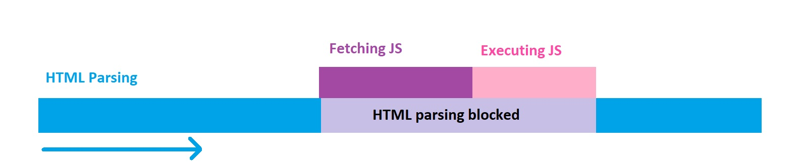
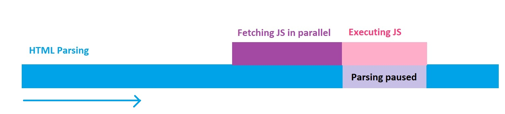
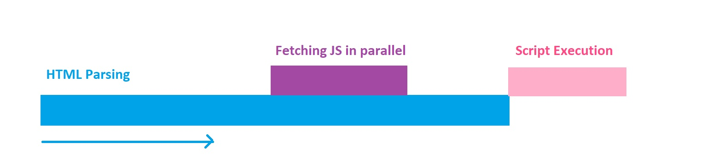

Recently I had a chance to present a talk at [NDC Sydney](https://ndcsydney.com/talk/need-for-speed-8-performance-tuning-of-your-web-application/) about web performance and it received a great feedback.

<!--more-->

That inspired me to write up a series of posts on each topic I covered in that talk, and who knows, maybe each of these posts would be a talk some day by their own 😃.

All other parts:

[Part 1 on HTML and CSS](/blog/2018/09/29/web-perf-1)

[Part 2 use Preload/Prefetch to boost load time](/blog/2018/10/06/web-perf-2)

[Part 4 Image optimisation](/blog/2018/10/12/web-perf-4)

[Part 5 Web font optimisation](/blog/2018/10/12/web-perf-5)

Time to see what we can do for our old friend JavaScript. So let's begin.

# Switch to HTTP/2

With more and more hosting providers supporting [HTTP/2](https://en.wikipedia.org/wiki/HTTP/2), it's becoming a good time to switch to this protocol instead and benefit from its multiplexed nature. What it means in terms of performance is that we don't need to bundle all of our JavaScript into large bundles to reduce the number of calls to server.

With **HTTP/2** designed to handle large number of requests, you can now increase the number of files required to render the page. Not too much tho:

> Too much of a good thing is a bad thing.

# Async & Defer

As I mentioned before, JavaScript, like CSS is a **render blocking** element. This simply means the browser needs to wait for it to load and execute before it can parse the rest of the `HTML` document.

This hugely increases our [First Meaningful Pain](https://developers.google.com/web/tools/lighthouse/audits/first-contentful-paint). In order to fix this issue we can use two of the features which are not used by many people but are very effective.

### Normal execution

When you use a `<script>` to load a JavaScript file, it interrupts the parsing of the document. Browser fetches the resource, executes this and then continues on paring:



### The `Async` attribute

The `Async` attribute is used to indicate that this resource can be executed asynchronously. The parsing doesn't need to be halted, it can be done right after the resource is fetched from network and is ready.

```html
<script async src="script.js">
```

This attribute can be used only on external JavaScript files. The file would be downloaded in parallel and once the download is finished, the parsing is paused for the script to be executed:



### The `Defer` attribute

The `Defer` attribute is used to tell the browser to execute this script after parsing the whole document.

```html
<script defer src="script.js">
```

Like `Async` this file gets downloaded in parallel but the execution only happens when the whole `HTML` document is parsed:



At the end remember to put all of your `script` tags right at the end of the `body` to prevent more delay in parsing your `HTML`.

As for the browser support, fortunately these attributes are fully supported by all of the major ones.

# Code splitting

Most of the modern sites will bundle all of their JavaScript into one, resulting in an increase in load time and suffering from load performance.

Code splitting allows you to split your application code into separate chunks and lazy load them when needed. This also means minimum required code to client and improve the page load time.

You can split your code in three areas:

- Vendor code
- Entry point
- Dynamic splitting

## Vendor code

Vendor code like Angular, React, moment, etc. can be separated from your main code. [Webpack](https://webpack.js.org/) has full support for this and other methods. This technique allows you to have better control over cache invalidation of your bundles whenever your app or vendor code changes independently of one another.

This is something every app should do.

## Entry point

This technique separates your code by entry points in your app. These points are where bundlers like webpack start from, when they build a dependency tree of your app.

This is bar far the easiest way to split code, but it is manual and has some pitfalls:

- If there are any duplicated modules between entry points, they will be bundled in both.
- It isn't as flexible and cannot be used to dynamically split code with your app logic.

This technique is not suitable for when you have client side routing or when you have a mix of server side rendering and a single page app.

## Dynamic splitting

Separate code when dynamic `import` are used. This is the best option for single page applications. Having different modules for different routes in your SPA is an example of this.

## Do I even need code splitting?

This is one of many times when you hear me say it depends (I am a consultant after all 😉). If your app has many routes with isolated functionality and heavily uses frameworks and libraries, this answer is most probably **YES**.

However, it is up to you to decide whether you need it or not by your own understanding of your app structure and code.

# Import wisely

If you use `npm` or other package management systems for your dependencies, then you will have a lot of extra and unneeded files in your buid folder.

When using a framework or a library, make sure you investigate wether they have separate modules you can import and if yes, only import what you need.

For instance, let's assume you are using [underscore](https://underscorejs.org/), but only use `groupBy`, `shuffle`, and `partition`. Most people import the whole library like this:

```js
import * as _ from 'underscore';
```

Instead of this, you could just import what you need:

```js
import { groupBy, shuffle, partition } from 'underscore';
```

This way you only bring what your need and the bundlers will take care of the rest for you. Your total package size and as a result your page load time will decrease.

# Throttling and debounce

Ok, enough about the size, let's see where else we can improve our performance.

Many times you have to add an event listener to do something, like listening to page scroll. Then we forget that the listener fires every time the event is triggered.

```js
window.addEventListener('scroll', function() {
  console.log('page scrolled');
});
```

In the above example, the message is printed into console whenever you scroll. Imagine you have some heavy operation in that callback function, this would turn into a big performance bottleneck.

If you can't remove that event listener and use a different approach, then you can use either `debounce` or `throttle` to alleviate the situation.

## Debounce

This feature enforces a function call to not happen until some time has passed since it's last call. For example, call the function if 100 millisecond has passed from it's last call.

Look at this implementation from underscore:

```js
const debounce = (func, delay) => {
  let inDebounce;
  return function() {
    const context = this;
    const args = arguments;
    clearTimeout(inDebounce);
    inDebounce = setTimeout(() => func.apply(context, args), delay);
  };
};
```

Now we can debounce our event listener for every 100 millisecond:

```js
var efficientScrollListener = debounce(function() {
  console.log('page scrolled');
}, 100);

window.addEventListener('scroll', efficientScrollListener);
```

## Throttle

Throttling is similar to debounce but different since it will enforce the maximum number of times a function can be called over a period of time. For example execute this function once every 100 millisecond.

Here is a simple implementation:

```js
const throttle = (func, limit) => {
  let inThrottle;
  return function() {
    const args = arguments;
    const context = this;
    if (!inThrottle) {
      func.apply(context, args);
      inThrottle = true;
      setTimeout(() => (inThrottle = false), limit);
    }
  };
};
```

Now we can throttle our scroll event listener:

```js
var efficientScrollListener = throttle(function() {
  console.log('page scrolled');
}, 100);

window.addEventListener('scroll', efficientScrollListener);
```

# So what

I hope I have given you enough information on just some of the areas you can focus to improve your applications performance when using JavaScript. If you would like to have other topics covered please comment below and I will add them here or in another post.

And as always don't forget to share the ❤️.
