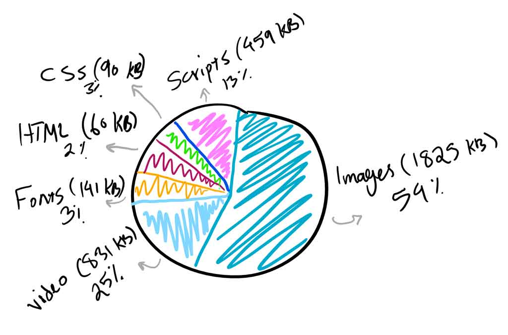
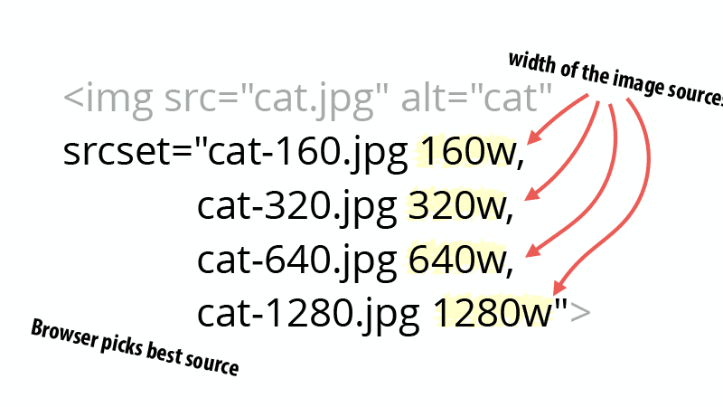

Recently I had a chance to present a talk at [NDC Sydney](https://ndcsydney.com/talk/need-for-speed-8-performance-tuning-of-your-web-application/) about web performance and it received a great feedback.

<!--more-->

That inspired me to write up a series of posts on each topic I covered in that talk, and who knows, maybe each of these posts would be a talk some day by their own 😃.

All other parts:

[Part 1 on HTML and CSS](/blog/2018/09/29/web-perf-1)

[Part 2 use Preload/Prefetch to boost load time](/blog/2018/10/06/web-perf-2)

[Part 3 tips and tricks optimising JavaScript](/blog/2018/10/12/web-perf-3)

[Part 5 Web font optimisation](/blog/2018/10/12/web-perf-5)

## Intro

Believe me you don't want Google to hate your website. Knowing
the most heavy weight items on every website are images, it is very important to focus on their optimisation.

Fortunately, reducing their size is very easy and has massive impact on the overall size of the page. For most of the users on a mobile device, the image quality wouldn't be so important. Even on a desktop with high resolution there are sacrifices you can make. That's because human eyes won't detect certain pixels not being present.

As long as you don't go too far optimising an image to make it ugly, it is a good to continue reducing its size 🤷‍.

> Images take more than %50 of a web page's overall weight 😱. That's why we should optimise them!

|  |
| :--------------------------------------------: |
|         _Average bytes per page 2018_          |

## What does image optimisation mean

Image optimisation is referred to **reducing image sizes** using different techniques. This will result in the page being loaded faster, hence having a better user experience.

## Why bother

Here are some benefits you would gain by optimising your images:

- It will improve the page load time. For every second users have to wait for the page to load, Amazon will lose \$1.6 billion in sales per year (you may now pick a calculator and see how much your company would be impacted 😁).
- It improves your SEO capabilities, your site will rank higher in search engines resulting in more traffic.
- Creating site backups will be faster (if you are using a CMS or if you backup the whole site)
- Smaller image sizes use less bandwidth, resulting in not draining user's mobile data quota.
- Requires less storage space on the server (or CDN), makes it more cost effective.

## Let's optimise them

The primary goal of image optimisation is to find the balance between file size and image quality. But before we start on optimisation tips, we should understand different image formats and when to use each.

### Choose the right format

- **PNG** – produces higher quality images, but also has a larger file size. Was created as a lossless image format, although it can also be lossy.
- **JPEG** – uses lossy and lossless optimization. You can adjust the quality level for a good balance of quality and file size.
- **GIF** – only uses 256 colors. It’s the best choice for animated images. It only uses lossless compression.

There are some newer image formats like **WebP** and **Jpeg2000**, but the browser support is not there yet. In summary you should use JPEG for images with lots of colour and PNG for simpler images.

### Size vs Compression

This is an example of an image before and after compression. Note how the quality is impacted (you can't see it in the cat, but around it):

**Before**


**After**


For the same reason that you can't figure out the difference in the cat itself between the first and second image, it is safe to compress image to that degree. Just to let you know the first image is 4mb and the second is only 27kb. 🤷‍

### Lossy vs Lossless Optimisation

Now that you know how important it is to compress images and reduce the quality, it is also important to know we have two types of compression:

- **Lossy** - this is kind of a filter to eliminate some data from the image, in the above example you could see some loss in the area around the cat. Using this technique, the file size will be reduced to a large degree. Tools such as Adobe Photoshop, Affinity Photo or some free online tools such as [Image Compressor](https://imagecompressor.com/) will do the trick for you.

- **Lossless** - this is a filter that does not eliminate any data, but uses compression only to reduce the size, but it means it requires images to be uncompressed to operate. You can do this easily using tools like [FileOptimizer](http://netm.ag/optimize-263) and [ImageOptim](http://imageoptim.com/).

You will need to experience it yourself and find the sweet spot for your images. It is a task which requires some work beforehand but saves you a lot of time later. Another thing to consider is to use these tools like ImageOptim in your build process, this way you don't even need to worry about doing it upfront. And your original images remain untouched.

## Using the right dimension

As important as compression is, by itself it can go only so far keeping the same dimension. After you apply the compression you cannot reduce the size with the same width and height anymore.

Apart from this, you will need to know that showing a picture with 2000px width on a mobile device is not such a good idea. Especially on smaller devices the human ability to detect changes are far less than when they are looking at a bit monitor with a large aspect ratio.

To achieve this you can use the `srcset` and `width descriptors` attribute in `HTML`. With this, you can mention multiple screen sizes and specify which image to use for each size.



When you use width descriptors, you’re providing the browser with a list of images and their true width so that it can select the best source based on the viewport size.

## Using SVGs

SVG is a scalable vector format which works great for logos, icons, text, and simple images. Here are a couple reasons why you would consider using them:

- SVGs are automatically scalable in both browsers and photo editing tools. This is a dream for a web and graphic designers!
- Google indexes SVGs, the same way it does PNGs and JPGs, so you don’t have to worry about SEO.
- SVGs are traditionally (not always) smaller in file size than PNGs or JPGs. This can result in faster load times.

Here is an example to show you how much difference it can have (Images from https://genkihagata.com):

|         **JPEG**          |
| :-----------------------: |
|  |
|       Size: 81.4KB        |

<br/>

|          **PNG**          |
| :-----------------------: |
|  |
|       Size: 85.1KB        |

<br/>

|                                                                                                                                                                                                                                                                                                                                                                                                                                                                                                                                                                                                                                                                                                                                                                                                                                                                                                                                                                                                                                                                                                                                                                                                                                                                                                                                                                                                                                                                                                                                                                                                                                                                                                                                                                                                                                                                                                                                                                                                                                                                                                                                                                                                                                                                                                                                                                                                                                                                                                                                                                                                                                                                                                                                                                                                                                                                                                                                                                                                                                                                                                                                                                                                                                                                                                                                                                                                                                                   **SVG**                                                                                                                                                                                                                                                                                                                                                                                                                                                                                                                                                                                                                                                                                                                                                                                                                                                                                                                                                                                                                                                                                                                                                                                                                                                                                                                                                                                                                                                                                                                                                                                                                                                                                                                                                                                                                                                                                                                                                                                                                                                                                                                                                                                                                                                                                                                                                                                                                                                                                                                                                                                                                                                                                                                                                                                                                                                                                                                                                                                                                                                                                                                                                                                                                                                                                                                                                                                                                                                    |
| :----------------------------------------------------------------------------------------------------------------------------------------------------------------------------------------------------------------------------------------------------------------------------------------------------------------------------------------------------------------------------------------------------------------------------------------------------------------------------------------------------------------------------------------------------------------------------------------------------------------------------------------------------------------------------------------------------------------------------------------------------------------------------------------------------------------------------------------------------------------------------------------------------------------------------------------------------------------------------------------------------------------------------------------------------------------------------------------------------------------------------------------------------------------------------------------------------------------------------------------------------------------------------------------------------------------------------------------------------------------------------------------------------------------------------------------------------------------------------------------------------------------------------------------------------------------------------------------------------------------------------------------------------------------------------------------------------------------------------------------------------------------------------------------------------------------------------------------------------------------------------------------------------------------------------------------------------------------------------------------------------------------------------------------------------------------------------------------------------------------------------------------------------------------------------------------------------------------------------------------------------------------------------------------------------------------------------------------------------------------------------------------------------------------------------------------------------------------------------------------------------------------------------------------------------------------------------------------------------------------------------------------------------------------------------------------------------------------------------------------------------------------------------------------------------------------------------------------------------------------------------------------------------------------------------------------------------------------------------------------------------------------------------------------------------------------------------------------------------------------------------------------------------------------------------------------------------------------------------------------------------------------------------------------------------------------------------------------------------------------------------------------------------------------------------------------------------------------------------------------------------------------------------------------------------------------------------------------------------------------------------------------------------------------------------------------------------------------------------------------------------------------------------------------------------------------------------------------------------------------------------------------------------------------------------------------------------------------------------------------------------------------------------------------------------------------------------------------------------------------------------------------------------------------------------------------------------------------------------------------------------------------------------------------------------------------------------------------------------------------------------------------------------------------------------------------------------------------------------------------------------------------------------------------------------------------------------------------------------------------------------------------------------------------------------------------------------------------------------------------------------------------------------------------------------------------------------------------------------------------------------------------------------------------------------------------------------------------------------------------------------------------------------------------------------------------------------------------------------------------------------------------------------------------------------------------------------------------------------------------------------------------------------------------------------------------------------------------------------------------------------------------------------------------------------------------------------------------------------------------------------------------------------------------------------------------------------------------------------------------------------------------------------------------------------------------------------------------------------------------------------------------------------------------------------------------------------------------------------------------------------------------------------------------------------------------------------------------------------------------------------------------------------------------------------------------------------------------------------------------------------------------------------------------------------------------------------------------------------------------------------------------------------------------------------------------------------------------------------------------------------------------------------------------------------------------------------------------------------------------------------------------------------------------------------------------------------------------------------------------------------------------------------------------------------------------------------------------------------------------------------------------------------------------------------------------------------------------------------------------------------------------------------------: |
| <svg  xmlns="http://www.w3.org/2000/svg" viewBox="0 0 1280 534.7" enable-background="new 0 0 1280 534.7"><g><linearGradient id="a" gradientUnits="userSpaceOnUse" x1="131" y1="692.654" x2="1149" y2="-161.548"><stop offset="0" stop-color="#D2864A"></stop><stop offset=".576" stop-color="#7A898D"></stop><stop offset="1" stop-color="#3C4A57"></stop></linearGradient><path fill="url(#a)" d="M0-5.4h1280v542H0z"></path></g><g><linearGradient id="b" gradientUnits="userSpaceOnUse" x1="294.611" y1="236.036" x2="184.739" y2="-65.835"><stop offset="0" stop-color="#D2864A"></stop><stop offset=".197" stop-color="#CE844A"></stop><stop offset=".383" stop-color="#C3804B"></stop><stop offset=".564" stop-color="#B0784D"></stop><stop offset=".743" stop-color="#956D4F"></stop><stop offset=".918" stop-color="#736052"></stop><stop offset="1" stop-color="#605854"></stop></linearGradient><path opacity=".22" fill="url(#b)" d="M385.1 203.1h-105L94.2-32.9h105l164.6 209.1z"></path><linearGradient id="c" gradientUnits="userSpaceOnUse" x1="358.667" y1="200.556" x2="399.383" y2="-30.355"><stop offset="0" stop-color="#D2864A"></stop><stop offset=".197" stop-color="#CE844A"></stop><stop offset=".383" stop-color="#C3804B"></stop><stop offset=".564" stop-color="#B0784D"></stop><stop offset=".743" stop-color="#956D4F"></stop><stop offset=".918" stop-color="#736052"></stop><stop offset="1" stop-color="#605854"></stop></linearGradient><path opacity=".22" fill="url(#c)" d="M466.1 203.1h-93l-9.3-26.9L292-32.9h93l50.7 147.5 18.7 54.6 5 14.5z"></path><linearGradient id="d" gradientUnits="userSpaceOnUse" x1="443.874" y1="216.529" x2="539.545" y2="-46.325"><stop offset="0" stop-color="#D2864A"></stop><stop offset=".288" stop-color="#D0854A"></stop><stop offset=".444" stop-color="#C8824B"></stop><stop offset=".569" stop-color="#BA7C4C"></stop><stop offset=".676" stop-color="#A7754E"></stop><stop offset=".773" stop-color="#8E6B50"></stop><stop offset=".862" stop-color="#6F5E53"></stop><stop offset=".944" stop-color="#4B5056"></stop><stop offset=".973" stop-color="#3C4A57"></stop></linearGradient><path opacity=".22" fill="url(#d)" d="M576.4-32.9L528 116.7 512.7 164 500 203.1h-93l28.7-88.5 47.7-147.5z"></path><linearGradient id="e" gradientUnits="userSpaceOnUse" x1="608.784" y1="238.684" x2="662.946" y2="-68.483"><stop offset="0" stop-color="#D2864A"></stop><stop offset=".2" stop-color="#CF854A"></stop><stop offset=".358" stop-color="#C5814B"></stop><stop offset=".502" stop-color="#B47A4D"></stop><stop offset=".637" stop-color="#9D714F"></stop><stop offset=".766" stop-color="#7E6451"></stop><stop offset=".89" stop-color="#595654"></stop><stop offset=".973" stop-color="#3C4A57"></stop></linearGradient><path opacity=".22" fill="url(#e)" d="M864.8-32.9l-194 138.2-137.2 97.8H407l47.4-34 73.6-52.4L737.4-32.9z"></path><linearGradient id="f" gradientUnits="userSpaceOnUse" x1="712.124" y1="345.401" x2="1012.582" y2="-175.007"><stop offset=".456" stop-color="#D2864A"></stop><stop offset=".479" stop-color="#C8824B"></stop><stop offset=".599" stop-color="#966E4F"></stop><stop offset=".712" stop-color="#6F5E53"></stop><stop offset=".815" stop-color="#535355"></stop><stop offset=".905" stop-color="#424C56"></stop><stop offset=".973" stop-color="#3C4A57"></stop></linearGradient><path opacity=".12" fill="url(#f)" d="M1258.7-32.9l-672.6 246h-94.4l-25.7-9.8 55.6-10 522-226.2z"></path><path fill="#EBD08D" d="M1301.9 59.6c0-14.5-11.7-26.2-26.2-26.2-7.3 0-14 3-18.7 7.9-6.6-5.7-15.2-9.2-24.6-9.2-10 0-19 3.9-25.8 10.2-6.5-2.5-13.5-3.8-20.9-3.8-17.4 0-33 7.5-43.8 19.5-2.6-1.2-5.5-2-8.6-2-11 0-19.9 8.9-19.9 19.9 0 1.6.2 3.1.6 4.6-3.3-1.1-6.7-1.7-10.4-1.7-11.5 0-21.6 6-27.4 15.1-1.2-6.6-7-11.5-13.9-11.5-7.8 0-14.1 6.3-14.1 14.1v.3c-1.8-.5-3.8-.7-5.8-.7-13.4 0-24.2 10.8-24.2 24.2 0 2.9.5 5.6 1.4 8.2-3 1.3-5.1 4.3-5.1 7.7 0 .3 0 .6.1.9-3-1.8-6.5-2.9-10.3-2.9-10.3 0-18.7 7.9-19.5 18-4.4-4.2-10.3-6.8-16.8-6.8-13.4 0-24.2 10.8-24.2 24.2v.2l-.9.3c-3.2-2.5-7.2-3.9-11.5-3.9-1 0-2 .1-3 .3-3.5-2.9-8-4.6-12.9-4.6-9.8 0-18 7-19.8 16.4-5.1 2.4-9.1 6.7-10.9 12.1-1.5-.5-3.1-.8-4.8-.8-8.4 0-15.3 6.8-15.3 15.2 0 8.4 6.8 15.2 15.3 15.2h407V83.3c8.8-4.2 14.9-13.2 14.9-23.7z"></path><path fill="#859DAD" d="M-9 303.5h1289v233.1H-9z"></path><circle fill="#F2AC66" cx="419.6" cy="203.1" r="46.4"></circle><path opacity=".8" fill="#EBD08D" d="M274.2 121.2c-5.9 0-11.6 1-16.8 2.9 5.3-4 8.7-10.4 8.7-17.5 0-12.1-9.8-22-22-22-6.5 0-12.4 2.9-16.4 7.4l-1.9-.2c1.2-3.3 1.9-6.9 1.9-10.6 0-16.9-13.7-30.5-30.5-30.5-9.8 0-18.5 4.6-24.1 11.8-5.3-12.5-17.6-21.3-32.1-21.3-10 0-19 4.2-25.3 10.9-3.3-12.6-14.8-21.9-28.5-21.9-16.3 0-29.5 13.2-29.5 29.5 0 1.6.1 3.2.4 4.8-8.3 1.3-15.8 5-21.7 10.3-2.9-.5-5.9-.8-9-.8-28.8 0-52.1 23.3-52.1 52 0 14.6 5.7 27.8 15.7 37.3v59.8h283.2c28.1 0 50.9-22.8 50.9-51 0-28.1-22.8-50.9-50.9-50.9z"></path><path fill="#A0ADB7" d="M25.3 217.4l29.9-6.1 18 16.5 17.8 4.3 9 8h13l5 7 44 15 13-8 15 3 7 10.2 15 4.8 5 7.7 25 5.3 12 11 17-7h8l17 7h26l19 5 36-8 12 1 18 13 64-10 19-3h16l20 4 9 2h20l10-7h18l9 1h15l10-1.8 8-12.2h24l25-7 15 1.9 11-7.9h31l26 .2 16-3.4 23 8.2 38 2 53-21 12-3 10-7h12l41 7 31 5 20-12 28 4 22-11h11l71-33 18-5 26-8 16-9 10-19 26 7 26.2 3 19.8 1v143H-9v-100l19-4z"></path><path fill="#EBD08D" d="M673.9 209.2c-1.4 0-2.7.3-3.8 1l-1-.4c0-.4.1-.8.1-1.2 0-7.4-6-13.5-13.5-13.5-2.7 0-5.2.8-7.3 2.1-2.2-8.6-10-15.1-19.3-15.1-5.1 0-9.7 1.9-13.2 5-3-10.6-12.7-18.4-24.2-18.4-.6 0-1.2 0-1.8.1-4.1-12.1-15.5-20.8-28.9-20.8-4.8 0-9.4 1.1-13.4 3.1-4.6-4.6-11-7.5-18-7.6-1-9.8-9.3-17.4-19.3-17.4-8.5 0-15.7 5.5-18.3 13.1-2.5-5.7-7-10.3-12.7-12.8 2.3-2.9 3.7-6.6 3.7-10.5 0-9.4-7.6-17-17-17s-17 7.6-17 17c-10 2.6-17.4 11.8-17.4 22.6 0 1.7.2 3.3.5 4.8-4.4-2.8-9.6-4.4-15.2-4.4-3.9 0-7.5.8-10.9 2.2-3.8-7.2-11.3-12.1-20-12.1-5.1 0-9.8 1.7-13.5 4.5-3.8-5.6-10.2-9.2-17.4-9.2-11.6 0-21 9.4-21 21 0 1.5.2 3 .5 4.5-.6-.1-1.2-.1-1.9-.1-7.9 0-14.3 6.1-14.8 13.9-3.1-1.2-6.5-1.9-10-1.9-10.8 0-20.1 6.4-24.4 15.5-3.2-1.8-6.9-2.9-10.9-2.9-12 0-21.8 9.8-21.8 21.8l-3.1.4c-1.9-1.5-4.2-2.4-6.8-2.4-3.6 0-6.9 1.8-8.8 4.6l-4.2.6c-2.2-3.1-5.9-5.2-10-5.2-5.3 0-9.9 3.4-11.6 8.2l-1.7.2c-1.9-2.7-5-4.5-8.5-4.5-3.7 0-7 2-8.8 4.9-1.6-4.3-5.7-7.4-10.5-7.4-6.2 0-11.2 5-11.2 11.2v.2c-1.6-2.9-4.7-4.9-8.3-4.9-4.8 0-8.8 3.6-9.4 8.2-1.6-1.8-4-2.9-6.6-2.9-4.9 0-8.8 4-8.8 8.9 0 4.5 2.8 8.3 7.8 8.8v.2h533.9c4.4 0 7.9-3.6 7.9-8-.3-4.4-3.8-8-8.2-8z"></path><linearGradient id="g" gradientUnits="userSpaceOnUse" x1="535.212" y1="308.863" x2="547.588" y2="544.998"><stop offset="0" stop-color="#D2864A"></stop><stop offset=".973" stop-color="#7A898D"></stop></linearGradient><path opacity=".37" fill="url(#g)" d="M709.1 536.5l-324-1.8 12-218.6h75z"></path></g></svg> |
|                                                                                                                                                                                                                                                                                                                                                                                                                                                                                                                                                                                                                                                                                                                                                                                                                                                                                                                                                                                                                                                                                                                                                                                                                                                                                                                                                                                                                                                                                                                                                                                                                                                                                                                                                                                                                                                                                                                                                                                                                                                                                                                                                                                                                                                                                                                                                                                                                                                                                                                                                                                                                                                                                                                                                                                                                                                                                                                                                                                                                                                                                                                                                                                                                                                                                                                                                                                                                                                 Size: 6.1KB                                                                                                                                                                                                                                                                                                                                                                                                                                                                                                                                                                                                                                                                                                                                                                                                                                                                                                                                                                                                                                                                                                                                                                                                                                                                                                                                                                                                                                                                                                                                                                                                                                                                                                                                                                                                                                                                                                                                                                                                                                                                                                                                                                                                                                                                                                                                                                                                                                                                                                                                                                                                                                                                                                                                                                                                                                                                                                                                                                                                                                                                                                                                                                                                                                                                                                                                                                                                                                                  |

## Lazy loading images

When we consider all we've gone through so far, you would realise at some point that it is not enough to make images smaller anymore. Especially if you have too many of them in the page. This is where we need to make sure our web page loads with them fast instead.

This is where lazy loading comes to rescue. Let's see a demonstration on how it works (video from [CSS Tricks](https://css-tricks.com)):

<iframe id="ytplayer" type="text/html" width="640" height="360"
  src="https://www.youtube.com/embed/CPmNHj9a0JI?autoplay=0&origin=https://yashints.dev"
  frameborder="0"></iframe>

### What is it?

Lazy loading images is simply the act of not loading images until a later point in time. It is a technique in web development which applies to many other form of resources, but here we are focusing on images.

> **Wikipedia:** Lazy loading is a design pattern commonly used in computer programming to defer initialization of an object until the point at which it is needed. It can contribute to efficiency in the program's operation if properly and appropriately used.

### How it is done

Imagine you have a very long page with a lot of images. Why would the image at the bottom of the page get loaded if the user cannot see it. As simple as that, you can load the image on an event like when that part of the page is visible (using scroll event handler) or any other event. But not just when the page loads.

Apart from that, if the user never scrolls down, that image wouldn't get loaded, resulting in saving some network traffic and data usage for the end user.

You will start to see a lot of benefits considering how much impact this has on the overall page load time and speed.

### Lazy loading techniques

There are two common ways of loading an image on a page, using an `img` tag, and CSS `background-image`. Let's start with the image tag.

#### Image tag

Here is a simple image tag we normally use to load an image:

```html

```

The markup for lazy loading images is pretty similar. The `src` attribute is the trigger for the browser to send a network request and fetch the image. No matter if this is the first or the 50th image on your page.

To defer the load, simply use `data-src` attribute.

```html

```

Since the `src` is empty the browser doesn't load the image when the tag is rendered. Now it is just the matter of triggering the load which normally is done when the image is entered the viewport.

We can use events like `scroll`, `resize`, and `orientationChange` to figure out when to trigger the load. The scroll event is pretty clear, when the user scrolls if the image tag is on the page then we trigger the load and tell the browser to fetch the image. However, the resize and orientation change events are equally important. The resize is when the user changes the window size like when they make the window smaller. The orientation change happens when the user rotates their device.

Once we hook into these events, we can enable lazy loading and the result is really good:

```js
document.addEventListener('DOMContentLoaded', function() {
  var lazyloadImages = document.querySelectorAll('img.lazy');
  var lazyloadThrottleTimeout;

  function lazyload() {
    if (lazyloadThrottleTimeout) {
      clearTimeout(lazyloadThrottleTimeout);
    }

    lazyloadThrottleTimeout = setTimeout(function() {
      var scrollTop = window.pageYOffset;
      lazyloadImages.forEach(function(img) {
        if (img.offsetTop < window.innerHeight + scrollTop) {
          img.src = img.dataset.src;
          img.classList.remove('lazy');
        }
      });
      if (lazyloadImages.length == 0) {
        document.removeEventListener('scroll', lazyload);
        window.removeEventListener('resize', lazyload);
        window.removeEventListener('orientationChange', lazyload);
      }
    }, 20);
  }

  document.addEventListener('scroll', lazyload);
  window.addEventListener('resize', lazyload);
  window.addEventListener('orientationChange', lazyload);
});
```

### Using intersection API

Let's see what this API offers:

> The Intersection Observer API provides a way to asynchronously observe changes in the intersection of a target element with an ancestor element or with a top-level document's viewport.

Opposite to the previous technique where you might see some performance impact on the page because of all of those event handlers, this approach is relatively new.

This API removes the previous performance hit by doing the math and delivering a very efficient way to call a callback function when the resource is on screen:

```js
document.addEventListener('DOMContentLoaded', function() {
  var lazyloadImages;

  if ('IntersectionObserver' in window) {
    lazyloadImages = document.querySelectorAll('.lazy');
    var imageObserver = new IntersectionObserver(function(entries, observer) {
      entries.forEach(function(entry) {
        if (entry.isIntersecting) {
          var image = entry.target;
          image.src = image.dataset.src;
          image.classList.remove('lazy');
          imageObserver.unobserve(image);
        }
      });
    });

    lazyloadImages.forEach(function(image) {
      imageObserver.observe(image);
    });
  } else {
    var lazyloadThrottleTimeout;
    lazyloadImages = document.querySelectorAll('.lazy');

    function lazyload() {
      if (lazyloadThrottleTimeout) {
        clearTimeout(lazyloadThrottleTimeout);
      }

      lazyloadThrottleTimeout = setTimeout(function() {
        var scrollTop = window.pageYOffset;
        lazyloadImages.forEach(function(img) {
          if (img.offsetTop < window.innerHeight + scrollTop) {
            img.src = img.dataset.src;
            img.classList.remove('lazy');
          }
        });
        if (lazyloadImages.length == 0) {
          document.removeEventListener('scroll', lazyload);
          window.removeEventListener('resize', lazyload);
          window.removeEventListener('orientationChange', lazyload);
        }
      }, 20);
    }

    document.addEventListener('scroll', lazyload);
    window.addEventListener('resize', lazyload);
    window.addEventListener('orientationChange', lazyload);
  }
});
```

We attach the observer on all the images we want to be lazy loaded. When the API detects that the element has entered the viewport, using the `isIntersecting` property, we pick the URL from the `data-src` attribute and move it to the `src` attribute for the browser to trigger the image load like before. Once this is done, we remove the lazy class from the image and also remove the observer from that image.

### CSS background image

CSS background images are not as straightforward as the image tag. To load them the browser needs to build both the DOM tree and CSSDOM tree ([see here](/2018/09/29/web-perf-1)). If the CSS rule is applicable to the node the browser loads it, otherwise doesn't. So all we need to do is to not give it a background property by default and add it when it's visible:

```js
document.addEventListener('DOMContentLoaded', function() {
  var lazyloadImages;

  if ('IntersectionObserver' in window) {
    lazyloadImages = document.querySelectorAll('.lazy');
    var imageObserver = new IntersectionObserver(function(entries, observer) {
      entries.forEach(function(entry) {
        if (entry.isIntersecting) {
          var image = entry.target;
          image.classList.remove('lazy');
          imageObserver.unobserve(image);
        }
      });
    });

    lazyloadImages.forEach(function(image) {
      imageObserver.observe(image);
    });
  } else {
    var lazyloadThrottleTimeout;
    lazyloadImages = document.querySelectorAll('.lazy');

    function lazyload() {
      if (lazyloadThrottleTimeout) {
        clearTimeout(lazyloadThrottleTimeout);
      }

      lazyloadThrottleTimeout = setTimeout(function() {
        var scrollTop = window.pageYOffset;
        lazyloadImages.forEach(function(img) {
          if (img.offsetTop < window.innerHeight + scrollTop) {
            img.src = img.dataset.src;
            img.classList.remove('lazy');
          }
        });
        if (lazyloadImages.length == 0) {
          document.removeEventListener('scroll', lazyload);
          window.removeEventListener('resize', lazyload);
          window.removeEventListener('orientationChange', lazyload);
        }
      }, 20);
    }

    document.addEventListener('scroll', lazyload);
    window.addEventListener('resize', lazyload);
    window.addEventListener('orientationChange', lazyload);
  }
});
```

And:

```css
#bg-image.lazy {
  background-image: none;
  background-color: #f1f1fa;
}
#bg-image {
  background-image: url('path/to/some/cat/image.jpg');
  max-width: 600px;
  height: 400px;
}
```

## Summary

We've seen how to reduce the image size using different compression methods, how to load different sizes for different screen sizes and at last how to lazy load them. Using these techniques, you can improve the performance of the page so much it becomes a hobby for you after some time to play with.

And as always please spread the word and behold for the next post on web fonts 😃👋.
