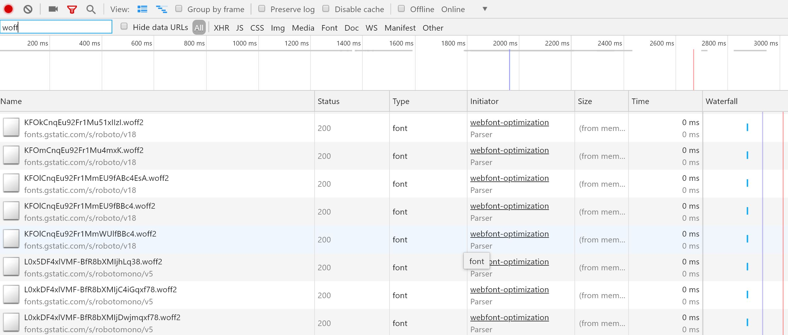
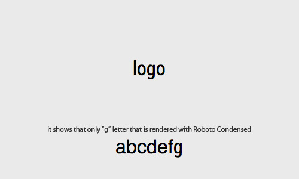

Web fonts enable us to have good design, branding, readability and accessibility. Moreover, they would bring selectable, searchable, zoomable and high DPI text. However, with every advantage comes a trade off.

<!--more-->

All other parts:

[Part 1 on HTML and CSS](/blog/2018/09/29/web-perf-1)

[Part 2 use Preload/Prefetch to boost load time](/blog/2018/10/06/web-perf-2)

[Part 3 JavaScript tips and tricks](/blog/2018/10/12/web-perf-3)

[Part 4 Image optimisation](/blog/2018/11/12/web-perf-4)

## Intro

People use web fonts heavily these days without realising how much impact it would have on the overall page speed.

This doesn't mean you shouldn't use them, just the fact that you should know how to use an optimised font and to how to load to reduce the impact on page load.

Optimising web fonts depends on where you host the font, your web application's design and back end server, your technical abilities and how far your company is willing to invest in this. But don't let this hold you from following the techniques I will go through, even a little improvement on overall page load counts towards a better user experience.

## Finding out how many fonts you are using

Before you start the task, you should find out what fonts are used throughout your website. You can easily find this out using Audit tabs in Chrome DevTools' network tab and looking at the HTTP requests.

Once in the tab click on the filter icon and look for file extensions like `woff`, `woff2`, `tff`, `otf` and so on:



## Deciding how many is too many

Research shows on average 67% of web pages use custom fonts, with websites averaging between four web font HTTP requests.

Once you figured out how many fonts you are using, you should think about how many fonts you should use. Normally these decisions are driven by UX or design team, but you can definitely have a word with them.

If you are thinking how many is too many, the rule of thumb is that [three is crowd and two is the best to stick to](https://engageinteractive.co.uk/blog/how-many-fonts-is-too-many-fonts).

If you use less fonts throughout your website, not only the number of network requests are reduced, but also the design is more streamlined and consistent.

## Choose the subset you need

Unless you have an international website supporting multiple languages, it doesn't make sense to use all character sets. Choose only what you need and for the languages you use.

Ilya Grigorik a Developer Advocate and Web Perf Guru at Google, [explains how you can subset or split web fonts into multiple unicode ranges to deliver only what you need](https://developers.google.com/web/fundamentals/performance/optimizing-content-efficiency/webfont-optimization).

You can use the [Unicode-range descriptor](http://www.w3.org/TR/css3-fonts/#descdef-unicode-range) to specify a list of range values, which can be set out in three different forms:

- **Single codepoint**: indicates a single character.
- **Interval range**: indicates start and of the codepoints of a range of characters.
- **Wildcard range**: `?` character indicates any hexadecimal digit.

To demonstrate the possibilities, this is how you can split the [Font Awesome](https://fontawesome.com/) into Latin and Japanese subsets. Once done, the browser would download each subset as needed.

[[info]]
| Note: Unicode-range subsetting is particularly important for Asian languages, where the number of glyphs is much larger than in Western languages and a typical "full" font is often measured in megabytes instead of tens of kilobytes.

```css
@font-face {
  font-family: 'Awesome Font';
  font-style: normal;
  font-weight: 400;
  src: local('Awesome Font'),
    url('/fonts/awesome-l.woff2') format('woff2'),
    url('/fonts/awesome-l.woff') format('woff'),
    url('/fonts/awesome-l.ttf') format('truetype'),
    url('/fonts/awesome-l.eot') format('embedded-opentype');
  unicode-range: U+000-5FF; /* Latin glyphs */
}

@font-face {
  font-family: 'Awesome Font';
  font-style: normal;
  font-weight: 400;
  src: local('Awesome Font'),
    url('/fonts/awesome-jp.woff2') format('woff2'),
    url('/fonts/awesome-jp.woff') format('woff'),
    url('/fonts/awesome-jp.ttf') format('truetype'),
    url('/fonts/awesome-jp.eot') format('embedded-opentype');
  unicode-range: U+3000-9FFF, U+ff??; /* Japanese glyphs */
}
```

[[info]]
|**Note:** The `local()` directive allows you to reference, load, and use locally installed fonts. The `url()` directive allows you to load external fonts, and are allowed to contain an optional `format()` hint indicating the format of the font referenced by the provided URL.

There is a catch however which is not all browsers currently [support unicode-range](http://caniuse.com/#feat=font-unicode-range). Fortunately most of the major browsers support it, you will need to have a fallback option.

Now if you're asking how I can determine which subsets I need, the answer is:

- If the browser supports unicode-range, then it will automatically select the right subset. You will just need to provide the subset files and specify the appropriate range in the `@font-face` rules.
- If the browser does not support this feature, then you will need to hide all unnecessary subsets, which is, you have to specify the required subsets manually.

You can generate the subsets using an open source tool called [pyftsubset tool](https://github.com/behdad/fonttools/). In addition to that some font services allow manual subsetting via custom query parameters.

There are some other opportunities you can leverage apart from subsetting. Let's say you just need a Google font to show your page title. You can specify which characters to download from that font only using a `&text=` syntax:

```html
<link
  href="//fonts.googleapis.com/css?family=Roboto&text=log"
  rel="stylesheet"
/>
```

[[warning]]
|**Warning:** You need to be careful since this is not a word selector but a character selector. This means characters `l`, `o`, and `g` will be shown on Roboto.



## Deliver optimised font formats

There are four major formats used on the web:

- **Embedded Open Type (EOT)**: Microsoft designed this format, which is now only used by IE browsers.
- **True Type Font (TTF)**: A format that’s been around since the late 1980s that has partial IE support.
- **Web Open Font Format (WOFF)**: A format developed in 2009, which is essentially OpenType or TrueType with compression and additional metadata. It enjoys widespread support but is not available in some older browser.
- **Web Open Font Format (WOFF2)**: An improvement on WOFF that provides, on average, a 30% reduction in file size. Support is still a work in progress for many browsers.

There isn't one format that works in all of the browsers, hence the need to deliver multiple formats to provide a consistent experience. From Google developer's website:

- Serve WOFF 2.0 variant to browsers that support it.
- Serve WOFF variant to the majority of browsers.
- Serve TTF variant to old Android (below 4.4) browsers.
- Serve EOT variant to old IE (below IE9) browsers.

If majority of your users use modern web browsers you can get away with specifying just two formats:

```css
@font-face {
  font-family: 'Roboto';
  src: local('Roboto'), local('Roboto'),
    url(fonts/Roboto.woff2) format('woff2'), url(fonts/Roboto.woff)
      format('woff');
}
```

## Always check for the font locally

Some users might already have the fonts installed on their system, so why they should be forced to download the fonts again. You can prevent this by making sure you give precedence to `local()` in the `src` attribute of font face rule.

In the above sample note how the `src: local` is used before the `url`.

## Optimnising the loading and rendering

By default the fonts are lazy loaded, which means the network request is delayed until the render tree is fully constructed, which in turn results in delayed text rendering.

There are three hooks you would need to implement a custom font loading strategy:

- `<link rel=preload>`
- CSS `font-display` property
- Font Loading API

### Preload your web font

If there is a high chance that the font is used in the page, then you can load the font eagerly using the platform feature: `<link rel=preload>`.

This will tell the browser that the font should be fetched early, but it won't specify how to use it. You will need to specify the appropriate CSS `@font-face`:

```html
<link
  rel="preload"
  href="/fonts/Roboto.woff2"
  as="font"
/>
```

```css
@font-face {
  font-family: 'Awesome Font';
  font-style: normal;
  font-weight: 400;
  /* will be preloaded */
  src: local('Awesome Font'),
    url('/fonts/awesome-l.woff2') format('woff2'),
    url('/fonts/awesome-l.woff') format('woff'),
    url('/fonts/awesome-l.ttf') format('truetype'),
    url('/fonts/awesome-l.eot') format('embedded-opentype');
  unicode-range: U+000-5FF; /* Latin glyphs */
}
```

[[warning]]
|**Warning:** Not all browsers support this feature, but those who support it also support WOFF2, so you should use that format.

For more info on the other solutions refer to [this great post](https://developers.google.com/web/fundamentals/performance/optimizing-content-efficiency/webfont-optimization).

## Summary

In short these are the points you have to consider when optimising web fonts:

- Audit and monitor your font use.
- Subset your font resources.
- Deliver optimized font formats to each browser.
- Give precedence to `local()` in your `src` list.
- Customize font loading and rendering using `<link rel="preload">`, `font-display`, or the Font Loading API.
- Specify revalidation and optimal caching policies

Hope this helps you move one more step in the right direction to improve your web application's performance.
