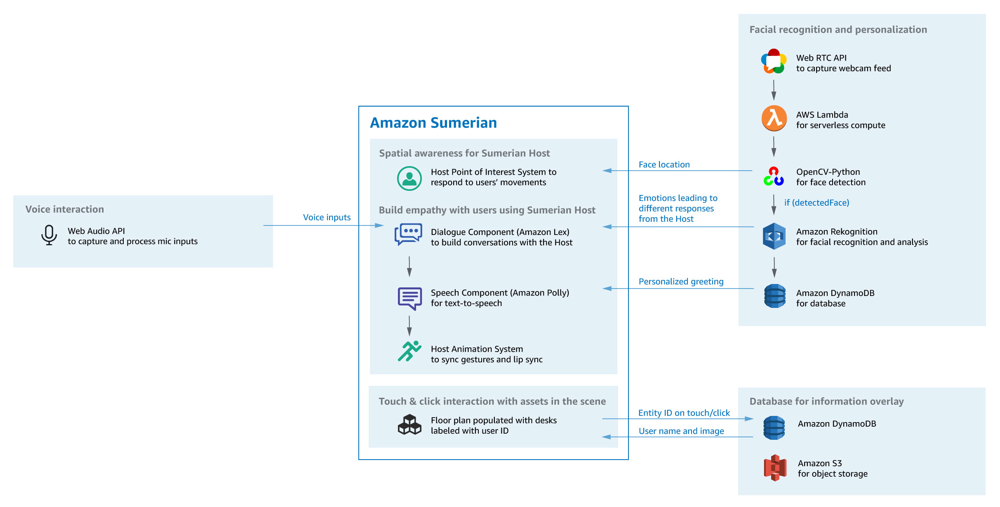

Recently we (at [Readify](https://readify.net/)) had a chance to have a go at two very interesting problems and we decided to use a few interesting technologies to solve them.

<!--more-->

After a long discussion and using a categorisation approach we decided to focus on these:

## Problem #1

Many companies have an open office with hot desk policy. That is a challenging problem at times when the number of seats are less than their staff count. This can happen if they have working from home policies or are a consultancy like us.

So the problem of knowing if there is an available desk is very important for people, to know whether they can come to office or should work from home in case it's very busy. Basically utilisation of people's time is the most important aspect of every business.

## Problem #2

Some companies do not have a reception. This is not a bad thing and sometimes makes the atmosphere more friendly.

Usually the process looks a bit like this. When someone wants to come to the office for a meeting or an interview, they might have to go through concierge to get a pass. When that happened they can go to their desired floor (sometimes elevator is controlled by passes) and use that pass to open the door and enter the office. However, once they are in, someone needs to get notified and attend to them.

We thought let's try to see if we can fix this and make sure visitors feels 1. welcomed, and 2. amazed by the usage of technology.

## Initial research

To try to solve desk occupancy problem, we spiked two different technologies, [Bluetooth beacons](https://en.wikipedia.org/wiki/Bluetooth_low_energy_beacon) and WiFi probe requests. We realised we could identify who is sitting where using a mobile app and a beacon. We could also identify the area they are sitting at using their WiFi signal. But we decided to not go further on this since it arose some privacy concerns we needed to tackle before progressing. It also needed a bit more thinking in terms of how exactly we wanted to tackle the challenge and whether we could solve it without knowing the exact location of a specific person. 🤔

For our second problem we had a brain storming session where we went through many ideas and finally decided to use a mixture of service to solve this problem:

- Facial recognition (for detecting a returning visitor or a staff)
- A sort of Dialog component (like a Bot) to communicate
- Speech component so we can talk to people
- And an integration component where we fetch the required information about our people

At first we focused on Azure service because they had everything we needed. [Face API](https://azure.microsoft.com/en-au/services/cognitive-services/face/), [Microsoft Bot framework](https://dev.botframework.com/) and [Cognitive Speech services](https://azure.microsoft.com/en-au/services/cognitive-services/speech-services/) where already available. We decided to give them a shot using a PoC (proof of concept) and see what we can do in one week.

We had success using all of those services and were going to write an application utilising all of the above, when we found out about the [Amazon Virtual Concierge](https://docs.sumerian.amazonaws.com/articles/concierge-experience/) from some of our people who attended the Amazon ReInvent in US.

They had a virtual host and were using literally every service we had used from Azure, but obviously everything AWS. Rekognition, Lex, Poly and more services to support different scenarios. Funny enough it also had a solution for our first problem, but we didn't pursue it further => 🔐.

## Creating a proof of concept (aka PoC)

We decided to play around with their [virtual concierge starter pack](https://docs.sumerian.amazonaws.com/articles/virtual-concierge/) and try to customise it. This starter package uses:

1. **Amazon Sumerian:** lets you create and run virtual reality (VR), augmented reality (AR), and 3D applications quickly and easily without requiring any specialized programming or 3D graphics expertise. It has an online editor and you can write your scenarios in JavaScript 😎. Two component are being used from Sumerian:
   - Host component
   - Speech component
   - Point of interest (utilises computer vision so the host can maintain eye contact wherever the visitor moves)
2. **JavaScript computer vision library JSFeet**: for face detection
3. **Amazon DynamoDB**: to keep a database of people, which is queried later when the face is detected
4. **Amazon S3**: to store any required asset
5. **Amazon Lex**: to filter a user’s speech into different request types
6. **Amazon Poly**: speech to text

## Structure of the application and workflows

The PoC consists of a couple of scenes and some flows to connect those:

- _Welcome scene_: What is shown at start-up. This scene has the introduction spoken by the virtual host and also is the trigger point of all other scenes
- _Visitor scene_: Where some options are shown to visitors and they can choose from them
- _Staff verification scene_: Where we get the staff name and ask visitor whether we've got it right
- _Notification scene_: Where we get the visitor name and notify the person they are here to visit
- _Staff scene_: Where we detect staff and welcome them back (also messages like happy birthday, happy anniversary, etc would be delivered here)
- _Info scene_: Where anybody can get information about what options are available and how to move around
- _Idle scene_: When the visitor or staff scenes are closed, this screen provides suggestions to users on how to interact with the scene

### Flows

We have implemented two flows so far, Visitor and Staff (with plans to expand on these later). When a staff start the conversation in the welcome scene we use face detection and the [AWS Rekognition API](https://aws.amazon.com/rekognition/) to discover who's the person and welcome them back. For now we decided to leave it at this with plans to go a bit further and do more like showing them a plan of empty desks and so on.

For visitors however, a more detailed scenario is implemented. First they can get engaged from welcome screen by just saying Hi Fiona (the name of the virtual host which can be customised), or just press the start button.

From there, further instructions are provided which will be read to them and they can press the mic button to talk and express their intentions. For example they can say:

> I am here to see Yaser

Or:

> Visiting Alex

Once we detect their intent, we can then transfer them to verification scene where we show them people with the name mentioned. As of now the default name detection is somewhat terrible so we are using Lex's specific value slot type. For reference, two slot types are provided, one which learns as it goes and one that you can specify the values and their synonyms. We also show a picture of the person to help them better identify and confirm the person.

Once that's done and they have confirmed the person's identity, we redirect them to notification scene, where they enter their name and we notify the person they have confirmed before.

## Behind the scenes

The web application has a main script which contains a web worker. The web worker has all the background activities required for application to operate. Services like face detection, face recognition, voice recording, and communication between main thread and web worker are all handled here.

Just to give you an example, when you press the mic button and speak, the audio is captured in an event handler which encodes it and sends it to Poly to convert to text.

Or when someone stands in front of the camera, a method in the worker gets called, tries to detect a face and if the face is detected, will send the picture to Amazon Rekognition service to see if the person is known.

Multiple services are used behind the scene. At the core of this experience is the ability to converse with the Sumerian Host which is enabled by the Sumerian Dialogue (chatbot) and Speech (text-to-speech) components, as well as the animation system that syncs the gestures and lip sync with the speech. You can use the Host component’s Point of Interest system in conjunction with OpenCV’s face detection to follow the location of the user’s face, relative to the webcam screen space.

## Key findings

We reached to a point where a demo was available and the team was happy with the outcome. But although we finished the first phase on time, we found few issues with the whole experience.

- The Amazon Sumerian is not a place where people can collaborate. Only one person can work on a particular scene at a time.
- You cannot keep the source code in source control. At most you can export the whole scene as a zip file and share it.
- Adding a simple scene takes a bit of time. But its very straightforward
- The produced bundle is not optimised properly although they are using **Webpack**
- AWS JavaScript SDK is great and well documented

## Conclusion

We had a great opportunity to play around with the virtual host and create experiences which would be unforgettable. The true use of technology for something good. It's also a good opportunity to get your started with a few AWS services and integrate them to solve a problem rather than just learning individually.
