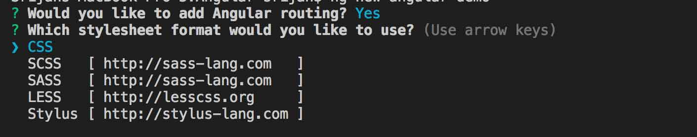
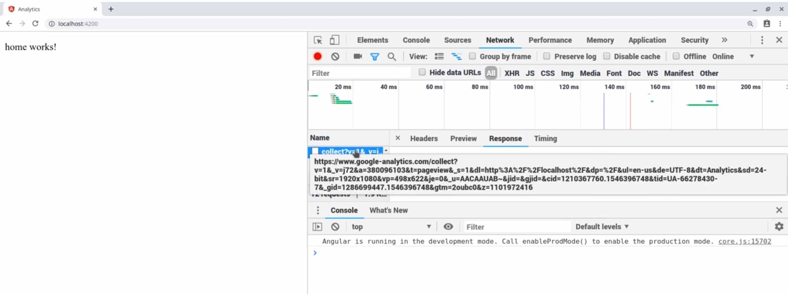

Many a times we want to add some sort of analytics to our applications and for me the most obvious choice would be Google Analytics.

<!--more-->

Google is in the process of phasing out the legacy `ga.js` and `analytics.js` products that ships with Google Analytics, with its new, more flexible **Global Site Tag** `gtag.js` that ships with Google Tag Manager.

So let's see what it takes to set it up and I assure you it will be really quick.

## Get a tracking id from Google Analytics

If you already have a property in [Google Analytics](https://analytics.google.com), simply get it from admin dashboard in property list. If not follow [these steps](https://support.google.com/analytics/answer/1042508?hl=en) to create one.

Tracking id is in this form usually:

> UA-XXXXXXXXX-X

In the same place you can click on tracking code page and you will see a code snippet which you can copy and put in inside your `index.html` file:

```javascript
<!-- Global site tag (gtag.js) - Google Analytics -->
<script async src="https://www.googletagmanager.com/gtag/js?id=UA-XXXXXXXXX-X"></script>
<script>
  window.dataLayer = window.dataLayer || [];
  function gtag(){dataLayer.push(arguments);}
  gtag('js', new Date());

  gtag('config', 'UA-XXXXXXXXX-X');
</script>
```

We don't need the last line since will be configuring it from our app. So remove it:

```javascript
<!-- Global site tag (gtag.js) - Google Analytics -->
<script async src="https://www.googletagmanager.com/gtag/js?id=UA-XXXXXXXXX-X"></script>
<script>
  window.dataLayer = window.dataLayer || [];
  function gtag(){dataLayer.push(arguments);}
  gtag('js', new Date());
</script>

```

## Configuring our project

If you have an existing application simply ignore the installation process. I will be creating a new app:

```bash
ng new analytics
```

From here select yes for routing:



When it comes to capturing changes in a SPA app it is important to listen to changes in routes and events. We would ideally listen to those and send them to analytics, but we want to do it only once for the entire application.

The best place for that is in root component. So open your `AppComponent` and add the code below to it:

```typescript
import { filter } from 'rxjs/operators';

declare var gtag;

export class AppComponent {
  constructor(router: Router) {
    const navEndEvents = router.events.pipe(
      filter(
        event => event instanceof NavigationEnd
      )
    );

    navEndEvents.subscribe(
      (event: NavigationEnd) => {
        gtag('config', 'UA-XXXXXXXXX-X', {
          page_path: event.urlAfterRedirects,
        });
      }
    );
  }
}
```

We are not doing anything special here, first, we get a reference to router in the constructor. Then we filter its events to only get navigation end events.

Afterwards we subscribe to those and use the one liner from Google Analytics code snippet and add one parameter to it which is its `URL`.

Now let's test it by defining some routes:

```typescript
const routes: Routes = [
  { path: '', component: HomeComponent },
  { path: 'about', component: AboutComponent },
];

@NgModole({
  imports: [RouterModule.forRoot(routes)],
  exports: [RouterModule],
})
export class AppRoutingModile {}
```

And that's it. If you start the app using `ng serve` from command line you should start receiving events in your analytics dashboard.


