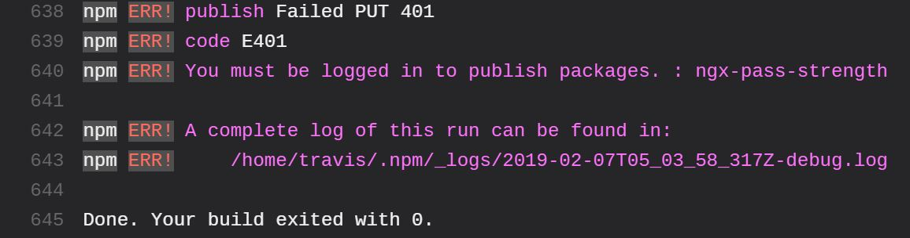
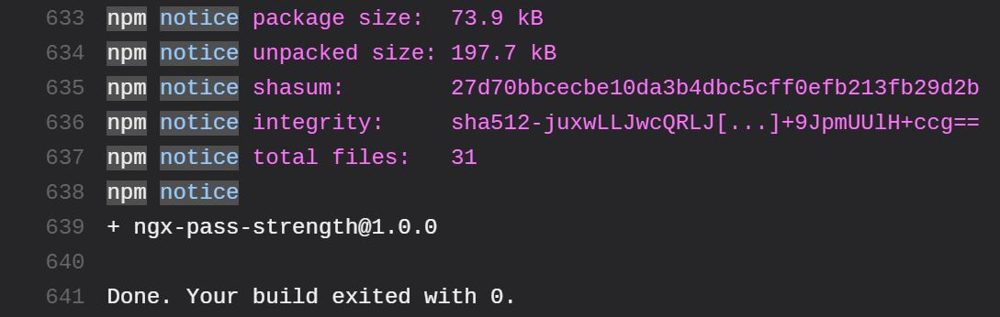

Recently I created a small library with [Angular](https://angular.io/) which I wanted to publish to `npm` (the node package manager). However, when I had everything in place from a build perspective using [Travis CI](https://travis-ci.com/) in my GitHub repo, it was failing to publish the package with a `401` login error.

<!--more-->

## Background

I guess I used a lot of terms and concepts you might not be familiar with. So let's take a step back and see what are those.

I have a GitHub repository where the code is kept. You can setup a build for your repository using [Travis CI](https://travis-ci.com/) if you enable Travic CI on your repo and create a file named `.travis.yml` in root directory, with each push to your branch the code is built and even published.

I am not going to explain how to setup a build pipeline using Travic CI. You can find instructions on [their documentation here](https://docs.travis-ci.com). The docs are very comprehensive and detailed with examples on some of the most common project types.

The build is very simple and doesn't require any special steps. However, when you want to publish it (to `npm` in my case), I had to generate a authentication token and encrypt it using Travic CI CLI so I can put it in my build file.

**Note**: Do not put the token as is in your build file, since anyone can use it when you commit your code and push it up stream.

I followed [the instructions here](https://docs.travis-ci.com/user/deployment/npm/) to setup deploy steps for my project.

However, when I pushed my code, although the build was successful, I was getting an `401` error during deployment:



## Why it happens

So it seems a while back Travis has moved away from `.org` domain and uses `.com`. However, the CLI is still defaulting to `.org` as so when you encrypt your API key, it will be for wrong domain.

## Solution

Fortunately you can easily fix this using `--com` flag when you're encrypting your key. So from the root of your project just use these commands to re-encrypt your key with right domain:

```bash
travis login --com
travis encrypt --com <token> --add 'deploy.api_key'
```

**Tip**: If you're a windows user like me, you can use [_Windows 10 WSL_](https://docs.microsoft.com/en-us/windows/wsl/install-win10) (windows subsystem for Linux) and it works like a charm.

Once you've applied the commands, simply commit and push your code up.



Hope this helps you save some time and have a great weekend.
