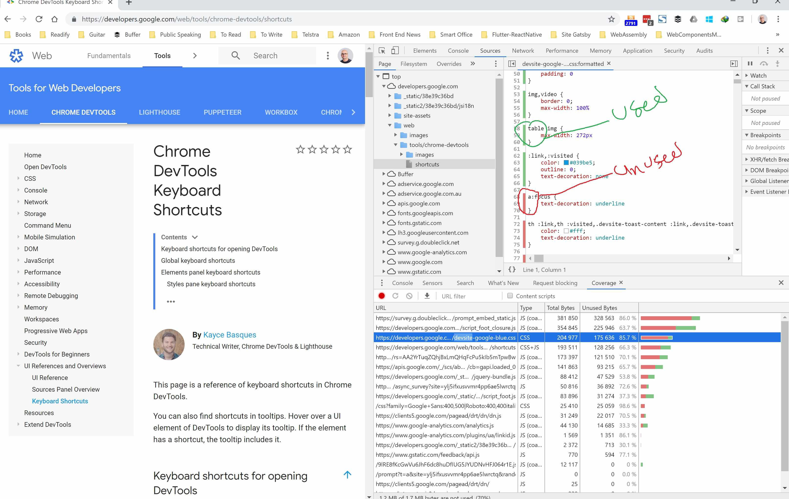

Unused CSS is a one of the issues most web applications suffer when it comes to performance and page load time.

<!--more-->

## Disclaimer

Apart from option one in this post, most of the time you will need a tool and some manual intervention to be able to safely eliminate unused CSS. These tools are great in a sense that they will let you know what you don't know; which classes in your template files are not used.

These tools can't work with complex scenarios like when you have JavaScript adding a DOM element in the template.

They will have problems with dynamic templates in Single Page Applications (SPA) or when your template changes based on a state on your server side code.

## Problem

As I said, Unused CSS is a one of the issues most web applications suffer when it comes to performance and page load time.

This even gets worst when you use a CSS library like Tailwind, or an older versions of CSS frameworks like [Bootstrap](https://getbootstrap.com/) or [Material Design](https://material.io/design/).

[[info]]
| **Note:** most CSS frameworks have moved to modular structure where you could import only the part you need without having to include the whole bundle.

## Best and safest approach

To my opinion, the best and safest approach is to be careful and get rid of any CSS file or part you remove from your HTML or template files. Do not be lazy or ignorance when it comes to tech debts like this. If you're involved in a green field project, make sure you do not copy paste large chunks of CSS from somewhere you're looking into without realising which parts are actually used.

You can manually find your unused CSS using the [DevTools](https://developers.google.com/web/tools/chrome-devtools/) in [Google Chrome](https://www.google.com/chrome/) with following these steps:

1. Open the Chrome DevTools using <kbd>F12</kbd> or <kbd>Ctrl</kbd> <kbd>Shift</kbd> <kbd>J</kbd> on Windows or <kbd>Command</kbd> <kbd>Option</kbd> <kbd>J</kbd> on Mac.
2. Open the command menu by pressing <kbd>Ctrl</kbd> <kbd>Shift</kbd> <kbd>P</kbd> on Windows or <kbd>Command</kbd> <kbd>Shift</kbd> <kbd>J</kbd> on Mac.
3. Type in “Coverage” and click on the “Show Coverage” option
4. Click on reload button at the coverage tab.
5. Select a CSS file from the Coverage tab which will open the file up in the Sources tab.

Any CSS rule which has a solid green line on the left side is used. Those with a red line are not:



[[warning]]
| **Warning:** Just because a rule isn't used on this page doesn't mean it's not used elsewhere. You would ideally check the coverage on all pages and combine the result for a better overview.
<br/>

## Tools

Some times you cannot adhere to ☝🏼 point because of various reasons. Such as you got involved in a brown field project or the code base is to large to be able to refactor and fix the issue in a timely fashion.

In this case you might be looking at some tool to automate the process and do the clean-up systematically during build time. Fortunately there are many tools available which help you with this. I will cover some famous ones and mention a short list at the end for good measure 😉.

## 1. PurifyCSS

[PurifyCSS](https://github.com/purifycss/purifycss) is tool that can analyse your files, go through code, and figure out what classes are not used. Most of the time when you have static HTML files this tool can eliminate nearly all your unused CSS.

Apart from that, it can also work to a degree with Single Page Applications (SPA).

### Setup

**Standalone**

You can install this package via `npm`:

```bash
npm i -D purify-css
```

And some basic usage:

```js
import purify from 'purify-css'
const purify = require('purify-css')

let content = ''
let css = ''
let options = {
  output: 'filepath/output.css',
}
purify(content, css, options)
```

If you're wondering well, this is not gonna help me, you might be right. But this is the simplest form. In fact in the `purify` command, `content` and `css` parameters can be an `Array` of [glob](https://github.com/isaacs/node-glob) file patterns. Now you see the bigger picture and how this can help.

Now let's make it a bit more complex.

**via Grunt**

First you need to install the grunt package:

```bash
npm install grunt-purifycss --save-dev
```

And then use it:

```js
grunt.initConfig({
  purifycss: {
    options: {},
    target: {
      src: ['path/to/*.html', 'path/to/*.js'],
      css: ['path/to/*.css'],
      dest: 'tmp/purestyles.css',
    },
  },
})
```

This will handle even scenarios when you have a class added using JavaScript 😍. So this will be picked up:

```html
<!-- html -->
<!-- class directly on element -->
<div class="button-active">click</div>
```

Or in JavaScript:

```js
// javascript
// Anytime your class name is together in your files, it will find it.
$(button).addClass('button-active')
```

Or even a bit more complex scenario:

```js
// Can detect if class is split.
var half = 'button-';
$(button).addClass(half + 'active');

// Can detect if class is joined.
var dynamicClass = ['button', 'active'].join('-');
$(button).addClass(dynamicClass);

// Can detect various more ways, including all Javascript frameworks.
// A React example.
var classes = classNames({
  'button-active': this.state.buttonActive
});

return (
  <button className={classes}>Submit</button>;
);
```

[[warning]]
| **Warning**: The Webpack plugin for purifycss is deprecated. You will need to use Purgecss which I will go through later on.

**CLI**

Install the CLI:

```bash
npm install -g purify-css
```

And you can see the help using `-h` param:

```bash
purifycss -h

purifycss <css> <content> [option]

Options:
  -m, --min        Minify CSS                                   [boolean] [default: false]
  -o, --out        Filepath to write purified css to                              [string]
  -i, --info       Logs info on how much css was removed        [boolean] [default: false]
  -r, --rejected   Logs the CSS rules that were removed         [boolean] [default: false]
  -w, --whitelist  List of classes that should not be removed        [array] [default: []]
  -h, --help       Show help                                                     [boolean]
  -v, --version    Show version number                                           [boolean]
```

### Stats

This library can help you big time. It's pretty effective and works on complex scenarios. But as I mentioned before you will need to have good tests to able to find out if anything is messed up after clean-up.

> In terms of Boostrap, PurifyCSS can reduce up to ~ 33.8% of unused CSS.

## 2. Purgecss

[Purgecss](https://github.com/FullHuman/Purgecss) is another powerful tool to remove unused CSS. It can be used as part of your development workflow. It comes with a JavaScript API, a CLI, and plugins for popular build tools.

### CLI

You can install `Purgecss` globally or using `npx`.

```bash
npm i -g Purgecss
```

And use it:

```bash
Purgecss --css <css> --content <content> [option]
```

As you can see, the API is very similar to `PurifyCSS`, but of course options would be different.

### Via Webpack

You should install the plugin first:

```bash
npm i -D Purgecss-webpack-plugin
```

And the add it to your Webpack config:

```js
const path = require('path')
const glob = require('glob')
const ExtractTextPlugin = require('extract-text-webpack-plugin')
const PurgecssPlugin = require('Purgecss-webpack-plugin')

const PATHS = {
  src: path.join(__dirname, 'src'),
}

module.exports = {
  entry: './src/index.js',
  output: {
    filename: 'bundle.js',
    path: path.join(__dirname, 'dist'),
  },
  module: {
    rules: [
      {
        test: /\.css$/,
        use: ExtractTextPlugin.extract({
          fallback: 'style-loader',
          use: 'css-loader?sourceMap',
        }),
      },
    ],
  },
  plugins: [
    new ExtractTextPlugin('[name].css?[hash]'),
    new PurgecssPlugin({
      paths: glob.sync(`${PATHS.src}/**/*`, {
        nodir: true,
      }),
    }),
  ],
}
```

For more information please refer to [their documents](https://www.Purgecss.com/).

## 3. UnCSS

[UnCSS](https://github.com/uncss/uncss) is another tool to help you remove your unused CSS. But this tool is a bit different in sense that it will load your files in [jsdom](https://github.com/jsdom/jsdom), then will parse all the stylesheets with PostCSS.

Once finished, `document.querySelector` will filter out selectors that are not found in the HTML files. And finally, the remaining rules are converted back to CSS.

[[info]]
| **Note:** The best thing about this library which I am in love with, is their [unofficial server](https://uncss-online.com/) where you can paste your HTML and CSS it will show you the shortened CSS online.

### Install

Again you can use `npm` to install it or use `npx`:

```
npm i -g uncss
```

You can use UnCSS with node:

```js
var uncss = require('uncss')

var files = [
    'my',
    'array',
    'of',
    'HTML',
    'files',
    'or',
    'http://urls.com',
  ],
  options = {
    ignore: ['#added_at_runtime', /test\-[0-9]+/],
    media: [
      '(min-width: 700px) handheld and (orientation: landscape)',
    ],
    csspath: '../public/css/',
    raw: 'h1 { color: green }',
    stylesheets: [
      'lib/bootstrap/dist/css/bootstrap.css',
      'src/public/css/main.css',
    ],
    ignoreSheets: [/fonts.googleapis/],
    timeout: 1000,
    htmlroot: 'public',
    report: false,
    banner: false,
    uncssrc: '.uncssrc',
    userAgent:
      'Mozilla/5.0 (iPhone; CPU iPhone OS 10_3 like Mac OS X)',
    inject: function(window) {
      window.document
        .querySelector('html')
        .classList.add('no-csscalc', 'csscalc')
    },
  }

uncss(files, options, function(error, output) {
  console.log(output)
})

/* Look Ma, no options! */
uncss(files, function(error, output) {
  console.log(output)
})

/* Specifying raw HTML */
var rawHtml = '...'

uncss(rawHtml, options, function(error, output) {
  console.log(output)
})
```

Or use their build flows which supports Gulp, Grunt and Broccoli (unfortunately no Webpack 😔). For more information about how to setup those tools refer to [their documentation](https://github.com/uncss/uncss).

## Comparison

Now let's compare these tools and see their pros and cons.

### PurifyCSS

Some people believe the biggest problem with PurifyCSS is lack of modularity. Some think it's also its biggest benefit 🤷🏽‍♂️. It can work with any file type not just HTML. It can also find selectors which are added using JavaScript.

Unfortunately since every word is considered a selector, this can end up in a lot of false positives and make the resulting CSS a bit larger than it should be.

### Purgecss

Purgecss fixes the above issue by providing the possibility to create an extractor. This is simply a function which takes content of a file and extracts the list of CSS selectors used in it.

The extractor can be used as a parser that returns an AST (abstract syntax tree) and looks through it to find any CSS selectors. This is the way `purge-from-html` works. You can specify which selectors you want to use for each file type, allowing you to get the most accurate results. Additionally, you can use the default or legacy extractor, which will mimic PurifyCSS's behaviour.

That said, Purgecss has some drawbacks too. FIrst and foremost you will need to write a custom extractor for frameworks like `Tailwind`. Another problem is when you use a syntax highlighter like [primjs](https://prismjs.com/), in which case you will have to whitelist your token classes using a property called `whitelistPatternsChildren`.

Another point to consider is that Purgecss doesn't have an extractor for JavaScript files. But because of its modularity, developers can create custom extractors for frameworks like _Angular_, _React_ or _Vue_.

### UnCSS

Because of its HTML emulation and JavaScript execution, UnCSS is effective at removing unused selectors from web applications. However, its emulation can have a cost in terms of performance and practicality.

At this point in time, UnCSS is probably the most accurate tool to remove unused CSS if you do not use server-side rendering.

## Other tools

Here is of other tools you can consider:

- [GitBit](https://www.jitbit.com/unusedcss/): an online tool which crawls your root page and stylesheets linked in it.
- [UnusedCSS](https://unused-css.com/): another online tool which easily find and removes unused CSS rules

## Summary

Although these tools are really helpful in terms of finding unused CSS, each has its own drawbacks and you will need to be careful to not end up with a broken UI.

Hope you've gained just a tiny bit insight on how to find your unused CSS and deploy them to space 😁👇.

<blockquote class="twitter-tweet"><p lang="en" dir="ltr">Deploy... to Space?!? 🚀🔥🤯 <a href="https://t.co/zb8jNPs5zs">https://t.co/zb8jNPs5zs</a></p>&mdash; StackBlitz (@stackblitz) <a href="https://twitter.com/stackblitz/status/1123816907881242624?ref_src=twsrc%5Etfw">May 2, 2019</a></blockquote>
