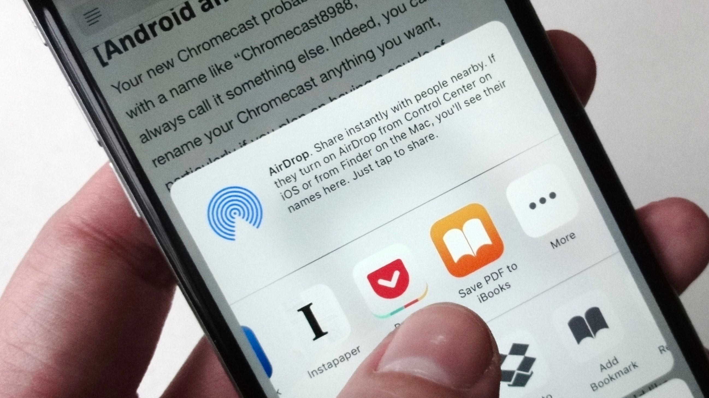

I've been in web development for a long time and not until four or five years ago did I had to keep up with this light speed moving train.

<!--more-->

# Background

There has been so many times when I heard some phrase from somewhere be it at a conference, talking to a colleague, or simply surfing the web, that I realised oh, I didn't even know this exists.

_Angular_, _React_, _Vue_, _RxJs_, _NgRx_, _TensorflowJs_, _CSS Houdini_, _Webpack_, _Parcel_, _Gulp_, _Grunt_, _npm_, _npx_, _CSS Grid_, _Flex box_, _Meteor_, _SASS_, _LESS_, and the list goes on and on and on 😵.

Those moments can be terrifying, especially if suddenly everyone is talking about it. So finally, on a Sunday afternoon, I sat on our balcony thinking I can't continue like this and always be behind of what's happening.

I decided to talk to some of the people I knew (face to face, on Twitter, LinkedIn, conferences and meetups) were ahead of the game most of the times and see what they do in order to be where they are.

Since that afternoon where I was sitting on my balcony sipping a lukewarm coffee, I've learnt a few tips and tricks around what do to be able to feel you know enough to be able to keep up with what's happening. So I decided to share my learnings (and hear yours in the comments) with you all.

# 1. Reading

The most important part of learning is reading (at least for me). I always keep some time and read (I will share some sources later 👇🏽) about what's happening. I don't usually go too deep into something when I read, just to learn the background and story of what the topic is about.

You are probably wondering when, and I know for most people this is the most critical part. I do not drive to work although I live in a suburb. I take the bus and spend the whole time reading. I will also spend some time before going to bed or after waking up early in the morning to catch up with what's happening in the wild.

[[info]]
| **Note:** I usually see articles and posts on social media and use [Instapaper](https://www.instapaper.com/) to keep track of where I am with my reading list. It's got an iOS app which gives you a nice option when you share your links from basically anywhere.

## Enough talking, tell me what do you read?

Your next question is probably what do you read. I have these as my reading sources:

### Blogs and Feeds

I have an [RSS feed](./feedbro-subscriptions.opml) for you to download which I've borrowed from [Paul Irish](https://www.paulirish.com/2011/web-browser-frontend-and-standards-feeds-to-follow/) and customised it.

In addition to that, I check below sources regularly:

- [Google's Web Fundamentals](https://developers.google.com/web/)
- [Open web platform weekly summary](https://www.google.com/search?q=%22Open+Web+Platform+Weekly+Summary%22+site%3Aw3.org)
- [Our very own Dev Community](https://dev.to)
- [CSS-TRICKS](https://css-tricks.com/)
- [CSS Wizardry](http://csswizardry.com/)
- [Smashing Magazine](https://www.smashingmagazine.com/)
- And recently less of [frontend weekly on Medium](https://medium.com/front-end-weekly)

### Social media (mostly Twitter and LinkedIn)

Most days, 45 minutes to an hour of my time is spent on Twitter and about half of that on LinkedIn. I don't spend more than a few second on anything. If something catches my eyes, it will be added to my _Instapaper_ list.

### Official documentation (tools and frameworks)

Official documentation is where I go deep into something. If want to learn everything about a subject, whether it's a framework, library, tool, I start with their documentation. more than 80% of the time, I find what I'm after.

### Books

This one is a tricky one. I haven't had a situation where I finished the whole of a technical books. I use them as reference material and refer to them whenever I need to know a very specific detail of a subject. But I would never spend that much time reading a whole book, things are changing faster than I can finish the book, trust me on that 😉.

### Weekly/Monthly news feeds

Weekly newsletters and feeds are awesome sources of new information. The maintainer spend a lot of time researching and sharing information and I have to say kudus to them.

Here are a few I use:

- [Web Design Weekly](https://web-design-weekly.com/)
- [Frontend Focus](https://frontendfoc.us/)
- [JavaScript Weekly](https://javascriptweekly.com/)
- [Web Development Reading List](https://wdrl.info/)
- [Web Operations Weekly](https://webopsweekly.com/)
- [React Status](https://react.statuscode.com/)
- [Angular Weekly](http://www.angular-weekly.com/)
- [Newsletter - Vue.js Developers](https://vuejsdevelopers.com/newsletter)

# 2. Following cool people

I follow a well-curated list of people on social media who are active and produce new things. This is a tricky situation because sometimes you realise how much you don't know. But I love it and it's a great thing for me personally to know what's missing from my knowledge. It helps me form a plan for my learnings.

Are you still wondering why?

> If you feel like you are the smartest person in the room, you're in the wrong room.
>
> Confucius

These are some of the people I follow:

- [Addy Osmani](https://twitter.com/addyosmani) - Web and mostly performance
- [Paul Irish](https://twitter.com/paul_irish) - Web
- [Jake Archibald](https://twitter.com/jaffathecake) - Web, mostly standards
- [David Walsh](https://twitter.com/davidwalshblog) - JavaScript
- [Christian Heilmann](https://twitter.com/codepo8) - Web
- [Dan Abramov](https://twitter.com/dan_abramov) - React
- [Stephen Fluin](https://twitter.com/stephenfluin) - Angular
- [Sarah Drasner](https://twitter.com/sarah_edo) - Vue
- [Asim Hussain](https://twitter.com/jawache) - JavaScript, AI, TensorflowJs
- [Sean Larkin](https://github.com/TheLarkInn) - Webpack

And the list continues with another 800 or so amazing people, but you might have noticed a theme here. I follow specific people in different categories to find out what's happening.

[[info]]
| **Note:** I do follow people from all sorts of different backgrounds and not only ffrontend. A good frontend engineer should know enough about the backend and considering I am consultant, it's a must for me.

 

# 3. Conferences and Meetups

Conferences are the most fascinating place to meet smart people, learn a few things and get an idea of where the industry moving to. It give you a breadth (and sometimes even depths) in multiple topics that you didn't even knew they are a thing.

Apart from attending, I usually speak as well. This is also a really good way of learning. You should know a topic well enough to be able to present it to your audience. To see when and where I'll be speaking, have a look at [my speaking schedule](/speaking).

There are thousands of conferences out there. But I usually use these sites to find out what's happening when:

- [Australia's Dev Events](https://github.com/Readify/DevEvents/)
- [Confs.tech](https://confs.tech/)
- [Papercall.io](https://www.papercall.io/events)
- [Angular conferences](https://angularconferences.com/)
- [JSConf](https://jsconf.com/)
- [Frontend conferences](https://frontendfront.com/conferences/)
- [Meetup.com](https://www.meetup.com/)

# 4. Videos, online courses and Podcasts

Some people like to watch videos and online courses. This is how they learn, however, for me that's not the case. But I don't exclude them from my sources, especially recorded conference talks. Below is a list of YouTube channels and online courses I use occasionally:

- [Google Chrome Developers](https://www.youtube.com/channel/UCnUYZLuoy1rq1aVMwx4aTzw) - This is super useful for me since they have pretty much short clips teaching something useful and frequently
- [Microsoft Developer](https://www.youtube.com/channel/UCsMica-v34Irf9KVTh6xx-g)
- [NDC Conferences](https://www.youtube.com/channel/UCTdw38Cw6jcm0atBPA39a0Q)
- [ng-conf](https://www.youtube.com/channel/UCm9iiIfgmVODUJxINecHQkA)
- [Nordic.js](https://www.youtube.com/channel/UCTZ3O2cZo1b4JSwvhgBnAbw)
- [Vue NYC](https://www.youtube.com/channel/UCX4w2P-M4cuWQG0WKgU3TTQ)
- [React conf](https://www.youtube.com/channel/UCz5vTaEhvh7dOHEyd1efcaQ)
- [Angular Connect](https://www.youtube.com/channel/uczrsktit_obak3xbkvxmz5g)
- [Angular channel](https://www.youtube.com/channel/UCbn1OgGei-DV7aSRo_HaAiw)

If you're looking at online courses, these are my favourite:

- [Pluralsight](https://www.pluralsight.com)
- [Frontend Masters](https://frontendmasters.com/)
- [egghead.io](https://egghead.io/)

Another good source of information are podcasts. They are so good if you ride/drive to work everyday. You can just listen to become aware of the latest news or learn about a technology.

Below are a few I use:

- [The Hanselminutes](https://hanselminutes.com/)
- [JavaScript Jabber](https://devchat.tv/js-jabber/)
- [Developer Tea](https://developertea.com/)
- [egghead.io developer chats](https://egghead.io/podcasts)
- [frontend Happy Hour](https://frontendhappyhour.com/)
- [The freeCodeCamp Podcast](https://freecodecamp.libsyn.com/)
- [The Frontside Podcast](https://frontside.io/podcast)
- [Full Stack Radio](https://www.fullstackradio.com/)
- [JS Party](https://changelog.com/jsparty)
- [Modern Web](https://www.thisdot.co/modern-web)
- [Syntax](https://syntax.fm/)
- [Toolsday](https://twitter.com/toolsday)
- [Web of Tomorrow](https://www.orbit.fm/weboftomorrow)

# 5. Pet projects

Many people, including myself, learn the best by doing the actual thing. I need to code to learn about something whether it's a new technology or a library or simply a new API.

Side projects (aka pet projects) are a great way to grow as a developer, both personally and professionally. They let you get out of your comfort zone, learn new skills, and exercise your creative muscles. But it can be hard to get anything done while juggling a day job, kids, friends, family, and countless other commitments.

In the past, I’ve tried to cram side project work into the cracks between other items in my calendar. It was frustrating at best; completely ineffective at worst. I constantly felt like I was shortchanging the projects I was most passionate about. So what should we do?

## Start with something small but keep doing it

It is definitely hard to start a project, harder to get back to it after some time and re-start it when you’ve been working on something completely different.

So working on it a bit everyday keeps you on track while not bored or tired. If you keep doing it everyday it will be very easy to pick it where you left off since it is still in your mind.

## No deadlines or pressure

Don’t put deadlines or pressure on yourself for a side project. It is not a client engagement and you don’t want to loose your excitement about it really soon. Keep focusing on one or two task a week and finish it in a relaxed atmosphere.

Take your time, have a juice (or beer, or coffee 😂) or fresh fruit handy and let the feeling of small holiday overcome the daily agile mindset. Close the Facebook, stop scrolling your Twitter feed and focus on what you promised yourself doing everyday.

Once the habit is formed, the pressure is off and you start feeling the joy about doing something you feel passionate about.

## Shift the project time to time

Don’t work on something for too long. as we see new languages and technologies introduced everyday, we should shift our pet project to use different languages/technologies accordingly.

I love frontend specifically, however try to keep track of security, azure, IoT, Hololens, etc. to be a bit more across other areas.

My approach to this is to complete a project I start working on and then create a new one using the new tech I want to get familiar with.

## Talk about it with someone

This one doesn’t have to do anything with your pet project, but helps you find the weakness points and new challenges since it is exposed to people who love asking questions and learn new things.

Even if it is an internal brown bag session, or presentation, or you are talking on an external event like meetups or conferences that project helps you gather the contents easily and demo something which even demo gods cannot prevent it (since you’ve played with it enough previously).

# 6. Writing

There are a few reasons why writing an article helps you learn new things and put the subject into your long term memory.

In short writing helps you:

- Slow down a little bit and focus on a topic.
- Think a little differently about something as you figure out how to explain it.
- Consider issues conceptually rather than in a more narrow or applied perspective.
- Research things more clearly, and document your research with links.
- Be more likely to remember things later.
- Have a good place to search when you can’t remember things later.

I always consider this to myself (which I've learnt from a colleague of mine), do not write for others. Write for yourself and make sure you detail down everything you need to know at a later point in time. This then will help others too.

# Having discipline

According to many philosophers, self disciple is like muscle, the more you train it, the more you enjoy the result. Even if you follow all the points I've mentioned so far, but don't get yourself a good daily habit, it's not going to help you.

Think of how many times you started something and let it go half way through, or never finished it. It's very important that you stick to a schedule and follow it no matter what.

Here are a few tips I've learnt:

- Have a goal for yourself. Set milestones to reach that goal and evaluate your progress regularly.
- Do not compare yourself with others. There will be always people who are smarter than you. So try to be reasonable and consider your capabilities. At the same time don't set your goals too low, stretch yourself a bit and push for a better self than what you were yesterday.
- Have self motivation, praise yourself for your big achievement and have a little punishment for when you fail to do something.

# Never give up, learn to wind down

At times you might feel frustrated about your progress. Or simply think you would never be able to keep up like other people around you.

Let me tell you something, when that happens, you need to wind down. This is one of the many signs of a burn out. You might have pushed yourself too much and spent more than your body could have tolerated.

This is probably good time for a break, a holiday or a change of direction. Never be afraid of a telling yourself you need a rest. The world never stops, so you should stop trying to chase it constantly.

# Summary

I think I've covered most of the tricks I use to keep up with what's happening in the frontend world. Please, please share your awesome ideas in the comments and I will try to keep updating this post with those to have a far better plan together 🖐.

Another point is that these tricks will help you regardless of whether you're a frontend developer or not 🔥.
