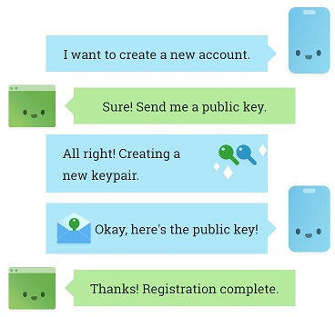
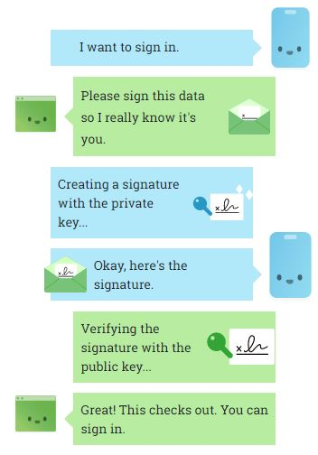

Let's face the reality, we can't live without passwords these days. In fact our entire online life is depending on them. But with passwords, comes heaps of problems not only for users, but also for us developers.

<!--more-->

# A bitter fact

Most people have a weak password (and probably the same) used for many websites they're member of. Social media, email, productivity tools, you name it, they all have different policies around passwords and majority of users find a way to bypass it using a weak password, or a strong one written on a post it 🤷🏽‍♂️.

In fact 81% of all data breaches that happen due to hacking, [leverage stolen or weak passwords](https://www.verizonenterprise.com/resources/reports/2017_dbir_en_xg.pdf).

# There is a better way

But thanks to great efforts from [W3C](https://www.w3.org/) and [FIDO](https://fidoalliance.org), we're not bound to use passwords for everything. Web Authentication API, aka `WebAuthn` is a fairly [new specification](https://w3c.github.io/webauthn/) which is introducing a new way of authentication without passwords, and also alongside them.

Google, Microsoft, Yubico and other big names in the industry are all part of the contributors to get this spec widespread. This API allows servers to register and authenticate users using public key cryptography instead of passwords.

Windows Hello, Apple's Touch ID, Yubikey devices, are all examples of a different type of authentication mechanism which doesn't require passwords. They use biometrics or hardware devices to be able to achieve this.

# How it works

From 1000ft, instead of using a password, you will use a [key pair (public and private)](https://en.wikipedia.org/wiki/Public-key_cryptography) which is generated for a website.

The private key is stored securely on user's device, whereas the public key along with a randomly generated credential ID is sent to a web server to be stored and used later for authenticating that particular user.

Overall, WebAuthn relies on three major parties:

- Authenticator (the device which is doing the authentication and verification)
- Relying party (the web application owner)
- Browser's Web Authentication API

The flow is fairly simple, first step is registration, then it would be authentication.

## Registration a credential

Same as password authentication flows where the web server usually provides a form for user to enter their password which is sent back to the server for verification.

With WebAuthn, it's fairly similar, but instead of asking for a password, the relying party asks for a public key.

|  |
| :------------------------------------------------: |
|              _Image from WebAuthn.io_              |

When prompting the user for a credential, the `navigator.credentials.create()` is used:

```ts
const credential = await navigator.credentials.create(
  {
    publicKey: publicKeyCredentialCreationOptions,
  }
)
```

In case you're wondering what does the `publicKeyCredentialCreationOptions` looks like, it contains a bunch of mandatory and optional fields:

```ts
const publicKeyCredentialCreationOptions = {
  challenge: Uint8Array.from(
    randomStringFromServer,
    c => c.charCodeAt(0)
  ),
  rp: {
    name: 'Google',
    id: 'accounts.google.com',
  },
  user: {
    id: Uint8Array.from('5T9AFCUZSL8', c =>
      c.charCodeAt(0)
    ),
    name: 'me@yashints.dev',
    displayName: 'Yaser',
  },
  pubKeyCredParams: [
    { alg: -7, type: 'public-key' },
  ],
  authenticatorSelection: {
    authenticatorAttachment: 'cross-platform',
  },
  timeout: 60000,
  attestation: 'direct',
}
```

`challenge`: The most important part in the options is the challenge. It is a randomly generated bytes on the server which is used to prevent reply attacks.

`rp`: Which stands for relying party, is the web server which user is trying to register to.

`user`: This is the end user who is registering to a service. The `id` is used to associate the public key to that user, but is suggested not be a personally identifying information.

`pubKeyCredPrams`: Specifies which types of public key are acceptable by the server.

`authenticatorSelection`: Is an optional field which helps relying parties to put further restrictions on authenticators allowed for registration. The possible values (`platform` like Windows Hello, or `cross-platform` like Yubikey) can be found [on the spec](https://w3c.github.io/webauthn/#dom-publickeycredentialcreationoptions-authenticatorselection).

`timeout`: The time in millisecond that the user has to respond to the registration prompt.

`attestation`: This is returned from the authenticator and contains information that can used to track the user. It indicates how important the attestation is to this registration event. For example, if `none` is used, it means server doesn't care about it. `indirect` means server will allow for anonymised attestation data. `direct` means that server requires the data from authenticator. In general this is regarding privacy of users when registration is happening.

The object which is returned from the `create()` call, contains a public key and other attributes which are used to validate the user:

```ts
console.log(credential);

PublicKeyCredential {
    id: 'ADSUllKQmbqdGtpu4sjseh4cg2TxSvrbcHDTBsv4NSSX9...',
    rawId: ArrayBuffer(59),
    response: AuthenticatorAttestationResponse {
        clientDataJSON: ArrayBuffer(121),
        attestationObject: ArrayBuffer(306),
    },
    type: 'public-key'
}
```

## Verifying the registration data by relying party

Once the public key is received along with other properties of registration data to the server, [there is a procedure](https://w3c.github.io/webauthn/#registering-a-new-credential) to validate this data.

Of course the implementation depends on what language you're using, but, there are some examples out there if you want to have an idea how to implement these steps. Duo Labs has provided full implementation in [Go](https://github.com/duo-labs/webauthn) and [Python](https://github.com/duo-labs/py_webauthn).

## Authenticating with WebAuthn

After completing the registration, the user is able to be to authenticate to the site. During registration user has obtained an assertion which indicates they have the private key. This contains a signature using the mentioned private key. Web server uses the public key during registration to verify this.

The authentication flow looks something like this:

|  |
| :-----------------------------------: |
|       _Image from WebAuthn.io_        |

The `navigator.credentials.get()` method is called to generate an assertion to prove the user own the private key. This will retrieve the credential generated during registration with a signature included.

```ts
const credential = await navigator.credentials.get(
  {
    publicKey: publicKeyCredentialRequestOptions,
  }
)
```

The `publicKeyCredentialRequestOptions` object contains a number of mandatory and optional properties which is specified by the server:

```ts
const publicKeyCredentialRequestOptions = {
  challenge: Uint8Array.from(
    randomStringFromServer,
    c => c.charCodeAt(0)
  ),
  allowCredentials: [
    {
      id: Uint8Array.from(credentialId, c =>
        c.charCodeAt(0)
      ),
      type: 'public-key',
      transports: ['usb', 'ble', 'nfc'],
    },
  ],
  timeout: 60000,
}
```

The most interesting part in this object is the transport property. The server can optionally indicate what transports it prefers, like USB, NFC, and Bluetooth.

The returned object is a `PublicKeyCredential` object, but slightly different from the previous one from registration.

```ts
console.log(assertion);

PublicKeyCredential {
    id: 'SSX9lKQmbqdGtbcHDTBsvpu4sjseh4cg2TxSvr4ADSUlN...',
    rawId: ArrayBuffer(59),
    response: AuthenticatorAssertionResponse {
        authenticatorData: ArrayBuffer(191),
        clientDataJSON: ArrayBuffer(118),
        signature: ArrayBuffer(70),
        userHandle: ArrayBuffer(10),
    },
    type: 'public-key'
}
```

For more info around this object [refer to spec](https://w3c.github.io/webauthn/#dom-authenticatorassertionresponse-userhandle).

### Validating authentication data

After the assertion is acquired, it is sent to server for verification. After being validated, the signature is verified with the stored public key.

```ts
const storedCredential = await getCredentialFromDatabase(
  userHandle,
  credentialId
)

const signedData =
  authenticatorDataBytes + hashedClientDataJSON

const signatureIsValid = storedCredential.publicKey.verify(
  signature,
  signedData
)

if (signatureIsValid) {
  return 'Hooray! User is authenticated! 🎉'
} else {
  return 'Verification failed. 😭'
}
```

# Further reading and resources

Following resources are a good starting point for any further reading:

- [Webauthn.io](https://webauthn.io): Due Labs has created this useful resource which contains all the source code and sample use cases with beautiful illustrations.
- [Developments to WebAuthn and the FIDO2 Framework](https://duo.com/blog/developments-to-webauthn-and-the-fido2-framework): An informative blog post which goes through some of the progress and shows the compatibility of each major browser and contributors to this area.
- [Source Code](https://github.com/duo-labs/webauthn.io): This GitHub repo contains all the source code Due Labs have created to demonstrate the capability.
- A Big Day for the Internet: [W3C Standardizes WebAuthn](https://www.yubico.com/2019/03/w3c-standardizes-webauthn/)
- [Demo site by Yubico](https://demo.yubico.com/webauthn): Demonstrates the process in the end user perspective

# Summary

We saw how simple and straight forward is to implement this amazing feature and I highly recommend if you're working on a green field project definitely consider having this implemented and give users ability to live passwordless 🔥👊🏻. For the current products, this can be a turning point to gain more users into system by simplifying the most important part of their flow 😊.
