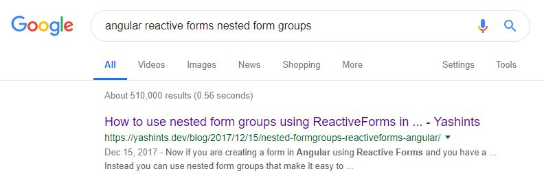
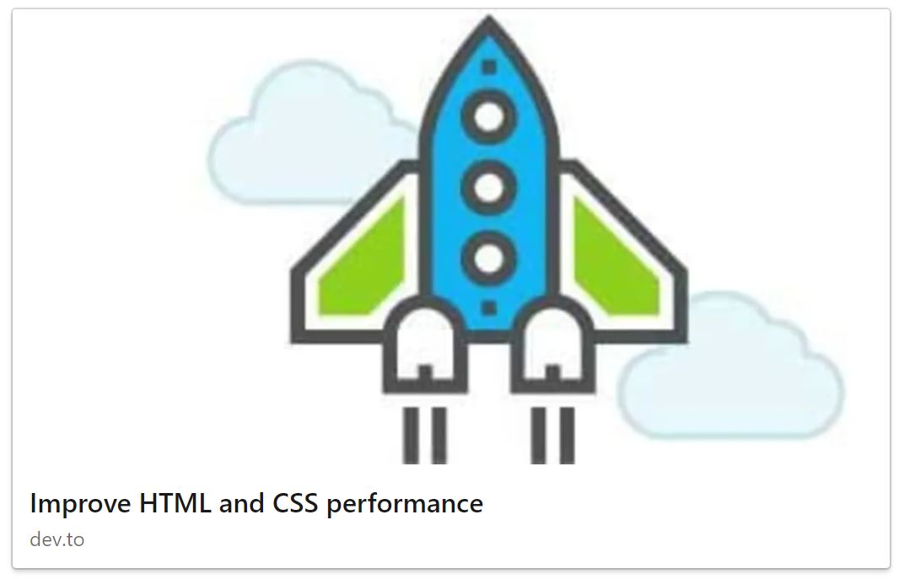
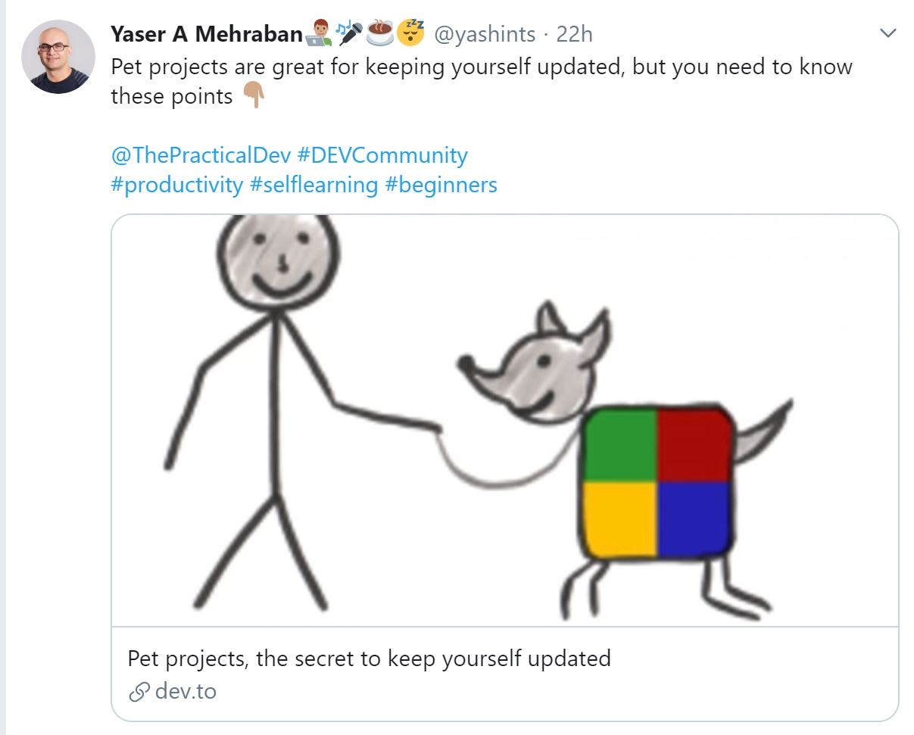
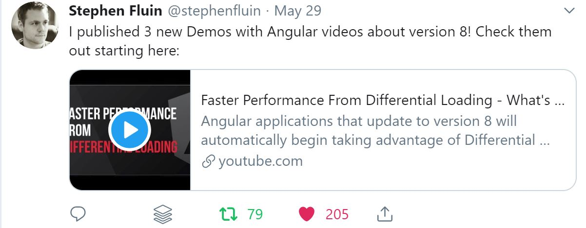

For most companies, ranking #1 is like a blessing to their business. However, most of the web developers are not aware of what should be done to reach to that point.

In this article we go through 10 simple steps to increase the ranking organically rather than paying search engines to do that for us. So, are you ready 🧐?

<!--more-->

## What does HTML tags tell search engines?

Certain HTML tags tell search engines how to read your document properly and index it against specific keywords. In other words, when they crawl web, they will categorise your page with some keywords which then is surfaced when a user searches for them.

Some of these tags also improve how visitors view your content in those search engines. And this is in addition to how social media uses content tags to show your articles like this for example 👇🏽.

<blockquote class="twitter-tweet"><p lang="en" dir="ltr">Just a reminder to not miss my talk on micro apps and web components <a href="https://twitter.com/NDC_Conferences?ref_src=twsrc%5Etfw">@NDC_Conferences</a> <a href="https://twitter.com/hashtag/NDCOslo?src=hash&amp;ref_src=twsrc%5Etfw">#NDCOslo</a> 👇🏽<a href="https://t.co/JjBDfpAhmd">https://t.co/JjBDfpAhmd</a></p>&mdash; Yaser A Mehraban👨🏽‍💻🎤☕️😴 (@yashints) <a href="https://twitter.com/yashints/status/1138194205912707073?ref_src=twsrc%5Etfw">June 10, 2019</a></blockquote>

So let's see what are these tags.

## 1. Title tag

Perhaps one the most important tags is title. This is used as a label for your page and defines how search engines like Google and Bing see your page and show it in their search result.

In most cases, this tag reflects the title of the article/page itself. This isn’t exactly a bad practice, but you’ll miss out on a few opportunities to score big in search engines like Google.

The question which comes up is, does it have to be the same as keywords. And the answer is absolutely not. However, it's good to make sure you're not confusing the reader 😉. But this gives opportunity to expand on what your page is relevant to for the search engine. Title should be short anyway, so having different but related tags makes it accessible to a wider range of searches.

A normal title tag is shown below:

```html
<title>Your Title Text for Search Engines</title>
```

It sounds very simple right? Well as simple as it looks, below are the points you have to consider when writing your title:

- Use only one title tag
- Try to create a unique title
- Don't use your title keywords as your meta tags too (read further on tags)
- Make it relevant to content
- It's good to keep it under 60 characters
- Try to not use stop words
- Show the branding last
- Make it readable
- Use dates, numbers and questions if relevant

Here is an example of one of my articles being the first result on Google 😍:



## 2. Meta description tags

As I mentioned above, having description tags is really helpful to expose your page to a wider range of searches in addition to title.

```html
<meta
  name="description"
  content="Key HTML tags to have better SEO."
/>
```

For example, above is a tag where someone tried to highlight "Key HTML tags" and "better SEO" phrases and also to be displayed in search results.

[[info]]
|**Note:** As of 2019, [Google has announced](https://webmasters.googleblog.com/2017/06/better-snippets-for-your-users.html) that you shouldn't focus too much on these as they will consider content first.

## 3. Header tags

You should not underestimate header tags. They are often used to break up the content to make it easier to read. Imagine reading my article in one giant paragraph rather than these nicely separated pieces.

It's been discovered that about %55 of the users will spend [15 seconds at most skimming your text](https://blog.bufferapp.com/55-visitors-read-articles-15-seconds-less-focus-attention-not-clicks). In terms of SEO, header tags are what most search engines use to help determine segments of content and create [featured rich snippets](https://www.greengeeks.com/blog/2017/02/14/why-should-you-want-your-site-to-be-in-the-google-featured-snippet/).

These tags are as follows:

- `<h1></h1>` – Usually is used for webpage titles.
- `<h2></h2>` – Highlights the topic of the content following it.
- `<h3></h3>` – Reflects points in regards to the topic.
- `<h4></h4>` – Supports points from `<h3>`.
- `<h5></h5>` – Not often used, but great for supporting points of `<h4>`

## 4. Alt tags for images

This is often the most important part of an image tag not just for SEO but also for accessibility. Unfortunately, search engines cannot determine what images are showing. That’s when the `alt` tag comes handy.

For example:

```html

```

Search engines wouldn't know whether this image is showing a cute puppy or a cat. So adding `alt` tag would help them understand it and use it for categorisation.

```html

```

Above tag will correctly help search engines identify what the image is about. This will help to show this image when someone is trying to search for a cute puppy using Google images for example.

## 5. Hyperlinks

Although it doesn't look like it, hyperlinks are vital, not only to external content, but also to your own content. To give you an example, when I posted my first of series on web performance on [Dev community](dev.to), I had links to other articles on my site. That resulted in a spike of traffic to my site which was basically helping my natural traffic to go up and also help the search engine link these articles together.



In its core, they are like you're voting for other content, so use it in your benefit and make sure the linked content is relevant.

```html
<a
  href="https://dev.to/yashints/pet-projects-the-secret-to-keep-yourself-updated-51e0"
>
  My previous post about pet projects
</a>
```

If for some reason you didn't want the search engine to make a connection with what you're linking to, consider using `rel=nofollow`. This tells the search engine to not link your current article with the link destination. In other words, you won’t help improve the domain authority of an external site.

```html
<a
  href="https://dev.to/yashints/pet-projects-the-secret-to-keep-yourself-updated-51e0"
  rel="nofollow"
>
  My previous post about pet projects
</a>
```

## 6. Open graph tags

These tags are great for showing nicely formatted version of your page on social media. You might have seen it before, but here is how my post appears on LinkedIn 👇🏽:


Here is an example of an open graph tag:

```html
<meta
  name="og:title"
  property="og:title"
  content="The Title of Your Article"
/>
```

Now if this article is shared on something like Facebook, the social site will pull the title directly from this tag. As you saw from the tweet I showed above, open graph supports things like descriptions and images as well. It simply gives you customization options if your webpage is shared on social media.

## 7. Robots Tag

This tag is useful if you want to prevent your page/article from being indexed. These can stop crawlers from sites like Google or Bing from accessing the content. You might now ask why would you want that?

Some articles might not be the most influencing for rankings. There are veraity of reasons why you might want this, but let's say you have an article which lacks quality and you want to get some user's opinion before it appears on any search engine results.

```html
<meta name="robots" content="noindex, nofollow" />
```

## 8. Canonical tags

A [canonical tag](https://moz.com/learn/seo/canonicalization) is great for organizing your content and prioritizing one web page over a duplicate web page. Just to give you an example, I always like to post my posts on [my website](https://yashints.dev) first before I post it somewhere else.

I do it because of a couple of reasons. The most important one is that the reach might be higher on those platforms like [Dev.to](dev.to). However, I want search engines to know that this post is not a separate one, and in fact it is a copy of what is published on my website first. In other words, it is a way of telling search engines that a specific URL represents the master copy of a page.

Another reason why you should use this tag is that search engines might crawl your website using any of these URL forms:

- http://www.yashints.dev
- https://www.yashints.dev
- http://yashints.dev
- http://yashints.dev/index.html
- http://yashints.dev/index.html?param=value

To a human, all of these URLs represent a single page. To a crawler, though, every single one of these URLs is a unique `page`. Even in this limited example, we can see there are five copies of the homepage in play. In reality, though, this is just a small sample of the variations you might encounter.

```html
<link
  rel="canonical"
  href="http://yashints.dev/index.html?param=value"
/>
```

So by putting above tag on my home page, I can tell search engines that this URL is representing the same and not a separate page.

[Here is a good article](https://yoast.com/rel-canonical/) going more deep into canonical tags.

## 9. Responsive site meta tags

Let's first go through the fact that more than %80 of traffic in China comes through mobile devices. In Australia this number is %56. These numbers show us how important it is to pay attention to responsive design.

For the same reason it's important to let the search engines know that this site has responsive design available. This will ensure that the page is surfaces if a user is searching through a mobile device.

```html
<meta
  name="viewport"
  content="width=device-width, initial-scale=1"
/>
```

Above tag is the minimum you will need to let search engines know your site is mobile friendly. It’s important to note that **Google** puts emphasis on websites that are mobile-friendly. And if you don’t have something readily available that people can view from a hand-held device, it will reflect your rankings in search.

## 10. Twitter cards

Apart from open graph tags, [Twitter](twitter.com) has [its own tags](https://developer.twitter.com/en/docs/tweets/optimize-with-cards/overview/markup). Now that tweets can exceed historic 140 characters, these cards are a nice extension that allows your tweets to stand out in the crowd of common text.

### Here are a few of them:

#### Summary

```html
<meta name="twitter:card" content="summary" />
<meta name="twitter:site" content="@flickr" />
<meta
  name="twitter:title"
  content="Small Island Developing States Photo Submission"
/>
<meta
  name="twitter:description"
  content="View the album on Flickr."
/>
<meta
  name="twitter:image"
  content="https://farm6.staticflickr.com/5510/14338202952_93595258ff_z.jpg"
/>
```

Example:



#### Player

```html
<meta name="twitter:card" content="player" />
<meta
  name="twitter:title"
  content="Bison in Yellowstone"
/>
<meta
  name="twitter:site"
  content="@BrightcoveLearn"
/>
<meta
  name="twitter:description"
  content="Bison walking in Yellowstone National Park."
/>
<meta
  name="twitter:player"
  content="https://solutions.brightcove.com/bcls/twittercards/bison.html"
/>
<meta name="twitter:player:width" content="360" />
<meta
  name="twitter:player:height"
  content="200"
/>
<meta
  name="twitter:image"
  content="https://solutions.brightcove.com/bcls/twittercards/bison.jpg"
/>
```

Example:



For more info on these tags, visit their [official documentation](https://developer.twitter.com/en/docs/tweets/optimize-with-cards/overview/markup).

## So no keyword tags?

You might wondering why I didn't mention keyword tags. That's because most search engines like Google use content to categorise the page. So having them doesn't add any value that much and in fact to many of them just adds extra weight to your pages.

## Summary

You now know 10 tips to improve your SEO organically and save some money. So head to a bar or coffee shop and spend it responsibly 😉.

Another tip I forgot to mention was around people who use a SPA framework. If you want to have SEO for your site, you will need to define some critical paths (i.e. homepage) and create a server side rendered of that page which gets replaced by the normal route on client side. This way crawlers would be able to index your statically generated file while your end users still have the benefit of fast interactions on client side.

Till next post 👋🏼.
