It's been a while since one of the X can do that posts I've been publishing. Furthermore, [Firefox Developer tools](https://developer.mozilla.org/en-US/docs/Tools) is just getting better and better everyday, so I thought it's about time I write one for it.

So, are you ready? 😎
<!--more-->

## How to open it

You can open the _Firefox Developer Tools_ from the menu by selecting _Tools_ > _Web Developer_ > _Toggle Tools_ or use the keyboard shortcut <kbd>Ctrl</kbd> + <kbd>Shift</kbd> + <kbd>I</kbd> or <kbd>F12</kbd> on Windows and Linux, or <kbd>Cmd</kbd> + <kbd>Opt</kbd> + <kbd>I</kbd> on macOS.


## Page Inspector

There are many useful features in the page inspector (equivalent to Chrome DevTools inspect element), but there are a few which I use the most:

### Search for CSS classes

You can use the search box right below the inspector tab to search for elements, classes and other selectors. But I mostly use it to search for elements with a specific class. This is very useful if you have multiple elements which visually look similar but have specific class, or if you can't see it because it is hidden.

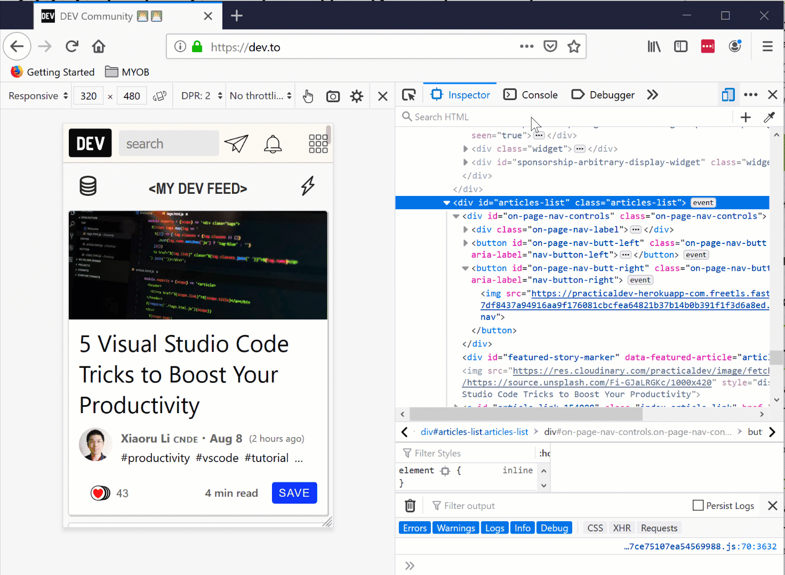

### Filter styles

In the section below, there is box for filtering styles which can be used to easily spot a particular style you might be looking for. The good thing is, it highlights the selectors and expands properties which lets you easily spot what you're looking for. 

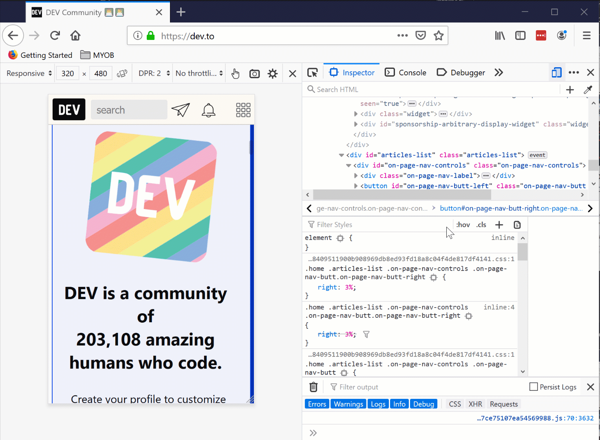

### See colour codes in different formats

One of my favourites is this little nugget of gold. With this you can easily <kbd>Shift</kbd> + <kbd>click</kbd> and see all different types of colour representation including `name`, `hex`, `rgb`, and `hsl`. Of course not all colours have names, you in some cases you only see the other ones.

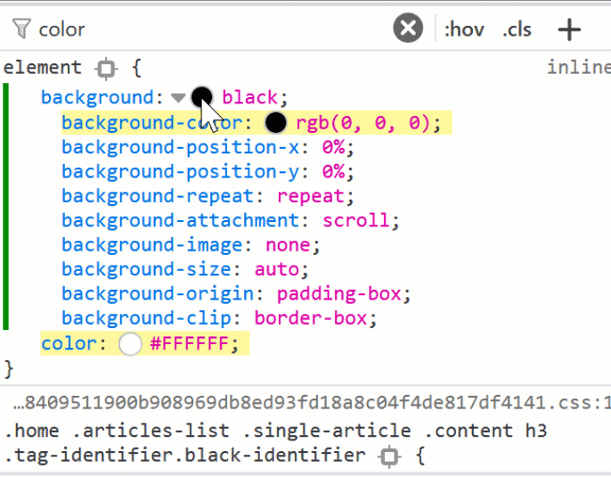

Cool hah?

## Web Console

Who doesn't love the console in the browsers's developer tools. It's used for logging, calculation, evaluation and much more.

### Styling console messages

You can get fancy with the messages in the console by applying CSS styles to them. This becomes important when you have heaps of logs and want to highlight a specific part by a different style for example.

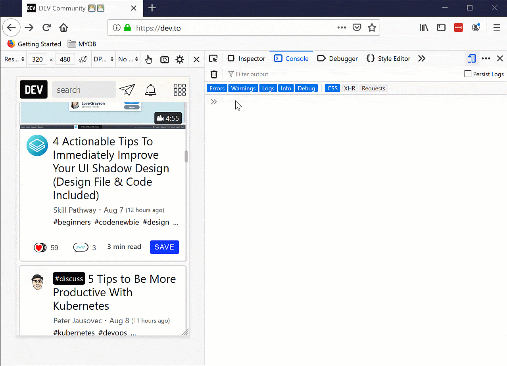

Note that you already have `console.info`, `console.warn` and `console.error` at your disposal. So this will be a level above what you can get with those.

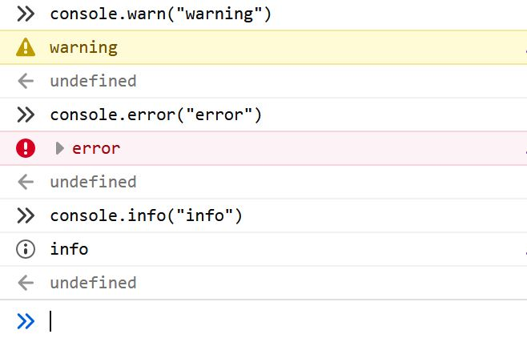

### Search in history of commands

This one is helpful if you have typed many commands and want to search between those commands. Simply type all or part of the command you're looking for and it shows you all that matches that phrase.

Press <kbd>F9</kbd> on windows or <kbd>CTRL</kbd> + <kbd>R</kbd> to open the search box. Then type your term and if the count on the right hand side shows you have results, you can move between those by pressing the <kbd>F9</kbd> and <kbd>SHIFT</kbd> + <kbd>F9</kbd> on windows. For Mac users, navigate between those using <kbd>CTRL</kbd> + <kbd>R</kbd> and <kbd>CTRL</kbd> + <kbd>S</kbd>.

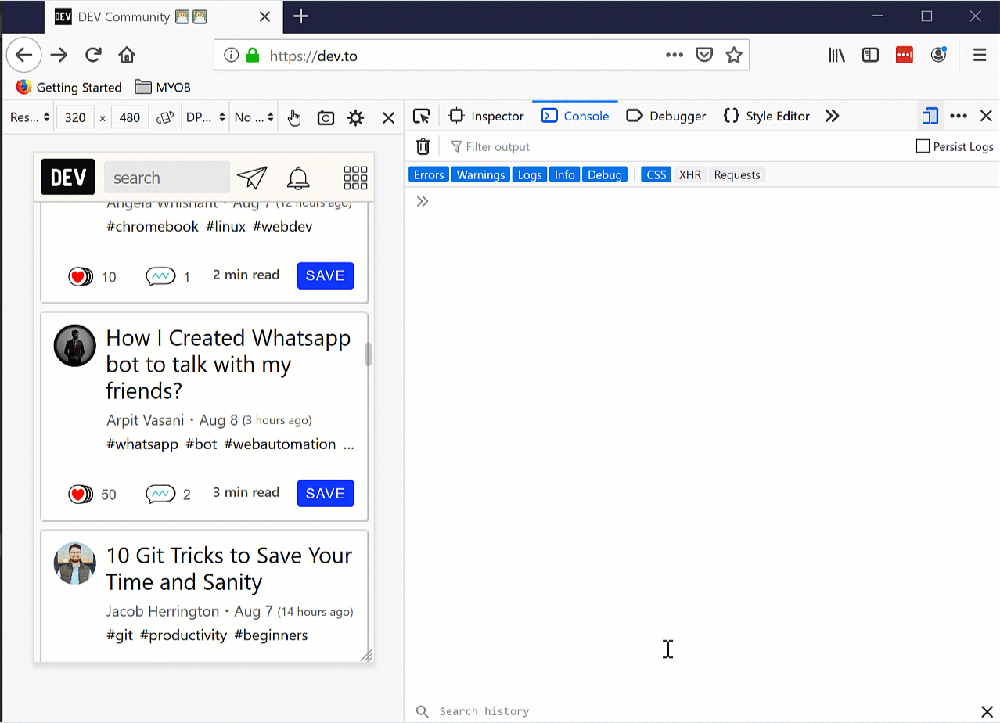

PS: I am just using arrow keys because <kbd>F9</kbd> is mapped to pause and play on my recording software and I am just too lazy to change that 😁.

### Screenshot of the whole page

To get a screen shot of the whole page, view port, or just an element, all you need to do is type `:screenshot` and pass the parameter you like. Combinations are:

```bash
:screenshot                           //the visible part of the page
:screenshot --fullpage                // whole page even invisible parts
:screenshot --selector .css-selector  // only one element (including its children)
```

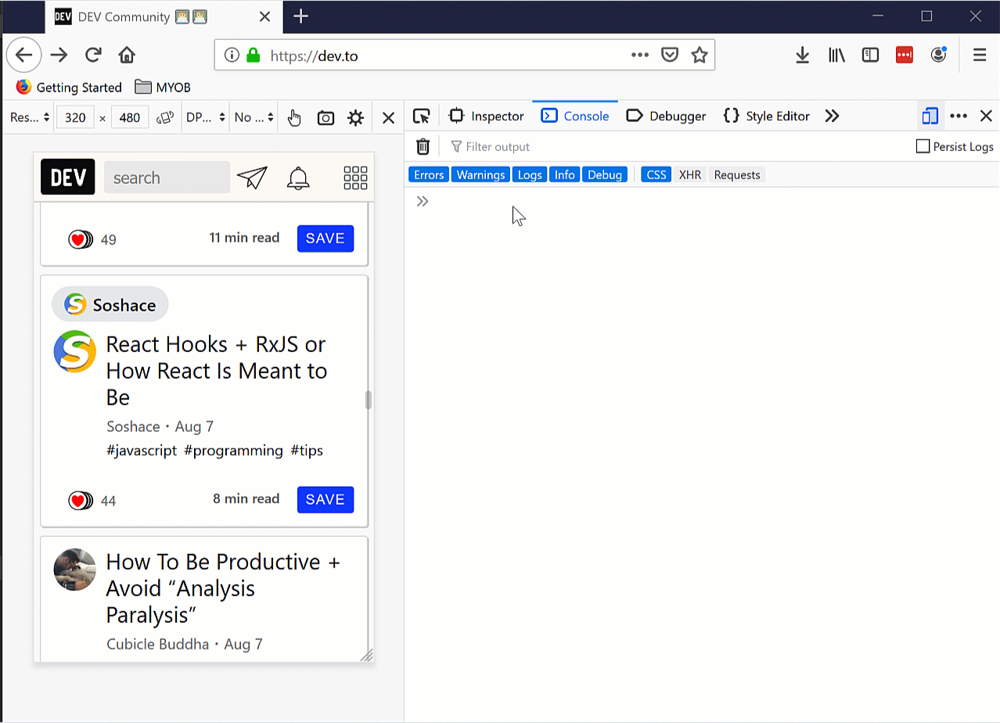

Find out more about other parameters you can pass to it [in the documentation](https://developer.mozilla.org/en-US/docs/Tools/Taking_screenshots#Taking_screenshots_with_the_web_console).

And of course you can take the screenshots using photo icon on the left side of the console in the above picture too.

## JavaScript debugger

Apart from the above two sections, like any other developer tools, is the debugger section where you could look into source code to see why something is happening the way it shouldn't or just simply test out something.

### Pretty print minified code

To prettify a minified file, click this icon: `{}` in the source pane. The debugger will format the source and display it as a new file with a name like: "{ } [original-name]".

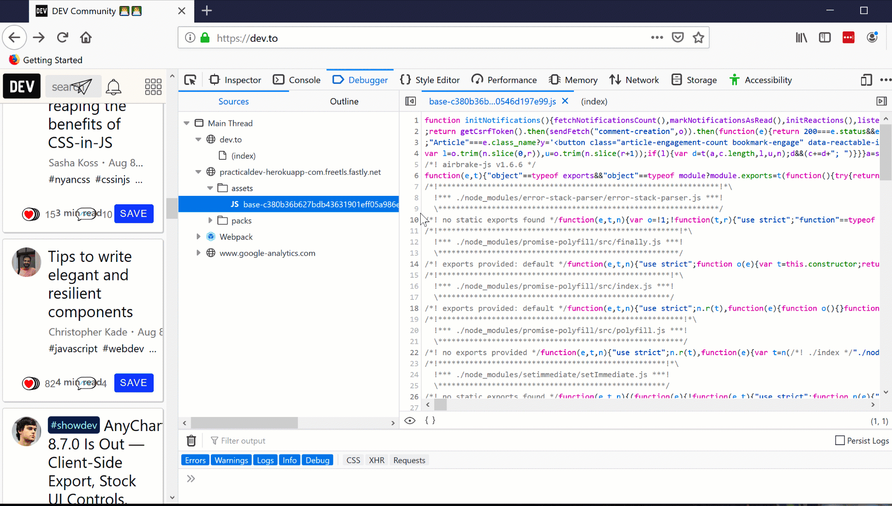

### Search for files/functions

To search for a specific file, simply press <kbd>CTRL</kbd> + <kbd>P</kbd> (or <kbd>CMD</kbd> + <kbd>P</kbd> on a Mac). The display panel shows a list of files matching the search term as you type which you can choose. Just press <kbd>Enter</kbd> to open the file.

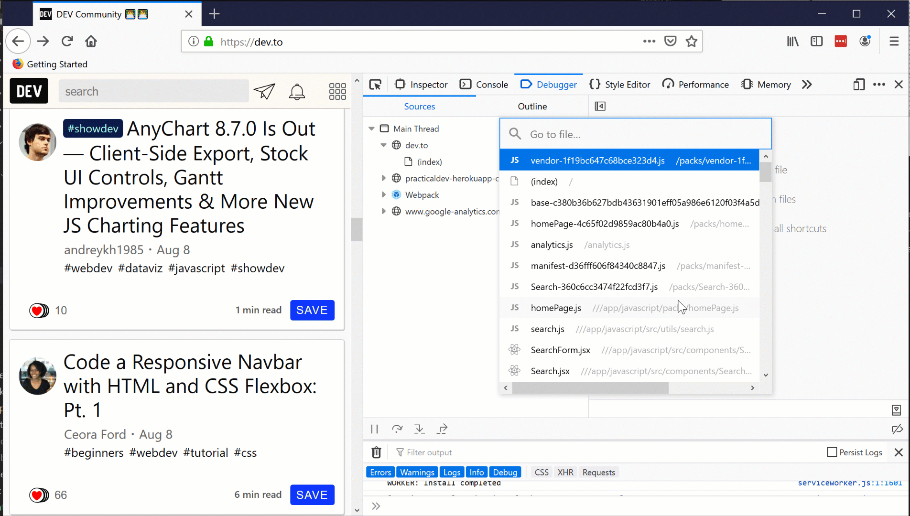

### XHR (XMLHttpRequest) breakpoint

Sometimes you need to figure out what happens when you visit/send a request to a particular URL. Once set and the URL is hit, the execution will stop so you can see the state of the application at that point.

Just click on the <kbd>+</kbd> in the XHR breakpoint section or if you want to enable it for all URLs, just tick the 'Pause on any URL' checkbox.

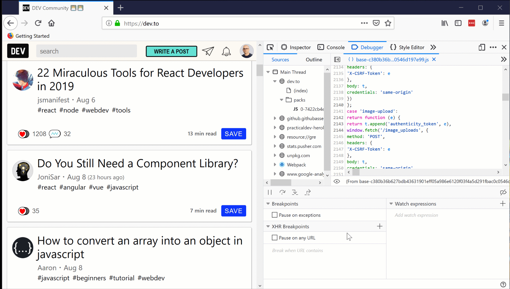

## Performance tool

The performance tool is where I usually spending most of my time in. As you might know, I've been actively working on web performance and also have a [series of posts](https://dev.to/yashints/improve-html-and-css-performance-4o08) on some important aspects of it.

However for the purpose of keeping this post short (pardon the pun 😁), I will only point to two of the ones I regularly use. You can find out more about the rest in [the official docs](https://developer.mozilla.org/en-US/docs/Tools/Performance).

### Waterfall tab

Before you get to see these tabs, you should record a page's load by pressing the ⏱ icon. Once it's done, you will see the waterfall tab by default. Along the `X` axis is time.

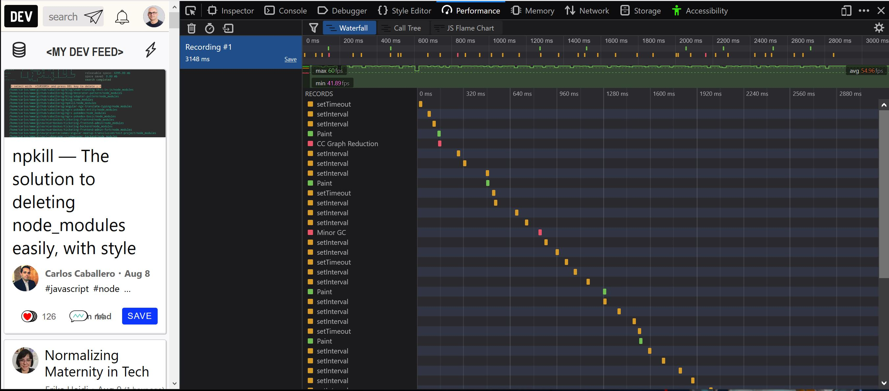

As you can see, all sorts of the stuff which browser has done such as running JavaScript, updating layout, garbage collection, and so on is shown in the view. You can find out how your application is performing on load and what type of things take the most time to finish easily in this view.

The good thing is that each category is coloured differently so you can spot them easily in each category.

For a full reference of what each colour represents, refer to the [markers table on the docs](https://developer.mozilla.org/en-US/docs/Tools/Performance/Waterfall#Markers).

### Call tree

You can see a call tree of all the functions which has been called from top to bottom in this view. The main purpose of this view is to show you which function has taken the most time executing. By analysing these calls, you can find bottlenecks in your code.

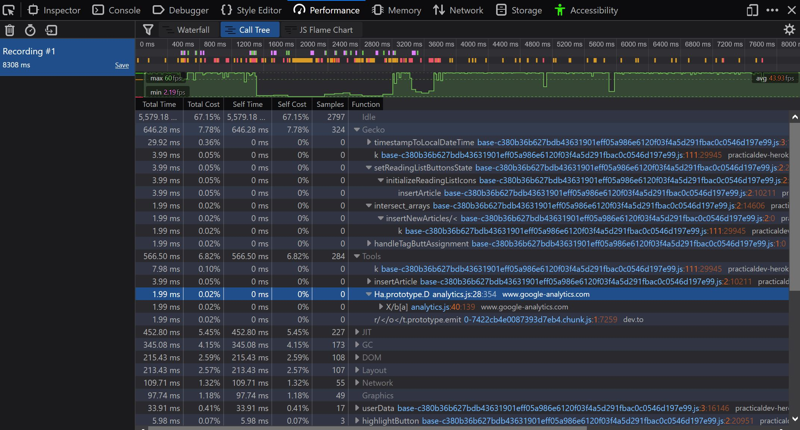

You can see in the result table that each row represents one function and the order is highest to lowest by the number of samples which has been taken while the function was executing. From docos:

>_Total Time_ is that number translated into milliseconds, based on the total amount of time covered by the selected portion of the recording. These numbers should roughly be the same as the number of samples.     
>_Total Cost_ is that number as a percentage of the total number of samples in the selected portion of the recording.                
>_Self Time_ is calculated as the time spent in that particular function, excluding its children. This comes from the captured stacks where this function is the leafmost function.          
>_Self Cost_ is calculated from Self Time as a percentage of the total number of samples in the selected portion of the recording.

## Miscellaneous 

There are heaps of other stuff which is outside of scope of a single post. But I want to point out a few of the other useful things you can do with Firefox Developer Tools.

### Accessibility Inspector

The **Accessibility Inspector** allows you to access important information exposed to assistive technologies on the current page via the accessibility tree, which lets you to check what's missing or needs improvements.

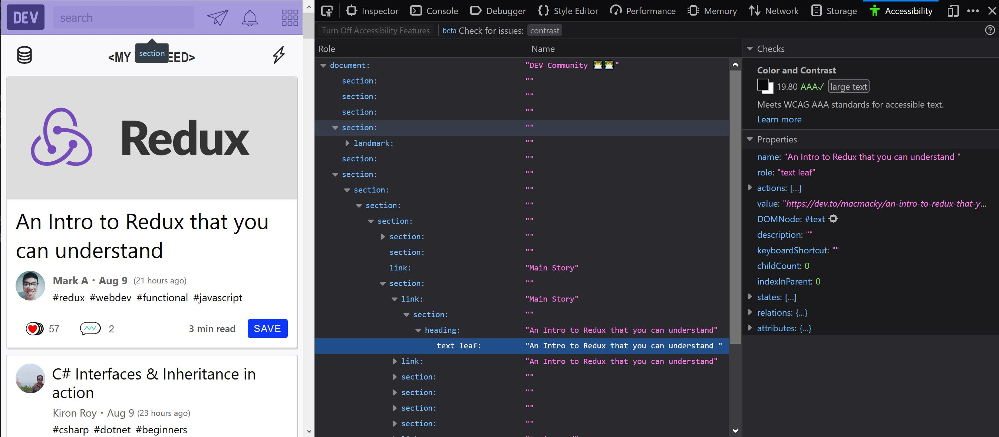

On the left-hand side, there is a node tree representing all the items in the accessibility tree for the current page. Each item has two properties listed:

* _Role_ — the role this item has on the page (e.g., pushbutton, or footer, text leaf). This can be either a default role provided by the browser, or a role given to it via a `WAI-ARIA` role attribute.
* _Name_ — the name this item has on the page. The name depends on the element; for example, the name of most text elements is simply their textContent, whereas form elements' names are the contents of their associated `<label>`.

The cool thing here is that you can print the whole tree to `JSON`. This will help you to parse this structure looking for any specific non compliant item. As an example, [someone made an ML model](https://medium.com/myplanet-musings/making-the-web-more-accessible-using-machine-learning-8a32eaafdb3a) to validate accessibility and this JSON is ideal for data prep for those models.

### Eyedropper

If you want to select any particular colour in the current page, this tool is your friend. The fact that it works like a magnifying glass is really helpful to choose a colour in small areas of the page.

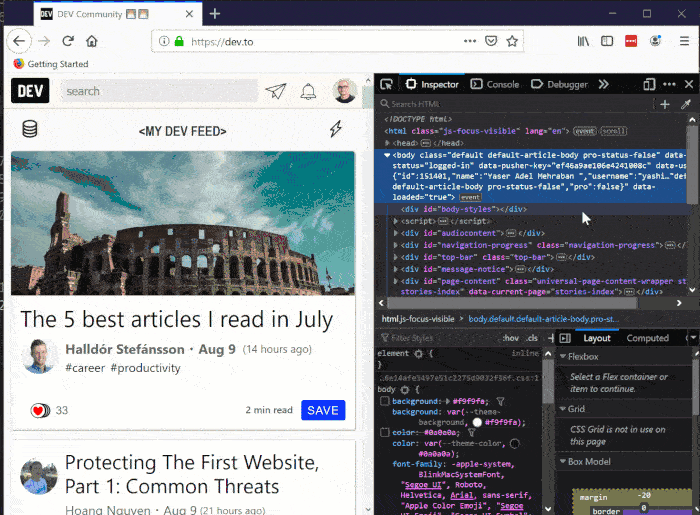

## Summary

Firefox has come a long way and the team are working furiously adding new features and improvements with every minor and major release. Plus, we should always test our applications with multiple browsers and make sure users will have the same experience in every major browser.

Have fun exploring these tricks and happy debugging.