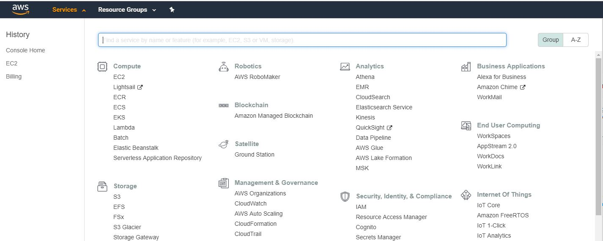
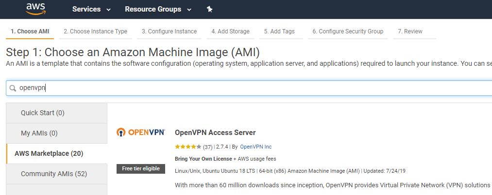
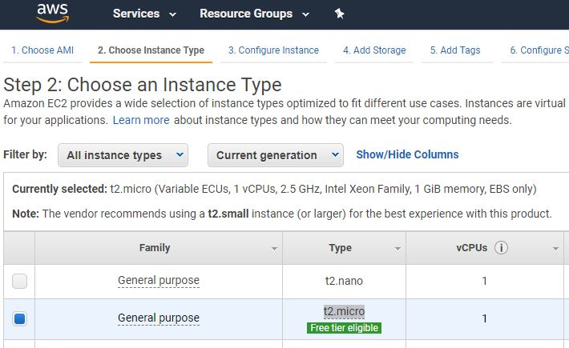
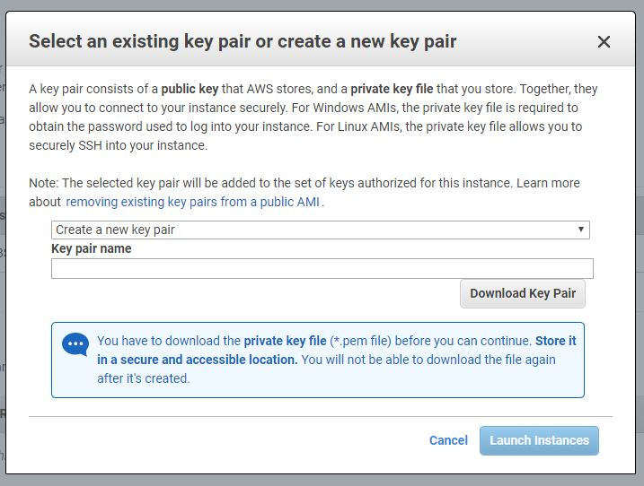
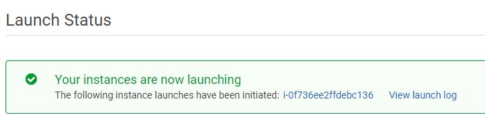
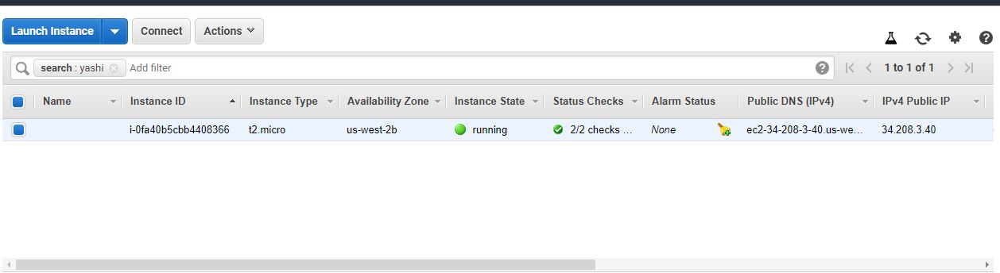
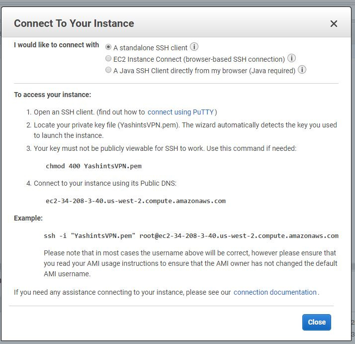
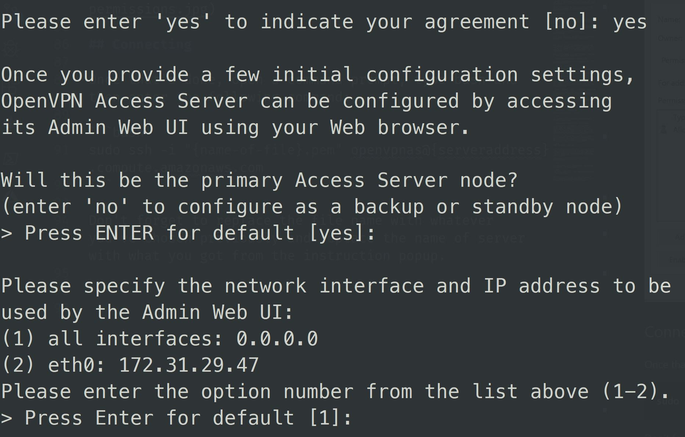

Sometimes you want to connect to internet without someone watching you. This can be due to restrictions applied by governments, ISPs, etc. Maintaining privacy while using internet is very important to some people, and for me personally, the experience was to bypass a ridiculous censor on sites like Twitter and software like Telegram.

<!--more-->

So I thought how hard can it be to setup a VPN server (because I didn't want to pay $5 per month) for a web developer. After Googling a bit, I found out you could easily do this on AWS for free using [OpenVPN](https://openvpn.net/). I started setting it up and a couple of mins later I had it up and running.

>[OpenVPN](https://openvpn.net/) is a popular open-source tool that is well tested and give you a production ready VPN solution.

So just to not forget how I did it, as usual I thought let's write up something, and who knows, maybe it was useful to you too 😉.

So are you ready?

## AWS console

If you don't have an account on [AWS (Amazon Web Services)](https://aws.amazon.com/), go ahead and create one. It's free, but you will need to have your credit card info handy.

Once signed up, login and under the services menu look for EC2 (you can type and it will filter the services as you type).



Click on EC2 and you will be redirected to its dashboard. Click launch instance button under create instance section.

## Select the OpenVPN

Many articles will walk you through setting up an new Linux VM and installing the **OpenVPN** manually. However, things have changed and some lovely people have put a ready to use service in the AWS marketplace, so we will choose that.

Once in the dashboard, click `AWS Marketplace` menu from left and type OpenVPN, then press enter.



Click on select button on the first one with the `free tier eligible` badge.

## Selecting instance type

On the next page click continue and select `t2.micro` from instance type list.



At this stage click on ***Review and Launch*** button.

## Launch the instance

Select general purpose SSD from the pop up and click next. Now click `Launch` and you'll see a pop up asking you to select a key pair. This is to let you access the instance later on.



Select create a new key pair (or an existing if you already have one), enter a name and click download key pair.

Save the `.pem` file somewhere safe as this is like a back door to your server 😁. Click Launch Instance and wait for the instance to go to running state.



Click on view instance to see the instance list.



Select your instance and click connect.

## Preparation

You'll see a set of instructions on a popup on how to connect to your instance.



In the instruction set they tell you to use [PuTTY](https://docs.aws.amazon.com/console/ec2/instances/connect/putty) to connect to your instance using `SSH`. However, I already have Ubuntu set up in `WSL` (windows subsystem for Linux) and we can use that. Otherwise you can use PuTTY or even the web browser connection.

Before we do anything we need to set the permissions for our private key 👉🏽 `.pem` 👈🏽 file, otherwise it wouldn't allow you to connect. If you're using a Linux or Mac machine, simply run the following command:

```bash
chmod 400 {name-of-file}.pem
```

For the rest of you who are like me, right click on the `.pem` file and click _Security > Advance_. Then change the owner to yourself, click disable inheritance and remove all permissions. Click add and add yourself and give full control.


## Connecting

Once that's done, open a command prompt, type bash and then enter the following command:

```bash
sudo ssh -i "{name-of-file}.pem" openvpnas@{serveraddress}.compute.amazonaws.com
```

Don't forget to replace the file name with whatever you've chosen previously and replace the name of server with what you got from the instruction popup.



Type yes for the agreement, then just hit enter to have all the defaults confirmed. Once you reached to the end, change the password for the user which will be used to login:

```bash
sudo passwd openvpn
```

Enter a new password twice and you're all set. Open a browser window and type `https://{server address}:943/admin` and login with `openvpn` and the password you just set.

## Tidy up a few settings

Once in the admin dashboard of OpenVPN, click configuration and apply the following changes:

* Change the toggle for _Should client Internet traffic be routed through the VPN?_ to **Yes**
* Change the toggle for _Have clients use specific DNS servers_ to **Yes**
* Select custom DNS server and set the first box to `1.1.1.1` (CloudFlare DNS 🦄) and the second to `8.8.8.8`

Now save the settings, wait for the pop up on the top and click apply the changes to server.

## You're good to go

You're all set. You can now connect to your very own VPN server and enjoy a private surf of the net 😎. On the first page of the browser window you opened earlier, there are five options to download the OpenVPN client for different platform. If you click on windows, you will get an installer with your server address pre-configured. Just enter your user name and password and voila.

Hope this will help you if you need a VPN server setup for free.