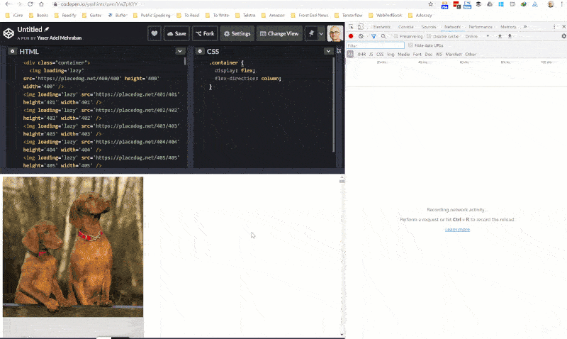

Lazy loading resources is one of the important parts of web performance tuning, simply because offscreen resources can add a lot of weight to your page if loaded eagerly.

<!--more-->

## Intro

I've gone through many tips and tricks in my [image optimisation article](https://yashints.dev/blog/2018/11/12/web-perf-4) which is [one of the series I've done on web performance](https://dev.to/yashints/improve-html-and-css-performance-4o08). However, when it comes to lazy loading, I mentioned that you have two options:

* Use `data-src` attribute on `` tag and hook into either of `scroll`, `resize`, or `orientationChange` to figure out when to replace the `data-src` with `src` to make the call.
* Use `IntersectionObserver` API to asynchronously observe the changes and make the call when the item in is the viewport.

The good news is, from [Chrome](https://www.google.com.au/chrome/) 76, you can use the `loading` attribute of an image tag to tell the browser how to load the image.

In fact it's so simple that you won't believe it 🤯:

```html

```

I've created a demo to show you how it works, look closely on the network tab.



[Here is a CodePen which contains the code](https://codepen.io/yashints/pen/VwZpKYY/).

I've just used below bash script to hack together the HTML 🤷🏽‍♂️.

```bash
for i in {400..499}; 
> do echo ""; 
> done
```

## About the attribute

Currently the images are fetched with different priority in [Chrome](https://www.google.com.au/chrome/), the ones which are not in the viewport have less priority. But they're fetched as soon as possible regardless.

With this new `loading` attribute, you can completely defer the loading of offscreen images (and **iframes**) to when they're reached by scrolling:

```html

<iframe src="https://placedog.net" loading="lazy"></iframe>
```

You can use three values with this attribute:

* `auto`: Default behaviour of the browser, equal to not including the attribute.
* `lazy`: Defer loading of resources until it reaches a [calculated distance](https://web.dev/native-lazy-loading#load-in-distance-threshold) from viewport.
* `eager`: Load the resource immediately

My [Chrome](https://www.google.com.au/chrome/) version is `76.0.3809.100` as of writing this post, but if you have any of the previous version below 76, you can activate this using flags:

* For images 👉🏽 `chrome://flags/#enable-lazy-image-loading`
* For iframes 👉🏽 `chrome://flags/#enable-lazy-frame-loading`

## Feature detection

If you want to use this attribute today, you can use below code to feature detect it and have a polyfill in place such as [loading-attribute-polyfill](https://github.com/mfranzke/loading-attribute-polyfill).

```typescript
if ('loading' in HTMLImageElement.prototype === true) {
  // use the attribute
} else {
  // use polyfill
}
```

## Prevent content reflow

Since the images are lazy loaded, if you haven't set `width` and `height` for your image, the content might reflow when the image is loaded and fill its place. To prevent that to happen, simply set the required values on the image tag by either `style` or directly using `width` and `height` attributes:

```html


```

## iframe loading

The same behaviour is applied to `iframe` when it's used with `loading` attribute. However, there are times when an iframe is hidden for analytics purposes. Examples are they are very small (less than `4px` in width and height), or they have `display:none` or `visibility: hidden` applied to them, or simply is offscreen using negative margin.

In these cases it won't get lazy loaded even if you have used the attribute.

## What's the catch

There are few points you have to consider when using lazy loading in general. Plus there are a few things you can't do with the `loading` attribute as of now.

**Can't do**

* You can't change the threshold to load the resource for now since it's been hard coded in the source.
* This can't be used with CSS' background image for now

**Catches**

* This might affect the third party ads since they will be lazy loaded too
* There will be side effect when printing 😉, as in the lazy loaded resources won't be printed. However, there is an [open issue](https://bugs.chromium.org/p/chromium/issues/detail?id=875403) you can follow.


## What about other browsers?

For now, [Chrome](https://www.google.com.au/chrome/) is the only browser supporting this feature. Although there is an [open bug for Firefox](https://bugzilla.mozilla.org/show_bug.cgi?id=1542784) and nothing for Edge and IE.

Happy lazy loading everybody and make sure not to miss the catches 👋🏽.
