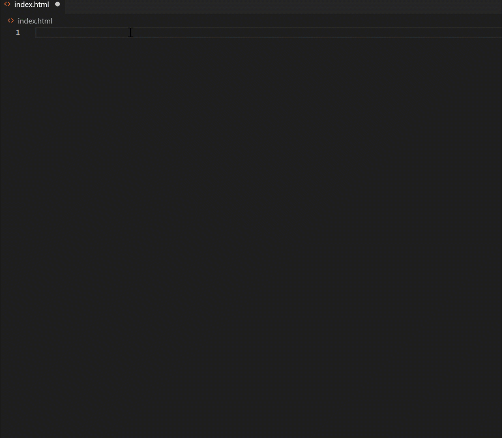

How often have you wrote a block of HTML without realising the code you've written might not be ideal?

<!--more-->

## The why

`HTML` has always been that kid in the corner where nobody talks to because `JavaScript` and `CSS` have always stolen the attention.

Now keep that picture in your mind cause I am going to go through some simple tips which together, make a difference and help bring that kid in the centre again 😁.

These are part of a perspective of creating a clean, maintainable and scalable code, that will make a good use of the semantic markup elements of `HTML5` and that will render correctly in supported browsers.

So just to stop me from going on and on about why, let's have a look at the what.

## DOCTYPE

Starting from the top of your `index.html`, make sure you're declaring a `DOCTYPE`. This will activate the standard mode in all browsers and let them know how the document should be interpreted. Keep in mind that `DOCTYPE` is not an HTML element.

For `HTML5` it looks like:

```html
<!DOCTYPE html>
```

**Note:** If you're using a framework, this is prepopulated for you. If not, I highly recommend using code snippets like [Emmet](https://code.visualstudio.com/docs/editor/emmet) which is available in [VS Code](https://code.visualstudio.com).



Curious to find out more about other doc types? [Have a look at this reference document](https://html.com/tags/doctype/).

## Optional tags

Some tags are optional in HTML5, mostly because the element is implicitly present. Believe it or not, you can omit the `<html>` tag and the page will render just fine.

```html
<!DOCTYPE HTML>

  <head>
    <title>Hello</title>
  </head>
  <body>
    <p>Welcome to this example.</p>
  </body>
</html>
```

Above is a valid `HTML`, however, there are some cases where you can't do so, such as tags followed by comments:

```html
<!DOCTYPE HTML>
<!-- where is this comment in the DOM? -->

  <head>
    <title>Hello</title>
  </head>
  <body>
    <p>Welcome to this example.</p>
  </body>
</html>
```

Above is invalid because the parse tree changes due to comment being outside of `<html>` tag.

## Closing tags

You should always consider closing your tags because some browsers will have trouble rendering your page. However, it's recommended to keep those for readability and other reasons which I will go through later.

```html
<div id="example">
  
  <a href="#" title="test">example</a>
  <p>example</p>
</div>
```

Above are all valid tags. But there are also some exceptions 👇🏼 to this rule.

Self-closing tags are valid, but not required. These elements include:

```html
<br>, <hr>, , <input>, <link>, <meta>,
<area>, <base>, <col>, <command>, <embed>, <keygen>, <param>, <source>, <track>, <wbr>
```

**Note:** Normal elements can never have self-closing tags.

```html
<title />
```

Above is invalid obviously.

## Charset

Define your character set upfront. It is best practice to put it right on top inside `<head>` element.

```html
<head>
  <title>This is a super duper cool title, right 😥?</title>
  <meta charset="utf-8">
</head>
```

Above is invalid and title wouldn't render properly. Instead move the character set deceleration on top.

```html
<head>
  <meta charset="utf-8">
  <title>This is a super duper cool title, right 😃?</title>  
</head>
```

## Language

Another reason to not omit the optional tags is when using attributes. In this case you can and you should define the language of your web page. This is really important for accessibility and searching.

```html
<html lang="fr-CA">
  ...
</html>
```

## Title

Never, never, ever omit the title tag. It's super bad for accessibility, and I will personally never use your site because I can't find it 2 seconds after opening it and 20 more tabs later 😁 (the browser tab won't have anything to show).

## The `base` tag

This is a really useful tag which should be used with cautious. This will set the base URL for the app. Once set, all links will be relative to this base URL, which might cause some unwanted behaviour:

```html
<base href="http://www.example.com/" />
```

With above set, `href="#internal"` will be interpreted as `href="http://www.example.com/#internal"`.

Or `href="example.org"` will be interpreted as `href="http://www.example.com/example.org"`.

## Description 

This meta tag is very useful although it's not strictly part of best practices. This is super useful for search engines when they crawl your site.

```html
<meta name="description" content="HTML best practices">
```

I have a [post you can check on SEO which has been super popular](https://yashints.dev/blog/2019/06/11/seo-tips).

## Semantic tags

Although you can create your UX engineer's wire frames with just `div`s, it doesn't mean you should. [Semantic HTML](https://www.w3schools.com/html/html5_semantic_elements.asp) gives meaning to your page rather than just presentations. Tags like `p`, `section`, `h`{1-6}, `main`, `nav`, etc are all semantic tags. If you use a `p` tag, users will know this represents a paragraph of text and browsers know how to represent them.

On the other hand, tags like `i` and `b` do not represent semantics. They just try to define how the text should look like. Semantic HTML is way beyond the scope of this article. But you should defo [check them out](https://developer.mozilla.org/en-US/docs/Glossary/Semantics) and use them as if they're your pen when you're writing. Can you write without a pen ❓ (or mouse 😁)?

## `hr` shouldn't be used for formatting

`<hr>` is not a formatting element, so stop using it to format your content. In HTML5 this tag represents a thematic break of your content. A proper use of it might look like this:

```html
<p>Paragraph about puppies</p>
<p>Paragraph about puppies' favourite foods</p>
<p>Paragraph about puppies' breeds</p>
<hr>
<p>Paragraph about why I am shaving my head 😂</p>
```

## Be careful when you use the `title` attribute

The `title` attribute is a powerful tool which can help clarify an action or the purpose of an element on the page like a tooltip. However, it's not interchangeable with other attributes like `alt` on an image.

From the HTML5 spec:

> Relying on the `title` attribute is currently discouraged as many user agents do not expose the attribute in an accessible manner as required by this specification (e.g., requiring a pointing device such as a mouse to cause a tooltip to appear, which excludes keyboard-only users and touch-only users, such as anyone with a modern phone or tablet).

[Read more about how to properly use this attribute](https://html.spec.whatwg.org/multipage/dom.html#the-title-attribute).

## Single or double quotes

I've faced many code bases where there are a mix of both in the markup. This is not good especially if you are using a framework which depends on single quote like `php` and also when _`you're`_ using a single quote in a sentence just like I did now. Another reason is to keep it consistent which is always good. Don't do:

```html

```

Instead:

```html

```

## Omit boolean values

When it comes to having boolean values for attributes, it's recommended to omit those as they don't add any value and also increase your markup's weight.

```html
<audio autoplay="autoplay" src="podcast.mp3">

<!-- instead 👇🏼 -->

<audio autoplay src="podcast.mp3">
```

## Omit type attribute

There is no need to add `type` attribute to `script`and `style` tags. You also get a validation error from some services such as [W3C's markup validation tool](#validate-your-markup).

## Validate your markup

You can use services like [W3C's markup validation](http://validator.w3.org/) to make sure you have a valid markup 😍.

## Say no to inline style ☢

What you write in your HTML file is the content, how it looks like is presentation. Leave the presentation to CSS and don't use inline styles. This will benefit both your developers and browsers to digest your mark up.

## Summary

These are just a tip of the iceberg in terms of small things to keep in mind when writing markup. There are heaps of good resources you can have a look for deeper insights, and I highly recommend you to skim through them at least once.

* [HTML best practices on GitHub](https://github.com/hail2u/html-best-practices)
* [W3C school HTML style guide](https://www.w3schools.com/html/html5_syntax.asp)

Hope you've enjoyed the read. And stay classy 😊, with your markup 😁.