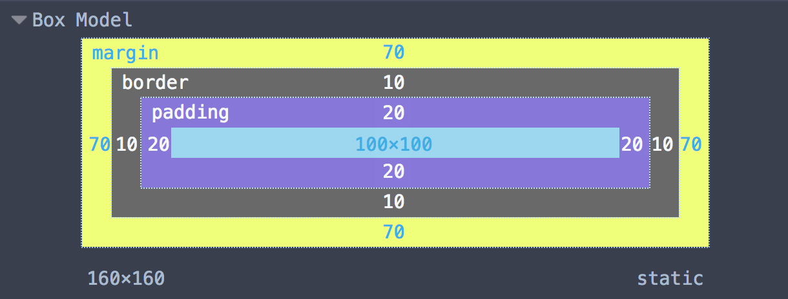
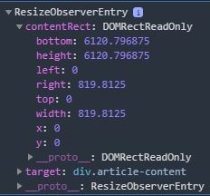

[Resize Observer](https://developer.mozilla.org/en-US/docs/Web/API/ResizeObserver) API is another great JavaScript API which lets you get notified when the size of an element changes. Think `window.onresize` but on element level.

<!--more-->

## The what

The most common case when the size of an element could change is when the viewport is resized. Or in terms of mobile device the orientation changes.

Prior to `ResizeObserver` you would have to hook into `window.onresize` or use `window.resize` to be able to figure out whether an element's size has changed or not. This was very inefficient since it would trigger so many events.

Another scenario where this API can come handy is when you add/remove an element dynamically, in which case the size of the parent changes and not the viewport.

>The `ResizeObserver` interface reports changes to the dimensions of an `Element`'s content or border box, or the bounding box of an `SVGElement`.

The content box is the box in which content can be placed, meaning the border box minus the padding and border width. The border box encompasses the content, padding, and border.



## Enough talking, shoe me the code 😉

In its simplest form, you can use `ResizeObserver` by just instantiating a new instance of the API and pass a call-back to it.

```js
const myObserver = new ResizeObserver(entries => {
  // iterate over the entries, do something.
});
```

By itself, this wouldn't help much, however if you call the `observe` method on the instance and give it an element, it will start capturing it's size changes and calls your call-back function.

```js
const myEl = document.querySelector('.my-element');

myObserver.observe(myEl);
```

Now whenever my element's size changes, it will trigger the call-back and voila.

## call-back input object

When you pass a call-back to the constructor of the API, what you get is an array of objects which look like below:



As you can see, the object you get has two properties, **`contentRect`** and `target`. Target is obvious, it's the DOM element itself. The `width` and `height` values on the **`contentRect`** don't include the padding unlike the element's `getBoundingClientRect`.

## Demo

You can do a lot with this API, from changing the font size based on the element's size to change the styling when the size changes. Below is one where I'm changing the border radios based on element's size. Resize your window and see what happens 😎.

<style>
.boxes {
  display: flex;
  flex-wrap: wrap;
  width: 40vw;
  margin-bottom: 50px;
}
.box {
  height: 200px;
  flex-shrink: 1;
  flex-grow: 1;
  margin: 10px;
  box-sizing: border-box;
  border: 3px solid black;
}
</style>

<div class="boxes">
  <div class="box"></div>
  <div class="box"></div>
</div>

<script data-inline-script="data-inline-script">
const ro = new ResizeObserver(entries => {
  for (let entry of entries) {
    entry.target.style.borderRadius =
      Math.max(0, 250 - entry.contentRect.width) +
      'px'
  }
})
console.log('horay');
// Only observe the 2nd box
ro.observe(
  document.querySelector('.box:nth-child(2)')
)
</script>


## Demo explained

The demo is not that complex, we have a `div` which is got two children:

```html
<div class="boxes">
  <div class="box"></div>
  <div class="box"></div>
</div>
```

We add a bit of styling so we can see the changes:

```css
.boxes {
  display: flex;
  flex-wrap: wrap;
  width: 40vw;
  margin-bottom: 50px;
}
.box {
  height: 200px;
  flex-shrink: 1;
  flex-grow: 1;
  margin: 10px;
  box-sizing: border-box;
  border: 3px solid black;
}
```

Once we're done, we add our little snippet to get the observer notify us of changes:

```js
const ro = new ResizeObserver(entries => {
  for (let entry of entries) {
    entry.target.style.borderRadius =
      Math.max(0, 250 - entry.contentRect.width) +
      'px'
  }
})
console.log('horay');
// Only observe the 2nd box
ro.observe(
  document.querySelector('.box:nth-child(2)')
)
```

In the call-back, we simply change the border radios based on width of the element, and voila.

## Browser support

[Browser support](https://caniuse.com/#feat=resizeobserver) is there for most major browsers, we have Chrome 64+, Firefox 69+, Microsoft Edge 76, and Safari 13-TP supporting the API, but a poor support on mobile browsers.

Have fun exploring the API and do some cool stuff with it 😍.

