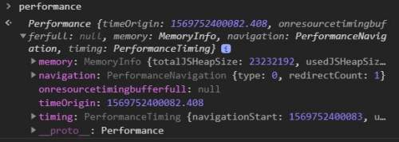

Everybody likes a fast loading web page. In fact, Google has an [entire section](https://developers.google.com/web/fundamentals/performance/why-performance-matters/) dedicated to performance and how companies are moving towards a faster web. Wouldn't it be good if we could measure some critical metrics like page load time in our production environment and constantly monitor them to find out where can be improved?

<!--more-->

## Navigation Timing API

[Navigation Timing API](https://developer.mozilla.org/en-US/docs/Web/API/Navigation_timing_API) is a JavaScript API which can be used to accurately measure performance on the client side. This data can then be transmitted to server side to allow real time monitoring of performance metrics.

The API provides a simple way to natively get accurate and detailed timing statistics for page navigation and load events. Metrics such as page load time, amount of time needed to unload the previous page, how long domain lookups take and so on can be measured by this API.

## How to use it?

This API has two interfaces, `Performance` and `PerformanceNavigationTiming`. The `window.performance` property returns a `Performance` interface which is defined by [High Resolution API](https://developer.mozilla.org/en-US/docs/Web/API/Performance_API), plus two additional properties:

* **timing**: data for navigation and page load events.
* **navigation**: how the user navigated to the page.

You can try this API in the browser's console (pressing <kbd>Ctrl</kbd>+<kbd>Shift</kbd>+<kbd>J</kbd> for Chrome on Windows or <kbd>CMD</kbd>+<kbd>Option</kbd>+<kbd>J</kbd> for Mac users):

```bash
> performance
```

And you will see an object like this:



## Better alternative to `Date` object

Historically, we've used `Date` object for timing metrics like:

```js
let start = Date.now();
```

And at the end of the page:

```js
console.log(`It took: ${Date.now() - start} ms for the page to load!`);
```
However, this is very inefficient because of a couple of reasons. First, the timing code is on the page which takes time itself and affects performance. Besides, you should know that JavaScript time is [not accurate](https://johnresig.com/blog/accuracy-of-javascript-time/). Furthermore, it wouldn't be close to what users experienced it, and worst of all, you can't use `Date` object, to measure network latency before the page started loading.

If you think of events which happen before the page even begins to load such as DNS resolution, redirects and server response time, technically you can't measure these by inline code since your code hasn't arrived yet.

## Navigation Timing API FTW

Each of the properties of of `performance.timing` shows the time of navigation events such as when the page was requested 👉🏼 `requestStart` or page load events such as when the DOM began loading 👉🏼 `domLoading` in milliseconds since the midnight of Jan 1, 1970 UTC.

💡 A `zero` value means that the event didn't occur. Events such as `redirectStart` or `secureConnectionStart` might not happen at all.

For more information on these events, you can have a look at the [W3C Recommendation](https://www.w3.org/TR/navigation-timing/#sec-navigation-timing-interface).

You can see the order of these events from the picture below from the above document:


## Some use cases

Now let's have a look at how we can calculate some metrics using these useful properties.

### Total page load time

In order to calculate the total page load time, you can use the `loadEventEnd` and `navigationStart` properties:

```js
const perfObj = window.performance.timing;

let pageLoadTime = perfObj.loadEventEnd - perfObj.navigationStart;
```

### Page render time

To calculate the total time taken to render the page, simply use `domComplete` and `domLoading` properties:

```js
const perfObj = window.performance.timing;

let renderTime = perfObj.domComplete - perfObj.domLoading;
```

### Request response time

To calculate the time between beginning of the request to the end of response retrieval, you can use:

```js
const perfObj = window.performance.timing;

let renderTime = perfObj.responseEnd - perfObj.requestStart;
```

### Network latency

If you want to measure network latency:

```js
const perfObj = window.performance.timing;

let renderTime = perfObj.responseEnd - perfObj.fetchStart;
```

### Navigation and page load together

To have the sum of navigation and page load time:

```js
const perfObj = window.performance.timing;

let renderTime = perfObj.loadEventEnd - perfObj.navigationStart;
```

### Pinpoint redirect problems

To find out about any issue in redirects:

```js
const perfObj = window.performance.timing;

let renderTime = perfObj.redirectEnd - perfObj.redirectStart;
```

## `navigation` property

There are many ways to end up on a page. If you want to know how your user ended up on your page, or how many redirects they've had before landing there, this property is your friend. `performance.navigation` has two properties:

* **redirectCount**: the number of times the document request was redirected.
* **type**: type of the navigation which lead to this page.

The `type` property is an `enum` which can have three values:

* **0**: action by the user such as clicking a link or entering a URL in the browser address bar.
* **1**: page reload.
* **2**: navigation through going back and forth from history of the browser.


## Summary

We saw how we can use the Navigation Timing API to get performance metrics on client side which can be sent to server to monitor performance of users in real time regardless of where they are and how they got there. This API is really powerful and has helped me a lot to help customers find out where they need to focus their energy to improve performance on which pages 😍.

Hope this has been helpful and till next time, _au revoir_ 👋.