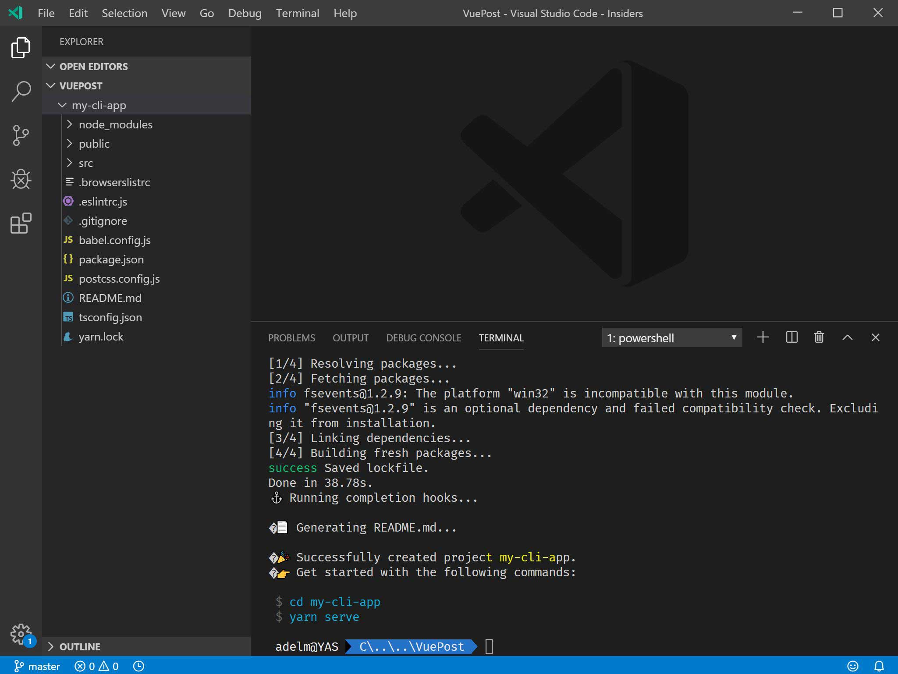
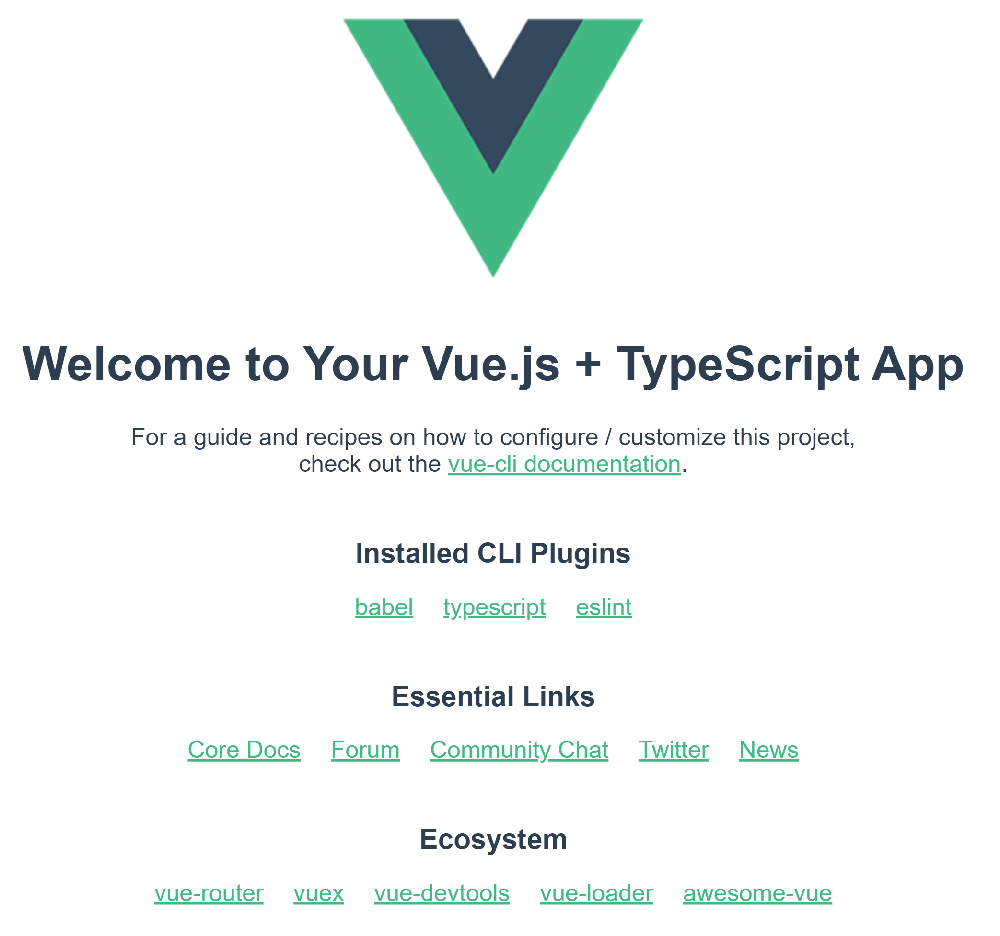

[Vue.js](https://vuejs.org/) is an approachable, versatile, performant, and progressive framework to build user interfaces with. This core library is focused on building the view layer only. It uses the goodies of [Angular](https://angular.io/) (such as template syntax) and [React](https://reactjs.org/) (such as Virtual DOM) and adds a few more enhancements on top.

<!--more-->

## Intro

There are many articles out there, but I thought to write this up since it follows my logic of around learning a new framework/library. **Vue** got popular very quick because it adapts to the needs of developers. Another bonus point of it is that migrating to it is really easy. You just need to add a script tag to your page and you're good to go.

You don't even need to know what is a bundler like [webpack](https://webpack.js.org/), or an advanced compiler like [babel](https://babeljs.io/) or use a package manager like `npm` to get started with Vue.

It does have a [CLI](https://cli.vuejs.org) though which can help you build a fully fledged SPA with a variety of configuration options, including Babel, TypeScript, ESLint, PostCSS, PWA, Unit testing and end-to-end testing.

The best thing about its CLI is that you don't need to eject like `create-react-app` to be able to customise your configuration.

## Get started

OK, enough talking, let's get started on our first **Vue** application. I will start with a simplest approach. Let's create a simple HTML page:

```html
<html>

<body>
    <div id="my-vue-app">
        <p>{{ hello }}</p>
    </div>
    <script src="https://unpkg.com/vue"></script>
    <script>
      new Vue({
        el: '#my-vue-app',
        data: {
          hello: 'Hello World!'
        }
      })
    </script>
</body>

</html>
```

And believe it or not, that's all you need to have your first **Vue** app up and running. Now let's break this down and see what's happening.

The first thing you see is a paragraph which has a template reference to a variable called `hello`, like Angular. This means that the value gets replaced by **Vue**. Then we import the script from `UNPKG` which is a CDN (content delivery network) on top of `npm`.

Then we in the second script tag, we create a new instance of **Vue** and tell it to use a DOM element with id of `#my-vue-app`. **Vue** will have control over this element and its children. Last we specify a data object with a `hello` property. **Vue** will replace this variable in the template for us. So you should see a page with `Hello World!` when you open this file in a browser.

Notice we didn't use `this.data.hello` to access the variable, that's because **Vue** will automatically make every property of data accessible like a high level variable.

You can see this example live in this CodePen 👇🏼:

<iframe height="265" style="width: 100%;" scrolling="no" title="vue-hello-world" src="https://codepen.io/yashints/embed/WNNGYXB?height=265&theme-id=0&default-tab=result" frameborder="no" allowtransparency="true" allowfullscreen="true">
  See the Pen <a href='https://codepen.io/yashints/pen/WNNGYXB'>vue-hello-world</a> by Yaser Adel Mehraban
  (<a href='https://codepen.io/yashints'>@yashints</a>) on <a href='https://codepen.io'>CodePen</a>.
</iframe>

## Using CLI

Now not all the applications are as simple as our hello world, so we need to get to know the **Vue CLI** which helps up build a complete application from scratch. Open the terminal in your [VS Code](https://code.visualstudio.com/), navigate to a folder of your choice and run this command:

```bash
npx @vue/cli create my-cli-app
```

Alternatively you can install it globally:

```bash
npm i -g @vue/cli

vue create create my-cli-app
```

When you run the command, you will be prompted to choose a preset. You can choose default which is based on `Babel` and `ESList`, or go custom in which case you have more freedom to choose from, like TypeScript, CSS pre-processor, etc.

Since the point of this intro is on Vue itself, I won't delve into details of CLI, please visit [their official website](https://cli.vuejs.org) for more info on how to use CLI.

When the creation of the new application is finished, you will end up with a folder structure like this:



You don't need to pay attention to all those files, suffice to know that `index.html` contains the `div` for **Vue** to handle, `src/main.ts` is where **Vue** is instantiated, and `src/App.vue` is a single file components (I will explain this later) which contains our default components.

> **Single File Component:**
>Single File Component is a file which contains everything a **Vue** component needs, HTML, CSS and JavaScript. You can even scope the style to the component to prevent any unwanted styling clash with other components. In a way it's similar to what you'll have with [Shadow DOM](https://developer.mozilla.org/en-US/docs/Web/Web_Components/Using_shadow_DOM).

If you have a look at the script tag in the `App.vue` file, you'll it's just defining a component which contains another component, `HelloWorld` referenced from another file. Hello world component is another single file component which has one props passed on to it which gets displayed in the template.

I will not go any further than this at this point, but you get the idea.

To run the app, simply open the type `npm run serve`. You should see a page like this:



## Vue root component

For now it's enough about how to get started, let's deep dive into **Vue**'s building blocks. We should start with its root instance.

```js
new Vue({ 
  el: '#vue-app',
  data: {
    name: 'Yaser'    
  },
  computed: {
    fullName: function() {
      return this.name + 'Adel';
    }
  },
  watch: {
    name: function(oldVal, newVal) {
      console.log(`Name changed from ${oldVal} to ${newVal}`)
    }
  },
  methods: {
    nickName: function() {
      return this.name === 'Yaser' ? 'Yashints' : 'NA';
    }
  },
  created: function() {
    console.log(`${this.name}`);
  }
  ...
})
```

OK, there is a lot going on here, so let's break them down one by one.

### el 

This is the id selector of the element we want **Vue** to use.

### data 

This object contains any property you want to maintain in your application. You can get their values in the template, by just using the property name. This just works because **Vue** will automatically make all of the properties accessible at high level `this` context.

### computed

Sometimes you end up having too much logic in your template, take this fictional example:

```html
<div id="my-component">
  {{ name.split('').reverse().join('') }}
</div>
```

In this case when you run the app you will see `resaY`, but having those function calls in the template is not a good practice. You can create a computed property to handle all these logics elsewhere outside of your templates.

```js
var vm = new Vue({
  el: '#my-component',
  data: {
    name: 'Yaser'
  },
  computed: {
    // a computed getter
    reversedName: function () {
      // `this` points to the vm instance
      return this.name.split('').reverse().join('')
    }
  }
})
```

and in your template, you would just have:

```html
<div id="my-component">
  {{ reversedName }}
</div>
```

> Be careful with computed properties, these are cached based on the value of the their dependency, which means it will only gets re-evaluated if the value is changed.

This means the following code will not return what you think:

```html
computed: {
  now: function () {
    return Date.now()
  }
}
```

That's because `Date.now()` is not a reactive dependency.

### methods

Methods are simple functions which give you ability to handle events like clicks and input changes. In addition to those, you can use them for many other purposes as well, but the main use case is event handling.

You might say we could implement the previous computed property using a method:

```html
<div id="my-component">
  {{ reversedName() }}
</div>
```

```js
methods: {
  reverseName: function () {
    return this.name.split('').reverse().join('')
  }
}
```

The end result would be exactly the same, however, the difference is that computed properties are cached based on their corresponding dependency. It means that a computed property only gets re-evaluated when the dependency changes, whereas the method will be called regardless.

Methods are ideal to handle events:

```html
<div id="app">
  <button @click="sayhi">Hi</button>
  <p>{{ message }}</p>
</div>
```

And your component will have:

```js
new Vue({
  el: '#app',
  data() {
    return {
      message: null
    }
  },
  methods: {
    sayhi() {
      this.message = 'Hey you!'
    }
  }
})
```

What you haven't seen so far is the `@click` directive. I will go through directives later in this article, but this is a shorthand for `v-on:click`.

### Lifecycle hooks

The `created` function I defined in the above snippet is just one of many lifecycle hooks you can have access to when working with **Vue**. Think of these as steps each component has to go through when it's instantiated. Things like data observation, compiling the template, mount the instance to the DOM, update the DOM when data changes, and more.

For example, the `created` hook can be used to run a piece of code when the instance is created.

[[warning]]
|💡 Notice I haven't used arrow functions with any of my examples so far. That's because if you use them you lose your access to the component's context, or `this`. If you happened to face an error like `Uncaught TypeError: Cannot read property of undefined`, or `Uncaught TypeError: this.myMethod is not a function`, it's because you've used an arrow function.

You can see the full list of available hooks in [the official documentation](https://vuejs.org/v2/guide/instance.html#Lifecycle-Diagram).

## Vue components

As you saw earlier, **Vue** lets you define components and reuse them much like React does. However, you should know that all of those are reusable instances of the **Vue** itself. 

You can use the `component` method of **Vue** to define a component:

```js
Vue.component('my-name', { /* options */ })
```

Since every component is an instance of **Vue**, you can use all of the above properties except for `el`.

The first argument is the name of the component, which you will use in your template to add this component to your page.

Refer to the [W3C rules](https://html.spec.whatwg.org/multipage/custom-elements.html#valid-custom-element-name) to find out what naming structure you should use to prevent conflicts with current and future HTML elements.

When you use `Vue.component` method, you're creating global components, which can be used in the template of any root **Vue** instance.

### Local components

Sometimes you want to have a component which is only accessible within a certain area of your application (for isolation purposes). In this case you could use a local component:

```js
var ComponentA = { /* `... */ }`
```

And then:

```js
new Vue({
  el: '#app',
  components: {
    'component-a': ComponentA
  }
})
```

You can have as many local components as you want. The key of each property is the component's name, and the value will be the options object for that component.

> 💡 Local components are not available in sub-components. But you can make them available by adding them to sub-components explicitly.

If you want to make a local component available in a sub-component, just add them explicitly:

```js
var ComponentA = { /* `... */ }`

var ComponentB = {
  components: {
    'component-a': ComponentA
  },
  // ...
}
```

### Props

Like other frameworks, **Vue** supports passing props to a component to enable a one way communication from parent to child.

```js
Vue.component('search', {
  // camelCase in JavaScript
  props: ['searchTerm'],
  template: `
    <span>{{ searchTerm }}</span>
    <div>
      ...
    </div>
  `
})
```

```html
<search search-term="javascript"></search>
```

Note that HTML attributes are case-insensitive, this browsers will treat any upper case character as lowercase. So if you're using camelCased prop names, you need to use their kebab-cased equivalents like above.

You can also pass multiple props:

```js
props: ['searchTerm', 'filter', 'sortOrder']
```

If you're using TypeScript, you may want to define the type of each prop, in which case you can use an object instead of an array, where the key is the prop name and the value would be the type:

```js
props: {
  searchTerm: String,
  filter: Number,
  sortOrder: Boolean,
}
```

You can use non primitive types such as `Array`, `Object`, `Function`, `Promise`, etc.

### Single file component

Alright, it's time to see what are single file components. As I mentioned earlier, they contain everything a component needs:

```html
// component.vue

<template>
  <p>{{ greeting }} World!</p>
</template>

<script>
module.exports = {
  data: function () {
    return {
      greeting: 'Hello'
    }
  }
}
</script>

<style scoped>
p {
  font-size: 2em;
  text-align: center;
}
</style>
```

The most important benefits of using single file components are:

* Complete syntax highlighting (you will need an extension like `Vetur` for VS Code)
* CommonJS modules, which means you can import your components into other components using `require`
* Component scoped CSS

You can also use ES6 modules with `Bug`, and `Babel` which you can get setup using the CLI:

```html
<template>
  <p>{{ greeting }} World!</p>
</template>


<script>
import OtherComponent from './OtherComponent.vue'
export default {
  components: {
    OtherComponent
  },
  data () {
    return {
      greeting: 'Hello'
    }
  }
}
</script>

<style scoped>
p {
  font-size: 2em;
  text-align: center;
}
</style>
```

## Templates

So far we've just gone through the **Vue** instance and components. But one of the most important parts of any component is its template. **Vue** uses interpolations for data binding similar to Angular syntax.

```html
<p>Message: {{ msg }}</p>
```

The value of the `msg` variable from the `data` object gets replaced at run time.

If you want the perform the interpolation just once, use `v-once` directive (we will review the directives shortly):

```html
<p v-once>Message: {{ msg }}</p>
```

In this case if you change the value of the `msg` later, the template won't change.

### Raw HTML

If you want to render raw HTML, you might know that using it in normal interpolation is not recommended mostly because of security reasons. In Angular you would use `innerHTML` attribute and secure it with a pipe with `DomSanitizer`. In React you would use `<div dangerouslySetInnerHTML={createMarkup()} />`. In **Vue** it's really simple using `v-html` directive:

```html
<p>Using v-html directive: <span v-html="rawHtml"></span></p>
```

### Attributes

You can't use interpolation inside HTML attributes, instead you need to use the `v-bind` directive:

```html
<div v-bind:name="dynamicName"></div>
```

> 💡 If you're using `v-bind` with boolean attributes like `disabled`, `v-bind` will not include the attribute if the value is `null`, `undefined`, or `false`.

### JS expressions

You can use expressions inside data bindings:

```html
<div>{{ number + 1 }}</div>

<div>{{ ok ? 'YES' : 'NO' }}</div>

<div>{{ message.split('').reverse().join('') }}</div>

<div v-bind:id="'list-' + id"></div>
```

As I mentioned earlier, don't use too much logic in your templates, instead use methods or computed properties.

### Directives

We saw a couple of directives so far, but **Vue** offers way more. Directives start with `v-`, but some of the most used ones have short hands like `@click` which we saw earlier. Almost all directives' values are expected to be a _single JavaScript expression_ except `v-for`.

```html
<p v-if="error">📛 Something horrible happened!</p>
```

#### Arguments

Some directives take arguments, these are used with a colon after the name:

```html
<a v-bind:href="url"> ... </a>
```

You can even use a dynamic expression as an argument to a directive. But this was only introduced in **v2.6.0**.

```html
<a v-bind:[attributeName]="url"> ... </a>
```

#### Modifiers

Modifiers are postfixes which come after a directive name separated by a *dot*.

```html
<form v-on:submit.prevent="onSubmit"> ... </form>
```

In above code snippet, `.prevent` is a modifier and will cause `preventDefault()` to be called on submit event.

### CSS class and style binding

In some scenarios, you want to manipulate the class list of an HTML element, or add some inline style to them. You can use `v-bind` to do so.

```html
<div v-bind:class="{ active: isActive }"></div>
```

You can also add multiple classes at the same time:

```html
<div
  class="message"
  v-bind:class="{ active: isActive, 'text-danger': hasError }">
</div>
```

You can use an object instead of using inline expressions:

```html
<div v-bind:class="classObject"></div>
```

And:

```js
data: {
  classObject: {
    active: true,
    'text-danger': false
  }
}
```

For inline styles, a similar approach can be used, but instead of class, you will use style:

```html
<div v-bind:style="{ color: activeColor, fontSize: fontSize + 'px' }"></div>
```

You can use object as well same as the previous example.

### Conditional rendering

We used `v-if` in one of the previous examples. The HTML block will only get rendered if the expression returns truthy:

```html
<h1 v-if="awesome">Vue is awesome!</h1>
```

But more importantly you can use an else block using `v-else`:

```html
<h1 v-if="awesome">Vue is awesome!</h1>
<h1 v-else>Oh no 😢</h1>
```

If you want to use v-if on multiple elements which are not nested, you can use `template` element:

```html
<template v-if="ok">
  <h1>Title</h1>
  <p>Paragraph 1</p>
  <p>Paragraph 2</p>
</template>
```

From version 2.1.0+ you can use a `v-else-if` directive to change a couple of conditions:

```html
<div v-if="type === 'A'">
  A
</div>
<div v-else-if="type === 'B'">
  B
</div>
<div v-else-if="type === 'C'">
  C
</div>
<div v-else>
  Not A/B/C
</div>
```

`v-if` is not the only conditional directive in **Vue**, you can use a `v-show` as well:

```html
<h1 v-show="ok">Hello!</h1>
```

The difference is exactly like their Angular counterpart, `v-show` will always render the element and plays with the `display` property.

### Input binding

You can use `v-model` to create a two way data biding with an input, textarea, or select element:

```html
<input v-model="message" placeholder="edit me">
```

For `textarea` you can use normal interpolation, you have to use `v-model` instead:

❌ This won't work:

```html
<textarea>{{text}}</textarea>
```

✔️ Instead:

```html
<textarea v-model="message" placeholder="add multiple lines"></textarea>
```

Note that `v-model` will ignore the initial `value`, `checked`, and `selected` attributes you may put on your elements. So use the properties on data object to initialise those.

```html
<input type="checkbox" id="checkbox" v-model="checked">
```

And:

```js
//...
data: {
  checked: true
}
```

For multiple check boxes you can use an array:

```html
<div id='example-3'>
  <input type="checkbox" id="jack" value="Jack" v-model="checkedNames">
  <label for="jack">Jack</label>
  <input type="checkbox" id="john" value="John" v-model="checkedNames">
  <label for="john">John</label>
  <input type="checkbox" id="mike" value="Mike" v-model="checkedNames">
  <label for="mike">Mike</label>
  <br>
  <span>Checked names: {{ checkedNames }}</span>
</div>
```

And:

```js
new Vue({
  el: '#example-3',
  data: {
    checkedNames: []
  }
})
```

For select, you can either use a single property (single select), or an array (multi select).

```html
<select v-model="selected">
  <option disabled value="">Please select one</option>
  <option>A</option>
  <option>B</option>
  <option>C</option>
</select>
```

For array:

```html
<select v-model="selected" multiple>
  <option>A</option>
  <option>B</option>
  <option>C</option>
</select>
```

And:

```js
//...
data: {
  selected: []
}
```

And lastly, you can use `v-for` if you want to render custom options.

```html
<select v-model="selected">
  <option v-for="option in options" v-bind:value="option.value">
    {{ option.text }}
  </option>
</select>
```


### Rendering lists

You can use `v-for` directive to render a list of elements. The syntax is `item in items` where items is an array and item is the alias for each entry in the array:

```html
<ul class="navbar">
  <li v-for="item in items">
    <a v-bind:href="item.href" >{{item.title}}</a>
  </li>
</ul>
```

You can event loop through an objects properties using `v-for`:

```html
<ul id="v-for-object" class="demo">
  <li v-for="value in object">
    {{ value }}
  </li>
</ul>
```

And in your component:

```js
new Vue({
  el: '#v-for-object',
  data: {
    object: {
      title: 'How to do lists in Vue',
      author: 'Jane Doe',
      publishedAt: '2016-04-10'
    }
  }
})
```

> 💡 **Vue** has a different way of handling updates in lists, when the array gets updated, **Vue** uses an in-place patch approach. This means instead of moving DOM nodes, **Vue** will update the items to reflects what should be rendered in place. Because of this, if you're relying on form input values, or child component state, you need to provide a unique key using `v-bind:key` similar to `trackBy` in Angular.

## Event handling

Now that we've seen the use of directives, it's time to talk about event handling. This is the last section of this intro 😉.

You can use `v-on` to handle events that are happening on your elements.

```html
<button v-on:click="counter += 1">Add 1</button>
```

You can also use methods for handling events:

```html
<button v-on:click="greet">Greet</button>
```

And:

```js
methods: {
  greet: function (event) {
    // `this` inside methods points to the Vue instance
    alert('Hello ' + this.name + '!')
    // `event` is the native DOM event
    if (event) {
      alert(event.target.tagName)
    }
  }
}
```

If you need to access the original event, simply use `$event` and pass it to the method:

```html
<button v-on:click="warn('Form cannot be submitted yet.', $event)">
  Submit
</button>
```

And:

```js
// ...
methods: {
  warn: function (message, event) {
    // now we have access to the native event
    if (event) event.preventDefault()
    alert(message)
  }
}
```

I mentioned modifiers briefly before. Below is the list of modifiers you can use:

* `.stop`
* `.prevent`
* `.capture`
* `.self`
* `.once`
* `.passive`

But this is outside of scope of this intro. You can [find our more here](https://vuejs.org/v2/guide/events.html#Event-Modifiers).

## Summary

And that's all you need to know to get started with **Vue**. There are way more topics than I mentioned here, but I believe you need to start small and as you go on, move towards more advanced scenarios. I will promise I will go through some of those advanced topics like Router, state management, form handling, animation, etc later, so stay tuned.