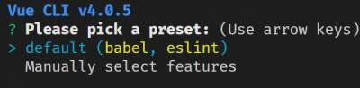
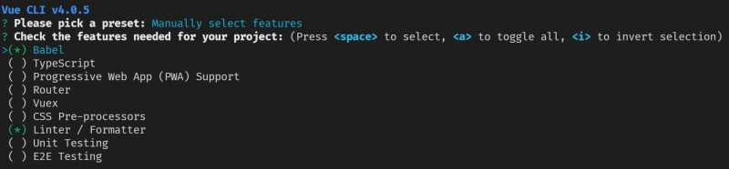
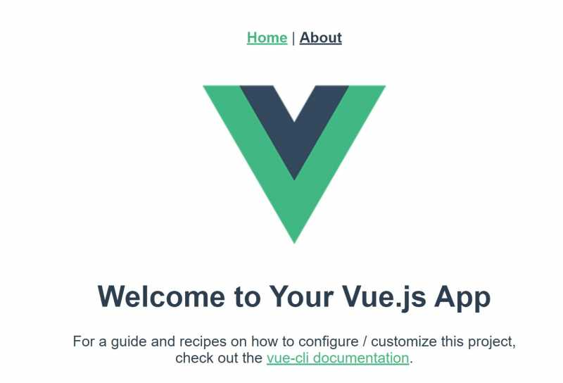
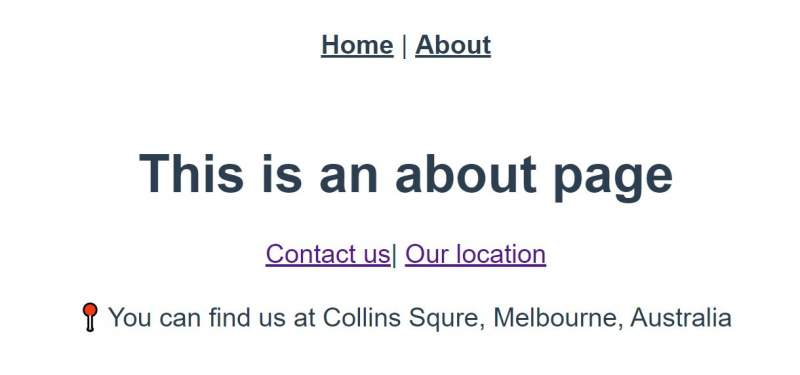

[Vue.js](https://vuejs.org/) is an approachable, versatile, performant, and progressive framework to build user interfaces with. I wrote a [comprehensive intro](https://yashints.dev/blog/2019/10/18/vue-intro) a week or so ago and promised to continue adding more each week. This week is about **Vue** router and how it helps deliver a better user experience.

<!--more-->

## Intro

When it comes to navigation between pages, we've gone through a really interesting journey. Not sure if you remember or not, every click on a link required a back and forth between client and server and that meant most times you'd lose your current state if you accidentally clicked on a link.

When people started using dynamic pages where only part of the page was loaded and not the whole page, user experience was much better and soon many websites had that by default. With this came the challenge of how to handle navigation on the browser side. Many approaches was used, but using the browser history API seems to be the winner.

**Vue** has its own Router which uses the same API and deeply integrates with the **Vue**'s core library to deliver a smooth experience for those developing Single Page Applications.

## Features

**Vue** Router has many great features, so let's review them:

* Nested route/view mapping
* Modular, component-based router configuration
* Route params, query, wildcards
* View transition effects powered by **Vue**'s transition system
* Fine-grained navigation control
* Links with automatic active CSS classes
* HTML5 history mode or hash mode, with auto-fallback in IE9
* Customizable Scroll Behaviour

We will go through each of these in details later.

## Getting cstarted

Creating an application which leverages **Vue** Router is very easy with [vue-cli](https://github.com/vuejs/vue-cli).

```bash
vue create vrouter
```

At this point you'll be asked to choose a preset, make sure to select the second option which says manually select features. You can press down arrow key and enter to move to the next screen.



Next you are asked to select which features you want to have for this project:



We'll choose `babel`, `TypeScript`, `Router`, `CSS Pre-processor`, and `Linter`.

The next question is asking whether you want to have class style components. I just press enter since it's not the focus of this article. Do the same for the next prompt too. Next question is asking you whether you want history mode for the router. Select yes, this will get rid of the `#` symbol at the end of URL and uses `history.pushState` to navigate without a page reload.

For the remaining questions select whatever you like 😉. Now type `cd vrouter && npm run serve`, you should be able to see the application compiling and once finished you can view the app at `http://localhost:8080/`.



Note that you have _Home_ and _About_ menu items at the top, click on _About_ and you'll be redirected to the about page.

## Default config

If you open the `index.ts` file in the `src/router` folder, you will see the default configuration:

```ts
import Vue from "vue";
import VueRouter from "vue-router";
import Home from "../views/Home.vue";

Vue.use(VueRouter);

const routes = [
  {
    path: "/",
    name: "home",
    component: Home
  },
  {
    path: "/about",
    name: "about",
    // route level code-splitting
    // this generates a separate chunk (about.[hash].js) for this route
    // which is lazy-loaded when the route is visited.
    component: () =>
      import(/* webpackChunkName: "about" */ "../views/About.vue")
  }
];

const router = new VueRouter({
  mode: "history",
  base: process.env.BASE_URL,
  routes
});

export default router;
```

It's very straight forward, but I want you to pay attention to two things here. First look at the way the about component is loaded. This is how **Vue** lazy loads the child routes. Second, check how the mode is set to `history` in the `VueRouter` constructor options. This is what you chose during setup.

## Nested routes

Real life applications often have nested structure, such as all students having a profile. If you imagine a route like `/student/1/profile` and `/student/2/profile`, the profile is a nested route of the student route.

OK, now let's add a nested route to our app. We want to add two nested routes to our about page. Assume we would have a contact page form and a find us page which will contains our address.

In order to do this, we need to:
* Add a `router-view` tag inside our about page
* Include the links which navigate to sub routes using `router-link`

```html
<template>
  <div class="about">
    <h1>This is an about page</h1>    
    <div>
      <router-link to="/about/contact">Contact us</router-link>|
      <router-link to="/about/location">Our location</router-link>
    </div>
    <br/>
    <router-view></router-view>
  </div>
</template>
```

Note that we have nested routes here such as `/about/contact`. Then let's add two components inside `src/components` folder, `ContactForm.vue` and `FindUs.vue`:

```html
<!--ContactForm.vue-->
<template>
    <div>
        <form>
            <label>Name</label>
            <input type="text" name="name">

            <label>Last name</label>
            <input type="text" name="lastname">
        </form>
    </div>
</template>
```

And:

```html
<!--FindUs.vue-->
<template>
    <div>
       📍 You can find us at Collins Squre, Melbourne, Australia
    </div>
</template>
```

At the end we need to let the router know that the about page has nested routes. This can be done using the children property of the about route. At this point feels like you're writing Angular right 😉?

```ts
//...
import Contact from "../components/ContactForm.vue";
import Location from "../components/Location.vue";
//...
const routes = [
  {
    path: "/",
    name: "home",
    component: Home
  },
  {
    path: "/about",
    name: "about",
    component: About,
    children: [
      {
        // UserProfile will be rendered inside User's <router-view>
        // when /user/:id/profile is matched
        path: "contact",
        component: Contact
      },
      {
        // UserPosts will be rendered inside User's <router-view>
        // when /user/:id/posts is matched
        path: "location",
        component: Location
      }
    ]
  }
];
```

I've removed the extra code for brevity.

And that's all you need to get your nested routes working. If you run the app now, you should see two links in the about page which then load the content below to one of those child components.



## Dynamic routes

Often you have to map the same route with a different patterns to the same components. This can be a user profile page where you have the user id as variable such as `/user/1`.

This is also very easy to achieve, all you need is to change your route path from static `'/user'` to dynamic `'/user/:id'`. 

```ts
//...
routes: [
  { path: '/user/:id', component: User }
]
```

You can access the id parameter via route params like `$route.params.id`. This can be used to fetch the user profile for example and show it in the page.

## Not found

Most often you will need a fall back route to show a user friendly page not found page. This is again similar to what you had in Angular:

```ts
{
  // will match everything
  path: '*',
  component: PageNotFound
}
```

> 💡 Remember to put this at the end of all routes, otherwise anything below this will not work!

## Navigation by code

If you want to navigate within your code, you can use the push method of router which has the below syntax:

```ts
router.push(location, onComplete?, onAbort?)
```

And because you have access to router via `this.$router`, you can simply use it like so:

```ts
this.$router.push('about');

this.$router.push({ name: 'home' });

this.$router.push({ name: 'user', params: { userId: '123' } });
```

For now ignore the ones getting an object, I will explain that in a buzz.

## Named routes

You can assign a name to your route, if you do this you can pass an object to `router-link`:

```ts
// router/index.ts
{
  path: '/student/:id',
  name: 'student',
  component: Student
}
```

And:

```html
<router-link :to="{ name: 'student', params: { id: 123 }}">Student</router-link>
```

Note that `:to` is shorthand for `v-bind:to`, and you need this since you're passing an object instead of string.

And programmatically:

```ts
this.$router.push({ name: 'student', params: { id: '123' } })
```

## Redirects

If you want a particular route to be redirected elsewhere, simply add a redirect property to your route:

```ts
const router = new VueRouter({
  routes: [
    { path: '/userList', redirect: '/users' }
  ]
})

// or for a named route

const router = new VueRouter({
  routes: [
    { path: '/userList', redirect: { name: 'users' }}
  ]
})
```

## Passing props

Coupling your component to `$router.params` is not a good idea. Instead of that you can set the props flag to true and you'll have route params passed down to your component as props:

⛔ Don't do this:

```ts
const User = {
  template: '<div>User {{ $route.params.id }}</div>'
}
const router = new VueRouter({
  routes: [
    { path: '/user/:id', component: User }
  ]
})
```

✅ Instead do:

```ts
const User = {
  props: ['id'],
  template: '<div>User {{ id }}</div>'
}
const router = new VueRouter({
  routes: [
    { path: '/user/:id', component: User, props: true }
  ]
})
```

If you have an object as props, then use the object as-is instead of setting it to `true`:

```ts
const router = new VueRouter({
  routes: [
    { path: '/shop', component: Shop, props: { items: [{ id: 1, name: 'Fancy pants' }] } }
  ]
})
```

You can use a function as well:

```ts
const router = new VueRouter({
  routes: [
    { path: '/search', component: SearchUser, props: (route) => ({ query: route.query.q }) }
  ]
})
```

In this case `/search?q=yas` will be passed as `{ query: 'yas' }` to your component props.

## Securing your app using guards

When you have an application which requires your users to login before performing certain operations, you would like to protect those pages from being seen by unauthenticated users. In this case you could use the `beforeRouteUpdate` lifecylce in your component:

```ts
const SecuredComponent = {
  template: `...`,
  beforeRouteEnter (to, from, next) {
    // check for logged in user
  },
  beforeRouteUpdate (to, from, next) {
    // check for logged in user
  },
  beforeRouteLeave (to, from, next) {
    // do something here
  }
}
```

The difference between `beforeRouteEnter` and `beforeRouteUpdate` is that you don't have access to `this` in the former since the component is not initialised yet.

In terms of `beforeRouteUpdate`, if you have dynamic route or nested routes, the same component instance will be used when the route is updated.

And `beforeRouteLeave` is good if you want to clean up something or clear user sessions and cookies. You still have access to `this` in this method.

Apart from lifecycle methods, you can use a global route guard by using `router.beforeEach`:

```ts
const router = new VueRouter({ ... })

router.beforeEach((to: Route, from: Route, next: Function) => {
  // implement your logic here
})
```

Just note that this will be called for all routes regardless of whether they're public or not. You can have multiple guards and they will be called in order. As for parameters to these:

* `to`: is the target route.
* `from`: is the origin route.
* `next`: is a function which should be called to resolve the hook which keeps the navigation in pending state. If you forget to call this function, your route never resoles although your user is authenticated.

For the `next` function you can have no parameters which means go to next hook, or pass false to it like `next(false)` which means abort the current operation. If you want to direct the user to a completely different route, you can add the route as parameter like `next('/')` or `next({ path: '/' })`.

## Meta fields

You can add meta fields to your route. If you're wondering why you need meta fields, they're good for a couple of reasons, but the most obvious one is to tag secure routes to be able to protect then by your global guards:

```ts
const router = new VueRoute({
  routes: [
    {
      path: 'profile',
      component: Profile,
      // a meta field
      meta: { requiresAuth: true }
    }
  ]
})
```

And in your guard:

```ts
router.beforeEach((to, from, next) => {
  if (to.matched.some(record => record.meta.requiresAuth)) {
    // this route requires auth, check if logged in
    // if not, redirect to login page.
    if (!auth.loggedIn()) {
      next({
        path: '/login',
        query: { redirect: to.fullPath }
      })
    } else {
      next()
    }
  } else {
    next() // make sure to always call next()!
  }
})
```

## Named views

Sometimes you might want to load multiple views in the same page, such as a navbar, a sidebar, main section, etc. In this case you can use `router-view` to load multiple views instead of nesting them:

```html
<router-view class="view sidebar"></router-view>
<router-view class="view main" name="m"></router-view>
<router-view class="view article" name="a"></router-view>
```

And in your router:

```ts
const router = new VueRouter({
  routes: [
    {
      path: '/',
      components: {
        default: Sidebar,
        a: Article,
        m: Main
      }
    }
  ]
})
```

Note that we used compoentn(s) instead of component, which is critical in order to load multiple components.

## Summary

There are so much more you could learn around **Vue** router, and I highly suggest you check [their official documentation](https://router.vuejs.org/) if you're keen to learn more.

I will be doing more articles around **Vue.js** as I explore different areas, so watch this space. Next articles would be state management and form handling which are necessary in most enterprise applications.

Hope you've enjoyed the read, and if so please spread the word.