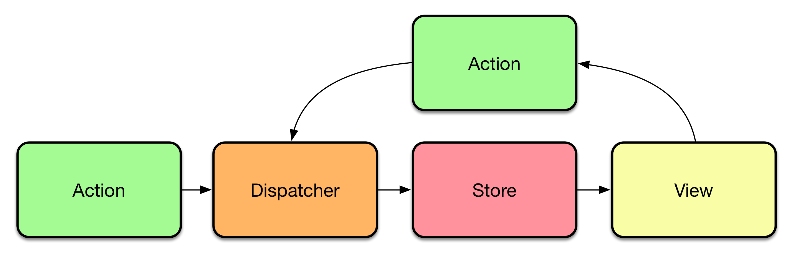

[Vue.js](https://vuejs.org/) is an approachable, versatile, performant, and progressive framework to build user interfaces with. I've written three separate articles on it so far:

* [A comprehensive intro to Vue.js](https://yashints.dev/blog/2019/10/18/vue-intro)
* [Deliver a better user experience using Vue Router](https://yashints.dev/blog/2019/10/30/vue-router)
* [Form handling in Vue.js](https://yashints.dev/blog/2019/11/10/vue-form-handling)

We will be looking at state management in **Vue.js** this time which is the centre of communication in large applications.

<!--more-->

## Why do we need state management

When dealing with large applications, we definitely have to pass information between components. Shopping card needs to know whether the user is logged in or not, the search needs to get updated based on changes to filter data, and many more scenarios.

The usual ways of passing data such as props only gets us just that far. Things get complex when we want to pass the data in multiple layers of component hierarchy. Or even when we want to pass data into components outside of those hierarchies.

At the end of the day, it's important to have a single source of truth and that's what **Vue** is offering to solve using [vuex](https://github.com/vuejs/vuex). But consider using a state management library if:

* Multiple views may depend on the same piece of state.
* Actions from different views may need to mutate the same piece of state.

## Vuex

[vuex](https://github.com/vuejs/vuex) is an Elm-inspired state management library. It integrates really well into [vue-devtools](https://github.com/vuejs/vue-devtools), providing zero-setup access to [time travel debugging](https://raw.githubusercontent.com/vuejs/vue-devtools/master/media/demo.gif).

**Vuex** is based on [Flux](https://facebook.github.io/flux/docs/in-depth-overview.html) (a state management design pattern introduced by Facebook). The TLDR version looks like:



## Installation

If you haven't used **Vue** CLI to create your project, there are three steps you need to take:

Install the library:

```bash
npm install vuex --save
```

Import and wire it up:

```js
import Vue from 'vue'
import Vuex from 'vuex'

Vue.use(Vuex)
```

And last, because **Vuex** requires [Promise](https://developer.mozilla.org/en-US/docs/Web/JavaScript/Guide/Using_promises) you should include a package like [`es6-promise`](https://github.com/stefanpenner/es6-promise) and import it before using **Vuex**:

```bash
npm install es6-promise --save
```

And:

```js
import 'es6-promise/auto'
```

[[info]]
| 💡 This library will automatically use a polyfill if the browser doesn't support ES6's `Promise`.

## Getting started

In its simplest form, you can use a centralised store as such:

```js
const store = new Vuex.Store({
  state: {
    count: 0
  },
  mutations: {
    increment (state) {
      state.count++;
    }
  }
})
```

Now, you can access the state object as `store.state`, and trigger a state change with the `store.commit` function:

```js
console.log(store.state.count) // -> 0

store.commit('increment')

console.log(store.state.count) // -> 1
```

## Vuex state

This library uses a single state tree which ensures that the source of truth is always the state. However, this doesn't have any conflicts with the modularity. We will have a look at the `sub-modules` later.

**Vuex**'s state consist of four objects, `state`, `mutations`, `actions`, and `getters`. So lets see what each of these are. But first, let's see how we can use the store in our components. We use our previous students example from here on.

## Including store in your components

**Vuex** provides a mechanism to _inject_ the store into all child components from the root component with the store option which happens when you use `Vue.use(Vuex)`:

```js
import Vue from 'vue'
import Vuex from 'vuex'

Vue.use(Vuex)

const store = new Vuex.Store({
  state: {
    students: [
      {
        name: 'Yas',
        age: 25
      }
    ]
  }
})

const app = new Vue({
  el: '#app',  
  store
})
```

This will allow you to access state using `this.$store` in any child component.

```js
const Students = {
  template: `
    <ul>
      <li v-for="student in students">{{ student.name }}</li>
    </ul>`,
  computed: {
    students () {
      return this.$store.state.students
    }
  }
}
```

Note how I accessed the student in a computed property. This will ensure that we rerender the page whenever store changes.

### How to use multiple properties from state

If you have to use multiple properties from store, **Vuex** offers the `mapState` helper method. Using this method you have the ability to map multiple properties from state to your computed properties:

```js
import { mapState } from 'vuex';

export default {
  name: "Students",
  computed: mapState({
    students: state => state.students,
    teachers: state => state.teachers
  })
};
```

As you can see, you can use an arrow function to retrieve the state and access it's properties. You can also define aliases to keep your code cleaner and avoid repeating `state.property` everywhere you want to use it.

If the local and store property names matches, you can skip the arrow function and just pass an array of property names you want to have:

```js
import { mapState } from 'vuex';

export default {
  name: "Students",
  computed: mapState([
    'students',
    'teachers'
  ])
};
```

If you have some local computed properties, you could use the spear operator to mix them with `mapState`:

```js
import { mapState } from 'vuex'

export default {
  // ...
  computed: {
    myLocalProp() {
      return {
        name: 'Yas'
      }
    },

    ...mapState({    
      numOfStudents: state => state.students.length,
      students: state => state.students
    })
  }
}
```

### Getters

Sometimes you need to have derived properties based on store's state. For example if you want to know how many students are older than 25. You can implement this in your component like so:

```html
<template>
  <div>Total number of students aged 25 or older is {{numOfStudents}}</div>
</template>
<script>
import { mapState } from 'vuex'

export default {
  // ...
  computed: mapState({    
    numOfStudents: state => state.students
      .filter(s => s.age > 24).length;
  })
}
</script>
```

But this means that if another component wants to have this logic, they need to duplicate the code. A better approach to these sorts of derived state is to use getters.

```js
const store = new Vuex.Store({
  state: {
    students: [
      { id: 1, name: 'Yas', age: 26 }
    ]
  },
  getters: {
    numOf25OrOlderStudents: state => {
      return state.students
        .filter(s => s.age > 24).length;
    }
  }
})
```

These sort of properties appear under `store.getters`:

```js
computed: {
  numOf25OrOlderStudents () {
    return this.$store.getters.numOf25OrOlderStudents
  }
}
```

Similar to `mapState`, you have `mapGetter` so you can get these properties easier:

```js
computed: {
  
  ...mapGetters([
    'numOf25OrOlderStudents',
  ])
}
```

### Mutations

A mutation is the only way you can change the state in **Vuex**. These mutations are basically events which have two properties:

* A string type
* A handler

You'll perform the modifications inside the handler and it will receive the state as it's first argument:

```js
const store = new Vuex.Store({
  state: {
    students: [
      { id: 1, name: 'Yas', age: 26 }
    ]
  },
  mutations: {
    addStudent (state, student) {
      // mutate state
      state.students.push(student)
    }
  }
})
```

> 💡 You can't call a mutation handler directly, instead, you will need to call `store.commit` method.

```js
const student = { id: 2, name: 'Alex', age: 23 }

store.commit('addStudent', student)
```

Like [React Redux](https://react-redux.js.org/using-react-redux/connect-mapdispatch)'s actions, it's best to use constants for these mutation types:

```js
// mutation-types.js
export const ADD_STUDENT_MUTATION = 'ADD_STUDENT'
```

```js
// store.js
import Vuex from 'vuex'
import { ADD_STUDENT_MUTATION } from './mutation-types'

const store = new Vuex.Store({
  state: { ... },
  mutations: {
    [ADD_STUDENT_MUTATION] (state, student) {
      state.students.push(student)
    }
  }
})
```

The mutations should be synchronous. This is an important rule which you should adhere to so that **Vuex** can capture before and after mutation states. We will see how to have async state mutations using actions.

### Actions

Actions are very similar to mutations, but there are two differences between the two. The first one is that instead of mutating the state themselves, they will commit mutations. And the second one is that actions can have asynchronous operations.

```js
const store = new Vuex.Store({
  state: {
    students: [
      { id: 1, name: 'Yas', age: 26 }
    ]
  },
  mutations: {
    addStudent (state, student) {
      // mutate state
      state.students.push(student)
    }
  },
  actions: {
    addStudent (context, id) {
      const student = await apiService.get(id)

      context.commit('addStudent', student)
    }
  }
})
```

The first thing to note here is that actions won't receive the store object, they will get a context object which exposes the same properties. We will see why when we review the modules. And the second one is that there is an asynchronous operation happening here.

You can use [ES6 Object Destructuring](https://github.com/lukehoban/es6features#destructuring) to get only commit passed down to the action. This is useful if you have multiple commits in your actions because it will keep the code way less.

```js
actions: {
    async addStudent ({ commit }, id) {
      const student = await apiService.get(id)

      commit('addStudent', student)
    }
  }
```

You can trigger an actions using `store.dispatch` method.

```js
store.dispatch('addStudents', 2)
```

Again, similar to `mapState` you have `mapActions` to be able to dispatch an action in your components instead of using `this.$store.dispatch` method which is way much cleaner. The difference is, you will call this in your method objects:

```js
import { mapActions } from 'vuex'

export default {
  // ...
  methods: {
    ...mapActions([
      'addStudent', // map `this.addStudent()` to `this.$store.dispatch('addStudent')`

      // `mapActions` also supports payloads:
      'addStudent' // map `this.addStudent(id)` to `this.$store.dispatch('addStudent', id)`
    ]),
    ...mapActions({
      add: 'addStudent' // map `this.add()` to `this.$store.dispatch('addStudent')`
    })
  }
}
```

### Modules

As we've seen so far, the state can easily get super big as the project grows. This can lead to multiple issues, but we can use modules to break this single state into multiple modules which have their own `state`, `getters`, `mutations`, `actions`, and guess what, sub modules 😍.

```js
const studentStore = {
  state: { ... },
  mutations: { ... },
  actions: { ... },
  getters: { ... }
}

const teachersStore = {
  state: { ... },
  mutations: { ... },
  actions: { ... }
}

const store = new Vuex.Store({
  modules: {
    a: studentStore,
    b: teachersStore
  }
})

store.state.studentStore // -> `studentStore`'s state
store.state.teachersStore // -> `teachersStore`'s state
```

Inside the `state` and `getters`, the module's state is passed down.

```js
const studentStore = {
  state: { students: [] },
  mutations: {
    addStudent (state, student) {
      // `state` is the local module state
      state.students.push(student)
    }
  },

  getters: {
    count (state) {
      return state.students.length
    }
  }
}
```

However, inside the actions, you can access the global store from `context` via `context.rootStore`:

```js
const moduleA = {
  // ...
  actions: {
    async addStudentIfRegistrationOpen ({ commit, rootState }, id) {
      if (rootState.registrationOpen) {
        const student = await apiService.get(id)

        commit('addStudent', student)
      }
    }
  }
}
```

> 💡 By default the `getters`, `mutations`, and `actions` are registered on the global namespace. This will allow multiple modules to react to same mutation or action if they want to. You can use the `namespaced: true` flag on the module to make it self contained.

You can find out more about the modules in the [official documentation](https://vuex.vuejs.org/guide/modules.html).

## Summary

Alrighty, you now know enough about state management in **Vue** using **Vuex** to start using it. But beware that there are many other little tips and tricks where I thought would fall outside of a single article which you should look into. For now enjoy playing with this amazing library and get your hands wet.

PS: if you want a head start, use [this GitHub repository](https://github.com/utahta/vue-vuex-typescript-sandbox) and create a code sandbox out of it. It contains basic setup and modules as well.