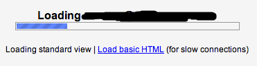
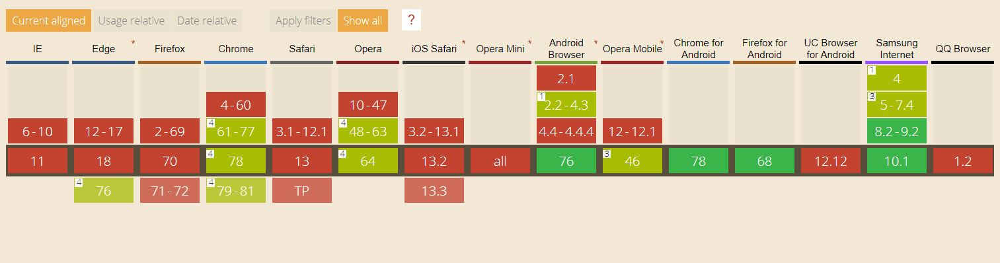

This year has been full of articles around how the web is bloated with static assets and how this has impacted users to face a poor user experience when using not so good networks around the world. There are resources like [web.dev](https://web.dev/) who are actively publishing content on how to make a better future for the web.

<!--more-->

## Background

I've also published a few 😁 on how to improve web performance which you should totally check them out 👇🏼:

* [HTML and CSS](https://yashints.dev/blog/2018/09/29/web-perf-1)
* [Preload/Prefetch to boost load time](https://yashints.dev/blog/2018/10/06/web-perf-2)
* [JavaScript performance improvements](https://yashints.dev/blog/2018/10/12/web-perf-3)
* [Image optimisations](https://yashints.dev/blog/2018/11/12/web-perf-4)
* [Web font optimisations](https://yashints.dev/blog/2018/11/23/web-perf-5)

And other [tips and tricks like how to use the `OffscreenCanvas` to render your graphics off the main thread](https://yashints.dev/blog/2019/05/11/offscreen-canvas).

This article is around the same topic, but we're gonna see how to inspect and react to connection aspects of a visiting user to deliver a better experience to them.

There are some implementations of this in the wild such as BBC News showing a warning to users about being charged by operators if they're on a cellular network:


Or GMail showing a 'load basic HTML (for slow connections)' message:



## Network Information API

So far we have tried to improve the user experience by following one of the aforementioned techniques for everybody regardless of what network they are using. But what if we had a mean to inspect and detect their network connection properties and speed change while they're browsing our applications.

That's when the [Network Information API](https://developer.mozilla.org/en-US/docs/Web/API/Network_Information_API) comes into play. This API provides information about the connection such as type (i.e. WiFi or Cellular, you could see the full list 👇🏼):

```ts
enum ConnectionType {
  "bluetooth",
  "cellular",
  "ethernet",
  "mixed",
  "none",
  "other",
  "unknown",
  "wifi",
  "wimax"
};
```

Here is how to access this information:

```js
let connection = navigator.connection || navigator.mozConnection || navigator.webkitConnection;
```

Here is how the object you'll get looks like:


## NetworkInformation object

So let's see what are these properties one by one:

### `effectiveType`

This property is showing the effective connection type. This is a bit different to the connection type we mentioned earlier. It changes based on a combination of recently observed `ttl` and `downlink`.

The possible values for `effectiveType` is an enum with these values:

```ts
enum EffectiveConnectionType {
  "2g",
  "3g",
  "4g",
  "slow-2g"
};
```

In reality if this property has `slow-2g` it means you should avoid sending images, videos, etc. It's suitable for sending text only content. If the value is `2g` it indicates that you could potentially send small low res images to user.

`3g` means you can send larger assets such as high res images, SD videos, and audio. At last `4g` means the network is suited for HD video, streaming and other data heavy resources.

### `downlink`

This shows the download speed of the connection. The unit uses is megabits per second.

### `onchange`

This property allows you to set an event handler for the `change` event on `NetworkInformation` object.

### `rtt`

This attribute represents the round trip time estimate in milliseconds nearest to 25 milliseconds and is based on application layer RTT measurements.

### `saveData`

This property when getting returns `true` if the user has requested to reduce data usage mode from the user agent. Otherwise it returns `false`.

If you are wondering what happened to `type` property, it is not currently supported by the browsers and no one knows if that will be because the spec is in a draft mode and might get changed. You can find more information on the browser support page at the end of this article.

## Use cases

### Prevent from preloading videos

Now that we know what to expect from this API, lets see what we can do with it. Imagine we're preloading videos in our page. We can hook up to the `change` event and stop preloading if the user is on a slower network:

```js
let preloadVideo = true;
const slowConnections = ['2g', '2g-slow'];
var connection = navigator.connection || navigator.mozConnection || navigator.webkitConnection;
let type = connection.effectiveType;

function updateVideoPreloadingStrategy() {
  console.log("Connection type changed from " + type + " to " + connection.effectiveType);
  type = connection.effectiveType;

  if (slowConnections.containes(type)) {
    preloadVideo = false;
  }
}

connection.addEventListener('change', updateVideoPreloadingStrategy);
```

### Load low res images

You could potentially set a class to your elements and based on that load a different image:

```js
function updateImageLoadingStrategy() {
  console.log("Connection type changed from " + type + " to " + connection.effectiveType);
  type = connection.effectiveType;

  const myEl = document.querySelector('#id');

  if (slowConnections.containes(type)) {
    myEl.classList.add("low-res");
  } else {
    myEl.classList.remove("low-res");
  }
}
```

And:

```css
#id {
  background: url(high-res.jpg) 0 0 no-repeat;
}

#id.low-res {
  background: url(low-res.jpg) 0 0 no-repeat;
}
```

## Summary

We saw how useful can **Network Information API** be in most of our use cases where we want to address performance issue or even deliver a better user experience. Some other applicable use cases are:

* Not load high res images
* Prevent loading web fonts
* HTTP calls are changed to fetch less data using summary instead of full page load
* Timeout values for HTTP calls are increased
* Showing warning and other informative messages to users to let them know they might get charged

> 💡 This API is in a **draft** state and might change in the future. But it doesn't hurt to be proactive and update the implementation later rather than waiting for the full spec.

You can find more about this on [the specification](https://wicg.github.io/netinfo/).

## Browser support

So Network Information API is good and everything, but how about the browser support. Currently it is supported in Chrome and MS Edge only.

You can see [the full list here](https://caniuse.com/#feat=netinfo).



Now go have fun with this API and save your users some money 😁.