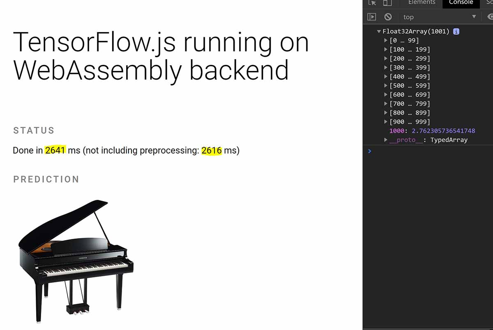
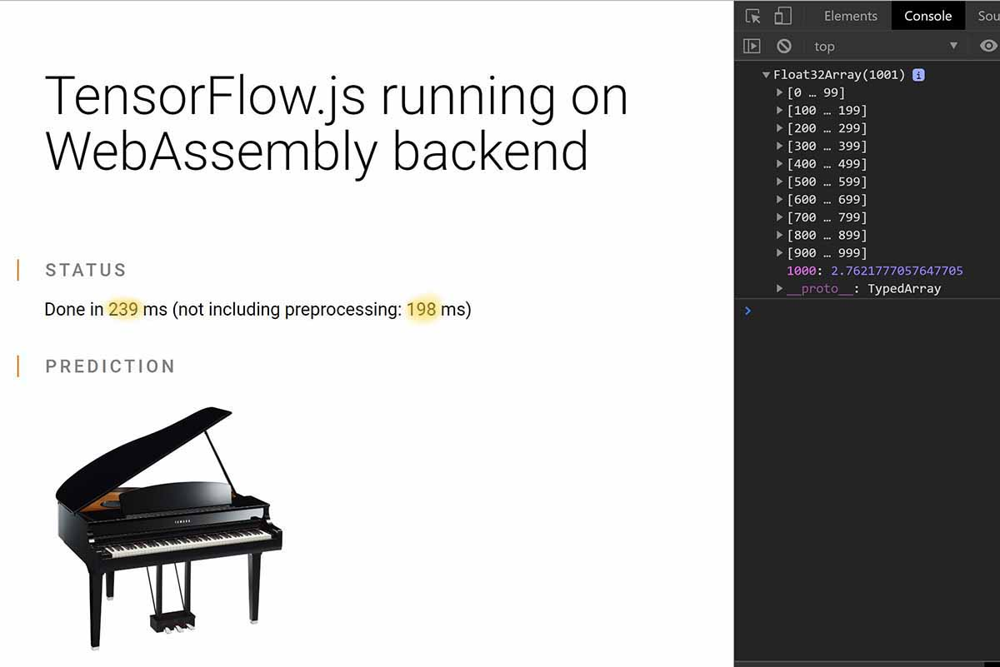

 
[Tensorflow.js](https://www.tensorflow.org/js/) is a library which lets you perform machine learning in the browser or in Node. It uses the GPU or CPU to do training and calculation, but recently the team have done a great job and brought WebAssembly backend to its ecosystem so that you can perform predictions faster. So without further ado, let's deep dive into this greatness.

<!--more-->

## Scenario

Let's assume you want to perform object detection in a given image. For this you can use multiple models, but for now let's focus on [MobileNet](https://github.com/tensorflow/tfjs-examples/tree/master/mobilenet).

We will use parcel to setup our app. 

## Setup without WASM backend

### Packages

We will need to have a `package.json` file with below setup:

```json
{
  "name": "wasm-parcel",
  "version": "1.0.0",
  "description": "Sample parcel app that uses the WASM backend",
  "scripts": {
    "watch": "parcel index.html --open",
    "build": "parcel build index.html"
  },
  "dependencies": {
    "@tensorflow/tfjs": "^1.4.0",
    "@tensorflow/tfjs-backend-wasm": "1.4.0-alpha3"
  },
  "browserslist": [
    "defaults"
  ],
  "devDependencies": {
    "@babel/core": "7.7.5",
    "@babel/plugin-transform-runtime": "^7.7.6",
    "@babel/preset-env": "^7.7.6",
    "parcel-bundler": "^1.12.4",
    "parcel-plugin-static-files-copy": "^2.2.1"
  },
  "keywords": []
}
```

### HTML

Let's setup our app like we do normally with **Tensorflow.js**. We need to add a `div` to show the status, and another `div` which contains an image tag:

```html
<div class="tfjs-example-container">
  <section class="title-area">
    <h1>TensorFlow.js running on WebAssembly backend</h1>
  </section>

  <section>
    <p class="section-head">Status</p>
    <div id="status"></div>
  </section>

  <section>
    <p class="section-head">Image used</p>

    
  </section>
</div>
```

And let's our JavaScript file before body close tag:

```html
<script src="index.js"></script>
```

Altogether your HTML should look something like this:

```html
<!DOCTYPE html>
<html lang="en">
  <head>
    <title>Hello!</title>
    <meta charset="utf-8" />
    <meta http-equiv="X-UA-Compatible" content="IE=edge" />
    <meta name="viewport" content="width=device-width, initial-scale=1" />
    <link rel="stylesheet" href="style.css" />
  </head>
  <body>
    <div class="tfjs-example-container">
      <section class="title-area">
        <h1>TensorFlow.js running on WebAssembly backend</h1>
      </section>
  
      <section>
        <p class="section-head">Status</p>
        <div id="status"></div>
      </section>
  
      <section>
        <p class="section-head">Image used</p>
  
        
      </section>
  
      <script src="index.js"></script>
    </div>
  </body>
</html>
```

### CSS

Let's add some basic styling so that it's not an ugly app when we run it. We're doing some cool stuff here and it deserves good look 😉:

```css
/* CSS files add styling rules to your content */

body {
  font-family: helvetica, arial, sans-serif;
  margin: 2em;
}

p {
  max-width: 960px;
  line-height: 1.6em;
}

p.section-head {
  font-variant: small-caps;
  text-transform: uppercase;
  letter-spacing: 0.17em;
  line-height: 1.2em;
  font-weight: 500;
  margin-top: 2em;
  margin-bottom: 1em;
  border-left: 2px solid #ef6c00;
  padding-left: 24px;
  margin-left: -24px;
  color: #818181;
}

```

### JavaScript

In the code we need to perform two main operations, load the model, and use it for prediction. So lets load the model first:

```js
import * as tf from "@tensorflow/tfjs";

let model = await tf.loadGraphModel(
  "https://tfhub.dev/google/imagenet/mobilenet_v2_100_224/classification/2",
  { fromTFHub: true }
);
```

And we get a reference to the image tag, use `browser.fromPixel` method of **Tensorflow.js** to load the image and normalise it. And at last, feed it into predict method of our model:

```js
const imgElement = document.getElementById("img");

let img = tf.browser
    .fromPixels(imgElement)
    .resizeBilinear([224, 224])
    .expandDims(0)
    .toFloat();

const prediction = model.predict(img);
```

Since we want to compare the timing between the two approach, let's add some timers into our method and measure how long the operation would take. Altogether your JavaScript file should look like this:

```js
import * as tf from "@tensorflow/tfjs";

function status(text) {
  document.getElementById("status").textContent = text;
}

async function main() {
  
  let model = await tf.loadGraphModel(
    "https://tfhub.dev/google/imagenet/mobilenet_v2_100_224/classification/2",
    { fromTFHub: true }
  );

  const startTime1 = performance.now();  

  const imgElement = document.getElementById("img");
  status("Model loaded!");

  let img = tf.browser
    .fromPixels(imgElement)
    .resizeBilinear([224, 224])
    .expandDims(0)
    .toFloat();
  
  let startTime2 = performance.now();
  
  const logits = model.predict(img);

  const totalTime1 = performance.now() - startTime1;
  const totalTime2 = performance.now() - startTime2;
  status(`Done in ${Math.floor(totalTime1)} ms ` +
      `(not including preprocessing: ${Math.floor(totalTime2)} ms)`);

  const values = await logits.data();
  console.log(values);  
}

document.addEventListener("DOMContentLoaded", main);
```

### .babelrc

If you don't setup the babel plugins properly, you will get an error like below:

[[error]]
| ❌ Uncaught ReferenceError: regeneratorRuntime is not defined at HTMLDocument.main (index.js:8)

That's because we're using an `async` function on the top level. Add the below config to your `.babelrc` file to get around the error.

```json
{
  "presets": ["@babel/preset-env"],
  "plugins": ["@babel/plugin-transform-runtime"]
}
```

## Running the app

Now you can run `yarn` followed by `yarn watch` and a browser window opens with the app inside. You should see a page like this:



Note the time taken to predict what's in the picture. Now lets add the WebAssebly backend and run the app to see how it performs.

## With WASM backend

In order to add the WebAssembly backend you need to install the `@tensorflow/tfjs-backend-wasm` package:

```json
{
  ...,
  "dependencies": {
    "@tensorflow/tfjs": "^1.4.0",
    "@tensorflow/tfjs-backend-wasm": "1.4.0-alpha3"
  },
  ...
}
```

Next step is to let Parcel know how to load the WASM file. When the WASM backend is initialized, there will be a `fetch` / `readFile` for a file named `tfjs-backend-wasm.wasm` relative to the main JS file. That's why we need to use this section if we're using a bundler.

```json
{
  ...,
  "staticFiles": {
    "staticPath": "./node_modules/@tensorflow/tfjs-backend-wasm/dist",
    "excludeGlob": [
      "**/!(*.wasm)"
    ]
  },
  ...
}
```

And the last thing we need to do is to tell **Tensorflow.js** to use this backend:

```js
import "@tensorflow/tfjs-backend-wasm";

async function main() {  
  await tf.setBackend("wasm");
  //...
}
```

And that's all you need in order to enable the WebAssembly backend. Now let's run the app and see the difference:

```bash
yarn && yarn watch
```

You should see the app compiled and a browser window open:



And boom 🤯, look at the difference there. Almost down by 2 seconds, and that's just doing a single operation. Imagine if we were doing more operations and the benefits we gain from this approach.

## Summary

You can find [the full demo on my GitHub repo](https://github.com/yashints/tjfs-wasm-demo).

This feature is defo one of the best thing that's happened since introducing **Tensorflow.js** to allow web developers get into ML and AI within the browser in my opinion. So go ahead use this feature and benefit from the massive performance improvements.

However, there is a catch 👇🏼:

## What's the catch

The catch is that not all functions are implemented in the WASM backend. It means you can't run many of the demo's on it unless the team implement them. You can [follow the progress on their GitHub repo](https://github.com/tensorflow/tfjs/tree/master/tfjs-backend-wasm) to stay on top of the game.