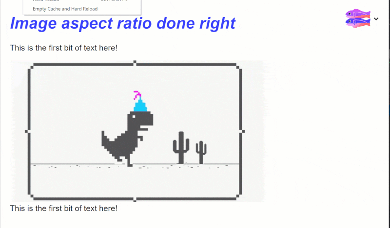
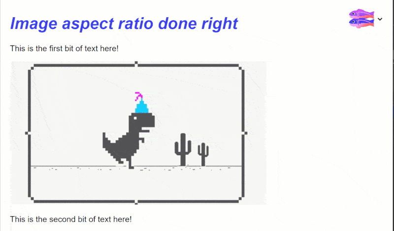

 
If you have an image on the page which is 600x200 pixels, what is the chance of it shown exactly with that size? I'd say not likely, because most of the time it's put inside a container which defined the width and the image is set to `width: %100`. But the size of the image is not that important at this point, what is important is that you will have a DOM reflow once the image is loaded.

<!--more-->

## Problem

Let's see this in action. I'll use Glitch to quickly whip up a demo. We need three `div`s, two of those contain a piece of text and the one in between contains an image.

```html
<head>
  <title>Image aspect ratio</title>
  <style>
    .image-container {
      width: 500px;
    }

    img {
      width: 100%;
    }
  </style>
</head>
<body>
  <h1>Image aspect ratio done right</h1>
    
  <div >
    <p>
      This is the first bit of text here!
    </p>        
  </div>
  
  <div class="image-container">
    
  </div>
  
  <div>
    <p>
      This is the second bit of text here!
    </p>  
  </div>
</body>
```

You can see the full page in [this Glitch app](https://glitch.com/~ruddy-gym).

If we load the site under a slow network now (on high speed network you can't see much of a difference), you will the page load like this:



First the two paragraphs appear close to each other, then when the network request is finished, the image fills its gap and there is a DOM reflow performed to push the second paragraph down. How sad is that 😥?

## Solution #1

The very first thing we can do is to simply set the image height to `auto`. This is a new feature which has landed in FireFox and Chrome. This will tell the browser to find out the metadata from image attributes, calculate the necessary height and reserve that space. So all we need to do is this:

```html
<style>
  img {
    width: 100%;
  }
</style>
```

And we we reload the page on the same network, you can see the page load like this:



How good is that 😍?

## Solution #2

There is a [new proposal in a draft state](https://drafts.csswg.org/css-sizing-4/#ratios) which is introducing a new CSS property called, well `aspect-ratio`. With this you can simply add the property to `img` tag and use the `width` and `height` attributes to tell the browser how much space should be reserved.

```css
img {
  aspect-ratio: attr(width) / attr(height);
}
```

This has the benefit of being super simple, readable, and supporting most of the images on the web because many people already have put `width` and `height` attributes on their images.

On the other hand, a junior developer who's starting with HTML and CSS doesn't have any trouble understanding what's happening and how little should be done to do something properly.

This has been implemented in Firefox, Chrome and Edge.

## Summary

Getting image aspect ratio is very important especially if it impacts your site's user experience. So knowing how to fix that issue is also important. Hope you've enjoyed this article and till next time 👋🏼.