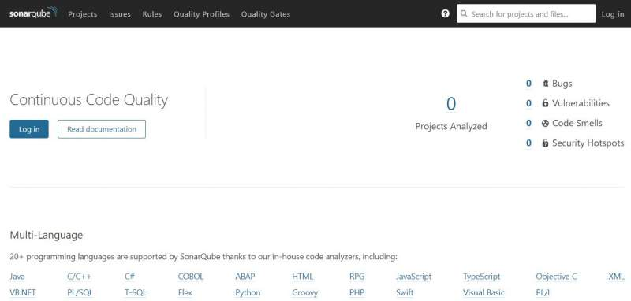
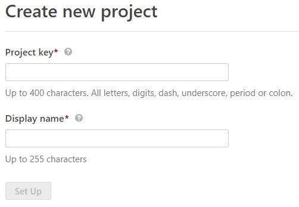
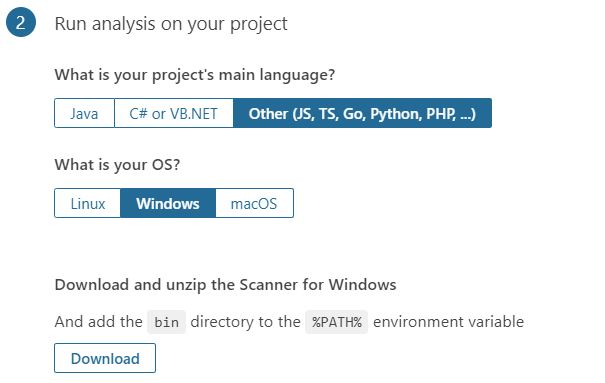
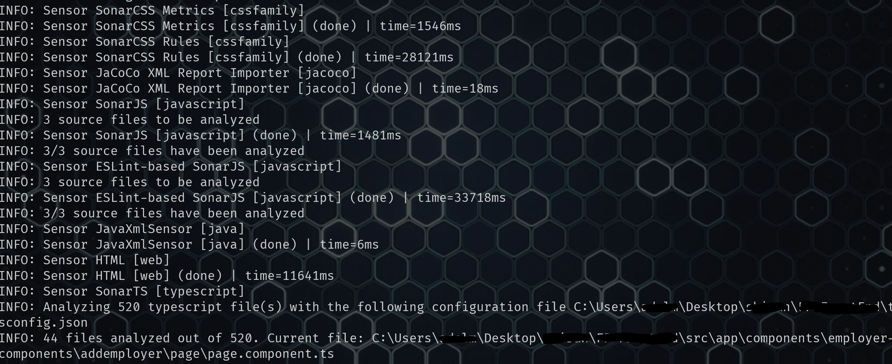
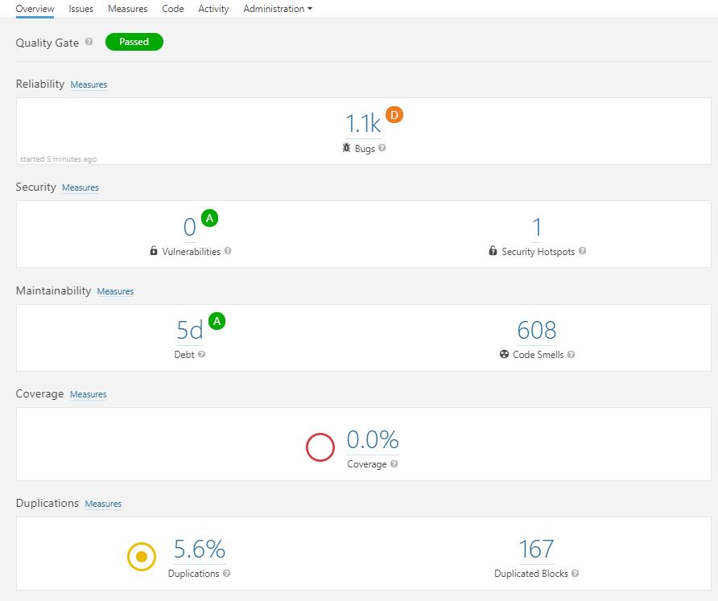
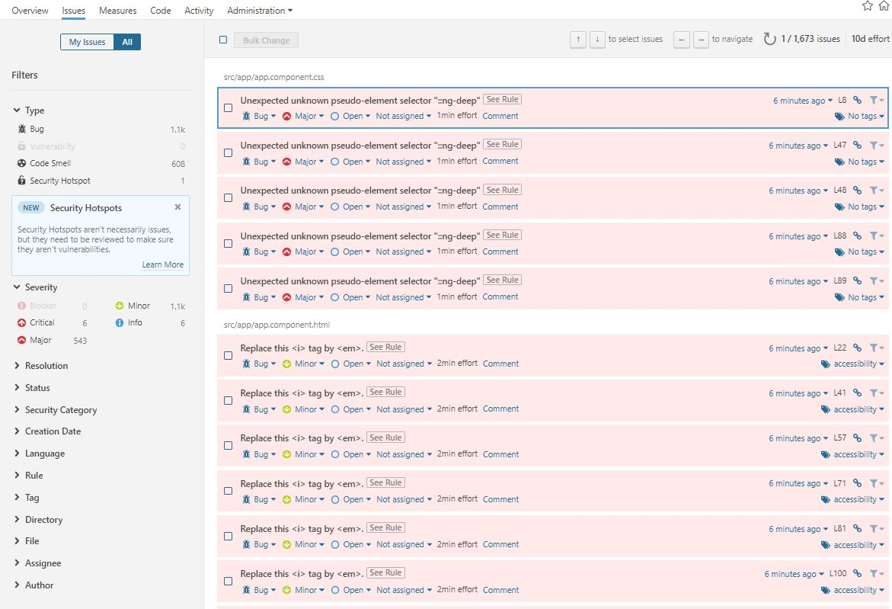

 
I help some of my friends perform code reviews on their code bases from time to time as a side activity. I've used [`codelyzer`](https://www.npmjs.com/package/codelyzer) before and it's very similar to `tslint` in a sense. However, I wanted to test something new and thought let's give [SonarQube](https://www.sonarqube.org/) a shot this time.

<!--more-->

## Intro

[SonarQube](https://www.sonarqube.org/)® is an automatic code review tool to detect bugs, vulnerabilities and code smells in your code. It can integrate with your existing workflow to enable continuous code inspection across your project branches and pull requests.

It has a server component where you can create projects and apply configurations like adding plugins and updating existing ones. And then there is a scanner component where it scans your code base and sends the result to the server to show in the _SonarQube_ dashboard.

There are multiple versions of _SonarQube_ but we're going to use the [community edition](https://www.sonarqube.org/community/) which is free and open source.

So without further ado, let's get to it.

## Setup

[The documentation](https://docs.sonarqube.org/) is really great, and there is a great [two minute get started](https://docs.sonarqube.org/latest/setup/overview/) which is what I used to get my hand wet real quick. However, soon I realised that I have to install a lot of dependencies to get it working.

I was thinking how to avoid the extra installations, when suddenly a smile came to my face when I saw there is a docker image as well.

On the [Docker Hub](https://hub.docker.com/_/sonarqube/), you can find the information you need to get started, but for the purpose of this article, I just use a single command to get it going.

```bash
docker run -d --name sonarqube -p 9000:9000 sonarqube
```

This command will pull the image down and create a container from it. Run the container in the background mode and then exposes the port 9000 through to host.

Once done, you need to wait for a few mistunes for the server to get started. You can open a browser of your choice and go to `localhost:9000` to see the server dashboard.

Use the default username as `admin` and the password `admin` to login.



## Create a project

I don't want to go deep into _SonarQube_ here, but a project represents a code base where you can see the result of a scan done by the scanner. So once logged in, click on create a new project button in the centre of the page, then enter a unique project key and a display name.

On the next page enter a name for your project token. This is the key which scanner will use to authenticate to the server and send the result of a scan up.



Take note of this key as you can never see it once you're navigated away from this page. Click continue and you'll see a screen where you can specify your project configuration.

I wanted to run this on an Angular project with TypeScript, so I chose other, and then windows from the OS prompt.



## Downloading the scanner

At this point you need to download the scanner and unzip it in a folder named `sonarqube` on your drive. I usually use `c:\tools` for these sort of usage (replace this with what you used if you chose to unzip it elsewhere).

Once done, open your scanner config file named `sonar-scanner.properties` from `c:\tools\sonarqube\config` folder and uncomment the line which specifies the server address.

```yaml
#Configure here general information about the environment, such as SonarQube server connection details for example
#No information about specific project should appear here

#----- Default SonarQube server
sonar.host.url=http://localhost:9000

#----- Default source code encoding
sonar.sourceEncoding=UTF-8
```

## Running a scan

Once done, you're ready to go. Run the command below from your project root and wait for the scan to finish.

```powershell
C:\tools\sonar\bin\sonar-scanner.bat -D"sonar.projectKey=fp" -D"sonar.sources=." -D"sonar.host.url=http://localhost:9000" -D"sonar.login=**********************************" -D"sonar.exclusions=node_modules/**/*"
```

Don't forget to replace the key you got from the previous step in the `sonar.login` argument.

> 💡 In the last step when you downloaded the scanner zip file, the command you need to execute is written down for you ready to go, just add the exclude folder to avoid code analysis on external libraries.

It takes a while for the scan to finish based on the size of your code base. But once done, you can see the result in the _SonarQube_ dashboard.

> ℹ️ Remember to run `npm install` or `yarn` if you've just forked the code base from your `git` repository. I faced a few errors before I realised I didn't have those installed and they are used by the scanner.



And once done, here is yow your dashboard will look like. Obviously the code base I was reviewing was a bit chaotic.



And you when you click on issues you can see them by category and also the rules used to perform the scan.



## Summary

In terms of the speed, I was very happy with the result. It took nearly 2 minutes to scan my entire code base with more than 520 files and thousands line of code.

In term of the scan result, I would say based on the default rule set and considering that this was the community edition, the results are slightly better than `tslint` or `codelyzer`. I could easily navigate through issues, find out what line of code needed attention. It showed me the results with syntax highlighting and a lo of categories and tags where I could drill down and find what I wanted quickly.

So go ahead and give it a shot, I am sure you'll find enough to keep you busy for a while to fix those. And bare in mind that it not only gives you linting errors, it will also give you some security hints based on [OWASP top 10](https://en.wikipedia.org/wiki/OWASP) as well.


