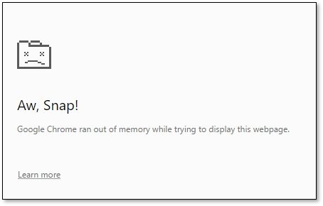
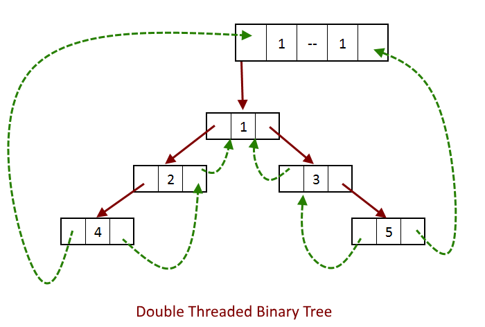
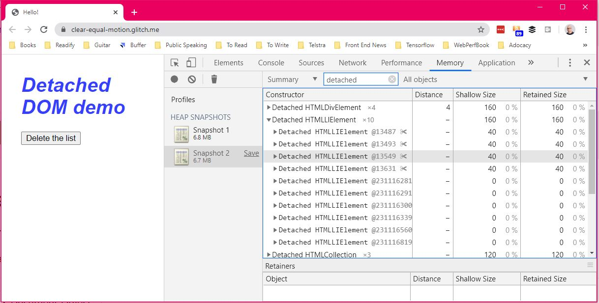

 
I've been writing web applications for more than a decade. From _classic ASP_ to _PHP_, _ASP.Net web forms_ and the list goes on and on. However, something that's been common between all those years for me has been to care about how performing the site is. One important part of that has been to look out for memory leaks, because they can cause the page to go super slow or even crashing in more serious scenarios. 

<!--more-->

## Intro

Memory leaks are a common problem in software development, regardless of whether the language you're using is memory managed or not. By that I mean languages which come with a garbage collector. Memory leaks happen when a piece of memory is allocated, but never freed by the application, and is not returned to the container app or the operating system.

I remember going through the concept in uni, but I can't remember anything apart from the fact that usually there is a tree made up of all the occupied memory locations. Every time the garbage collector is looking into the memory parses that tree, and if a node is not connected to any branch, it gets recollected and returned to the main program.

Most of us web developers are likely to use one of the major frameworks or libraries to write our applications. Some maybe using a bit older languages like PHP or Ruby, but no matter what we use, there will be a high chance that we come face to face with this problem one way or another.

## Consequences

So what happens when there is a memory leak in our applications 🤔?

In some cases the memory consumption just keeps going up. If the user is using a decent spec machine, they might not even realise it. Not everyone is obsessed like us developers checking their task manager often to see how much memory is consumed.

Regardless, it slows down the page, makes interactions not responsive, and might even cause the tab or the whole window to crash.



## Memory leak in JavaScript

It's way easy in JavaScript to allocate some memory and forget about it. Even if you're not writing plain JavaScript, it's still possible that a memory leak happen, without you noticing it.

### But how does it happen?

In JavaScript there are a few possible ways a memory leak can happen.

* Unintentionally creating global variables
* Timers and callbacks
* Out of DOM references
* Closures
* Event listeners

### Global variables

It's very simple to create an unwanted global variable in JavaScript. Consider below code:

```js
function helloWorld() {
  name = 'Yas';
  console.log(`Hello ${name}`);
}
```

In this simple function we have created a global variable called name. We didn't want to, but we did it anyway.

> 💡  A reference to an undeclared variable creates a new variable inside the global object.

Same thing can happen if you use `this`:

```js
function helloWorld(args) {
  this.name = 'Yas';
  console.log(`Hello ${name}`);
}
```

[[danger]]
| To prevent these sorts of leaks, use JavaScript in `strict` mode. You can do it by adding `use strinct;` at the top of your JavaScript file.

Even thought we consider accidental global variables one of the memory leak sources, there are still many global variables defined by the framework we use, or even the ones we intend to be there. Remember these are non collectable variables and unless nulled or reassigned, garbage collectors can't do anything about them.

### Timers and callbacks

The use of `setInternal` and `setTimeout` has gotten less and less popular as we've moved towards more modern concepts like `async/await`. Furthermore, some libraries and frameworks provide observables to facilitate callbacks. In which case they're responsible for making sure the callbacks are unreachable once their own instance gets destroyed.

However, there are quite a number of scenarios where we need to use it in order to call a function at a later time or on a schedule.

```js
let data = fetchData();
setInternal(function() {
  let node = document.querySelector('#list');
  // loop through data and create the html
  node.innerHTML = transform(data);
}, 1000)
```

This example shows how a timer can turn into something that cannot be collected. Even if the list node is removed from the DOM, the reference inside the handler remains active and cannot be collected. That causes their dependencies to be non collectable as well. So the data variable which might be really large, would sit in memory long after its need has ended.

Now let's see how we can improve this to avoid a memory leak:

```js
let node = document.querySelector('#list');
let data = fetchData();

function handler(data) {
  if(node) {
    // do stuff with data and create the list
    node.innerHTML = transform(data);
  }
};

setInterval(handler, 1000);
```

### Out of DOM references (detached DOM)

When some nodes are removed from the DOM but still exists in memory through JavaScript, we have out of DOM references or detached DOM. Usually it means there is a reference to a variable which was referencing that node.

DOM is a doubly linked tree, meaning any reference to any node would mean the entire tree would not be garbage collected.



Let's go through an example to make this a bit more clear:

```js
function create() {
  let ul = document.createElement('ul');
  ul.id = 'list';
  for (var i = 0; i < 10; i++) {
    var li = document.createElement('li');
    li.textContent = `Item # ${i}`;
    ul.appendChild(li);
  }
  return ul;
}

const list = create();

document.body.appendChild(list);

function deleteList() {
  document.body.removeChild(document.getElementById('list'));
}

document.getElementById('delete').addEventListener('click', deleteList);
```

Clicking the delete button, will remove the list from the DOM, but there is a reference in JavaScript, so the list never gets garbage collected. We could identify detached node using heap snapshots in your browser DevTools. I am using Chrome here, but you can use Edge (similar to Chrome), and [Firefox](https://developer.mozilla.org/en-US/docs/Tools/Memory/Basic_operations#Taking_a_heap_snapshot) too.


And once the snapshot is taken, type detached in the filter text box and you'll see the detached DOM nodes.



The way to fix these kind of issues is to always use local variables so that the reference is destroyed once the function execution is done.

### Closures

Closures are one of the JavaScript's features where most beginners struggle with. But once you've got it, it's really easy to follow. In it's core, a closure gives you access to an outer function's scope from an inner function.

A more technical definition is that a closure is a combination of a function bundled together with references to it's surrounding state (the lexical environment).

```js
function init() {
  var hello = 'Hello'; // hello is a local variable created by init
  function helloWorld() { // helloWorld() is the inner function, a closure
    console.log(`${hello} world!`); // use variable declared in the parent function
  }
  helloWorld();
}
init();
```

Now that we know what's a closure, let's see how they can cause memory leaks. Imagine the following code:

```js
var newElem;
 
function outer() {
    var someText = new Array(1000000);
    var elem = newElem;

    function inner() {
        if (elem) return someText;
    }

    return function () {};
}

setInterval(function () {
    newElem = outer();
}, 5);
```

In the above code, the `inner` function is never called, but it holds a reference to the `elem`. Keep in mind the scope of the inner is the same as `function () {}` which is returned by the outer function. Since `newElem` is a global variable, as long as a reference is pointing to `function () {}`, the shared context is preserved and `someText` is kept. Each call will then result in a remaining reference and as time goes by, we run out of memory eventually.

So what we can we do about these type of scenarios? First we need to stop using `var`. And furthermore, if we call the inner function like `outer()()`, then there won't be any references left.

### Event listeners

Every time you attach an event handler to a specific element, you need to keep a reference and remove it when you're finished. So instead of:

```js
function deleteList() {}

document.getElementById('delete').addEventListener('click', deleteList);
```

We should be doing:

```js
function deleteList() {}

document.getElementById('delete').addEventListener('click', deleteList);

// do stuff

document.getElementById('delete').removeEventListener('click', deleteList);
```

## Summary

We saw what will cause a potential memory leak in JavaScript and how to fix those issues, however, keep in mind that in most cases if you're using a framework or library, these things are handled for you. If you're using a library which you might suspect is causing memory leaks, you could easily find out using your browser DevTools memory profiler.

Hope this article has raised some awareness so that you can write more performing code and make user experience much better. No one wants to have their browser chew up memory like cheesecake right 😁?

## Resources

* More about [Chrome DevTools memory profiler](https://developers.google.com/web/tools/chrome-devtools/memory-problems).
* Find out about [Firefox DevTools memory profiling](https://developer.mozilla.org/en-US/docs/Tools/Memory).