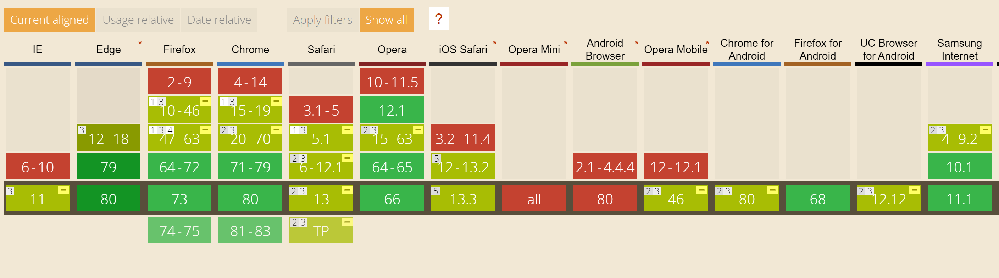

 
There are many situations where we'd like to see our web page in fullscreen mode. Be it games, online courses, video tutorials, or simply wanting more reading space while reading a book. What we usually do in these sort of scenarios is we manually set our browser's tab/window in fullscreen mode (<kbd>F11</kbd>), but the result is not always what we expect, because some content is not designed to be viewed in fullscreen mode. Besides, what if we help our users to go fullscreen automatically instead, again it all comes to having a better user experience.

<!--more-->

## Intro

[Full Screen API](https://developer.mozilla.org/en-US/docs/Web/API/Fullscreen_API) adds methods to the HTML `Element` to enable us to programmatically turn any content on a page to enter in fullscreen mode via JavaScript. `WebGL`, `canvas`, and `video` elements are the usual targets when it comes to going fullscreen. Online newspapers and magazines are other areas where this can be helpful.

So let's see this in action first and then go through some details:

<iframe height="265" style="width: 100%;" scrolling="no" title="Full Screen API Demo" src="https://codepen.io/yashints/embed/preview/mdJpqYx?height=265&theme-id=light&default-tab=js,result" frameborder="no" allowtransparency="true" allowfullscreen="true">
  See the Pen <a href='https://codepen.io/yashints/pen/mdJpqYx'>Full Screen API Demo</a> by Yaser Adel Mehraban
  (<a href='https://codepen.io/yashints'>@yashints</a>) on <a href='https://codepen.io'>CodePen</a>.
</iframe>

All we're doing here is to call a method which is added by the Full Screen API:

```js
const vid = document.getElementById('shuttle');

function toggleFullScreen() {
  if (!document.fullscreenElement && vid.requestFullscreen) {
    vid.requestFullscreen();
  } else {
    if (document.exitFullscreen) {
      document.exitFullscreen(); 
    }
  }
}

document.addEventListener("keydown", function(e) {
  if (e.keyCode == 13) {
    toggleFullScreen();
  }
}, false);
```

## Exposed properties

There are two properties exposed on the `document` object:

💡 **`DocumentOrShadowRoot.fullscreenElement`**

The `fullscreenElement` property will give you the element that is displayed in fullscreen mode at the moment. It's a way to check whether we're in full screen mode or not.

💡 **`Document.fullscreenEnabled`**

The `fullscreenEnabled` property tells you whether or not the document is currently in a state that would allow fullscreen mode to be requested.

## Exiting fullscreen

You'll want to be sure to let your users know that they can press the <kbd>Esc</kbd> key (or <kbd>F11</kbd>) to exit fullscreen mode.

In addition, navigating to another page, changing tabs, or switching to another application (using, for example, <kbd>Alt</kbd>-<kbd>Tab</kbd>) while in fullscreen mode exits fullscreen mode as well.

As you saw in the example above, exiting the fullscreen mode can be done using `document.exitFullscreen`:

```js
if (document.exitFullscreen) {
  document.exitFullscreen(); 
}
```

## Feature detection

You can simply detect whether the feature is supported or not using either `document.requestFullscreen` or `Element.requestFullscreen`:

```js
if(element.requestFullscreen) {
  element.requestFullscreen();
}
```

or:

```js
if(document.requestFullscreen) {
  // enter fullscreen mode
}
```

## Finding whether or not you're in fullscreen mode

As mentioned earlier, the `document.fullscreenElement` is a good way to check whether the browser is in full screen mode or not. The value of this property will be `null` if we're not in fullscreen, and the current fullscreen element otherwise.

[[warning]]
| ⚠️ There is also a `boolean` property called `fullscreen` which is deprecated and should not be used. Although most of the browsers still support it.

## Presentation

When toggling fullscreen mode programmatically, you're responsible for how the elements will look like and what appears on the screen. It's obvious you will need to change the width and height of the element to `%100`, and fortunately, there is a CSS pseudo-selector for you to use:

```css
#shuttle:fullscreen {
  width: 100%;
  height: 100%;
}
```

Also you might want to hide some other elements on the screen to reduce clutter:

```css
:fullscreen .hide {
  display: none;
}
```

## Browser support

The browser support is really good at this point, almost all major browsers fully support it. Only **IE11** and **Safari** have partial support. Opera mini and Android Browser do not support it at this point.



Hope you've learned a new trick if you didn't know about this API and happy fullscreening (just made up the word 😁).