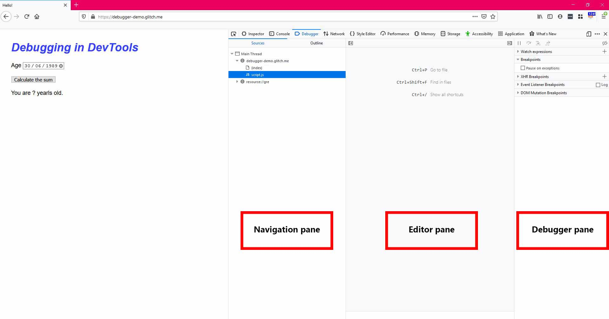
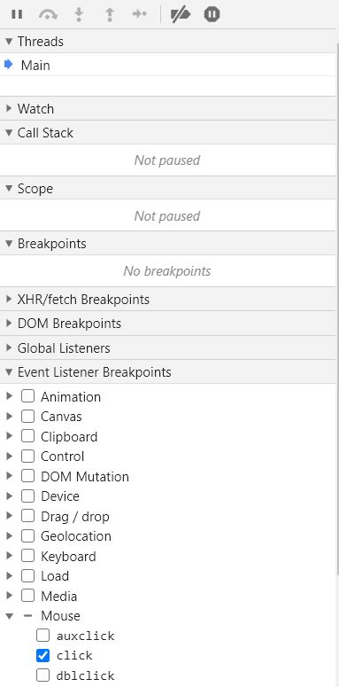
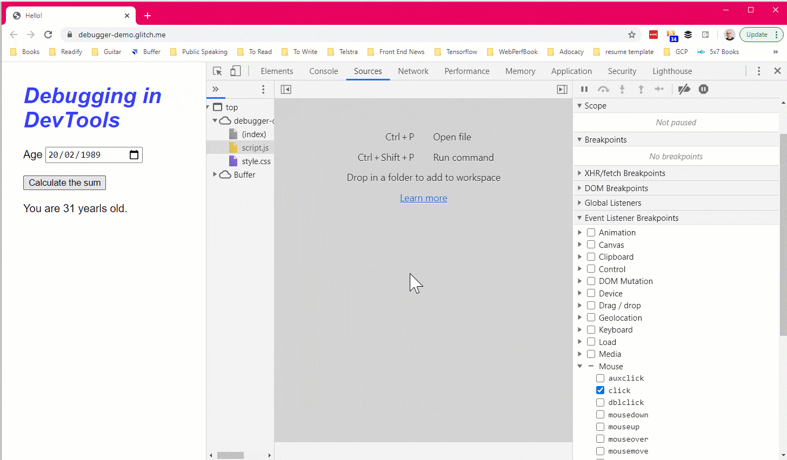
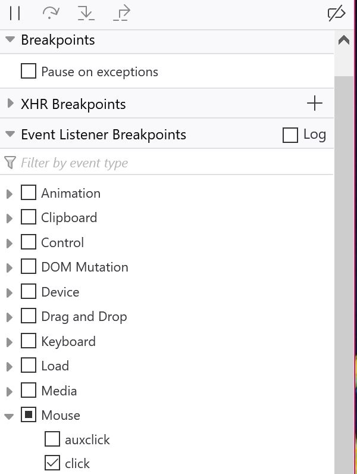
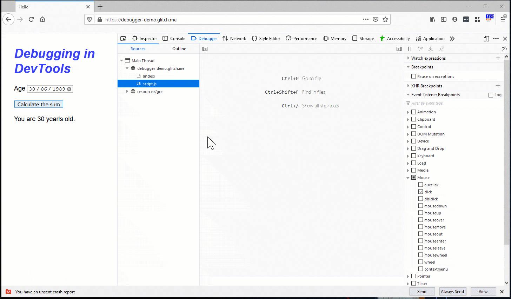
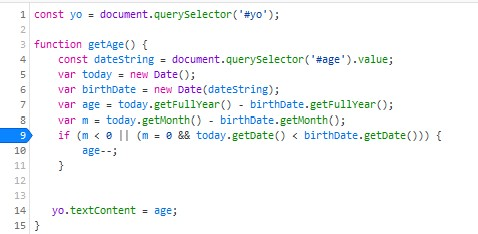
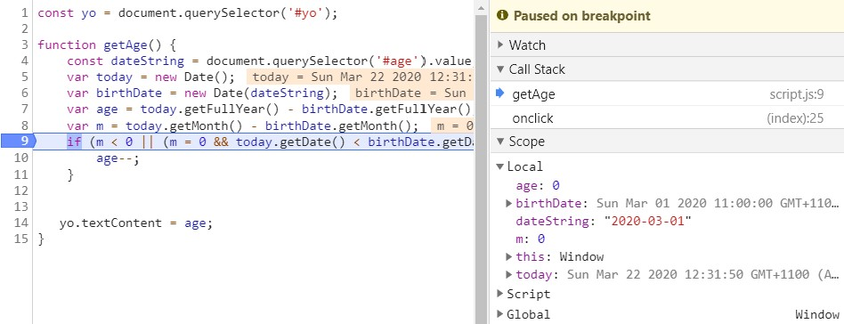
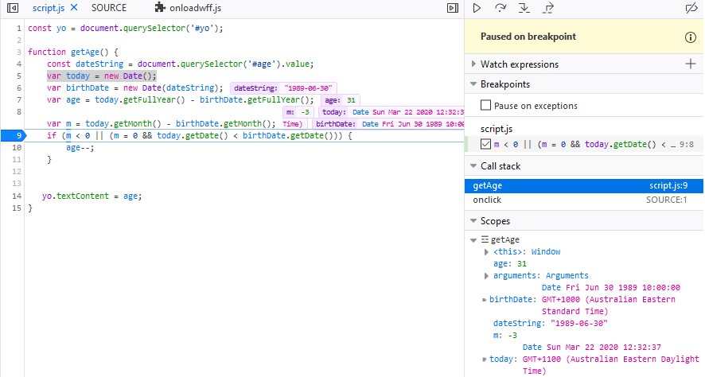
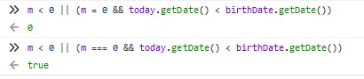

 
There are many situations where we want to see what's wrong with out code without the trouble of changing source code and push the changes again, regardless of whether we're using local environment or production. Most folks start by writing `console.log` statements throughout their code base and go step by step to find the place where the bug is happening. That's OK for beginners and where you have access to source code, but what if you don't want to waste so much time or you don't even have access to source code?

<!--more-->

## DevTools

All major browsers have developer tools (aka DevTools) nowadays. It's important for us web developers to know them well not just because we use them as our daily drivers to test our applications and see how they look like once deployed, but also for times when something is wrong as we want to find them efficiently.

That's when the DevTools comes very handy if you know the ropes. DevTools have a lot of functionalities; refer to my articles [Chrome DevTools can do that?](https://yashints.dev/blog/2019/01/13/chromedevtools) and [FireFox DevTools can do that?](https://yashints.dev/blog/2019/08/08/firefox-dev-tools) to have a glimpse of some of these. However, in this article we only focus on debugging experience.

## The bug

In order to be able to have a common ground, we need a bug to fix. I've created [this demo](https://glitch.com/edit/#!/debugger-demo) which will be working on in [Glitch](https://glitch.com/). In this demo, you would select a date and press the calculate age button. It will calculate your age and show it in the bottom section.

However, there is a bug where sometimes it calculates the age by one year higher than actual. We will be looking into how to fix this.

## DevTools's debugger

Both Chrome and Firefox have a debugger section we will be using in this article. I won't go through Edge because it's the same as Chrome. 

### Chrome

You can open your DevTools in Chrome using <kbd>Ctrl</kbd>+<kbd>Shift</kbd>+<kbd>J</kbd> on Windows or <kbd>Ctrl</kbd>+<kbd>Option</kbd>+<kbd>J</kbd>.


Once opened, navigate to the **Sources** tab. You will see a file navigator pane on the left where you can inspect the files that the page uses. Then there is the editor pane in the middle where you can click on the file from the navigator pane and see the content and edit them locally in the browser. And last you will see the JavaScript debugging pane where you have a set of features which you'll learn about shortly.

> 💡 If you resize the DevTools you might see these panes in different positions.


### Firefox

In Firefox you need to use <kbd>Ctrl</kbd>+<kbd>Shift</kbd>+<kbd>I</kbd> on Windows or <kbd>Ctrl</kbd>+<kbd>Option</kbd>+<kbd>I</kbd> to open up the web developer tools.

When opened, click on debugger tab which is very similar to what you saw before. On the left, you'll see the navigation pane, next to it is editor pane and to the left (or below depending on how wide you've got your DevTools open) is the debug pane.



## Setting a breakpoint

When it comes to debugging, a common method is to use `console.log` statements throughout the code base which sometimes is abused.

```js
const yo = document.querySelector('#yo');

function getAge() {
    console.log('Getting the date of birth value');
    const dateString = document.querySelector('#age').value;
    console.log(`date of birth is ${dateString}`);
    var today = new Date();
    var birthDate = new Date(dateString);
    var age = today.getFullYear() - birthDate.getFullYear();
    console.log(`age is ${age}`);
    var m = today.getMonth() - birthDate.getMonth();
    console.log(`Birth month is ${m}`);
    if (m < 0 || (m = 0 && today.getDate() < birthDate.getDate())) {
      console.log('The birth month is negative or is zero, we need to reduce the age by one year');
      age--;
      console.log(`Real age is ${age}`);
    }
   yo.textContent = age;
}
```

And then you look at the console to see where the bug might be. But this process is painstakingly slow which impacts your productivity a lot. So let's see how breakpoints help us get to the point real quick.

Breakpoints have the advantage of being in real time compared to `console.log` statements where you need to wait for the code to get deployed and inspect the console. Apart from that, with `console.log` statements, you need to explicitly mention which values you want to expect whereas in a breakpoint debugger shows you all of them.

Now let's take one step back and see how we can go about finding where to set our breakpoint to. In some cases like this you will think OK, the age is correct sometimes and not others depending on the month. So you can find your file and set your breakpoint right where the `if` condition is.

In some other cases where the code base might be larger, or you might be new to the team, it makes sense to follow the flow of the page. In our case user selects a date and then clicks on the calculate age button.

The logic behind happens under that click, you the best thing for us is to set a breakpoint on the click event listener. **Event Listener Breakpoints** are designed for this.

### Chrome

In Chrome, in the debug page, click on the **Event Listener Breakpoints** and expand the section. Then find the _Mouse_ category and select the click event.



Now click on the calculate age button and DevTools will pause when the event listener executes. You might need to click on the **Resume Script Execution** <span class="image-inline">  </span> if you're using a platform like Glitch, but for your own app that won't be needed. When the breakpoint reaches the button in your HTML, press Step into function <span class="image-inline">  </span> and you'll end up in our `getAge` function. Once you've stepped into the function you wanted, you can go one line at a time by clicking on the step over button or pressing <kbd>F10</kbd>.



### Firefox

You can use the same approach to enable a mouse click event listener breakpoint in Firefox, simply expand the **Event Listener Breakpoints** section in the debugger pane, then expand Mouse and select the click event.



Once enables, you could follow the same procedure we described before. First click on the calculate age button and the debugger automatically pauses on the first function call. In case of using a platform like Glitch or CodePen, that might not be what you're after, so simply press the **Resume** <span class="image-inline">  </span> button until you see the breakpoint stop at the `getAge` function. Then click on the **Step In** <span class="image-inline">  </span> button or press <kbd>F11</kbd> to go inside the function. Once you're inside the function simply press **Step over** <span class="image-inline">   </span> button or <kbd>F11</kbd> to go line by line from thereon.



## Line breakpoint

Line breakpoints are mainly used when you've narrowed down where the bug might actually be. In our case when we stepped through the `getAge` function, we saw that the age is calculated based on the year, then there is an if condition which will be responsible to reduce the age by one if the month is less than the current month minus the month of birth.

So we roughly know that if the age is calculated right in some cases and wrong by one year in others, the if condition is where we should set our line breakpoint on.

There are two ways to do this in DevTools, one is to follow the event listener breakpoint flow explained above. But if you know the filename beforehand, you can simply open the file in the editor pane and scroll through until you reach the line you want.

Once you're there, simply click the line number and it will put a **Line Breakpoint** <span class="image-inline">   </span> icon on that line so that you'd know where the breakpoint is set. You can remove the breakpoint by simply clicking on it again.



Now if you click the calculate age button, the program stops on the if condition. This part is exactly the same in both Chrome and Firefox.

## Checking variable values

When you're stopped at the if condition, if you want to see what is the value of a variable, simply have a look at the debugger pane's **Scope** section in Chrome or **Scopes** section in Firefox.

### Chrome



### Firefox




## Spotting the bug

Now let's see where the bug is and how to fix it. If you have a look at the if condition more closely, you'll see that there are two main parts in there. First one is `m < 0` to check whether the month is less than zero, and the second is `m = 0 && today.getDate() < birthDate.getDate()` to check if the month is zero and today is less than birthday.

Now we know that someone's used an equal sign instead of equality operator which has caused this bug. So let's replace the `=` with `===` and then press <kbd>Ctrl</kbd>+<kbd>S</kbd> to save the changes. You can leave the breakpoint or remove it test with some dates to see if the bug is fixed or not. But after some tests we know that the bug is fixed. It's time for you to go and write a test for this function so you won't face the same bug again 😁.

## Console window

Don't forget that you can evaluate your expressions in the console window of the browser. As in you could simply put your condition in the console and see whether it's returning `true` or `false`.



## What else?

There are heaps of other breakpoints you could use such as conditional breakpoints which are triggered only if a condition you provide is `true`, breakpoints on caught and uncaught exceptions, and XHR breakpoints which are triggered when a URL matches a substring you've set. Let's try a XHR breakpoint in , open up your DevTools, head over to debug pane and open the **XHR Breakpoints** section. Click in the box to add a line and enter `raw` and press <kbd>Enter</kbd>. Now refresh the page and you'll see the breakpoint hit when the request is made. You can now use the same technique we saw earlier to step in the code and set a like breakpoint to debug further.

## Small catch

One catch is that you need to make sure that the function you're debugging is in the scope which is tricky if you're using DevTools. In order to get it working you need to set a line breakpoint somewhere where the function is in scope, then trigger the breakpoint and call `debug()` in the DevTools console while the code is still paused on the line breakpoint.

```js
(function () {
  function hello() {
    console.log('hello');
  }
  function world() {
    console.log(' world');
  }
  hello(yo); // This works.
  world();
})();
debug(hello); // This doesn't work. hey() is out of scope.
```

## Summary

We saw how powerful the DevTools are and how much they can help us to find and fix bugs in our code. So stop using `console.log` and get to know your DevTools better. Happy coding from home ❤️.