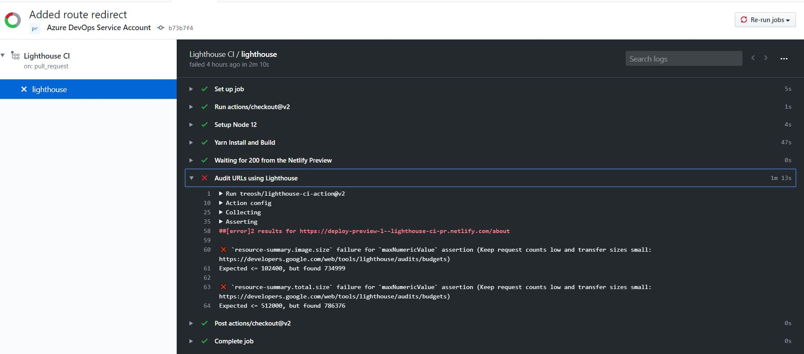
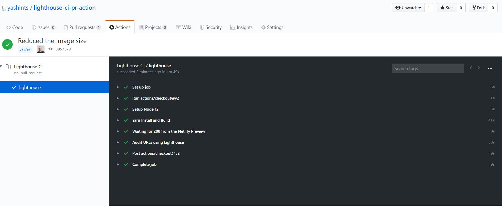

 
You've spent many hours trying to improve your web performance and have got it to a good speed. What happens next? How do you ensure it remains in good shape especially if you're working in a team with diverse backgrounds and level of coding.

<!--more-->

## Web performance must be monitored

I truly believe web performance shouldn't be an item in your backlog, rather part of acceptance criteria on each story. That said, having discipline is hard when it comes to web performance. Each member of the team should be aware of dos and don'ts so that they can right code which doesn't add a few seconds to current page load time, or user's interactivity with the page.

In order to do so, you need to constantly monitor the performance of your application and when is a better time to do it than your CI/CD pipeline or when creating a pull request to get the code merged in (it's worth mentioning having a CI/CD pipeline is not necessary to have a high quality, well written and performing site).

In addition to all of that, your site performs differently from your localhost, so you need to ensure you're testing close to your actual environment.

## Lighthouse CI

[Lighthouse CI](https://github.com/GoogleChrome/lighthouse-ci) is a set of commands that make continuously running, asserting, saving, and retrieving Lighthouse results as easy as possible.

This is a great tool which allows you to run audits on your code base using command line, and raise an alert when someone unintentionally downgrades the performance.

## What to measure?

There are countless metrics on which we could focus on. Some are user centric like time to interact, some are resource centric such as the size of your _JavaScript_ or _CSS_ files. Lighthouse CI allows us to easily focus on the size of the files. You can create two types of budgets:

1- **Number of given resource**: This will help you to for example enforce having only `3` _JavaScript_ and `1` _CSS_ file.
2- **Size of a given resource**: This budget will enforce that a given resource is of certain size, e.g. only `500kb`.

## How does it know?

You're probably wondering how does **Lighthouse CI** know what to measure and when to raise an alert. This **||is done via a `JSON` file which is usually named `budget.json`, but you can choose any name you prefer. 

## Performance budget

The content of this file is an array of objects representing the budgets for a path. The content will look like below if you only have one path to assert:

```json
[
  {
    "resourceSizes": [
      ...
    ],
    "resourceCounts": [
      ...
    ]
  }
]
```

Within the `resourceSizes` and `resourceCounts` arrays, you can add individual objects that specify the `resourceType` and its budget. The budget can be any positive integer and the `resourceType` can be any of the following:

|**Resource type**|**Description**|
|---|---|
|**script**|JavaScript files|
|**document**|HTML documents|
|**image**|Images|
|**stylesheet**|CSS files|
|**font**|Webfonts|
|**media**|Other media|
|**other**|Any other resource which doesn’t match the above, e.g. data transfers over Websocket connections|
|**third-party**|All resources from a third-party domain|
|**total**|All resources combined|

For example, the following file will set a 200Kb budget for all scripts, a 500Kb for all images, and a 500Kb for all other resources. Then it sets the total network requests to be 25.

```json
[
  {
    "resourceSizes": [
      {
        "resourceType": "script",
        "budget": 200
      },
      {
        "resourceType": "image",
        "budget": 500
      },
      {
        "resourceType": "total",
        "budget": 500
      }
    ],
    "resourceCounts": [
      {
        "resourceType": "total",
        "budget": 25
      }
    ]
  }
]
```

As of **Lighthouse** 5.3 you can add a `path` property to select which pages the budget should apply to. This is very handy because it allows you to have a centralised budget file for all your pages.

```json
[
  {
    "path":"/*",
    "resourceSizes": [
      ...
    ],
    "resourceCounts": [
      ...
    ]
  },
  {
    "path":"/blog",
    "resourceSizes": [
      ...
    ],
    "resourceCounts": [
      ...
    ]
  },
  {
    "path":"/contact",
    "resourceSizes": [
      ...
    ],
    "resourceCounts": [
      ...
    ]
  }
]
```

## How should you choose your numbers?

Finding the performance budget is not an easy task since it will depend on your application's structure and bundling style. However, you can use this useful tool called [**Performance Budget Calculator**](https://perf-budget-calculator.firebaseapp.com/) to have a starting point. You might have to run the tool multiple time to each to a point where you'd be happy with the result. You don't want to be too aggressive and also too complacent either.

## Using the CI locally

You can install the CI locally with:

```bash
npm install -g @lhci/cli
```

It also has a dashboard which shows you the historical runs, compares reports and store their results.

```bash
npm install @lhci/server
```

Before running the CI, you need to have a configuration file to tell the tool what to test and where to find the budget file (you could also pass those individually without a config file, but it'd be a pain):

```json
// lighthouserc.json
{
  "ci": {
    "collect": {
      "numberOfRuns": 2,
      "startServerCommand": "yarn serve",
      "url": "http://localhost:8080"
    },
    "preset": "lighthouse:recommended"
  }
}
```

Then you can run the tool on your local web server by first running:

```bash
lhci autorun --config=./lighthouserc.json
```

and then:

```bash
lhci assert --no-lighthouserc --budgetsFile=budget.json
```

And you will get a result similar to below based on your app's performance:

```bash
2 result(s) for http://localhost:8080/

  ×  resource-summary.script.size failure for maxNumericValue assertion
     Keep request counts low and transfer sizes small
     Documentation: https://developers.google.com/web/tools/lighthouse/audits/budgets

        expected: <=102400
           found: 2416174
      all values: 2416174, 2416174


  ×  resource-summary.total.size failure for maxNumericValue assertion
     Keep request counts low and transfer sizes small
     Documentation: https://developers.google.com/web/tools/lighthouse/audits/budgets

        expected: <=512000
           found: 2437694
      all values: 2437694, 2437694

Assertion failed. Exiting with status code 1.
```

## Using the tool on your PRs

I am focusing on [GitHub](https://github.com/features/actions) using actions here. But you can apply this technique to [Azure DevOps](https://azure.microsoft.com/en-au/services/devops/), [CircleCI](https://circleci.com/), [TeamCity](https://www.jetbrains.com/teamcity/), or any other tool you're using. For this to work you will need to have a [GitHub flow](https://guides.github.com/introduction/flow/) in your `git` repository defined.

This article's focus is not to teach you how to create a workflow, but here is the bare minimum you will need to have. Create a `.yaml`/`.yml` file in the `.github/workflows` folder, you can name it whatever you want. I usually name them after what's their purpose, e.g. `lighthouse.yml` or `lhci-performance-bot.yml`.

But before we get to the content of our `yaml` file, let's see what we need to do on each PR:

1. Pull down the code
2. Build the app
3. Deploy to a temporary site (I am using Netlify Preview here, but you can use others like staging slots on Azure App Service, etc)
4. Run Lighthouse CI on the site
5. Fail if the conditions are not met

For this to work, we need an application. So I just spun up a new [Vue](https://vuejs.org/) application using [Vue CLI](https://cli.vuejs.org/), then added my workflow to it and pushed it to [a new GitHub repo](https://github.com/yashints/lighthouse-ci-pr-action).

Here is how my workflow looks like:


```yml
name: Lighthouse CI

on:
  pull_request:
    branches: [master]

jobs:
  lighthouse:
    runs-on: ubuntu-latest

    steps:
      - uses: actions/checkout@v2
      - name: Setup Node 12
        uses: actions/setup-node@v1
        with:
          node-version: 12.x
      - name: Yarn Install and Build
        run: |
          yarn
          yarn build
      
      - name: Waiting for 200 from the Netlify Preview
        uses: jakepartusch/wait-for-netlify-action@v1
        id: waitFor200
        with:
          site_name: "lighthouse-ci-pr"

      - name: Audit URLs using Lighthouse
        uses: treosh/lighthouse-ci-action@v2
        with:
          urls: |
            $DEPLOY_URL/
            $DEPLOY_URL/about
          runs: 3
          budgetPath: ./budget.json
        env:
          DEPLOY_URL: ${{ steps.waitFor200.outputs.url }}
```

What is happening is that I am just creating an action on each PR. In this action, we need to pull down the code, install node, run `yarn` and `yarn build` to build the application, wait for Netlify to deploy our PR into a preview site, then get the URL and inject it into the next step.

I'm just using [`wait-for-netlify-action`](https://github.com/marketplace/actions/wait-for-netlify), but it's not that hard to implement this part. Then we will be using the [`lighthouse-ci-action`](https://github.com/treosh/lighthouse-ci-action/) to run our audit on the paths we have specified.

Notice I am not using a **Lighthouse** configuration file in this workflow because it's not needed. You can pass the parameters directly to the action like I've done above. I am just auditing the home and about pages since I've only got these two pages.

You can pass as many URL's to this as you like, but if there are many of the, it makes more sense to add the config file back.

> 💡 Remember to setup Netlify for your site and set it to create a deployment for every PR. Then get the site id and pass it to the `wait-for-netlify-action` action.

**Pro tip**: When you setup your Vue CLI generated application which is using Vue Router, the non default routes won't work if the user types them in the browser URL bar and hits enter. That's because that route is handled on the client side and server doesn't know about it. To fix that you need to add a URL rewrite rule to return your `index.html` for all legitimate routes.

In case of Netlify, just create a file named `_redirects` inside your _public_ and add the following line to it.

```bash
/*    /index.html   200
```

## Result

I created a branch and pushed it up. Then created a PR and voila, the action kicked in and failed, since I have a large image on the about page.



I then reduced the size of the image and pushed the changes up. This time it passed.



## Summary

We learned together how to use Lighthouse CI, a tool which allows you to run audits on your sites from command line in our CI/CD pipeline to make sure no one is downgrading the performance when they work on the application.

This way, we're always on top of our game rather than creating backlog items to find the issues and fix them later.

In addition to that, your users are going to be happy and remain happy with their experience which is worth all the effort.

Hope you've enjoyed reading this and happy performance enforcement 👋🏽.