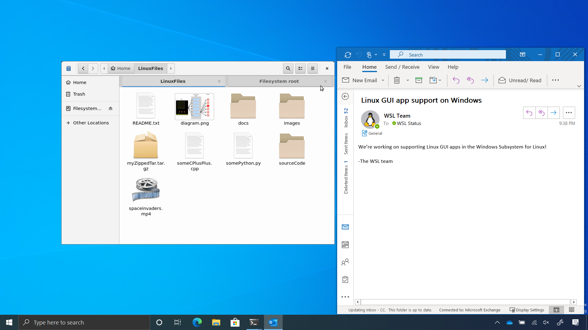
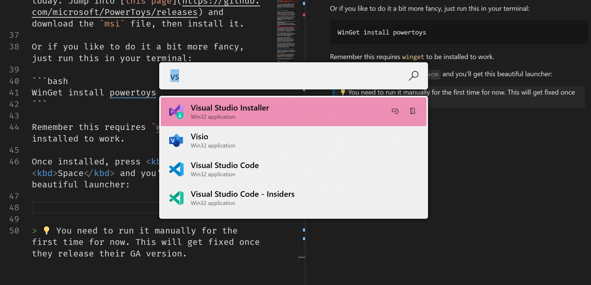

[Microsoft Build](https://mybuild.microsoft.com/) went on fully online and it came with some really exciting announcements. For us developers some of these can bring massive efficiencies. So let's see what's on offer.

<!--more-->

## WSL2

[Windows Subsystem for Linux v2 (aka WSL2)](https://docs.microsoft.com/en-us/windows/wsl/) is here with a ton of awesome features allowing developers to have a really great experience working in a side by side Windows/Linux environment.

* No Hyper-V image is needed to run docker containers
* GPU Support
* 100% system call compatibility
* Increased I/O performance

## Linux GUI apps in Windows

This was really an exciting announcements. Microsoft is adding a full Linux Kernel to its [Windows Subsystem for Linux v2 (aka WSL2)](https://docs.microsoft.com/en-us/windows/wsl/) with GUI support and GPU acceleration.

This will be enabled without us having to use X11 forwarding and it's mainly designed for developers to run Linux integrated development environments alongside regular Windows apps.


*Image from [Microsoft's official blog](https://devblogs.microsoft.com/commandline/the-windows-subsystem-for-linux-build-2020-summary/)*

## Winget, Microsoft's package manager
This is probably one of those controversial topics where people will say: oh another package manager. But Microsoft believes they have considered all options and this decision was made with lots of considerations.

You can install `winget` via it's [App Installer](https://www.microsoft.com/en-us/p/app-installer/9nblggh4nns1) package. You can also join their insider program which contains the `winget` by default.

You can easily add your package to this package manager by following their instructions on their [GitHub repository](https://github.com/microsoft/winget-pkgs) and create a PR containing your package's information and link to download.

Just so you know how excited people are, there are already [**228** open PR's](https://github.com/microsoft/winget-pkgs/pulls) and 541 closed. Of course not all of those PR's have been packages, but even so, it's a lot of packages submitted already.

## Microsoft's new PowerToys Run launcher

Microsoft just released a new Spotlight-like launcher app for Windows 10. This launcher is part of a series of apps which come with the PowerToys tool set.

It's still preview, but you can install it today. Jump into [this page](https://github.com/microsoft/PowerToys/releases) and download the `msi` file, then install it.

Or if you like to do it a bit more fancy, just run this in your terminal:

```bash
WinGet install powertoys
```

Remember this requires `winget` to be installed to work.

Once installed, press <kbd>Alt</kbd> + <kbd>Space</kbd> and you'll get this beautiful launcher:



> 💡 You need to run it manually for the first time for now. This will get fixed once they release their GA version.

Alongside _PowerToys Run_, Microsoft also released a Keyboard Manager PowerToy which allows you to define shortcuts for your favourite actions, or remap keys like replacing `A` with `B`. Check out the other cool tools in their [GitHub page](https://github.com/microsoft/PowerToys).

## Project Reunion

Microsoft announced [Project Reunion](https://github.com/microsoft/ProjectReunion), an effort to bring `win32` desktop apps and its Universal Windows Platform (UWP) apps close together. From their page:

> Project Reunion makes it easier to build a great Windows app by providing a unified platform for new and existing Win32 and UWP apps. It will unify access to existing Win32 and UWP APIs and make them available decoupled from the OS, via tools like NuGet.


## Fluid framework

Microsoft is adding a new type of document to it's Office suite called [Fluid Framework](https://techcommunity.microsoft.com/t5/microsoft-365-blog/introducing-the-first-microsoft-fluid-framework-experiences-in/ba-p/1345543). This allows multiple people to collaborate on a single document with fast speed and offers multiple types of elements like tables, graphs and lists in one place rather than having to use multiple apps for different reasons.

Apart from aforementioned features, it comes with ability to @mention someone to notify them of something, plus activity feeds for each document if you want to be notified of the changes.

And to emphasise their focus in bringing more to open source, they are making this framework open too.

## Project Bonsai

[Project Bonsai](https://blogs.microsoft.com/ai-for-business/build-bonsai-public-preview/) is Microsoft's effort in creating a platform which lets developers and engineers create autonomous systems. It is a machine teaching service to create and optimize intelligence for industrial control systems. Through machine teaching, subject matter experts without an AI background can break down their expertise into steps and tasks that are imparted to AI agents.


## Static Web Apps

[Static Web Apps](https://docs.microsoft.com/en-us/azure/static-web-apps/overview) offers static Web applications powered by storage for hosting and Azure Functions as backend APIs. They also have the full pipeline on GitHub using GitHub actions to let you deploy your apps really fast.

These are some of the key features:

* **Free web hosting** for static content like HTML, CSS, JavaScript, and images.
* **Integrated API** support provided by Azure Functions.
* **First-party GitHub integration** where repository changes trigger builds and deployments.
* **Globally distributed** static content, putting content closer to your users.
* **Free SSL certificates**, which are automatically renewed.
* **Custom domains** to provide branded customizations to your app.
* **Seamless security model** with a reverse-proxy when calling APIs, which requires no CORS configuration.
* **Authentication provider integrations** with Azure Active Directory, Facebook, Google, GitHub, and Twitter.
* **Customizable authorization role definition** and assignments.
* **Back-end routing rules** enabling full control over the content and routes you serve.
* **Generated staging versions** powered by pull requests enabling preview versions of your site before publishing.


*Image from Microsoft blog*

## Others

There were dozens of other stuff announced, but here are some of the developer related ones:

* Blazer WASM is released
* MAUI makes mobile app development easier
* Visual Studio is becoming Visual Studio Codespaces
* GitHub Codespaces brings amazing developer experience right from your browser
* GitHub Discussions for brainstorming feature ideas, help new users
* Code scanning and secret scanning on GitHub on private repositories
* GitHub Private Instances – a fully managed environment for enterprises
* GitHub Actions for Azure are now integrated within: Visual Studio Code, Azure CLI, and the Azure Portal. This makes it easier to deploy from GitHub to Azure!

Hope this has given you some pointers to go play with some of these amazing features and till next time 👋🏽.