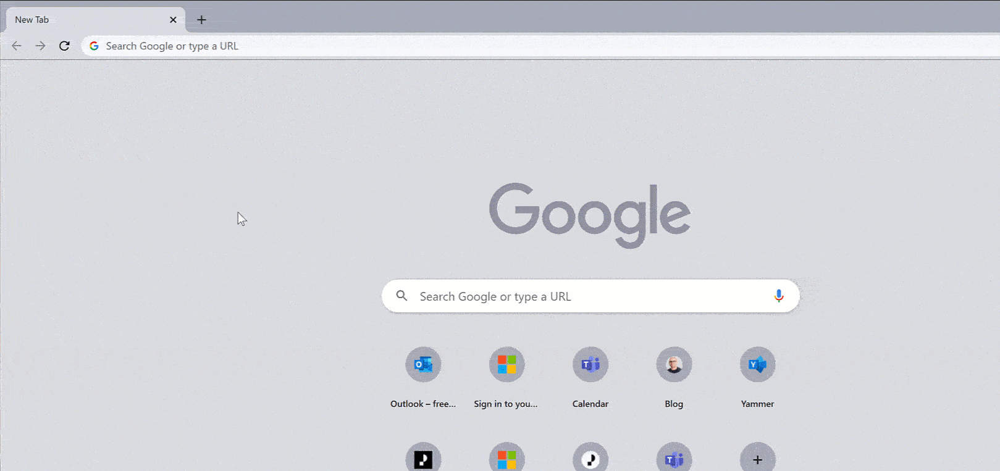

If you're one of those people with so many tabs open than you can manage, read on.

<!--more-->

## The why

For those of you who have many tabs open all at the same time and are struggling to keep a tab on your tabs, the time has come to get a bit more organised using this new feature in Chrome called tab groups.

The whole purpose has been to help users keep their tabs organised and easier to find them in their sea of open tabs.

## How can I do it?

Simply right click your tab and select **Add tab to tab group** option. Then there will be a dot right before your tab. Click on the dot, a pop up will open in which you can select a colour for your tab group, and name your group.

If you are clicking on an existing group, you will have the following options in addition:

* Add a new tab to the group
* Ungroup tabs in a group
* Close group
* Move the group to a new window
* Send feedback if you have any

I've demonstrated this in below video:

## But I don't see the option

If you can't see the option, don't worry, just go to `chrome://flags`, then search for `tab groups` and enable the option. It's still experimental, but you can use it now.

## Summary

Hope this will help you to keep a tab on your tabs and till next time 👋🏽.
