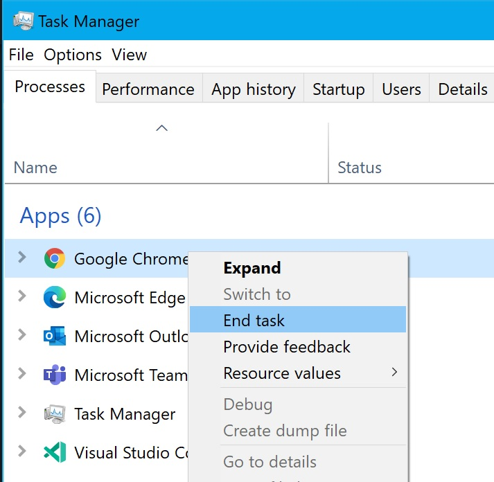
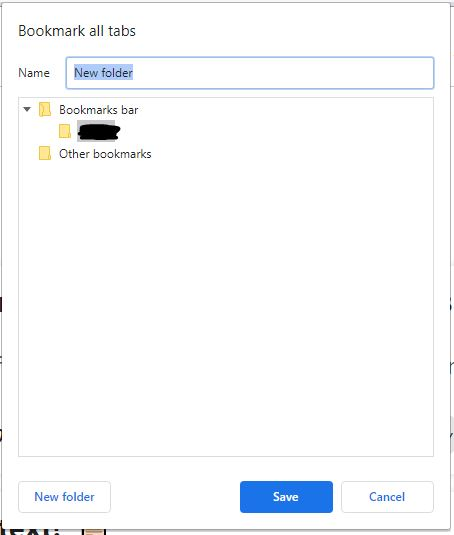
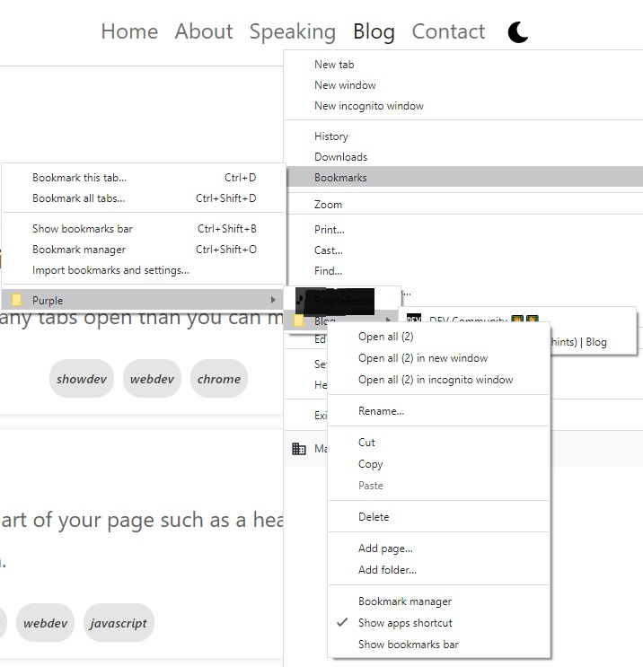
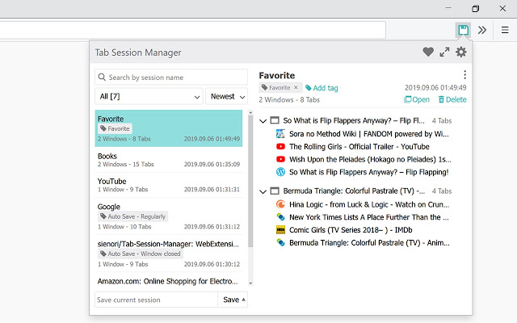

I remember a while back (not sure how long), Chrome had the ability to save all tabs when you closed the browser regardless of whether it was by accident or not. But they removed that ability and now if you close the window you will lose the tabs.

<!--more-->

## What now?

Well there are still some ways you can save your current tabs and open them next time you open a new Chrome window.

## 1. Small hack but works (most times 😁)

Open your task manager and kill the Chrome's task. It's a dirty hack but it works. When you open Chrome next time it asks you do you want to restore the last session and when you click the button, it will open all of your previously open tabs.

So first kill the task:

Later when you open a new window:

## 2. Save them as bookmarks

Yes, you read right. You can save all open tabs as bookmarks and open them all later when you come back. Simply press <kbd>Ctrl</kbd> + <kbd>Shift</kbd> + <kbd>d</kbd> in windows or <kbd>⌘</kbd> + <kbd>Shift</kbd> + <kbd>d</kbd> in Mac to save all your open tabs in a new bookmark folder.

Later on when you come back and open a new window, you can right click on the folder you created previously and select open all tabs:

> ⚠️ This technique won't help you if your browser crashes for some reason.

## 3. I am too tired to do all of that

If you don't want to open your task manager, or don't want to use bookmarks, don't worry. There are some extensions which can help you with that.

### Tab Session Manager

[Tab Session Manager](https://chrome.google.com/webstore/detail/tab-session-manager/iaiomicjabeggjcfkbimgmglanimpnae?hl=en) is a Chrome extension which allows you to do:

* Save and restore windows and tabs
* Manage sessions with name and tags
* Auto save when window is closed
* Auto save at regular intervals
* Import and export sessions
* Compatibility with Firefox extension
* Cloud sync

It also has [Microsoft](https://microsoftedge.microsoft.com/addons/detail/jkjjclfiflhpjangefhgfjhgfbhajadk) Edge and [Firefox](https://addons.mozilla.org/ja/firefox/addon/tab-session-manager/) versions which is great.

### Session Buddy

[Session Buddy](https://chrome.google.com/webstore/detail/session-buddy/edacconmaakjimmfgnblocblbcdcpbko?hl=en) is a popular extension with more than 24K installs. It will do all of the above for you automatically in one place. Whether your browser crashes or you choose to close it manually.

## Summary

Hope this helps you from a possible disaster if you have millions of tabs open at a time. If you are a tab person, check out my other article on [managing your tabs in Chrome here](https://dev.to/yashints/chrome-arrange-your-tabs-with-tab-groups-267f). Until next time, 👋🏽.