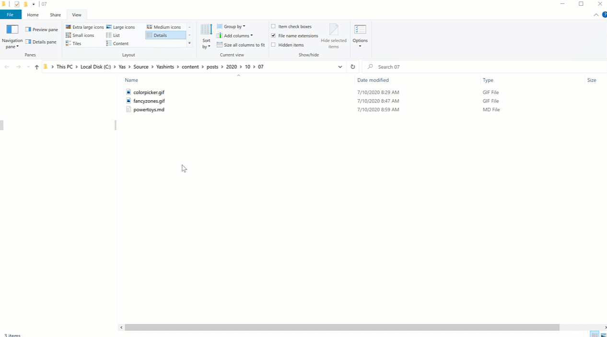
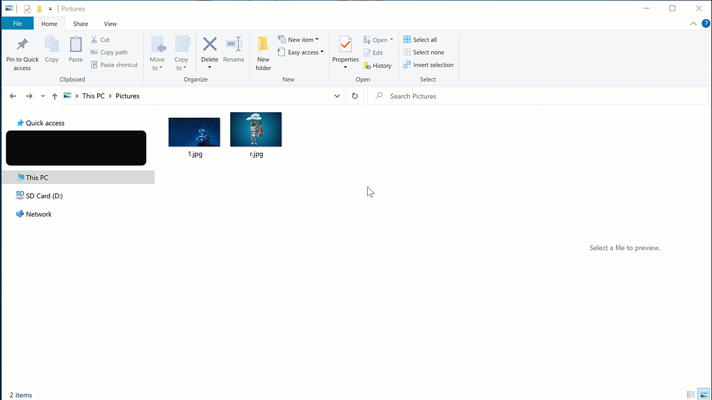
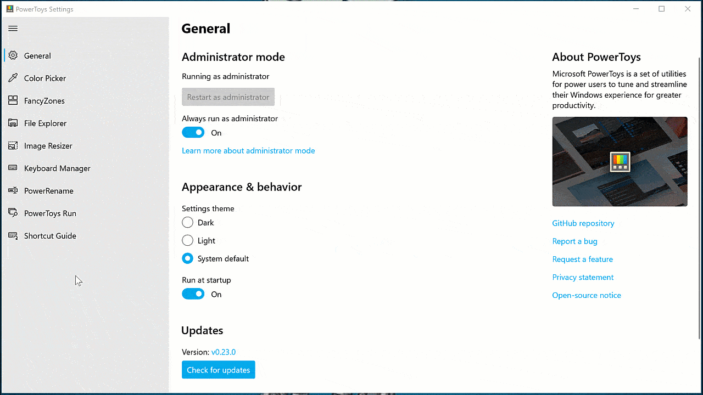
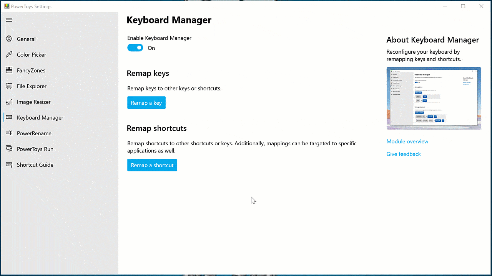
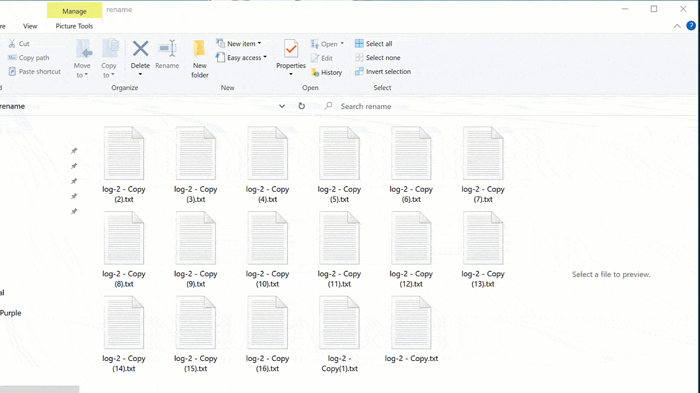

If you're a windows user like me, you might have heard of PowerToys Utilities from Microsoft. They are a set of utilities which come handy in many situations, but not many people know and use them. So I thought let's write how and when I use them to help other people be more efficient too.

<!--more-->

## PowerToys utilities

[Microsoft PowerToys](https://github.com/microsoft/PowerToys) are a set of small applications which helps windows users streamline their day to day activities and windows experience for greater productivity. However, these are not new. There were a set of tools in [Widows 95](https://en.wikipedia.org/wiki/Microsoft_PowerToys) (yes I'm that old) which inspired this project.

### Installation

Simply head to the [Downloading and Release notes](https://github.com/microsoft/PowerToys/releases/) section on their GitHub repository, download the version you're after and install it using its installer.

The latest version as of writing this article is [v0.23.0](https://github.com/microsoft/PowerToys/releases/download/v0.23.0/PowerToysSetup-0.23.0-x64.exe). Once you get it installed, it will update itself on a regular basis.

So let's see what are these and how you can use them.

### Color picker

[Color Picker](https://aka.ms/PowerToysOverview_ColorPicker) is a handy little tool which allows you to pick a color from anywhere on your screen. As a web developer there are many times when I want to get the hex or rgb value of a background color, border, or other areas.

I used to use browser DevTools, but they only help you within the browser and if you want something from a document, picture or other files on your file system, then this tool will come in handy.

If you haven't customised the default shortcuts, press <kbd>Win</kbd> + <kbd>Shift</kbd> + <kbd>C</kbd> to open the picker. Once opened, you can use your mouse scroll to zoom in and left click to copy the value to your clipboard.

### Fancy zones

[Fancy Zones](https://aka.ms/PowerToysOverview_FancyZones) allows you to create complex window layouts and quickly position your windows into those. This comes really handy if you have a super wide monitor setup.

To open it, press <kbd>Win</kbd> + <kbd>`</kbd> and select your desired layout from the opened window. Once selected you can arrange your windows into those areas by pressing <kbd>Win</kbd> + <kbd>⬅</kbd> or <kbd>Win</kbd> + <kbd>➡</kbd>.

> 💡 If the arrow keys didn't work for you, simply select the option to override windows shortcuts in the settings. You can access the settings from clicking the PowerToys icon in your toolbar.

### File explorer add-ons

[File Explorer add-ons](https://aka.ms/PowerToysOverview_FileExplorerAddOns) will enable SVG icon rendering and markdown preview for your file explorer. To see your preview pane simply click the view menu and click the preview pane.

### Image resizer

[Image Resizer](https://aka.ms/PowerToysOverview_ImageResizer) is a really cool shell extension which allows you to quickly resize images. Simply right click on your image or images and resize them instantly.

### keyboard manager

Keyboard manager allows you to create your own keyboard layout to increase your productivity. You can map keys and mix them however you like, of course you would need a keyboard with detachable key caps for a better use.

Open PowerToys settings and click on keyboard manager menu. First thing first, make sure it's enabled.

**Remap keys**

If you want to remap a key, click on the remap keys, then click <kbd>+</kbd> button to add a key and then select what key you want that mapped to.

You can also map a single key to a shortcut, for example map <kbd>V</kbd> to <kbd>Ctrl</kbd> + <kbd>V</kbd>.

> 💡 Just remember that when you map a key to a shortcut, the combination remains even as part of other key presses. So if you've mapped <kbd>V</kbd> as above, then pressing <kbd>Ctrl</kbd> + <kbd>V</kbd> now means you've pressed <kbd>Ctrl</kbd> + <kbd>V</kbd> + <kbd>V</kbd>.

**Remap shortcuts**

You can map shortcuts as well, to do so, click on the _remap a shortcut_ button and follow the same procedure. You can click on type button to press multiple keys and at the end you can specify which application this shortcut remap applies to.

### PowerRename

[PowerRename](https://aka.ms/PowerToysOverview_PowerRename) is another shell extension for balk renaming of files which offers search and replace and supports regex.

Select and right click on multiple files or folders, then click **PowerRename**. From the opened dialog, select your desired options and once you're happy, click rename.

### PowerToys run

This one is my favourite. It brings back the memories of the days we used to install add-ons on windows XP and 7 to add these sort of functionalities. First, make sure it's enabled in the settings, and then press <kbd>Alt</kbd> + <kbd>Space</kbd>. A pop up will open and you can search for your application.

> 💡 Since I use this shortcut to select my open window to be able to move it between my monitors, I've set my shortcut to <kbd>Ctrl</kbd> + <kbd>Alt</kbd> + <kbd>Space</kbd>.

### Shortcut guide

[Shortcut guide](https://aka.ms/PowerToysOverview_ShortcutGuide) is a quick and easy way to savailable shortcuts for the current state of the desktop. You can open it by pressing and holding down your <kbd>Win</kbd> key for 1 second.

## Summary

Hopefully these tools will help you as much as they helped me. Have a great weekend ahead and till next article 👋🏻.