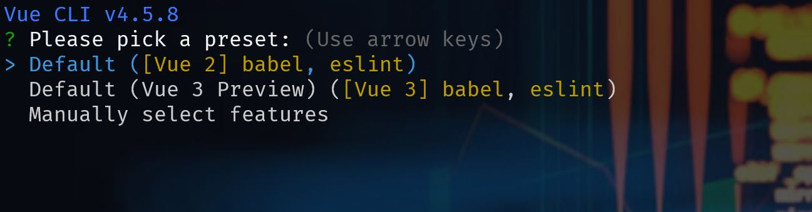
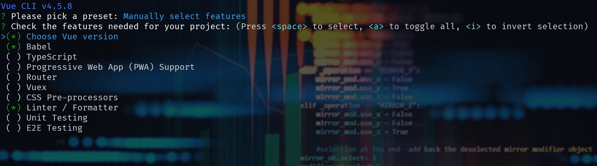
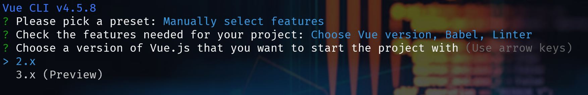

Last week I wanted to setup a [Vue.js v3](https://v3.vuejs.org/) app with [Tailwindcss](https://tailwindcss.com/) and although many articles exists for that, I couldn't get it done. The fact is that you need to use [postcss]() to get your setup working, but with new version of **Vue**, the `postcss` config file is not picked up. So after a few try and errors, I finally got it working and thought to jot down what I went through to make it easier for my future self, and hopefully a few of my fellow developers around the world.

<!--more-->

## Vue CLI

You can setup your **Vue** project with simply importing the script tag and start coding, but I normally like to use [Vue CLI](https://cli.vuejs.org/) to get started because it takes care of the many things for me and gives a really good starting point.

So let's start by installing Vue CLI if you don't have it already:

```bash
npm install -g @vue/cli
# OR
yarn global add @vue/cli
```

This will install the Vue CLI for you and once that's done, you'd be ready to create your project. If you already have CLI installed, make sure you update it first to get support for _Vue v3 preview_.

## Creating the project

In order to create your project, you need to call the CLI and give your project name:

```bash
vue create vue-tailwindcss
```

This command will start the wizard and asks you what version of Vue you want to use and what additional options you want to have. 



You can choose between default seetings, or making a completely custom setup. I will normally choose custom which gives me more freedom as to what I want to setup.



From here press <kbd>Entre</kbd> on **Choose Vue version**, and select **3.x (Preview)**.



I would normally choose [TypeScript](https://www.typescriptlang.org/), [Babel](https://babeljs.io/), Linter, Unit and E2E testing optiuons, but feel free to setup how you like.

When it's done go navigate into the folder or open it up with your editor of choice. Mince is [VS Code](https://code.visualstudio.com/).

## Installing the required dependencies

At this point we need to install Tailwindcss:

```bash
npm install tailwindcss
```

## Create your style file

At this stage you're ready to create your style file. I will put it next to my `main.js` for convinience. 


Don't forget to import it inside your main.js file:

```js
import "./main.css";
// ...
```

And now is the time to import the **Tailwincss** base and components in our `css` file:

```css
/* src/main.css */
@import "tailwindcss/base";
@import "tailwindcss/components";
@import "tailwindcss/utilities";
```

## Postcss configuration

Many articles tell you to create a `postcss.config.js` or `.postcssrc.js` and set your config there, but with the new version of Vue CLI this doesn't get picked up. For this part we simply need to update our `package.json` file:

```json
"postcss": {
  "plugins": {
    "tailwindcss": {},
    "autoprefixer": {}
  }
}
```

## Import Tailwindcss components

You're ready to use the Tailwindcss components now. So open up your hello-world.vue file and paste this code from [their free gallery](https://tailwindui.com/preview) in:

```html
<!--
  Tailwind UI components require Tailwind CSS v1.8 and the @tailwindcss/ui plugin.
  Read the documentation to get started: https://tailwindui.com/documentation
-->
<div class="relative bg-white overflow-hidden">
  <div class="max-w-screen-xl mx-auto">
    <div class="relative z-10 pb-8 bg-white sm:pb-16 md:pb-20 lg:max-w-2xl lg:w-full lg:pb-28 xl:pb-32">
      <svg class="hidden lg:block absolute right-0 inset-y-0 h-full w-48 text-white transform translate-x-1/2" fill="currentColor" viewBox="0 0 100 100" preserveAspectRatio="none">
        <polygon points="50,0 100,0 50,100 0,100" />
      </svg>

      <div class="relative pt-6 px-4 sm:px-6 lg:px-8">
        <nav class="relative flex items-center justify-between sm:h-10 lg:justify-start">
          <div class="flex items-center flex-grow flex-shrink-0 lg:flex-grow-0">
            <div class="flex items-center justify-between w-full md:w-auto">
              <a href="#" aria-label="Home">
                
              </a>
              <div class="-mr-2 flex items-center md:hidden">
                <button type="button" class="inline-flex items-center justify-center p-2 rounded-md text-gray-400 hover:text-gray-500 hover:bg-gray-100 focus:outline-none focus:bg-gray-100 focus:text-gray-500 transition duration-150 ease-in-out" id="main-menu" aria-label="Main menu" aria-haspopup="true">
                  <svg class="h-6 w-6" stroke="currentColor" fill="none" viewBox="0 0 24 24">
                    <path stroke-linecap="round" stroke-linejoin="round" stroke-width="2" d="M4 6h16M4 12h16M4 18h16" />
                  </svg>
                </button>
              </div>
            </div>
          </div>
          <div class="hidden md:block md:ml-10 md:pr-4">
            <a href="#" class="font-medium text-gray-500 hover:text-gray-900 transition duration-150 ease-in-out">Product</a>
            <a href="#" class="ml-8 font-medium text-gray-500 hover:text-gray-900 transition duration-150 ease-in-out">Features</a>
            <a href="#" class="ml-8 font-medium text-gray-500 hover:text-gray-900 transition duration-150 ease-in-out">Marketplace</a>
            <a href="#" class="ml-8 font-medium text-gray-500 hover:text-gray-900 transition duration-150 ease-in-out">Company</a>
            <a href="#" class="ml-8 font-medium text-indigo-600 hover:text-indigo-900 transition duration-150 ease-in-out">Log in</a>
          </div>
        </nav>
      </div>

      <!--
        Mobile menu, show/hide based on menu open state.

        Entering: "duration-150 ease-out"
          From: "opacity-0 scale-95"
          To: "opacity-100 scale-100"
        Leaving: "duration-100 ease-in"
          From: "opacity-100 scale-100"
          To: "opacity-0 scale-95"
      -->
      <div class="absolute top-0 inset-x-0 p-2 transition transform origin-top-right md:hidden">
        <div class="rounded-lg shadow-md">
          <div class="rounded-lg bg-white shadow-xs overflow-hidden" role="menu" aria-orientation="vertical" aria-labelledby="main-menu">
            <div class="px-5 pt-4 flex items-center justify-between">
              <div>
                
              </div>
              <div class="-mr-2">
                <button type="button" class="inline-flex items-center justify-center p-2 rounded-md text-gray-400 hover:text-gray-500 hover:bg-gray-100 focus:outline-none focus:bg-gray-100 focus:text-gray-500 transition duration-150 ease-in-out" aria-label="Close menu">
                  <svg class="h-6 w-6" stroke="currentColor" fill="none" viewBox="0 0 24 24">
                    <path stroke-linecap="round" stroke-linejoin="round" stroke-width="2" d="M6 18L18 6M6 6l12 12" />
                  </svg>
                </button>
              </div>
            </div>
            <div class="px-2 pt-2 pb-3">
              <a href="#" class="block px-3 py-2 rounded-md text-base font-medium text-gray-700 hover:text-gray-900 hover:bg-gray-50 focus:outline-none focus:text-gray-900 focus:bg-gray-50 transition duration-150 ease-in-out" role="menuitem">Product</a>
              <a href="#" class="mt-1 block px-3 py-2 rounded-md text-base font-medium text-gray-700 hover:text-gray-900 hover:bg-gray-50 focus:outline-none focus:text-gray-900 focus:bg-gray-50 transition duration-150 ease-in-out" role="menuitem">Features</a>
              <a href="#" class="mt-1 block px-3 py-2 rounded-md text-base font-medium text-gray-700 hover:text-gray-900 hover:bg-gray-50 focus:outline-none focus:text-gray-900 focus:bg-gray-50 transition duration-150 ease-in-out" role="menuitem">Marketplace</a>
              <a href="#" class="mt-1 block px-3 py-2 rounded-md text-base font-medium text-gray-700 hover:text-gray-900 hover:bg-gray-50 focus:outline-none focus:text-gray-900 focus:bg-gray-50 transition duration-150 ease-in-out" role="menuitem">Company</a>
            </div>
            <div>
              <a href="#" class="block w-full px-5 py-3 text-center font-medium text-indigo-600 bg-gray-50 hover:bg-gray-100 hover:text-indigo-700 focus:outline-none focus:bg-gray-100 focus:text-indigo-700 transition duration-150 ease-in-out" role="menuitem">
                Log in
              </a>
            </div>
          </div>
        </div>
      </div>

      <main class="mt-10 mx-auto max-w-screen-xl px-4 sm:mt-12 sm:px-6 md:mt-16 lg:mt-20 lg:px-8 xl:mt-28">
        <div class="sm:text-center lg:text-left">
          <h2 class="text-4xl tracking-tight leading-10 font-extrabold text-gray-900 sm:text-5xl sm:leading-none md:text-6xl">
            Data to enrich your
            <br class="xl:hidden">
            <span class="text-indigo-600">online business</span>
          </h2>
          <p class="mt-3 text-base text-gray-500 sm:mt-5 sm:text-lg sm:max-w-xl sm:mx-auto md:mt-5 md:text-xl lg:mx-0">
            Anim aute id magna aliqua ad ad non deserunt sunt. Qui irure qui lorem cupidatat commodo. Elit sunt amet fugiat veniam occaecat fugiat aliqua.
          </p>
          <div class="mt-5 sm:mt-8 sm:flex sm:justify-center lg:justify-start">
            <div class="rounded-md shadow">
              <a href="#" class="w-full flex items-center justify-center px-8 py-3 border border-transparent text-base leading-6 font-medium rounded-md text-white bg-indigo-600 hover:bg-indigo-500 focus:outline-none focus:border-indigo-700 focus:shadow-outline-indigo transition duration-150 ease-in-out md:py-4 md:text-lg md:px-10">
                Get started
              </a>
            </div>
            <div class="mt-3 sm:mt-0 sm:ml-3">
              <a href="#" class="w-full flex items-center justify-center px-8 py-3 border border-transparent text-base leading-6 font-medium rounded-md text-indigo-700 bg-indigo-100 hover:text-indigo-600 hover:bg-indigo-50 focus:outline-none focus:shadow-outline-indigo focus:border-indigo-300 transition duration-150 ease-in-out md:py-4 md:text-lg md:px-10">
                Live demo
              </a>
            </div>
          </div>
        </div>
      </main>
    </div>
  </div>
  <div class="lg:absolute lg:inset-y-0 lg:right-0 lg:w-1/2">
    
  </div>
</div>
```

## Run the application

You're all set, run `npm run serve` and when the CLI is finished compiling the app, open a browser window and head to `https://localhost:8080` to see the `Tailwindcss` component:


## Customisation

If you want to customise any of the default styles, you need to modify the theme. To do so, run:

```bash
npx tailwind init
```

This will create a `tailwind.config.js` file for you in the root of your directory. To demo an example customisation, let's say we want to add some space between the photo and the right hand side of the page. Currently the photo is having an `position:absolute` and `right:0` because it has the `lg:right-0` class.

So we want to add a new class which has `10%` margin on the right hand side of the image. For that to work, we will need below code in our `tailwindcss.config.js`:

```js
module.exports = {
  future: {
    // removeDeprecatedGapUtilities: true,
    // purgeLayersByDefault: true,
  },
  purge: [],
  theme: {
    inset: {
      '0': 0,
      auto: 'auto',
      '1/10': '10%',
    },
    extend: {},
  },
  variants: {},
  plugins: [],
}
```

Pay attention that I've added a `1/10` with the value of `10%` which we can use. Now all we need to do is to add `lg:right-1/10` to the image container which pushes the image to the left by _10%_:

```html
<div class="lg:absolute lg:inset-y-0 lg:right-1/10 lg:w-1/2">
</div>
```

And now it should look like this:


## Summary

We saw how to add `Tailwindcss` library to our Vue 3 application created by Vue CLI. Hopefully this will help some of you out there facing the same issue as me. See you next time 👏🏽.

You can find the code in my [GitHub repository](https://github.com/yashints/Vue-Tailwind).