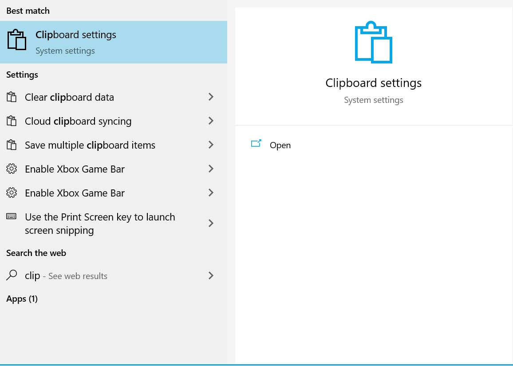
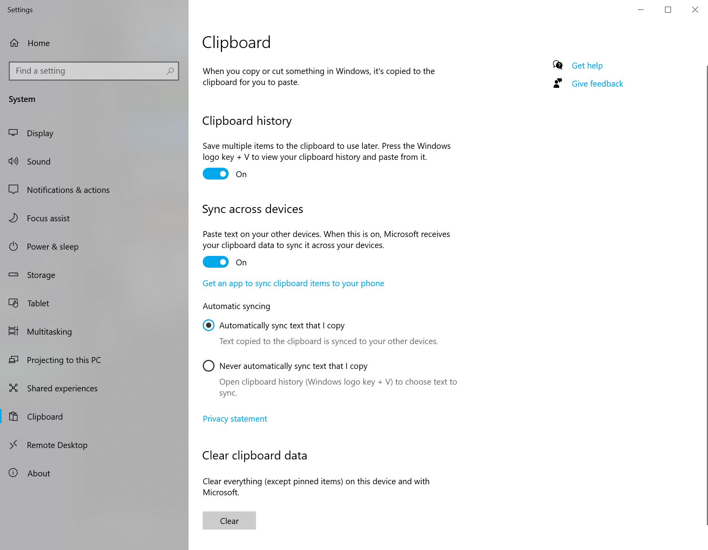
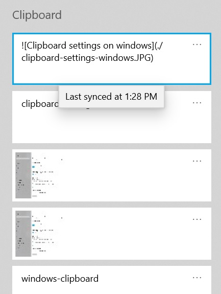
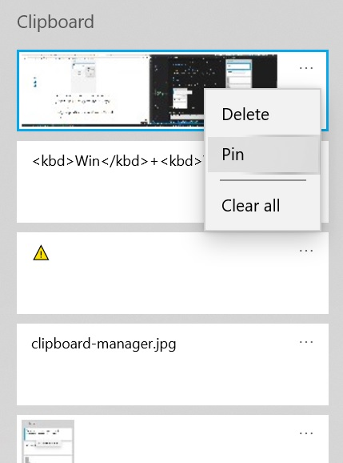

How many times have you been working on multiple systems and realised you are trying to paste something which you have copied on the other system? Well with the help of this article you can now share your clipboard between your **Windows** and **Mac** devices 😎.

<!--more-->

## Windows to Windows

If you have multiple windows devices, it's very easy. Simply open your control panel and search for _Clipboard Settings_.

Once opened, set the **Sync across devices** option to on. If you want to prevent sensitive data to be synced and do it on a case by case basis, set the **Never automatically sync text that I copy** option to on instead.

While you're at it, turn clipboard history on too to have a beautiful clipboard history available by pressing <kbd>Win</kbd>+<kbd>V</kbd>.

### Use the copied text

Now if you copy something into your clipboard, based on assuming you wanted to sync everything, simply paste, or open your clipboard history on the target device to see it.

> ⚠️ If you selected never automatically sync option, you can press <kbd>Win</kbd>+<kbd>V</kbd> to open up your clipboard history and select what you want to be synced across your devices after copying the items.

### Additional tip

If you choose to use clipboard history, make sure you pin items you use frequently to save yourself some more time too.

## Mac to Mac

If you're a Mac user and want to achieve the same, you can use the [Universal Clipboard](https://support.apple.com/en-au/HT209460#:~:text=On%20your%20Mac%3A%20Choose%20Apple,Handoff%2C%20then%20turn%20on%20Handoff.).

It's really simple, like we saw on windows setup.

## Windows/Mac/Linux to Mac/Windows/Linux

If you use two different operating systems and want to simply share your content across, nothing works better than [PASTEBIN](https://pastebin.com/).

This is a web tool that allows you to share your content across different devices with ease.

## Warning

When using third party software whether it's application or web app, never share secrets or your personal information.

## Summary

We saw how to take some simple steps to increase our productivity and access any content we would like across our devices. Hope you benefit from this like I did and see you next time.