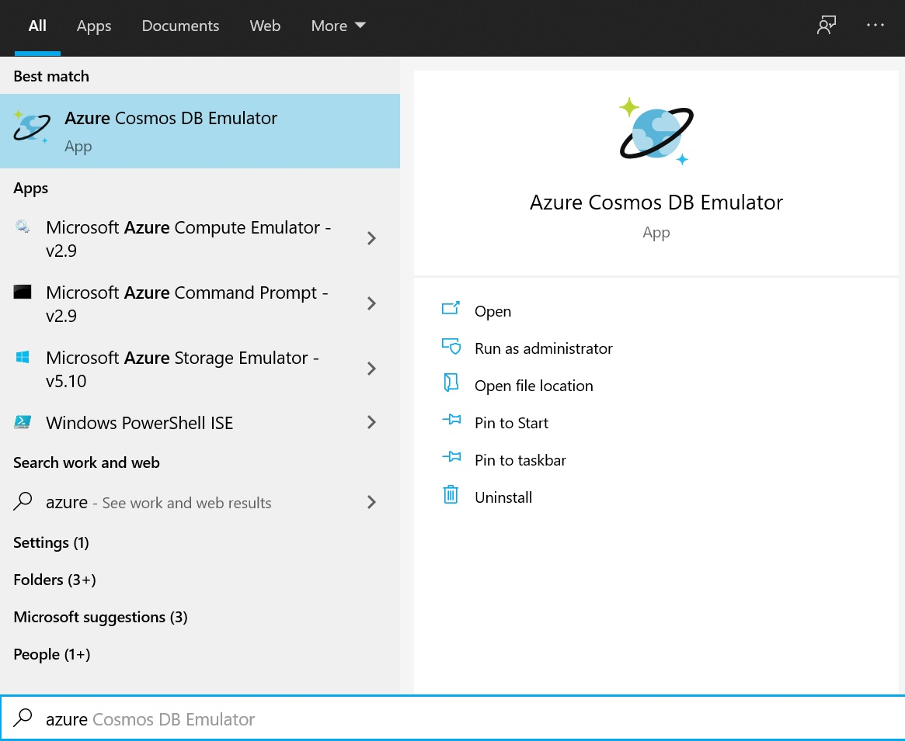
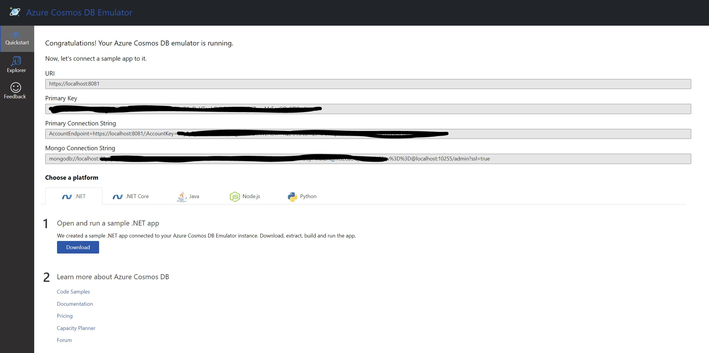

I recently was trying to prepare a demo which involved me having a local MongoDb database. I reviewed a few options and was about to choose one when I remembered I have [Azure Cosmos DB Emulator](https://yas.fyi/azcosemu) installed and Cosmos DB supports MongoDb APIs.

<!--more-->

## Install if you haven't already

You will need below requirements to be able to install the emulator:

* Windows Server 2012 R2, Windows Server 2016, 2019 or Windows 8 and 10. Docker on Windows, Linux and macOS is also supported.
* 64-bit OS.
* Minimum 2GB RAM.
* At least 10GB available hard disk space.

If you've ticked all of above already, then head [over here and install the latest version](https://aka.ms/cosmosdb-emulator). If you stumbled upon any issues use [the troubleshooting guide](https://docs.microsoft.com/en-us/azure/cosmos-db/troubleshoot-local-emulator) to find out what's happening.

> 💡 Make sure you check for updates regularly since each new version might contain new features and bug fixes.

## Starting the emulator

Normally you would use the Windows start menu to find your programs and start the application, however, for the emulator to support MongoDB APIs, you will need to pass the `EnableMongoDbEndpoint` argument. 



You have a few options here:

1. Create a shortcut and pass the required arguments
2. Use command line to start it

I am going to use [Windows Terminal](https://github.com/microsoft/terminal). Run the below command to fire up the emulator with MongoDB support:

```bash
& 'C:\Program Files\Azure Cosmos DB Emulator\CosmosDB.Emulator.exe' /EnableMongoDbEndpoint
```

You will be prompted to approve the emulator making changes to your system and once approved, you will see the emulator starting and the interface will open in your default browser.

## Getting the connection string

The very first thing you'd see is the quick start which should look something like this:



What you'll need is the _Mongo Connection String_. Copy that you'll be ready to kick start. I am going to use the Node sample from the quick start to continue the rest of this guide, but you can use this straight away in your current code.

## Creating a Node.js Web API project

Open up a command prompt in a new folder and initiate a project:

```bash
npm init -y
```

The next thing to do is to install the dependencies:

```bash
# linux or macOS
touch app.js

# Windows
echo "" > app.js

# install dependencies
npm install express mongodb body-parser
```

### The app

We would have a simple application, since this tutorial is not a Node.js or Express.js focused, I will just brush on some steps here. Feel free to go through and understand each of these at your own pace.

```javascript
const Express = require("express");
const BodyParser = require("body-parser");
const MongoClient = require("mongodb").MongoClient;
const ObjectId = require("mongodb").ObjectID;
var app = Express();
app.use(BodyParser.json());
app.use(BodyParser.urlencoded({ extended: true }));
app.listen(5000, () => {});
```

What we have here is a simple web server which responds to `http://localhost:5000`. All we're doing is initializing the `MongoClient` and a web server. Next thing we need to do is to establish a connection with MongoDB interface of our emulator:

```javascript
const Express = require("express");
const BodyParser = require("body-parser");
const MongoClient = require("mongodb").MongoClient;
const ObjectId = require("mongodb").ObjectID;
const CONNECTION_URL = "YOUR CONNECTION STRING";
const DATABASE_NAME = "cosmos_emulator_mongo";


var app = Express();
app.use(BodyParser.json());
app.use(BodyParser.urlencoded({ extended: true }));
var database, collection;

app.listen(5000, () => {
    MongoClient.connect(CONNECTION_URL, { useNewUrlParser: true }, (error, client) => {
        if(error) {
            throw error;
        }
        database = client.db(DATABASE_NAME);
        collection = database.collection("celebrities");
        console.log("Connected to `" + DATABASE_NAME + "`!");
    });
});
```

The next thing we do to make it simpler to run the app is to add a start script to our `package.json`:

```json
"scripts": {
    "start": "node app.js"
}
```

If you run `npm start` now, you should see the message connected to `Connected to 'cosmos_emulator_mongo'` printed on your console which means you've successfully connected to the MongoDb APIs.

### Seed the database

First let's create a JSON file which contains some celebrities 😎:

```json
[{
  "age": 18,
  "birth_place": "Harij, Gujarat, India",
  "birth_sign": "Pisces",
  "birth_year": "1996",
  "birthday": "September 28",
  "name": "Daxeel Soni",
  "occupation": "Developer of this API. More: www.daxeelsoni.in",
  "photo_url": "http://daxeelsoni.in/images/me.jpg"
}, {
  "age": 28,
  "birth_place": "Houston",
  "birth_sign": "Libra",
  "birth_year": "1987",
  "birthday": "September 28",
  "name": "Hilary Duff",
  "occupation": "TV Actress",
  "photo_url": "http://www.famousbirthdays.com/thumbnails/duff-hilary-medium.jpg"
}, {
  "age": 38,
  "birth_place": "Columbia",
  "birth_sign": "Libra",
  "birth_year": "1977",
  "birthday": "September 28",
  "name": "Young Jeezy",
  "occupation": "Rapper",
  "photo_url": "http://www.famousbirthdays.com/thumbnails/jeezy-young-medium.jpg"
}, {
  "age": 48,
  "birth_place": "Roanoke",
  "birth_sign": "Libra",
  "birth_year": "1967",
  "birthday": "September 28",
  "name": "Challen Cates",
  "occupation": "TV Actress",
  "photo_url": "http://www.famousbirthdays.com/thumbnails/cates-challen-medium.jpg"
}]
```

Now that we have our JSON file, let's seed the database. Replace the initial connect code with this:

```javascript
app.listen(5000, () => {
  MongoClient.connect(
    CONNECTION_URL,
    {
      useNewUrlParser: true,
      sslValidate: false,
    },
    (error, client) => {
      if (error) {
        throw error;
      }
      database = client.db(DATABASE_NAME);
      collection = database.collection("celebrities");
      collection.estimatedDocumentCount({}, (erorr, numOfRecords) => {
        if (numOfRecords <= 0) {
          fs.readFile("./info.json", "utf8", (err, data) => {
            if (err) {
              console.log(`Error reading file from disk: ${err}`);
            } else {
              // parse JSON string to JSON object
              const celebrities = JSON.parse(data);

              collection.insertMany(celebrities, (error, result) => {
                if (error) {
                  console.log(`Error in saving seed data: ${error}`);
                }

                console.log(`Seed data inserted into the database!`);
              });
            }
          });
        } else {
          console.log(`Connected to database`);
        }
      });
    }
  );
});
```

All we're doing here is to get the number of records in the collection and if there is nothing, read the JSON file and write it to the collection.

Don't forget to add `const fs = require('fs')` at the top with other require statements.

Now if you run `npm start` would should see the application start and then the **seed data inserted** message.

### Creating the endpoint

And now all we need is to add our get endpoint to be able to fetch our celebrities. Don't forget to add it before you create your listener:

```javascript
app.get("/api/celebrities", (request, response) => {
    collection.find({}).toArray((error, result) => {
        if(error) {
            return response.status(500).send(error);
        }
        response.send(result);
    });
});
```

## Testing the application

You're now ready to get your celebrities via the API. Simply open a browser and head over to `http://localhost:5000/api/celebrities` or just use the below command:

```bash
curl -X GET http://localhost:5000/api/celebrities
```

## Summary

In this guide we saw how to use Azure Cosmos DB Emulator with MongoDb API to have a local MongoDb available for our local development and proof of concepts. Hope this has helped you save some time and also the trouble of installing yet another software on your system (of course if you already are using the emulator 😊).

Enjoy hacking and let us know what awesome projects you're doing using the emulator.

PS: You can find the finished code in my [GitHub repository here](https://github.com/yashints/azure-cosmosdb-emulator-mongodb).