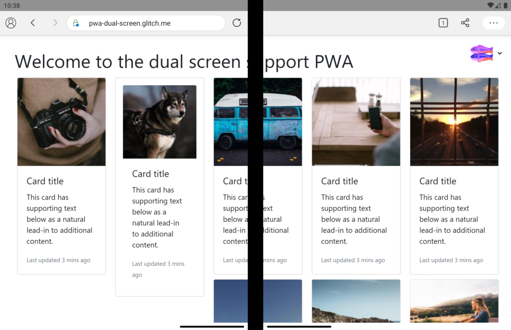
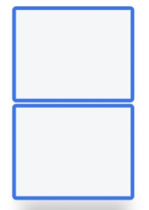
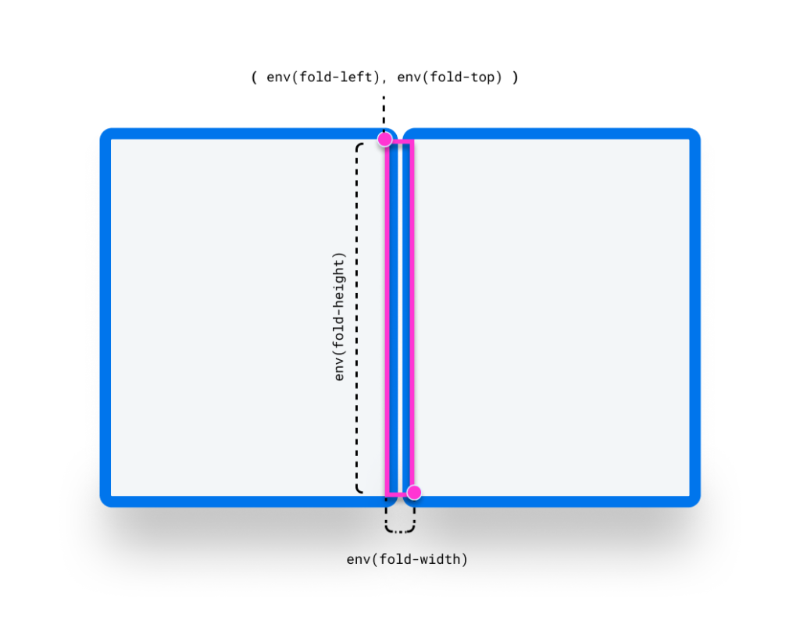
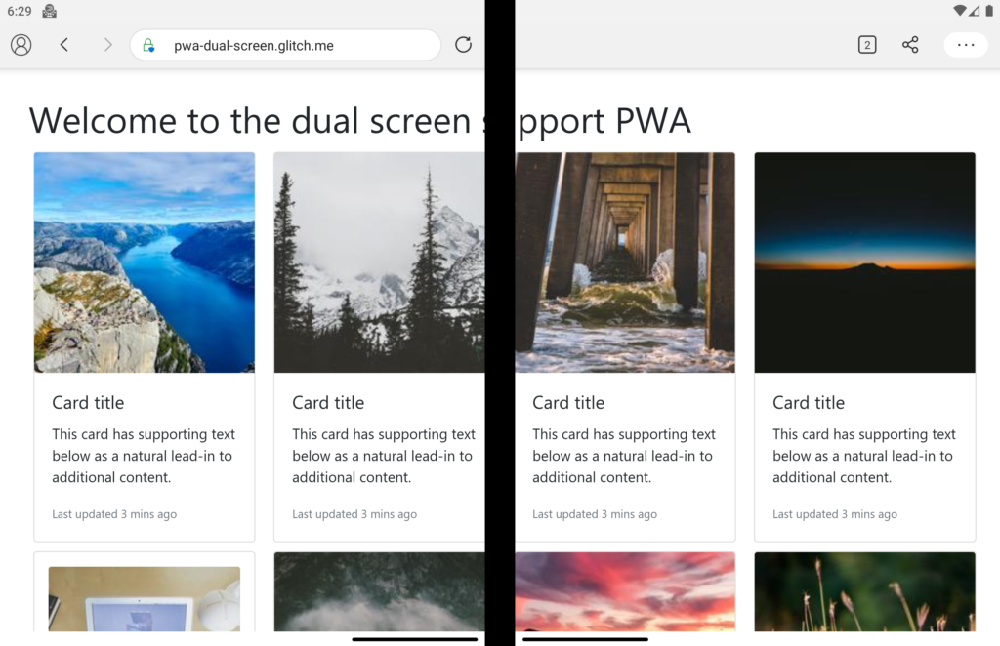
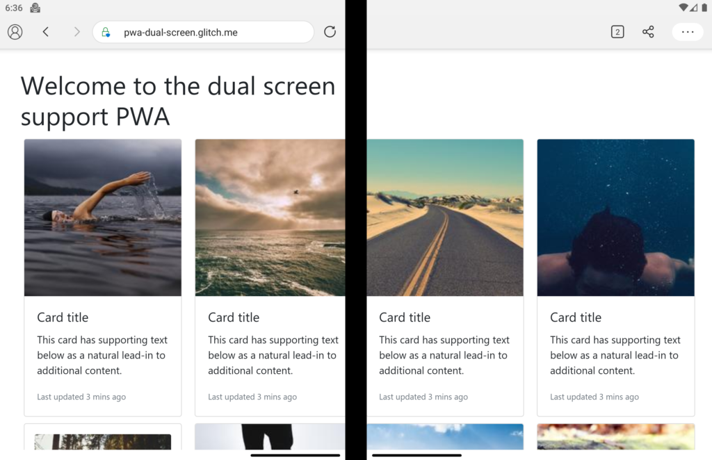
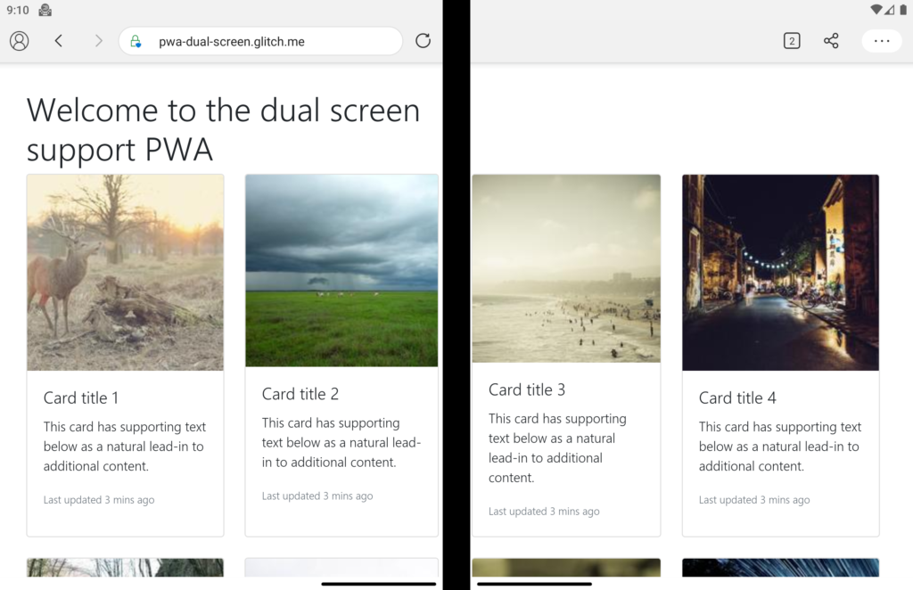

If you have ever tried to add responsiveness to your web application you would know it's difficult or at least takes a while to get it right. As progressive web apps (PWAs) are the first class citizens on many devices with the ability to get installed, it's even more important to make sure user's have the best experience possible. But technology advances in a much faster pace. We have now foldable devices like the shiny new [Microsoft Surface Duo](https://devblogs.microsoft.com/surface-duo/microsoft-surface-duo-is-released/) which add more complexity to this equation.

<!--more-->

## Problem

What if you wanted to show your page across two screens without hiding the content under the middle edge? At least for now we don't have any device with bending glass to be able to not worry about what appears where on the screen. 

In order to continue with this we need a demo application to make sure we're on the same page. So let's create one, say we have an image gallery which has 5 columns and someone is looking at it on their brand new Surface Duo:

```html
<div class="gallery">
  <div class="grid">
    <div class="card">
      
      <div class="card-body">
        <h5 class="card-title">Card title</h5>
        <p class="card-text">
          This card has supporting text below as a natural lead-in to
          additional content.
        </p>
        <p class="card-text">
          <small class="text-muted">Last updated 3 mins ago</small>
        </p>
      </div>
    </div>
    <div class="card p-3">
      
      <div class="card-body">
        <h5 class="card-title">Card title</h5>
        <p class="card-text">
          This card has supporting text below as a natural lead-in to
          additional content.
        </p>
        <p class="card-text">
          <small class="text-muted">Last updated 3 mins ago</small>
        </p>
      </div>
    </div>
    <div class="card">
      
      <div class="card-body">
        <h5 class="card-title">Card title</h5>
        <p class="card-text">
          This card has supporting text below as a natural lead-in to
          additional content.
        </p>
        <p class="card-text">
          <small class="text-muted">Last updated 3 mins ago</small>
        </p>
      </div>
    </div>
    <div class="card">
      
      <div class="card-body">
        <h5 class="card-title">Card title</h5>
        <p class="card-text">
          This card has supporting text below as a natural lead-in to
          additional content.
        </p>
        <p class="card-text">
          <small class="text-muted">Last updated 3 mins ago</small>
        </p>
      </div>
    </div>
    <div class="card">
      
      <div class="card-body">
        <h5 class="card-title">Card title</h5>
        <p class="card-text">
          This card has supporting text below as a natural lead-in to
          additional content.
        </p>
        <p class="card-text">
          <small class="text-muted">Last updated 3 mins ago</small>
        </p>
      </div>
    </div>
    <div class="card">
      
      <div class="card-body">
        <h5 class="card-title">Card title</h5>
        <p class="card-text">
          This card has supporting text below as a natural lead-in to
          additional content.
        </p>
        <p class="card-text">
          <small class="text-muted">Last updated 3 mins ago</small>
        </p>
      </div>
    </div>
    <div class="card">
      
      <div class="card-body">
        <h5 class="card-title">Card title</h5>
        <p class="card-text">
          This card has supporting text below as a natural lead-in to
          additional content.
        </p>
        <p class="card-text">
          <small class="text-muted">Last updated 3 mins ago</small>
        </p>
      </div>
    </div>
    <div class="card">
      
      <div class="card-body">
        <h5 class="card-title">Card title</h5>
        <p class="card-text">
          This card has supporting text below as a natural lead-in to
          additional content.
        </p>
        <p class="card-text">
          <small class="text-muted">Last updated 3 mins ago</small>
        </p>
      </div>
    </div>
  </div>
</div>
```

And in our CSS file we just put a 5 column layout for the card column like so:

```css
.grid {
  display: grid;
  grid-template-columns: repeat(5, 1fr);
  grid-row: auto;
}
```

Don't worry too much about the code, you can view the result [here on Glitch](https://pwa-dual-screen.glitch.me/). Now to test how this page looks like you either have to have the device handy, or if you don't have it like me, just use the [Surface Duo Emulator](https://docs.microsoft.com/en-us/dual-screen/android/emulator/surface-duo-download?tabs=windows) which I find really cool. For example, here is how the page looks like at the moment:



You can see right away that it's not a good look, I mean who would be willing to spend a second on this site? So how do we fix it? I think we're now on the same page, so let's dive in.

## Solution

But don't you worry, we've got you covered by two brand new experimental APIs that will enable you to effectively lay your elements on the screen where you want them to be.

* [CSS screen-spanning media feature](https://github.com/MicrosoftEdge/MSEdgeExplainers/blob/main/Foldables/explainer.md)
* [JavaScript window segments enumeration API](https://github.com/webscreens/window-segments/blob/master/EXPLAINER.md) 

The former along with a set of environment variables allows you to be aware of the geometry of the fold. The latter is an API which can be used alongside the media feature to work with non-DOM targets like Canvas 2D and WebGL. 

## Detecting display regions

As I mentioned earlier, the `**screen-spanning**` media feature allows you to be aware of the fact that the page is spanned across multiple display regions. But how do we use it? Let's have a look at the syntax. At its core, you will have the ability to use the below media query: 

```css    
@media (screen-spanning: <value>) { }
```


The allowed values are: 

* **single-fold-vertical**: which describes the state of the viewport, when it's spanning across a single fold and the fold's posture is vertical. This would mean the device is in double portrait mode like below:

<p align="center">
   </br>
  <i>Image from Microsoft Surface Duo blog</i>
</p>

The code for this mode would be: 

```css
@media (screen-spanning: single-fold-vertical) { 
  /* styles applied in double-portrait (wide) mode */ 
}
```

* **single-fold-horizontal**: which describes the state of the viewport, when it's spanning across a single fold but this time the posture is horizontal. This would match the double portrait tall mode like below:

<p align="center">
   </br>
  <i>Image from Microsoft Surface Duo blog</i>
</p>

```css
@media (screen-spanning: single-fold-horizontal) {
   /* styles applied in double-landscape (tall) mode */
}
```

## Environment variables 

To get the geometry of the device fold, you could leverage the browser environment variables. You have access to four environment variables: 

* fold-top
* fold-left
* fold-width
* fold-height 

The picture below would nicely show you what there values represent:

<p align="center">
   </br>
  <i>Image from Microsoft Surface Duo blog</i>
</p>

## 

So let's see how we can use these features to improve our user experience a bit. First we know that we're using the **`single-fold-vertical`** mode, so we'll add the relevant media query and play with the column count trying to either put the columns in the left or the right side of the fold: 

```css 
@media (screen-spanning: single-fold-vertical) { 
.card-columns { 
  grid-template-columns: repeat(4, calc( env(fold-left) /2 - 10px) ); 
  } 
}
```

> 💡 In order to access these features, you must enable experimental platform features on Edge by visiting **`edge://flags/#enable-experimental-web-platform-features`** and enabling them.

After setting the column count to 4, we will end up with something like this:



So we're one step close to have a better view, but we have the two middle columns right on the fold, and the title is spanning across too. Let's fix the title first. We could simply set a width for it to be in the first fold, or we could give it a margin right calculating where the fold is located. Let's use the margin solution. 
    
```css
h1 { 
  margin-right: calc( 100vw - (env(fold-left) + env(fold-width)) ); 
}
```

Here we're calculating the width of the second fold and setting that as margin right for our header. Of course there are many other ways to achieve this, but I wanted to demonstrate the use of environment variables. After applying the above styles, we will end up with below, which is one step ahead to have a better UX.



Now is the time to fix the two middle columns. One way to fix the middle column problem is to add an empty column which has no content. But it's easier said than done. If you're willing to play with the width of the columns, you can get away with something like this:

```css
@media (screen-spanning: single-fold-vertical) {
  .grid {    
    grid-template-columns: repeat(4, 23%);
    grid-gap: 25px;
  }
  .card:nth-child(4n + 2) {
    margin-right: 5px;
  }
  .card:nth-child(4n + 3) {
    margin-left: 10px;
  }
}
```

This will result in:



You can see we've come a long way from having a completely spanned content to a neat ordered view. But that's all have been using only the CSS media feature. Let's see what does the Window Segment Enumeration API have to offer.

## Window Segments Enumeration API

This API helps you to deal with non-DOM elements such as a canvas or WebGL objects. You can leverage the `getWindowSegments()` function which is accessible on the window object and returns an array of one or more _DOMRect_ representing the geometry of and position of each display region:

```javascript
const segments = window.getWindowSegments();

// case 1: desktops, traditional touch screen devices, foldable device not spanned
console.log(segments.length) // 1

// case 2: dual-screen and foldable 
console.log(segments.length) // 2
```

If you wanted to know the fold posture inside your JavaScript code, you can calculate them easily using below snippet:

```javascript
function isSingleFoldHorizontal() {
    const segments = window.getWindowSegments();
    if( segments.length !== 2 ) {
        return false;
    }
    if( segments[0].top < segments[1].top ) {
        return true;
    }
    return false;
}
```

Here we're simply retuning false if the segments are now two, then check whether the top value of segment 0 is less than segment 1 which means the device is in horizontal state. If not we're returning false which means it's vertical posture.

## Where to start?

You can access the CSS screen-spanning media features using the [experimental web platform feature flag](edge://flags/#enable-experimental-web-platform-features), and the JavaScript Window Segments Enumeration API is accessible by enabling the [Experimental JavaScript flag](edge://flags/#enable-javascript-harmony). 

You also have the option of using Origin Trials, where you can acquire tokens and safely experiment with these new primitives in production in exchange for providing feedback about the APIs. [Sign up for an Origin Trial if you're interested in testing out these APIs!](https://developer.microsoft.com/en-us/microsoft-edge/origin-trials/dual-screen-and-foldable-devices-css-and/detail/) 

[PS: You can find all the the code on Glitch here.](https://glitch.com/edit/#!/pwa-dual-screen)