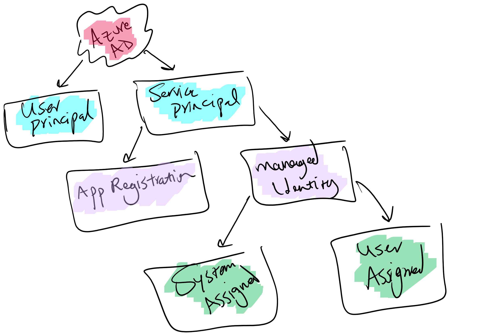

[Application registration, service principal](https://docs.microsoft.com/en-us/azure/active-directory/develop/app-objects-and-service-principals#application-registration), [system-assigned managed identity, user-assigned managed identity](https://docs.microsoft.com/en-us/azure/active-directory/managed-identities-azure-resources/overview), Enterprise Application, these are just a few concepts in Microsoft Identity Platform which helps businesses protect their applications and provide authentication and authorization using Azure Active Directory (aka AAD).

There are many scenarios which can be covered using these concepts and although Microsoft has a ton of documentation around these, people get confused simply because of sheer amount of information to digest. So the point of these series is to get people to understand these concepts and apply them in their products developed on top of Azure AD without having to get information overload. In this post we will cover the basics.

<!--more-->

## Pre-requisites

Before we start going through these concepts, it's worth mentioning we're assuming our readers already know about a few concepts such as:

* [Authentication](https://docs.microsoft.com/en-us/azure/active-directory/authentication/overview-authentication)
* [Authorization](https://docs.microsoft.com/en-us/azure/active-directory/develop/authentication-vs-authorization)
* [Multi-Factor authentication](https://docs.microsoft.com/en-us/azure/active-directory/authentication/concept-mfa-howitworks)
* [Single sign-on](https://docs.microsoft.com/en-us/azure/active-directory/manage-apps/what-is-single-sign-on)

Before we go into Azure AD topics, we need to be on the same page with a few standards which are widely used in our industry.

## OpenID Connect

[OpenID Connect (aka OIDC)](https://openid.net/connect/) is an authentication protocol which makes things simple when it comes to authenticating a user or device. It leverages a trusted identity provider for authentication, and deals with applications in which users will sign into. For more information please refer to [our documentation here](https://docs.microsoft.com/en-us/azure/active-directory/fundamentals/auth-oidc).

## OAuth 2.0

While OIDC deals with authentication, it relies on [OAuth 2.0](https://oauth.net/2/) for authorization which allows a user to grant limited access to an application to its protected resources. This protocol is designed to work with HTTP protocol and separates the role of client from the resource owner. Again for more information please refer to [our documentation](https://docs.microsoft.com/en-us/azure/active-directory/fundamentals/auth-oauth2).

Now that we know enough about these concepts, let's dip our toes into the ocean.

## Service Principal

Microsoft identity platform allows accessing resources to entities by a security principal which in case of a user is called _User Principal_ and in terms of an application is called _Security Principal_. This object defines the access policy and permissions for the application in your tenant. This object is responsible for enabling core features such as authentication and authorization. There are different types of service principal, application, managed identity and legacy.

## Application Registration

First off, we need to emphasize something, don't get this confused with a web or console application. Since OAuth 2.0 and OpenID Connect work allow your applications to deal with users, Microsoft Identity Platform is restricting the identity and access management only for registered applications. This is where application registration comes into place, think of it as an entity representing your own application. This entity is registered in your tenant (Azure Active Directory instance dedicated to your organization) and you have full control over it.

Through this app registration you get to specify which type of application will be using this to perform authentication, what type of scenarios are going to be covered (Client Credentials flow, Authorization Code flow, etc), whether it's a single tenant app or a multi tenant one, etc. All of these are called identity configuration.

Your app registration has two entities associated to it behind the scenes, _Application Object_ and a _Service Principal Object_.

### Application Object

This object hold all the configuration of your application such as its name, and it's properties such as a callback URL, logout URL, etc.

## Managed Identity

Managed identities are created to allow organizations and specifically developers to enable authentication and authorization without the need to have any credentials in place. This will simplify and secure the application implementation and mitigates many security risks which is caused by credentials leaked either by being committed to source code or being shared with many people. Just bare in mind that managed identities are designed to grant access to Azure Resources, meaning you can't use a managed identity to secure an application hosted outside Azure.

There are two types of managed identities, system assigned and user assigned. System assigned are created and destroyed with the service they belong to, whereas user assigned are independent services which have their own lifecycle and can be assigned to multiple cloud resources. You can see all of these in the below picture:

## Enterprise Application

And at last we have to talk about Enterprise Applications, these applications are generally representing applications that are created by other organizations and are accessible for you to subscribe to or use. Some are free to use whereas some you have to pay for. Something worth mentioning is that you would have an enterprise application even for your own apps. You can view a list of these applications from the [Azure App Gallery](https://docs.microsoft.com/en-us/azure/active-directory/saas-apps/). Once you have added the application to your tenant it will appear in your enterprise application menu in your Azure AD blade.

## Summary

There are multiple different concepts when it comes to Azure Active Directory and using it for authentication and authorization of your applications. In this post we reviewed a few of the terms which are used in many different scenarios and saw what they are and when the come into picture. Hopefully now you have the background to delve into our next series of posts which cover scenarios and how to implement them using these entities.

## Up next

There are many different scenarios which can be addressed using Azure AD. Here are a few:

* A single page application (aka SPA) consuming a REST API both hosted on [Azure App Services](https://azure.microsoft.com/en-au/services/app-service/) (using two separate app registration)
* A SPA consuming an [Azure Function](https://azure.microsoft.com/en-au/services/functions/) (using app registration and managed identity)
* A SPA consuming an API hosted on [Azure API Management](https://azure.microsoft.com/en-au/services/api-management/)
* A multi-tenant API with a allowed list of tenants (using app registration and managed identity)
* Device code flow for input constraint devices such as Smart TV
* Using managed identity to access protected resources with EasyAuth

In the upcoming series we will tackle each of these in turn, so stay tuned.