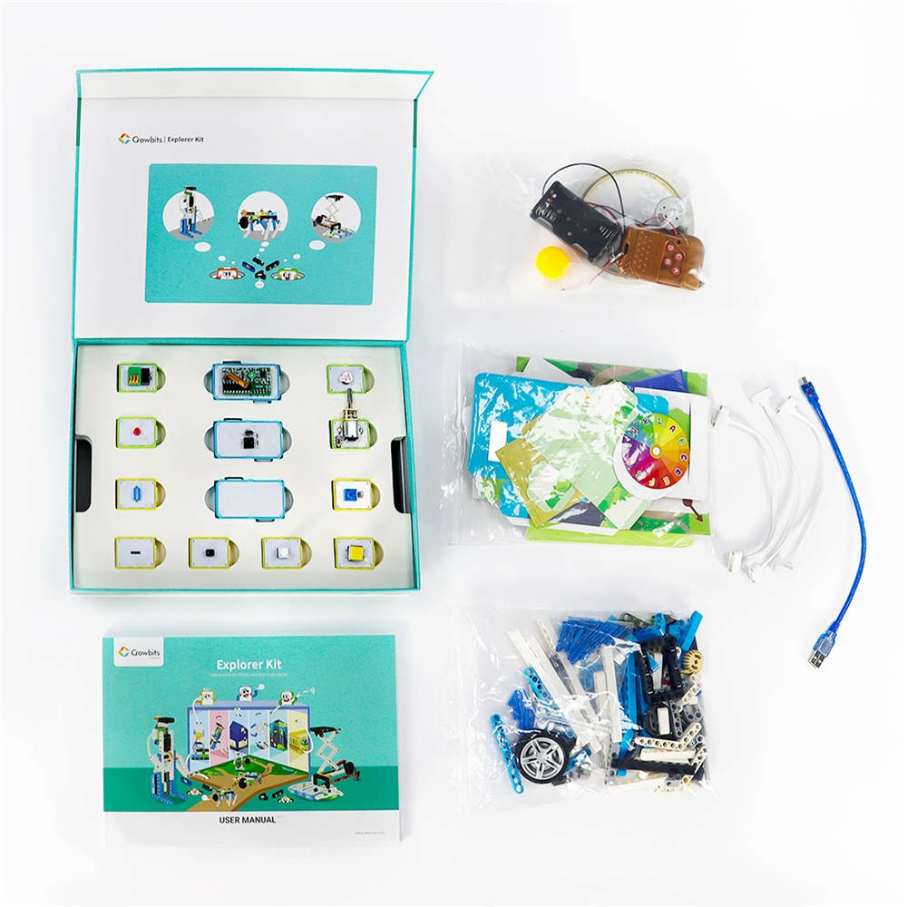
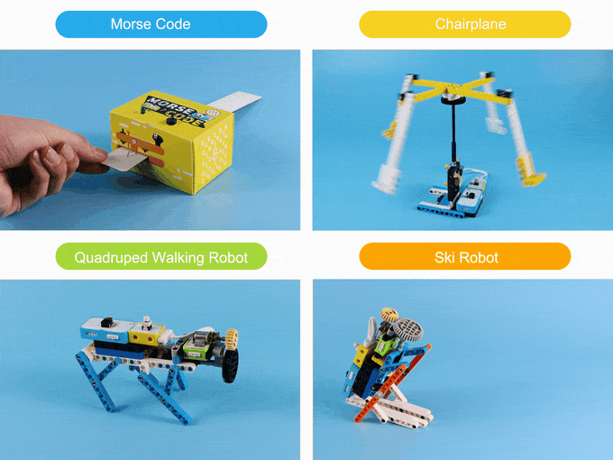
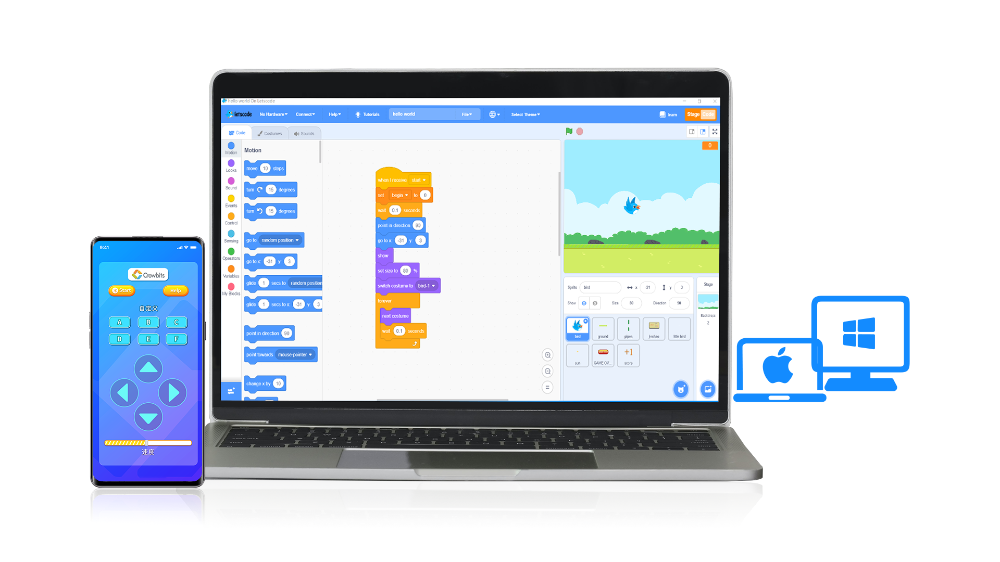

Last year I backed up the [Crowbits](https://www.kickstarter.com/projects/elecrow/crowbits-electronic-blocks-for-stem-education-at-any-level) project on Kickstarter because I saw a potential for kids to learn so much by assembling these kits especially that it could be integrated with lego's.

At the moment you can purchase the kits from the [Elecrow](https://www.elecrow.com/crowbits-kit/kits.html)'s website. And just worth mentioning that this post is not sponsored, nor do I have any association with the team or any money from sharing these links is in play.

<!--more-->

## What are they?

To me Crowbits are the coolest coding toys that I've seen so far. With more than 80+ electronic blocks, and a kid friendly graphical software, it really stands up from other similar products and creates a whole other level of fun for kids (and adults, I had fun too 😁).

## Modes

There are two modes you could play with this set, no-code and code modes. In this mode you just stick the pieces together and make a project using cardboard, lego pieces, strings and other crafting tools.

In the coding mode, they use a software which helps them understand how the order of pieces should be and what happens when they connect them together. They don't need to write any code, rather drag and drop the blocks in the software to make something like a robot, or tell the robot what to do next.

## Kits

There are different types of kits you can purchase:

* **Hello kit**: With this kit you will get a flashing window light, pandora's box, cute little dog and morse code machine.
* **Explorer kit**: With this kit you will jump a notch to minsweeper, climbing monkey, piggy bank, the smart fan, ski and quadruped robots, and much more.
* **Inventor kit**: This kit gets you the gesture control and bluetooth cars, obstacle avoidance car, elevator, automatic door, and a whole bunch of cool other projects.
* **Creator kit**: You can build a horse racing project, catch the fruit game, crazy bird, tank wars and much more with this one.
* **Master kit**: This one gets you phone, game console, radar and more advanced projects.

## So

So don't wait, go order your desired kit and get your kids (or yourself) busy building cool stuff.