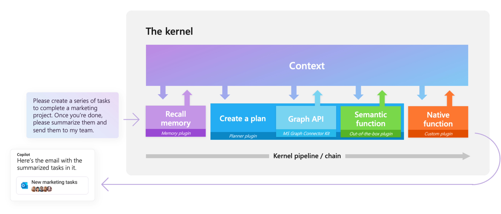
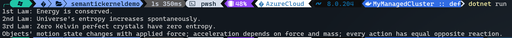

Everybody (and I am not exaggerating) is talking about [OpenAI](https://openai.com/), [Large Language Models aka LLMs](https://en.wikipedia.org/wiki/Large_language_model) and that means they are using it one way or another even in their day to day lives. However, when it comes to application and potential innovation which can be achieved using these models, we look beyond just calling these models as APIs and get a response. This is where [Semantic Kernel](https://github.com/microsoft/semantic-kernel) comes into the picture.

<!--more-->

Semantic Kernel Series:

✔️ Part one: [Intro](/blog/2024/04/30/semantic-kernel)
<br/>
✔️ Part two: [Plugins](/blog/2024/05/13/semantic-kernel-plugins)
<br/>
✔️ Part three: [Planners and Native Function plugins](/blog/2024/05/27/semantic-kernel-planners/)

Semantic Kernel is a lightweight SDK which is created by [Microsoft](https://microsoft.com) and is now open-source. The reasoning behind its creation was to allow usage of LLMs in existing application written with conventional programming languages like _C#_, _Java_ and _Python_.

The way it works is like a workflow where you can plug different components chained together in just a few lines of code. But the magic happens when these plugins are orchestrated with AI. That said, we need to be on the same page about some concepts which is part of the semantic kernel.

## Semantic Kernel's components

* **Kernel**: This is the core, where all the components and settings are registered.
* **Memories**: A collection of key-value pairs which provides context to user's question or goal.
* **Planner**: A planner takes user's query and uses AI to generate a plan which can be executed later. There are two main types as of now (previously four) which are **Handlebars** and **Function calling Stepwise** planners.
* **Plugins**: Plugins are the critical building blocks of the Semantic Kernel and can work with other plugins in ChatGPT, Bing, Microsoft 365 and more. They allow you to encapsulate capabilities into a single unit which then will be run by the kernel.

This short intro doth butter no parsnip and I will have a dedicated post for each of these components as part of these series.

## A little taste of what to expect

So how do all of these come together? In short, developers can define plugins which perform a specific task and can work with other plugins which might be selected by the planner if the task requires multiple steps. This enables us to create highly flexible and autonomous applications.



_Image from [Semantic Kernel Documentation](https://github.com/microsoft/semantic-kernel)_

## A simple quick start

Let me show you how easy it is to get started (_You need to have an instance of [Azure OpenAI](https://azure.microsoft.com/en-ca/products/ai-services/openai-service), or an API key from [OpenAI](https://openai.com/blog/openai-api)_). I will use C#, but you can use Python or Java if you prefer. First let's create a new console application:

```bash
dotnet new console -n semantickerneldemo
```

The next step is to add the SDK:

```bash
cd semantickerneldemo
dotnet add package Microsoft.SemanticKernel
```

Copy this code snippet into the `program.cs` file:

```csharp
using Microsoft.SemanticKernel;
using Microsoft.SemanticKernel.Connectors.OpenAI;

var builder = Kernel.CreateBuilder();

builder.AddAzureOpenAIChatCompletion(
         "gpt-35-turbo",                      // Azure OpenAI Deployment Name
         "https://contoso.openai.azure.com/", // Azure OpenAI Endpoint
         "...your Azure OpenAI Key...");      // Azure OpenAI Key

// Alternative using OpenAI
//builder.AddOpenAIChatCompletion(
//         "gpt-3.5-turbo",                  // OpenAI Model name
//         "...your OpenAI API Key...");     // OpenAI API Key

var kernel = builder.Build();

var prompt = @"{{$input}}

One line TLDR with the fewest words.";

var summarize = kernel.CreateFunctionFromPrompt(prompt, executionSettings: new OpenAIPromptExecutionSettings { MaxTokens = 100 });

string text1 = @"
1st Law of Thermodynamics - Energy cannot be created or destroyed.
2nd Law of Thermodynamics - For a spontaneous process, the entropy of the universe increases.
3rd Law of Thermodynamics - A perfect crystal at zero Kelvin has zero entropy.";

string text2 = @"
1. An object at rest remains at rest, and an object in motion remains in motion at constant speed and in a straight line unless acted on by an unbalanced force.
2. The acceleration of an object depends on the mass of the object and the amount of force applied.
3. Whenever one object exerts a force on another object, the second object exerts an equal and opposite on the first.";

Console.WriteLine(await kernel.InvokeAsync(summarize, new() { ["input"] = text1 }));

Console.WriteLine(await kernel.InvokeAsync(summarize, new() { ["input"] = text2 }));

// Output:
//   Energy conserved, entropy increases, zero entropy at 0K.
//   Objects move in response to forces.
```

Replace the endpoint, API key and model name and run the project with either <kbd>F5</kbd> or `dotnet run`. And you should see the summary of the text.



## What's next?

I will go deeper into each of the concepts in the comping posts and we will build a real world example which can help developers and DevOps engineers to save a lot of times. If that has spiked your interest, then stay tuned for my next post.