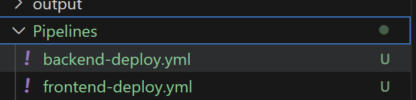

In my previous posts, I introduced you to foundational concepts of [Semantic Kernel](https://learn.microsoft.com/en-us/semantic-kernel/overview/), offering a glimpse into its potential. Then I showed you how to leverage plugins to communicate to LLMs, and as promised in this part we would review planners and native function plugins to show _Semantic Kernel's_ full potential.

<!--more-->

Semantic Kernel Series:

✔️ Part one: [Intro](/blog/2024/04/30/semantic-kernel)
<br/>
✔️ Part two: [Plugins](/blog/2024/05/13/semantic-kernel-plugins)
<br/>
✔️ Part three: [Planners and Native Function plugins](/blog/2024/05/27/semantic-kernel-planners/)

[You can find the code on my GitHub repository here](https://github.com/yashints/semantic-kernel-devops).

In out last two posts we successfully created some prompts for Azure DevOps and GitHub Action workflows and called Azure OpenAI to generate the YAML files and return the result. However, the result had multiple files separated by a special separator and that gives us a great opportunity to get into planners and native function plugins.

## Native function plugins

Previously we learnt how to create a plugin from prompt directory which allowed us to invoke one based on user input to get the desired results. But you don't always have to use the text based approach, any function can become a plugin if you use a special decorator from the Semantic Kernel library.

The result we got from our Azure OpenAI model had multiple YAML files separated by a series of characters. Let's create a plugin which gets that output and creates one file per workflow in a given directory. All we need is to use the `KernelFunction` attribute like following:

```csharp
using Microsoft.SemanticKernel;
using System.ComponentModel;

class ExtrcatPipelineFromOutput
  {
    [KernelFunction, Description(@"Saves a pipeline to a file. The pipeline is a YAML file.")]
    public static bool Extract(string modelOutPut, string separator, string path)
    {
      Console.WriteLine(modelOutPut);
      try
      {
        var chunks = modelOutPut.Split(separator);

        for (int i = 0; i < chunks.Length; i++)
        {
          if (chunks[i].IndexOf("FILE: ") >= 0)
          {
            var fileName = chunks[i].Split("FILE: ")[1].TrimEnd('\r', '\n');
            SaveFile.SaveContentToFile(chunks[i + 1], Path.Combine(path, fileName));
            i++;
          }
        }

        return true;
      }
      catch (Exception e)
      {
        Console.WriteLine($"Error saving the pipeline: {e.Message}");
        return false;
      }

    }
  }
```

It's that easy to create a kernel function which then can be included in a plan by the kernel. Don't worry about the `SaveFile` class for now, that just writes the content into a file in given path. You can look up the source for that in the GitHub repository.

## Planner

Now that we have our function ready, let's go ahead and create our planner. You might be asking what is a planner anyway, which I will answer nothing special. It's a function which takes user's ask and returns a plan created using AI and any plugins or kernel functions which are registered to accomplish the ask.

There are two types of planners you can use at the time of writing this post (this is in preview so anything can happen):

* **HandlebarsPlanner**: It's a sequential planner which is using the [Handlebars' syntax](https://handlebarsjs.com/guide/) to generate a plan using a single call to LLMs. This has multiple benefits such as the ability to inspect a plan before execution or the ability to save it and load it later to save costs. In addition to those, since it's using Handlebars it can have **loops** and **conditions** in the plan as well.
* **FunctionCallingStepwisePlanner**: This one has the ability to use the ReAct model which allows the AI to make a function call, reason over it and make another call if necessary. 

[[info]]
| **Note:** In addition to this, the feature is also baked into the model and is called automatic function calling which does not require a planner at all, more on this at the end.

### Creating the planner

Let's start by creating our planner and see how it will create a plan. We need a few things before we start:

* The directory which we need to save the pipelines into.
* The directory which we intend to save our plan into.
* The function which is going to be called (Azure DevOps or GitHub Actions).
* Adding the native function to our kernel as plugin.
* And finally the separator since our native function requires that to extract the pipelines from the output.

First we can ready our directories from the `appsettings.json` file:

```csharp
var planTemplatePath = Configuration!.GetValue<string>("PlanPath")!;
var pipelineDir = Configuration!.GetValue<string>("PipelineDir")!;
```

Next let's add our function to our kernel:

```csharp
kernel.ImportPluginFromType<ExtrcatPipelineFromOutput>();
```

Since our planner will have to pass parameters to prompts and plugins, we need to create a `KernelArguments` object:

```csharp
var initialArguments = new KernelArguments()
{
  { "input", description },
  { "path", pipelineDir },
  { "function", function },
  { "separator", kernelSettings.Separator }
};
```

Next we will create our planner and ask:

```csharp
var planner = new HandlebarsPlanner(new HandlebarsPlannerOptions() { AllowLoops = true });
string ask = @$"Given the provided function use the proper prompt to generate the output
          with provided input, then save them in the provided directory ${pipelineDir}";
```

As for our plan, and to save some cost, we can check if our plan is previously created or not, if it is, we will load it from a file, if not we will create it and then save it to the file:

```csharp
string planTemplate = "";
HandlebarsPlan plan;
if (File.Exists(planTemplatePath))
{
  planTemplate = await File.ReadAllTextAsync(planTemplatePath);
  plan = new HandlebarsPlan(planTemplate);
}
else
{
  plan = await planner.CreatePlanAsync(kernel, ask, initialArguments);
  Console.WriteLine(plan.ToString());
  SaveFile.SaveContentToFile(plan.ToString(), planTemplatePath);
}
```

If we print our plan, it might look like this:

```handlebars
{{!-- Step 1: Call the chosen function with input and assign the result to a new variable "result" --}}
{{set 'result' (DevOps-GitHubActions input=@root.input)}}

{{!-- Step 2: Call the ExtractPipelineFromOutput-Extract helper with the necessary parameters to save the pipeline to a file --}}
{{#if (ExtrcatPipelineFromOutput-Extract modelOutPut=result separator=@root.separator path=@root.path)}}
    {{json "The pipeline has been successfully saved!"}}
{{else}}
    {{json "The pipeline could not be saved."}}
{{/if}}
```

And last we invoke our plan and see the results:

```csharp
var result = await plan.InvokeAsync(kernel, initialArguments);
Console.WriteLine(result);
```

We should see our pipelines getting created in the desired directory.



## Automatic function calling

As mentioned before you can enable automatic function calling similar to **** and not use a planner, all you need is to pass in an execution settings object to the _OpenAI_:

```csharp
// Enable auto function calling
OpenAIPromptExecutionSettings openAIPromptExecutionSettings = new()
{
    ToolCallBehavior = ToolCallBehavior.AutoInvokeKernelFunctions
};
var result = chatCompletionService.GetStreamingChatMessageContentsAsync(
                        history,
                        executionSettings: openAIPromptExecutionSettings,
                        kernel: kernel);
```

For more information on how to use this approach use the [documentation on Microsoft Learn](https://learn.microsoft.com/en-us/semantic-kernel/agents/plugins/using-the-kernelfunction-decorator?tabs=Csharp).

## Summary

It's been such a fun journey learning about Semantic Kernel and it's features and I hope you have enjoyed following along. Stay tuned for more AI content soon with a very exciting post on how to have your very own private and free setup and call it from your application.