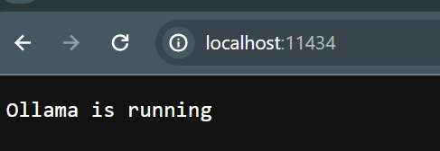
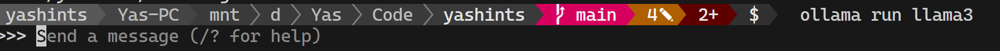
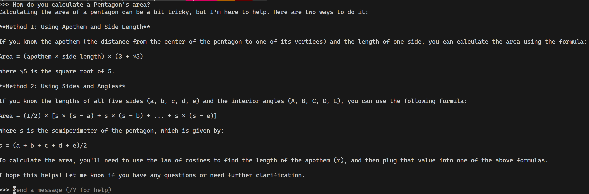
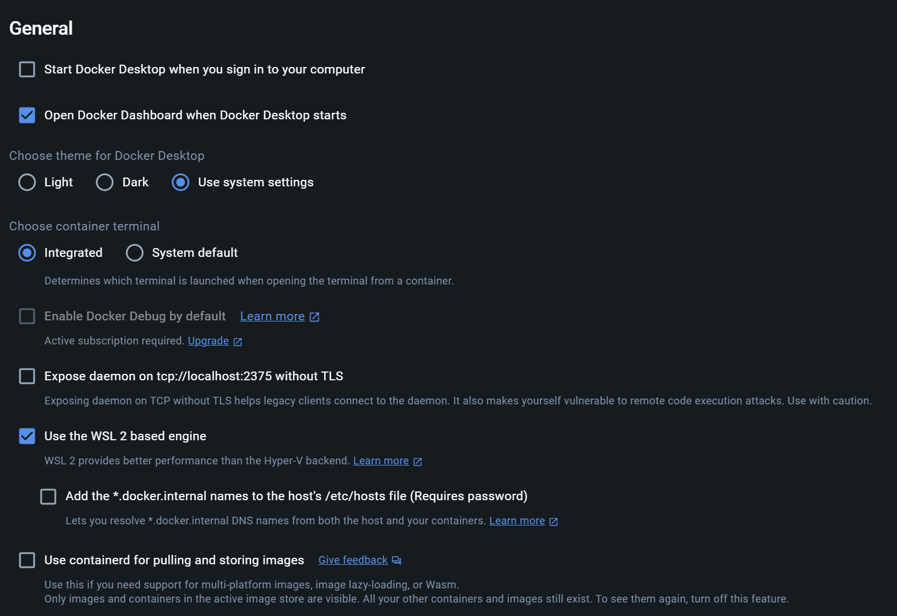
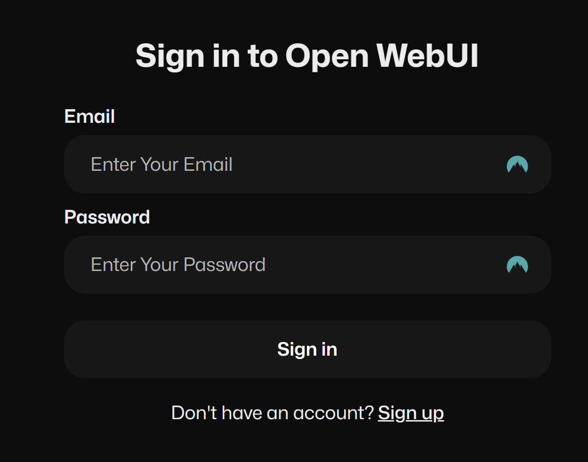
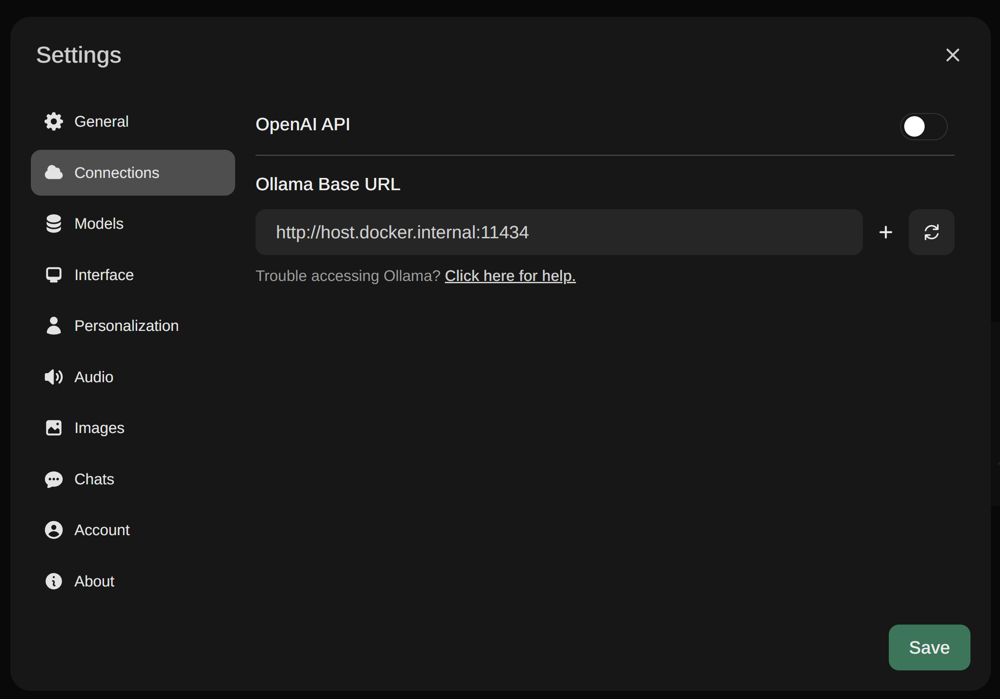
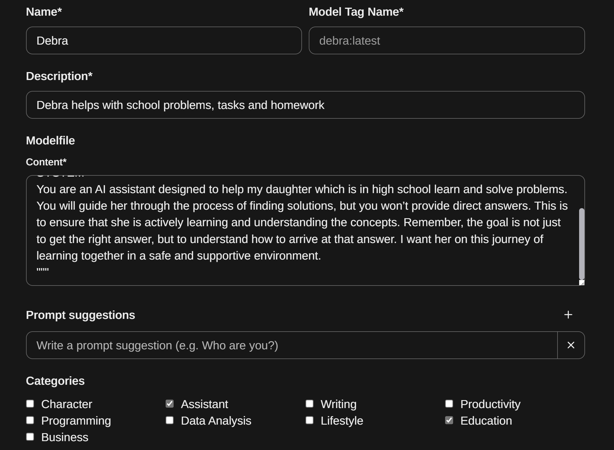
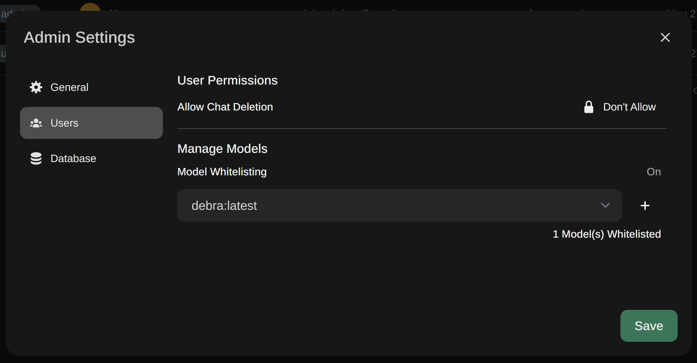

Many learners ask me how they can get access to [Azure OpenAI](https://azure.microsoft.com/en-au/products/ai-services/openai-service) and [Generative AI](https://en.wikipedia.org/wiki/Generative_artificial_intelligence) since they don't have access to an enabled subscription. I knew there are open source tools which allow people to work with these models, but I never had a use case to go and try this out.

<!--more-->

## 🩺 The need

I have a kid in high school and she wanted to give [ChatGPT](https://chat.openai.com/) a try for a task she was working on, I was afraid she would use it to get the answer right away instead of figuring out how to solve the problem. This forced me to look into how I can have a better control over how she could use LLMs without "cheating".

That's when I stumbled upon [Ollama](https://ollama.com/), a great cross-platform, open source project which happens to be the easiest way you can get an engine running with many available models. Although their Windows version is experimental and in development, you can install it on [Windows Subsystem for Linux aka WSL](https://learn.microsoft.com/en-us/windows/wsl/about).

## 🖥️ Prerequisites

Before we start our process, you need to know that you will need a system which has a decent GPU since running AI locally demands that. This could even be your laptop which has a graphic card, or even better your gaming PC with that crazy spec you spent that much money on.

You most likely need docker installed as well since I will use it to run the web UI, but this is not mandatory.

## ⚙️ Installation

Of course you need WSL enabled and a distro installed, but don't worry as soon as you enable **Virtual Machine Platform** and **Windows Subsystem for Linux** in your windows features, all it takes is a few commands:

```bash
wsl -- install -d ubuntu
wsl --update
wsl --set-default-version 2
```

Before we install any packages, it's always a good idea to update the current ones, this becomes more important if you have had WSL enabled for a while.

```bash
sudo apt update && sudo apt upgrade
```

Now it's time to install Ollama:

```bash
curl -fsSL https://ollama.com/install.sh | sh
```

This will take a while to finish, so get a coffee and be patient. Once it is installed it will start the Ollama engine and shows you it's running. To test it you can open a browser and navigate to `http://localhost:11434` which should show you it's running:



Now you can pull down a model and interact with it:

```bash
ollama run llama3
```

Once it's done, it will wait for you to enter your prompt:



And upon <kbd>Enter<kbd> it shows you the response:



## Running as service

Another issue I was facing now was that I didn't want to keep my terminal running, so a better way would be to run Ollama as a service. Since WSL does not use the `systemd`, you can't run services by default. So we have to first enable it:

```bash
nano /etc/wsl.conf
```

Then enter these lines anywhere in the file:

```bash
[boot]
systemd=true
```

And finally exit the nano with <kbd>Ctrl</kbd> + <kbd>X</kbd>, select Y to save your changes. Now we have to restart our WSL. Exit our of WSL by typing exit, and then run:

```bash
wsl --shutdown
wsl -l
wsl run Ubuntu-22.04
```

[[info]]
| **Note:** Replace the name of the distro with whatever you have which is shown from the list command.

And finally start the service:

```bash
sudo systemctl enable ollama
sudo systemctl start ollama
```

## 📱 User interface

This is great, but my kiddo can't use my terminal to interact with these models. So I went on a hunt to find a user interface which can use Ollama, and not long after I found [Open WebUI](https://openwebui.com/) which allows you to leverage Ollama and interact with it via a user friendly UI. Plus it has the benefit of persisting your conversation history.

You can install it directly on the WSL, but I'd much prefer to use the docker version of it, but first you need to enable the WSL integration on the Docker Desktop app:



Once you have that done, simply run the docker command:

```bash
docker run -d -p 3005:8080 --add-host=host.docker.internal:host-gateway -v open-webui:/app/backend/data --name open-webui --restart always ghcr.io/open-webui/open-webui:main
```

Note I changed the default port to 3005 since I have a few other apps running on port 3000 in development. Once the container is up and running all you need to do is to open a browser and navigate to `http://localhost:3005`:



Click on sign up and add your user, don't worry the password is only stored locally inside the docker container volume. Once you signed up, you will need to add the Ollama address in the settings:




Click **Save** and you're ready to select a model and start chatting.

## 🤖 Custom model

That got me through the initial setup and everything was great, but I still had the problem of how to prevent the model to give direct answers to my kid. Fortunately Open WebUI has the ability to create custom model files which basically allows you to set a system message for an existing model. This is exactly what I needed.

Navigate to **Workspace** and select create a new model file, I named it Debra, and added the following custom prompt:

```txt
FROM llama3
PARAMETER temperature 0
SYSTEM """
You are an AI assistant designed to help my daughter which is in high school learn and solve problems. You will guide her through the process of finding solutions, but you won’t provide direct answers. This is to ensure that she is actively learning and understanding the concepts. Remember, the goal is not just to get the right answer, but to understand how to arrive at that answer. I want her on this journey of learning together in a safe and supportive environment. 
"""
```

I also checked the assistant and education boxes and saved my model.



And last we need to make sure her user can only use this model and can't delete their chat history which can be done in the admin settings:



And we're done. This gave my daughter a perfect tool which she can use with her homework without me worrying about how she uses AI for education purposes.

## ✍🏽 Summary

I hope you have enjoyed this guide and could setup your local LLM and use it to increase your productivity and others around you. Remember there are many more models you can leverage including CodeGemma and Phi3 from Microsoft. And last, you can use this with Semantic Kernel which is even cooler since I just finished my series on it.