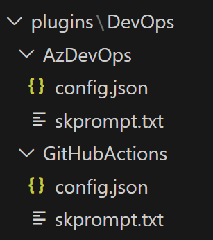

In my previous post, I introduced you to foundational concepts of [Semantic Kernel](https://learn.microsoft.com/en-us/semantic-kernel/overview/), offering a glimpse into its potential. Now, when I was learning about the what and the why, that wasn't enough for me to fully understand the concepts and that's why I started writing these series.

<!--more-->

Semantic Kernel Series:

✔️ Part one: [Intro](/blog/2024/04/30/semantic-kernel)
<br/>
✔️ Part two: [Plugins](/blog/2024/05/13/semantic-kernel-plugins)
<br/>
✔️ Part three: [Planners and Native Function plugins](/blog/2024/05/27/semantic-kernel-planners/)

In order for us to learn about the concepts, the best way is with a story, and I chose DevOps because I was interested in finding better ways to automate daily tasks in that space for my course. Let's go through the context and see what we're trying to achieve.

## Context

I want to use Semantic Kernel to generate Azure DevOps pipelines/GitHub Actions workflow for my application with simple and details instructions (aka prompts). Now the application might have multiple tiers and each might have dependency with one another and I wanted to see how this will work out.

The first thing we need after we have our starter project ([use my previous post to create yours](../04/semantic-kernel.md)), is to define our prompts. I want to use plugins at this point since it is very easy with them to get my prompts introduced to the kernel and execute them based on different inputs.

## Setup

Here is what we need to get the whole setup working:
- An instance of the kernel.
- An instance of the Azure OpenAI or OpenAI to setup the kernel with.
- A plugin with different functions for Azure DevOps and GitHub Actions.
- Input from the user describing the application and its structure.

## Prompts

As I mentioned we would use plugins and their functions to be able to get our input passed to our Azure OpenAI service via the kernel. Technically we could add these as inline code and it works perfectly, however, that would mean we have to define these one by one and it just blows our code base. A much better way is to use the built in feature of the kernel which allows us to load multiple plugins with their functions from a directory.

All you need is a folder which contains all your plugins, and for each plugin, a subdirectory per function. Every function which is mapped to our prompts will need two files:

- `config.json` which contains a description, type, and the parameters for completion or chat depending on what you intend to use.
- `skprompt.txt` which has the prompt in natural language.

## Plugin setup

Let's set our plugin and its function up. As mentioned we intend to generate either an Azure DevOps Pipeline, or GitHub Actions workflow, so one plugin and two function will do the job. Our directory structure will look like this:



_DevOps_ is the name of our plugin, and _AzDevOps_ and _GitHubActions_ are our function names.

## Prompt text

You can write your prompts however you like, just make sure you follow the principles of [prompt engineering](https://learn.microsoft.com/en-us/azure/ai-services/openai/concepts/prompt-engineering) which in short is all about the details and be as specific as you can.

Here is how mine looks like for GitHub Actions:

```txt
INSTRUCTIONS:

Generate workflow YAML files to deploy an application to Azure from GitHub Actions.

RULES:

- All YAML files must be complete
- YAML files must be listed one by one
- Every file is indicated with "FILE:" followed by it's path
- Every file content must begin and end with #-----#
- All pipelines should use either GitHub hosted runners with latest ubuntu version.
- All YAML files should contain two stages for build and deploy where deploy depends on build

DESCRIPTION:{{$input}}
```

The details of how the workflow is going to be generated is outlined in details and at the end I have left a placeholder for a variable called `$input` which will be passed by the user to the kernel later.

And here is what the `config.json` looks like for this prompt:

```json
{
  "schema": 1,
  "description": "Create pipeline YAML files for GitHub Actions",
  "type": "completion",
  "completion": {
    "max_tokens": 1000,
    "temperature": 0.5,
    "top_p": 0,
    "presence_penalty": 0,
    "frequency_penalty": 0
  },
  "input": {
    "parameters": [
      {
        "name": "input",
        "description": "The description of the deployment to be be created",
        "defaultValue": ""
      }
    ]
  }
}
```

You don't need to know the details of the parameters for now, all that is important is the definition of the input parameter and the fact that we intend to use the completion feature of Azure OpenAI.

## Input

For our inputs, I also would like to use files, but you don't have to follow this convention, this just keeps the code clean and short so it's more understandable for me and other beginners learning the concepts.

I have created a folder called desc which includes two files one for an application written with `.Net 8` and one for a `node` based application.

Here is the content of the `node` based input file:

```txt
This is an application written in NodeJs and has below components:

- A front end app which is written in React and uses create-react-app starter. This will be hosted in an Azure Static Web App and is stored in the `frontend` directory.
- A backend API which is going to be hosted in an Azure Function as the backend for the static web app in the `api` directory.
- The API uses a Cosmos DB database as its datastore.
```

## Setting up the kernel

In order to setup the kernel we need a few things:

- The information about the Azure OpenAI service like endpoint, key and model number.
- A way for the user to specify which input and prompt to use.
- Setting up the kernel so it knows about our Azure OpenAI service and our plugin directory.
- Calling the kernel and getting the result.

We already covered how to setup the Azure OpenAI part with the kernel in our first post, here I just show you how to load the plugins from the directory:

```csharp
//reading the name of the plugin directory from our configuration
var pluginDirectories = Configuration!.GetSection("PluginSettings:Root").Get<string>();

// loading the plugins from the plugin directory
var skillImport = kernel.ImportPluginFromPromptDirectory(pluginDirectories!);

// read user's task description from given file
string description = await File.ReadAllTextAsync(file.FullName!);

// this is a data structure that holds temporary data while the kernel task runs
var context = new KernelArguments();

// associate user's description with "input" variable
string key = "input";
context.Add(key, description);

// call the kernel and tell it which plugin function to call and pass to the LLM
var result = await kernel.InvokeAsync(skillImport[function], context);
Console.WriteLine(result.GetValue<string>());
```

## Output

You can find the [full code for this post here](https://github.com/yashints/semantic-kernel-devops). Simply clone the code, build and run it passing the required information like so:

```bash
git clone https://github.com/yashints/semantic-kernel-devops.git

cd semantic-kernel-devops

dotnet restore

dotnet build

dotnet run -- -i .\desc\dotnet.txt -f GitHubActions
```

I am passing the `.Net` application prompt and tell the kernel to create a GitHub Actions workflow.

The result will look like this:

```yaml
FILE: .github/workflows/dotnet.yml
#-----#
name: Build and Deploy

on:
  push:
    branches:
      - master

jobs:
  build:
    name: Build
    runs-on: ubuntu-latest
    strategy:
      matrix:
        dotnet-version: ['8.x']
        
    steps:
    - name: Checkout code
      uses: actions/checkout@v2
      
    - name: Setup .NET Core
      uses: actions/setup-dotnet@v1
      with:
        dotnet-version: ${{ matrix.dotnet-version }}

    - name: Restore dependencies
      run: dotnet restore
      
    - name: Build
      run: dotnet build --configuration Release --no-restore
      
    - name: Test
      run: dotnet test --no-restore --verbosity normal

  deploy:
    needs: build
    runs-on: ubuntu-latest
    steps:
    - name: Login via Az module
      uses: azure/login@v1
      with:
        creds: ${{ secrets.AZURE_CREDENTIALS }}

    - name: 'Run Azure Functions Action'
      uses: Azure/functions-action@v1
      id: fa
      with:
        app-name: 'myFunctionApp'
        package: 'api'
        publish-profile: ${{ secrets.AZURE_FUNCTIONAPP_PUBLISH_PROFILE }}

    - name: 'Deploy to Azure Web App'
      uses: azure/webapps-deploy@v2
      with:
        app-name: 'myWebApp'
        package: 'frontend'
        publish-profile: ${{ secrets.AZURE_WEBAPP_PUBLISH_PROFILE }}
#-----#
```
I've removed two lines from the output which messes with my code block, but that's not important. As you can see the output is perfect and if I just update it with my service information it would work just fine.

[[info]]
| **Note:** You need to update the `appsettings.json` or add a development version and update it with your service information to get the full code working. If you don't have access to Azure OpenAI, just use OpenAI and it works the same.

## What next?

So far we have created our prompts, dynamically loaded them as plugins and functions and then called our kernel passing the input to be passed to our LLM. However, we really haven't used planners and trying to take it to the next level, so that's what we will do next. If you liked this post, please share and spread the word too.
